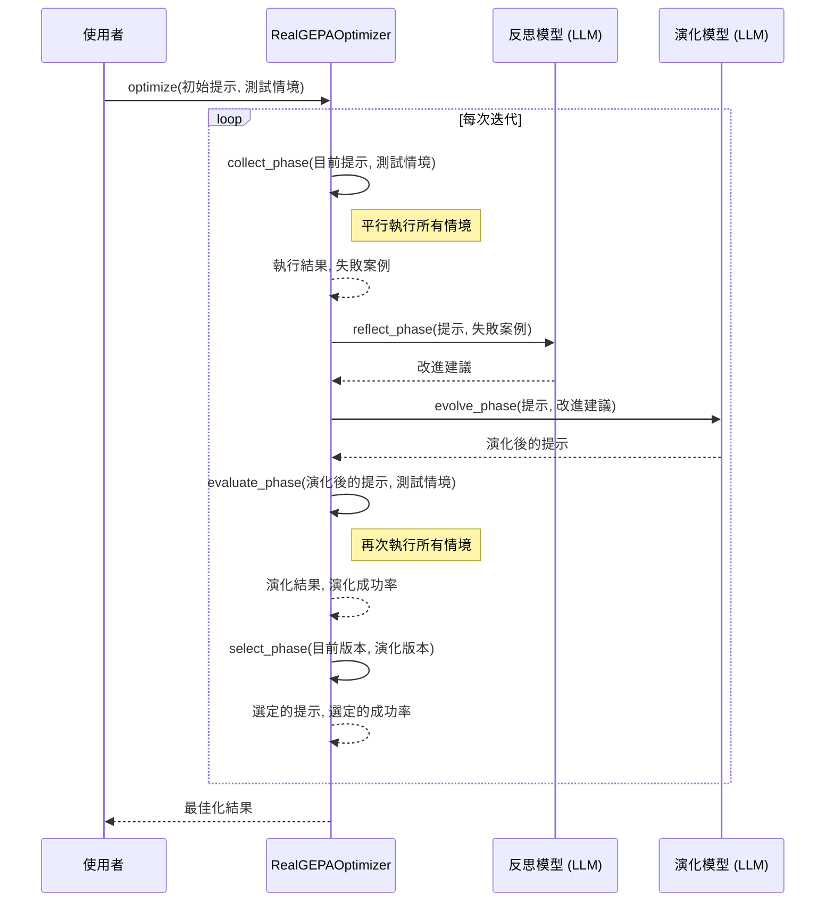
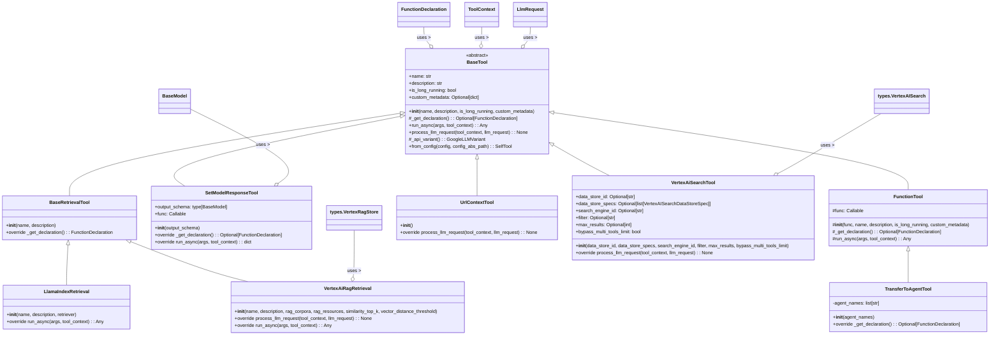

# GEPA 最佳化代理

本文檔概述了 GEPA (近似遺傳演算法的提示分析) 最佳化代理的架構和工作流程，參考 [gepa_optimizer.py](./gepa_optimizer.py)。

## `RealGEPAOptimizer` 呼叫流程

`RealGEPAOptimizer` 類別透過一個包含「收集、反思、演化、評估、選擇」的迭代循環來自動最佳化 LLM 提示。

下面的序列圖展示了 `optimize` 方法的核心邏輯：

## `BaseTool` 類別圖

此圖表說明了構成代理工具集基礎的 `BaseTool` 抽象類別及其各種具體實作。

