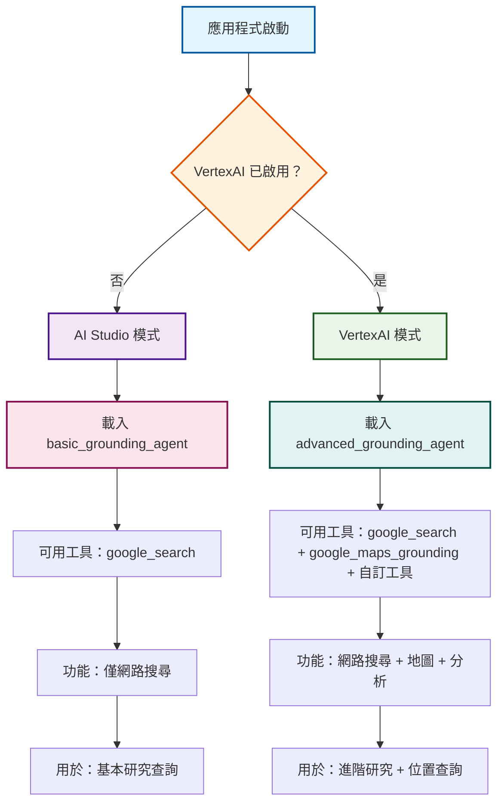
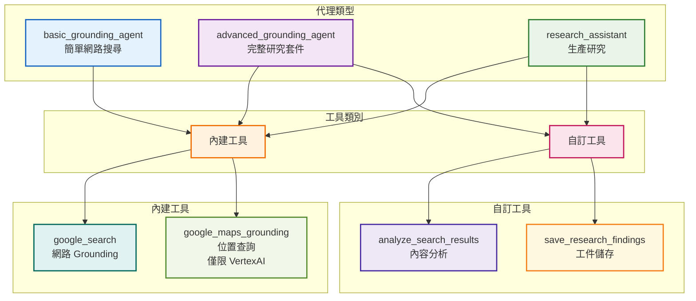
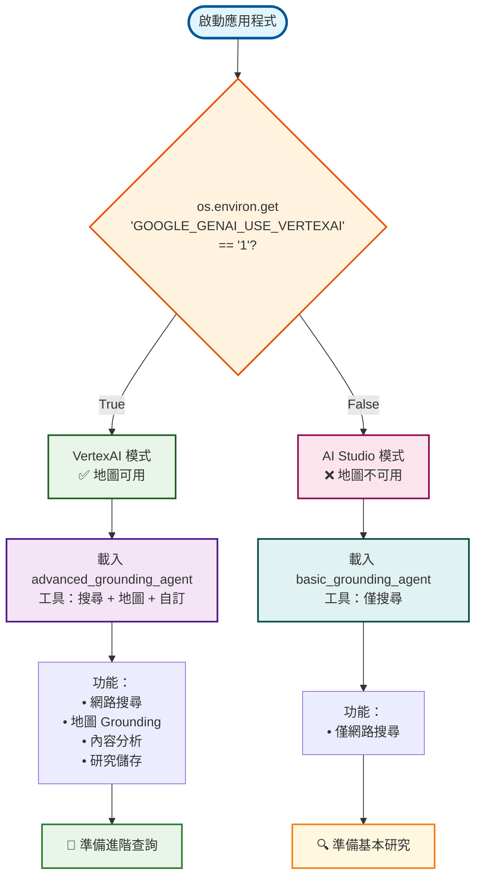
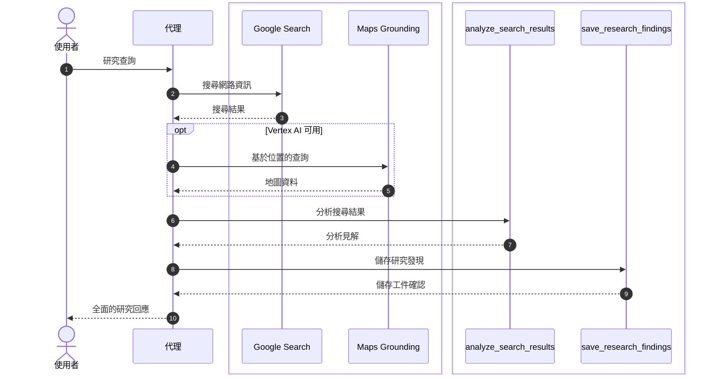

# 教學 11：內建工具與 Grounding  -  Grounding 代理

**教學連結**: [教學 11：內建工具與 Grounding ](../../../notes/google-adk-training-hub/built_in_tools_grounding.md)

這個實作展示了使用 Google 搜尋和其他內建 ADK 工具來存取當前資訊的網路 Grounding 功能。

## 🚀 快速開始

```bash
# 安裝相依性
make setup

# 啟動代理
make dev
```

然後開啟 `http://localhost:8000` 並從下拉選單中選擇 `research_assistant`。

## 📋 此代理的功能

這個 Grounding 代理提供三種不同的代理配置，具有**條件式 VertexAI 支援**：

### 1. 基本 Grounding 代理

- 直接使用 `google_search` 工具
- 簡單的網路搜尋功能
- 最適合基本的當前資訊查詢

### 2. 進階 Grounding 代理

- 結合搜尋與自訂分析工具
- 展示工具組合模式
- 多步驟研究工作流程

### 3. 研究助手（預設）

- 生產就緒的研究代理
- 多步驟研究工作流程
- 搜尋 → 分析 → 儲存模式
- 全面的研究能力

## 🌍 VertexAI 地圖 Grounding

當啟用 VertexAI（`GOOGLE_GENAI_USE_VERTEXAI=1`）時，代理會自動獲得 **Google 地圖 Grounding **功能：

### 條件式功能

- **位置查詢**：尋找附近的地點、餐廳、商家
- **導航**：取得旅行方向和交通資訊
- **地理背景**：了解位置和距離
- **本地探索**：在特定區域搜尋服務

### 環境檢測

代理會自動檢測您的環境：

```bash
# AI Studio（預設）- 僅網路搜尋
export GOOGLE_API_KEY=your_key

# VertexAI - 網路搜尋 + 地圖 Grounding
export GOOGLE_GENAI_USE_VERTEXAI=1
export GOOGLE_CLOUD_PROJECT=your_project
export GOOGLE_CLOUD_LOCATION=us-central1
```

### 代理選擇流程



### 支援地圖的查詢

當 VertexAI 啟用時，嘗試這些基於位置的查詢：

```bash
「時代廣場 5 英里內最好的義大利餐廳有哪些？」
「如何使用大眾運輸從 JFK 到中央公園？」
「在史丹佛大學附近尋找現在營業的咖啡店」
「洛杉磯和聖地牙哥之間的距離是多少？」
```

## 🔍 試試這些查詢

```bash
「2025 年 AI 的最新發展是什麼？」
「研究量子計算的突破」
「尋找可再生能源趨勢的當前資訊」
「分析太空探索的最新發展」
```

## 🛠️ 可用工具

### 內建 ADK 工具

- **`google_search`**：用於當前資訊的網路 Grounding （僅限 Gemini 2.0+）
- **`google_maps_grounding`**：基於位置的查詢和地理資訊（**僅限 VertexAI**）

### 自訂工具

- **`analyze_search_results`**：處理和分析搜尋內容
- **`save_research_findings`**：將研究儲存為工件

### 條件式工具載入

代理會根據您的環境自動載入工具：

- **AI Studio**：僅 `google_search`
- **VertexAI**：`google_search` + `google_maps_grounding`

## 🔧 設定與安裝

### 先決條件

- Python 3.9+
- Google Cloud 專案（用於 VertexAI）或 Gemini API 金鑰

### 認證選項

#### 選項 1：Gemini API（免費）

```bash
export GOOGLE_API_KEY=your_api_key_here
# 在此取得金鑰：https://aistudio.google.com/app/apikey
```

#### 選項 2：VertexAI（生產環境）

```bash
export GOOGLE_APPLICATION_CREDENTIALS=/path/to/service-account.json
export GOOGLE_CLOUD_PROJECT=your_project_id
export GOOGLE_CLOUD_LOCATION=us-central1
```

### 安裝

```bash
# 複製並導航到教學
cd tutorial_implementation/tutorial11

# 安裝相依性
pip install -r requirements.txt
pip install -e .

# 複製環境範本
cp grounding_agent/.env.example grounding_agent/.env
# 使用您的 API 金鑰編輯 .env
```

## 🧪 測試

```bash
# 執行所有測試
make test

# 執行並產生覆蓋率報告
make test-cov

# 在 htmlcov/ 中檢視覆蓋率報告
```

### 測試 VertexAI 條件式邏輯

代理包含針對條件式 VertexAI 功能的全面測試：

```bash
# 測試 VertexAI 檢測
pytest tests/test_agent.py::TestVertexAIConditionalLogic::test_is_vertexai_enabled_false_by_default -v
pytest tests/test_agent.py::TestVertexAIConditionalLogic::test_is_vertexai_enabled_with_env_var -v

# 測試基於環境的工具載入
pytest tests/test_agent.py::TestVertexAIConditionalLogic::test_get_available_grounding_tools_without_vertexai -v
pytest tests/test_agent.py::TestVertexAIConditionalLogic::test_get_available_grounding_tools_with_vertexai -v

# 測試功能描述
pytest tests/test_agent.py::TestVertexAIConditionalLogic::test_get_agent_capabilities_description_without_vertexai -v
pytest tests/test_agent.py::TestVertexAIConditionalLogic::test_get_agent_capabilities_description_with_vertexai -v
```

### 條件式行為的手動測試

**不使用 VertexAI（預設）的測試：**

```bash
cd tutorial_implementation/tutorial11
python -c "
from grounding_agent.agent import root_agent, is_vertexai_enabled, get_available_grounding_tools
print('VertexAI 已啟用:', is_vertexai_enabled())
print('根代理:', root_agent.name)
print('可用工具:', len(get_available_grounding_tools()))
"
```

**啟用 VertexAI 的測試：**

```bash
cd tutorial_implementation/tutorial11
GOOGLE_GENAI_USE_VERTEXAI=1 python -c "
from grounding_agent.agent import root_agent, is_vertexai_enabled, get_available_grounding_tools
print('VertexAI 已啟用:', is_vertexai_enabled())
print('根代理:', root_agent.name)
print('可用工具:', len(get_available_grounding_tools()))
"
```

## 📁 專案結構

```text
tutorial11/
├── grounding_agent/           # 代理實作
│   ├── __init__.py           # 套件標記
│   ├── agent.py              # 代理定義與工具
│   └── .env.example          # 環境範本
├── tests/                    # 測試套件
│   ├── __init__.py
│   └── test_agent.py         # 全面測試
├── requirements.txt          # Python 相依性
├── pyproject.toml           # 套件配置
├── setup.py                 # 安裝腳本
├── Makefile                 # 開發指令
└── README.md                # 本檔案
```

## 🎯 展示的關鍵功能

### 網路 Grounding

- 即時網路搜尋整合
- 當前資訊存取
- 來源引用和驗證

### 工具組合

- 混合內建和自訂工具
- 多步驟研究工作流程

### 生產模式

- 錯誤處理和驗證
- 結構化工具回應
- 研究文件和儲存

## 🔍 了解程式碼

### 代理階層與工具組合



### 環境檢測邏輯



### 代理階層

```python
# 基本：直接使用 google_search
basic_grounding_agent = Agent(
    tools=[google_search]  # 直接的內建工具
)

# 進階：工具混合與自訂工具
advanced_grounding_agent = Agent(
    tools=[google_search, custom_tool1, custom_tool2]
)

# 研究：生產就緒的完整工作流程
research_assistant = Agent(
    tools=[google_search, analyze_tool, save_tool],
    generate_content_config=types.GenerateContentConfig(
        temperature=0.3  # 事實性研究
    )
)
```

### 工具實作

```python
def analyze_search_results(query: str, content: str) -> Dict[str, Any]:
    """分析搜尋結果並提取見解。"""
    # 處理內容、計算字數、提取要點
    return {
        'status': 'success',
        'analysis': {...},
        'report': '分析完成'
    }

def save_research_findings(topic: str, findings: str) -> Dict[str, Any]:
    """將研究儲存為工件。"""
    # 建立文件並儲存
    return {
        'status': 'success',
        'filename': 'research_topic.md'
    }
```

### 研究工作流程



## 🚨 重要注意事項

### 模型需求

- **需要 Gemini 2.0+** 才能使用 `google_search` 工具
- 較舊的模型（1.5、1.0）會引發錯誤
- 使用 `gemini-2.0-flash` 以獲得最佳性能/成本平衡

### 工具限制

- 內建工具無法與自訂工具直接混合
- 對不同的工具組合使用單獨的代理

### 安全性

- 絕不提交包含真實 API 金鑰的 `.env` 檔案
- 使用 `.env.example` 作為範本
- 在生產環境中定期輪換金鑰

## 🐛 疑難排解

### "google_search requires Gemini 2.0+"

```bash
# 修復：使用正確的模型
agent = Agent(model='gemini-2.0-flash', tools=[google_search])
```

### 認證錯誤

```bash
# 檢查您的 .env 檔案或環境變數
# 確保已設定 GOOGLE_API_KEY 或 GOOGLE_APPLICATION_CREDENTIALS
```

## 📚 了解更多

- **教學**：[教學 11：內建工具與 Grounding ](../../docs/tutorial/11_built_in_tools_grounding.md)
- **ADK 文件**：[內建工具](https://google.github.io/adk-docs/tools/built-in-tools/)
- ** Grounding **：[網路 Grounding 企業版](https://cloud.google.com/vertex-ai/generative-ai/docs/grounding/web-grounding-enterprise)

## 🤝 貢獻

這是 ADK 訓練儲存庫的一部分。請參閱主要的 [README](../../README.md) 以了解貢獻指南。

## 📊 視覺架構概覽

上述圖表說明了這個 Grounding 代理的精密條件式架構：

### 🎯 代理選擇流程

展示系統如何根據 VertexAI 可用性自動選擇基本和進階代理，確保每個環境的最佳工具組合。

### 🏗️ 代理階層與工具組合

視覺化代理類型及其工具功能之間的關係，清楚說明內建工具（自動）如何與自訂工具（手動實作）結合。

### 🔄 環境檢測邏輯

展示決定哪些工具和功能可用的決策過程，幫助使用者了解背後的條件式邏輯。

### 🔄 研究工作流程

說明從使用者查詢透過多個工具互動到最終回應的完整研究管線，顯示序列和涉及的不同類型工具。

### 🎨 設計理念

- **柔和色彩**：專業而愉悅的色彩方案，具有出色的對比度
- **清晰階層**：不同組件和狀態之間的視覺區別
- **邏輯流程**：易於遵循的複雜決策樹進展
- **可及性**：高對比度比率確保所有使用者的可讀性

這些視覺輔助將複雜的條件式邏輯轉換為直觀、易記的概念，加速理解和實作。

---

**🎉 祝您 Grounding 愉快！** 您的代理現在可以存取當前的網路資訊並執行全面的研究。
