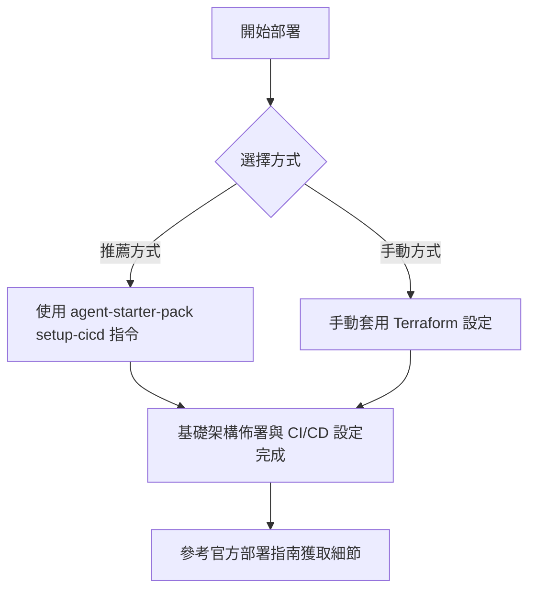

# 部署 (Deployment)

此目錄包含用於為您的代理程式（Agent）配置所需 Google Cloud 基礎架構的 Terraform 設定。

部署基礎架構並設定 CI/CD 流水線（Pipeline）的推薦方式是在專案根目錄使用 `agent-starter-pack setup-cicd` 指令。

然而，若想採取更實務的操作方式，您也可以手動套用 Terraform 設定來進行自行建置。

關於部署流程、基礎架構及 CI/CD 流水線的詳細資訊，請參閱官方文件：

**[Agent Starter Pack 部署指南](https://googlecloudplatform.github.io/agent-starter-pack/guide/deployment.html)**

---

### 重點摘要
- **核心概念**：提供自動化與手動部署代理程式基礎架構的設定。
- **關鍵技術**：Terraform、Google Cloud、CI/CD、`agent-starter-pack` 工具。
- **重要結論**：建議優先使用 `agent-starter-pack setup-cicd` 進行自動化部署與流水線設定。
- **行動項目**：
    - 根據需求選擇自動化或手動部署路徑。
    - 閱讀官方部署指南以了解完整細節。

