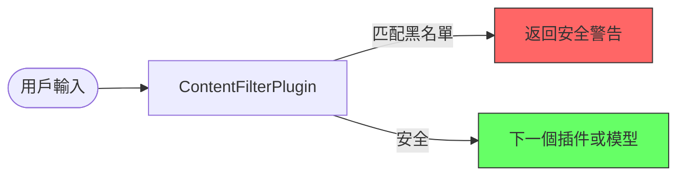
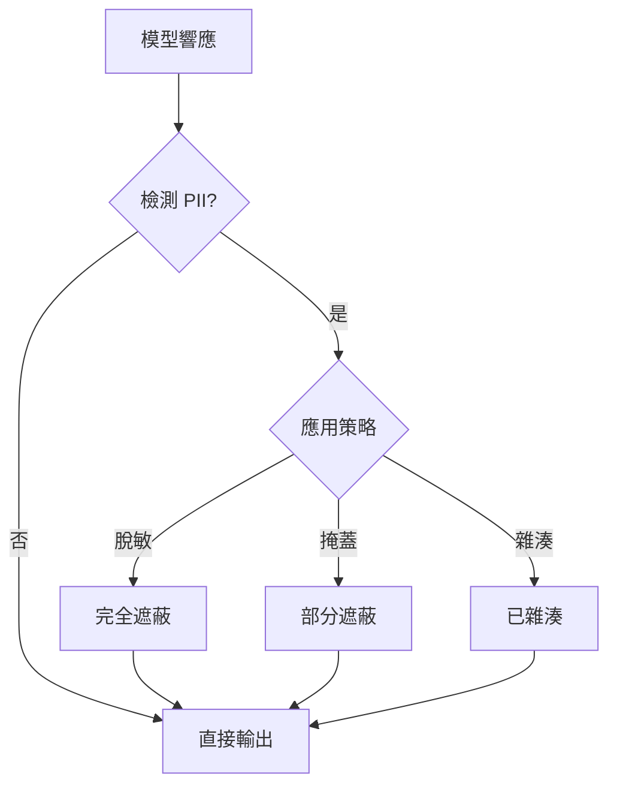

# 守衛系統插件

## 概述

本模塊提供多層安全保護系統，包含三個核心插件：

- **ContentFilterPlugin**：靜態關鍵字過濾
- **PIIDetectionPlugin**：敏感信息檢測和脫敏
- **SecurityMetricsPlugin**：安全指標收集

## 模塊架構

### 核心概念
- 模塊化安全功能，可靈活組合在執行器中
- 插件模式實現，用於集中管理
- 通過關注點分離增強系統可維護性

### 快速開始
在 `agent.py` 中導入本模塊以加載所有安全插件。

---

## ContentFilterPlugin

### 描述
靜態內容過濾插件，在 LLM 處理前掃描用戶輸入，阻止匹配預定義黑名單的請求。

### 功能特性
- 支持正則表達式的關鍵字黑名單過濾
- 多語言支持（英文、中文、日文）
- 模糊匹配和變體檢測
- 過濾統計和日誌記錄

### 設計決策
- 基於插件的方法，在所有代理和工具中全局應用
- `before_model_callback` 用於 LLM 調用前的低成本攔截
- 基於 YAML 配置，支持運行時更新

### 處理流程

### 配置
在 `security_config.yaml` 中維護 `blocked_patterns` 以更新過濾規則。

---

## PIIDetectionPlugin

### 描述
個人可識別信息（PII）檢測和脫敏插件，自動識別敏感數據並應用匿名化策略。

### 功能特性
- 多類型 PII 檢測（電郵、電話、身份證號、信用卡、API 密鑰）
- 四種處理策略：脫敏、掩蓋、雜湊、阻止
- 基於場景的可配置策略
- 檢測統計和審計日誌

### 設計決策
- `after_model_callback` 用於輸出過濾以防止數據洩露
- 可選的 `before_model_callback` 用於輸入端檢測
- 不記錄原始 PII 值—僅記錄類型、位置和雜湊值以符合合規要求

### 處理流程

### 配置
根據業務需求調整 `PIIHandlingStrategy`（例如內部日誌使用 HASH，外部響應使用 REDACT）。
