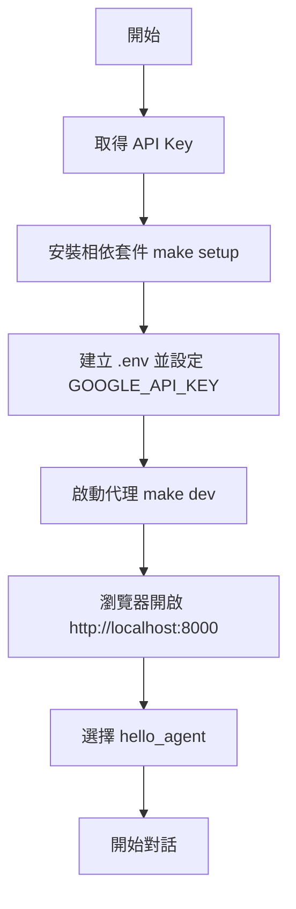

# 教學 01：Hello World Agent

第一個 ADK（Agent Development Kit 代理開發工具）代理：使用 Gemini 2.0 Flash 驅動的友善互動型對話助理。

## 🚀 快速開始 (Quick Start)

```bash
# 安裝相依套件 (Install dependencies)
make setup

# 啟動代理 (Start the agent)
make dev

# 開啟瀏覽器並前往 http://localhost:8000 並選擇 'hello_agent'
```

## 💬 功能說明 (What It Does)

- 友善地向使用者問候
- 介紹自己與可提供的能力
- 分享有趣的知識 / 小常識
- 作為一般性對話助理

## 📁 專案結構 (Project Structure)

```
tutorial01/
├── hello_agent/           # 代理實作 (Agent implementation)
│   ├── __init__.py        # 套件標記 (Package marker)
│   ├── agent.py           # 代理定義 (Agent definition)
│   └── .env.example       # API 金鑰範本 (API key template)
├── tests/                 # 測試套件 (Test suite)
├── requirements.txt       # 相依套件 (Dependencies)
└── Makefile               # 建置/操作指令 (Build commands)
```

## 🔧 設定流程 (Setup)

1. 取得 **API 金鑰 (API Key)**：前往 [Google AI Studio](https://aistudio.google.com/app/apikey)
2. 安裝：執行 `make setup`
3. 設定環境：複製 `.env.example` 為 `.env`，填入你的 API 金鑰（環境變數 `GOOGLE_API_KEY`）
4. 執行：`make dev`

### 🌊 流程圖 (Setup Flow)



## 🧪 測試 (Testing)

```bash
make test    # 執行所有測試 (Run all tests)
make demo    # 查看範例提示詞 (See demo prompts)
```

## 🎯 範例可嘗試的提示詞 (Try These Prompts)

- 「Hello! Who are you?」(你是誰？)
- 「What can you do?」(你能做什麼？)
- 「Tell me a fun fact」(給我一個有趣的事實)

## 📚 下一步 (Next Steps)

- **教學 02**：函式工具 (Function tools) 用於計算
- **教學 03**：外部 API 整合 (External API integration)
- **教學 04**：循序式工作流程 (Sequential workflows)

使用 ❤️ 打造，採用 Google ADK。

---

## 重點摘要 (Summary)

- **核心概念**：使用 Google ADK 建立一個最小可行的對話型 AI 代理，展示啟動、設定與互動流程。
- **關鍵技術**：Gemini 2.0 Flash 模型、環境變數管理、Makefile 自動化、模組化專案結構、測試驅動開發（TDD 基本雛形）。
- **重要結論**：僅需少量設定即可啟動可用的對話代理；清晰專案結構與標準化啟動指令有助於快速學習與擴充後續教學案例。
- **行動項目**：
  1.  申請並設定 API 金鑰
  2.  安裝依賴並建立 `.env`
  3.  啟動代理並進行互動測試
  4.  繼續進階教學（函式工具 / API 整合 / 工作流程）
