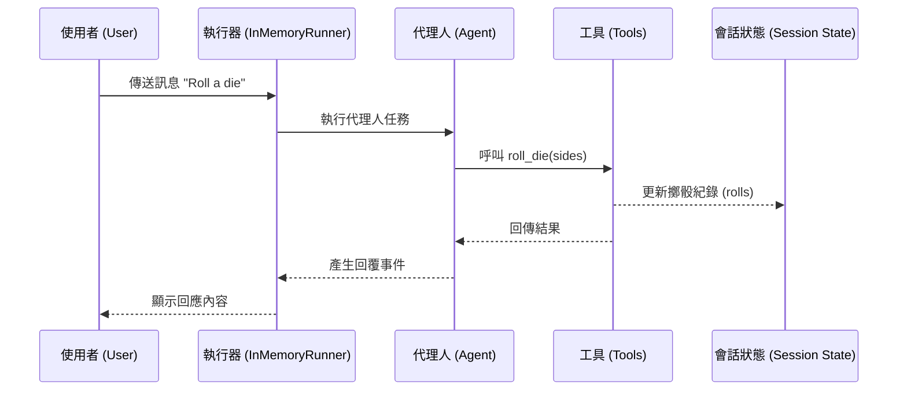

# Hello World 代理人應用程式 (Hello World Agent App)

本範例展示了一個基礎的 ADK 代理人應用程式，具備擲骰子、檢查質數以及管理會話狀態 (Session State) 的能力。此範例可用於快速理解 ADK 的核心組件，包括執行器 (Runner)、會話 (Session) 與工具 (Tools) 的互動。

## 主要特色

- **多功能工具組**：內建擲骰子 (`roll_die`) 與質數檢查 (`check_prime`) 工具。
- **狀態管理**：展示如何透過 `ToolContext` 在會話狀態中持久化資料。
- **自定義插件**：包含一個 `CountInvocationPlugin` 用於追蹤代理人與工具的調用次數。
- **事件壓縮 (Event Compaction)**：配置 `EventsCompactionConfig` 以優化長對話的上下文管理。
- **多格式輸入**：支援純文字 (Text) 與位元組 (Bytes) 訊息傳送。

## 系統架構流程



## 使用方式

### 環境準備

確保已安裝必要套件並設定 `.env` 檔案中的 API 金鑰。

### 直接執行應用程式

使用 Python 直接執行 `main.py` 以觀察完整的對話流程：

```bash
python -m workspace.python.agents.hello_world_app.main
```

### 使用 ADK CLI 運行

```bash
# 執行代理人
adk run workspace/python/agents/hello-world-app/hello_world_app/agent.py
```

## 內建工具

1. **roll_die** - 模擬擲骰子，並將結果存入會話狀態。
2. **check_prime** - 檢查給定的數字列表是否為質數。
3. **load_artifacts** - 載入會話相關的成品。

## 重點摘要

- **核心概念**：
    - 使用 `InMemoryRunner` 作為本地開發測試的執行環境。
    - 透過 `Agent` 定義模型行為、指令 (Instruction) 與可用的工具清單。
    - 利用 `App` 封裝代理人並整合插件與壓縮配置。
- **關鍵技術**：
    - `ToolContext`：用於在工具執行期間存取與修改會話狀態。
    - `EventsCompactionConfig`：透過設定間隔與重疊大小，自動縮減過長的歷史紀錄。
    - `BasePlugin`：自定義生命週期鉤子 (Hooks)，實作 AOP (面向切面編程) 式的監控。
- **重要結論**：
    - ADK 提供了一套完整的機制來管理代理人的狀態，使 LLM 能在多輪對話中保持一致性。
    - 透過插件系統，開發者可以在不修改核心邏輯的情況下擴展功能（如：監控、日誌）。
- **行動項目**：
    - 嘗試修改 `agent.py` 中的指令，觀察代理人行為的變化。
    - 實作新的工具並加入 `tools` 清單中。
    - 調整 `EventsCompactionConfig` 的參數以測試不同規模的對話壓縮效果。

## 技術實作細節

- **代理人定義**：在 `hello_world_app/agent.py` 中使用 `Agent` 類別進行配置，模型選用 `gemini-2.0-flash`。
- **會話持久化**：擲骰子結果被存儲在 `session.state['rolls']` 中，並可跨對話被讀取。
- **錯誤處理**：在 `main.py` 中使用 `assert` 驗證狀態一致性，確保工具執行結果符合預期。

## 相關文件

本範例主要搭配 `[adk-docs] context` [compaction](../../../adk-docs/context/compaction.md) 文件使用，展示事件壓縮實現的程式碼範例。