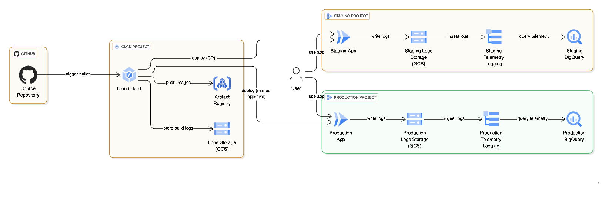

# 部署

此目錄包含為您的代理程式佈建所需 Google Cloud 基礎架構的 Terraform 設定。
部署基礎架構和設定 CI/CD 管線的建議方法，是從專案的根目錄執行 `agent-starter-pack setup-cicd` 指令。
然而，若想親自動手操作，您也可以隨時手動套用 Terraform 設定，進行 DIY 設定。
有關部署流程、基礎架構和 CI/CD 管線的詳細資訊，請參閱官方文件：

## 專案結構與部署指南

```
├── README.md
└── terraform
  ├── apis.tf             # 啟用必要的 Google Cloud API
  ├── build_triggers.tf   # 設定 Cloud Build 觸發器 (CI/CD)
  ├── dev                 # 開發環境專用的 Terraform 設定
  │   ├── apis.tf         # 啟用必要的 Google Cloud API
  │   ├── iam.tf          # 管理 IAM 權限和角色
  │   ├── locals.tf       # 定義本地變數
  │   ├── providers.tf    # 設定 Terraform 提供者 (例如 Google Cloud)
  │   ├── storage.tf      # 建立儲存資源 (例如 GCS 儲存桶)
  │   ├── telemetry.tf    # 設定遙測和監控
  │   ├── variables.tf    # 宣告通用變數
  │   └── vars
  │       └── env.tfvars  # 開發環境的變數設定檔
  ├── github.tf           # 設定 GitHub 整合
  ├── iam.tf              # 管理 IAM 權限和角色
  ├── locals.tf           # 定義本地變數
  ├── providers.tf        # 設定 Terraform 提供者 (例如 Google Cloud)
  ├── service_accounts.tf # 建立服務帳戶
  ├── sql
  │   └── completions.sql # 資料庫相關的 SQL 腳本
  ├── storage.tf          # 建立儲存資源 (例如 GCS 儲存桶)
  ├── telemetry.tf        # 設定遙測和監控
  ├── variables.tf        # 宣告通用變數
  └── vars
    └── env.tfvars      # 通用環境的變數設定檔 (主要)
```

**[代理程式入門包部署指南](https://googlecloudplatform.github.io/agent-starter-pack/guide/deployment.html)**

## 架構圖



## 環境配置對照表

本專案將部署環境劃分為 **開發 (Dev)** 與 **測試/生產 (Staging/Production)** 兩大類群組，分別使用不同的 Terraform 設定與權限控管。

| 項目 (Item) | 開發環境 (Dev) | 測試 (Staging) 與 生產 (Production) |
| :--- | :--- | :--- |
| **Terraform 目錄** | `deployment/terraform/dev` | `deployment/terraform` (Root) |
| **對應 Google Cloud 專案變數** | `dev_project_id` | `staging_project_id` / `prod_project_id` |
| **GCP 服務資源總覽** | **運算**: Cloud Run, Cloud Build<br>**AI**: Vertex AI, Agent Builder (Discovery Engine)<br>**數據**: BigQuery, Cloud Storage<br>**監控**: Cloud Logging, Cloud Trace | **運算**: Cloud Run<br>**AI**: Vertex AI, Agent Builder<br>**數據**: BigQuery, Cloud Storage<br>**監控**: Cloud Logging, Cloud Trace<br>*(Artifact Registry 與 Cloud Build 資源位於獨立 CI/CD 專案)* |
| **啟用 API ID (Enabled APIs)** | - `aiplatform.googleapis.com`<br>- `cloudbuild.googleapis.com`<br>- `run.googleapis.com`<br>- `bigquery.googleapis.com`<br>- `discoveryengine.googleapis.com`<br>- `cloudresourcemanager.googleapis.com`<br>- `iam.googleapis.com`<br>- `logging.googleapis.com`<br>- `cloudtrace.googleapis.com`<br>- `telemetry.googleapis.com` | - `aiplatform.googleapis.com`<br>- `run.googleapis.com`<br>- `discoveryengine.googleapis.com`<br>- `cloudresourcemanager.googleapis.com`<br>- `iam.googleapis.com`<br>- `bigquery.googleapis.com`<br>- `logging.googleapis.com`<br>- `cloudtrace.googleapis.com`<br>*(Cloud Build 服務啟用於獨立的 CI/CD Runner 專案)* |
| **應用程式服務帳戶 (App SA)** | **名稱**: `${project_name}-app`<br>**權限**: <br>- `roles/aiplatform.user`<br>- `roles/discoveryengine.editor`<br>- `roles/logging.logWriter`<br>- `roles/cloudtrace.agent`<br>- `roles/storage.admin`<br>- `roles/serviceusage.serviceUsageConsumer` | **名稱**: `${project_name}-app`<br>**權限**: 同開發環境 (一致的應用程式執行權限) |
| **部署與 CI/CD 服務帳戶** | **Default Compute Service Account**<br>權限: `roles/cloudbuild.builds.builder` | **CI/CD Runner Service Account** (位於 CI/CD 專案)<br>跨專案部署權限:<br>- `roles/run.developer`<br>- `roles/iam.serviceAccountUser`<br>- `roles/aiplatform.user`<br>- `roles/storage.admin` |
| **日誌與遙測配置** | 設定 Cloud Logging Sink 與 BigQuery 連接，用於 GenAI 遙測與使用者回饋。 | 同開發環境。另 CI/CD Runner 專案包含 `cloudbuild`, `bigquery` 等服務以支援管線執行。 |
