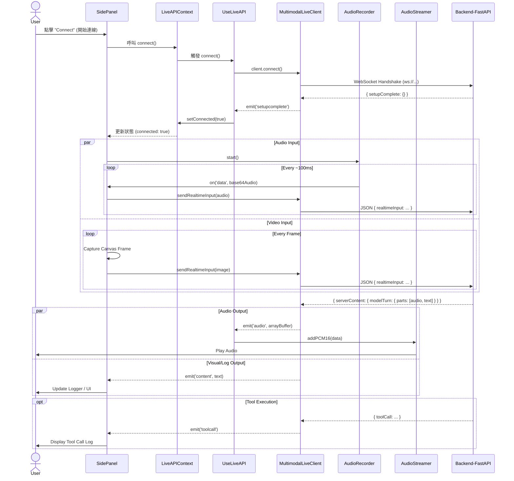

# Frontend Architecture Guide

本文件詳細說明前端應用程式的架構、元件互動方式與資料流向。

## 1. 架構總覽 (Architecture Overview)

前端應用程式是一個基於 React 的單頁應用程式 (SPA)，旨在與多模態即時 AI (Multimodal Live AI) 後端進行互動。

核心架構圍繞著 `MultimodalLiveClient` 運作，這是一個負責處理由 WebSocket 與後端進行所有通訊的類別。React 的 Context API (`LiveAPIContext`) 將此客戶端 (Client) 提供給整個應用程式使用。

### 專案結構 (Project Structure)
```
./frontend/
├── README.md
├── package-lock.json
├── package.json
├── public
│   ├── favicon.ico
│   ├── index.html
│   └── robots.txt
├── src
│   ├── App.scss
│   ├── App.test.tsx
│   ├── App.tsx
│   ├── components
│   │   ├── audio-pulse
│   │   │   ├── AudioPulse.tsx
│   │   │   └── audio-pulse.scss
│   │   ├── logger
│   │   │   ├── Logger.tsx
│   │   │   ├── logger.scss
│   │   │   └── mock-logs.ts
│   │   ├── side-panel
│   │   │   ├── SidePanel.tsx
│   │   │   └── side-panel.scss
│   │   └── transcription-preview
│   │       ├── TranscriptionPreview.tsx
│   │       └── transcription-preview.scss
│   ├── contexts
│   │   └── LiveAPIContext.tsx
│   ├── hooks
│   │   ├── use-live-api.ts
│   │   ├── use-media-stream-mux.ts
│   │   ├── use-screen-capture.ts
│   │   └── use-webcam.ts
│   ├── index.css
│   ├── index.tsx
│   ├── multimodal-live-types.ts
│   ├── react-app-env.d.ts
│   ├── reportWebVitals.ts
│   ├── setupTests.ts
│   └── utils
│       ├── audio-recorder.ts
│       ├── audio-streamer.ts
│       ├── audioworklet-registry.ts
│       ├── multimodal-live-client.ts
│       ├── store-logger.ts
│       ├── utils.ts
│       └── worklets
│           ├── audio-processing.ts
│           └── vol-meter.ts
└── tsconfig.json
```

### 核心元件 (Core Components)

- **App**: 應用程式的根元件 (Root Component)。負責設定 `LiveAPIProvider` 並佈局主要的 UI 區域 (視訊串流顯示與側邊控制面板)。
- **LiveAPIContext / LiveAPIProvider**: 全域狀態管理。初始化 `useLiveAPI` hook，並將 `client` 實例、連線狀態 (connected) 和音量資訊 (volume) 向下傳遞。
- **SidePanel**: 主要的使用者介面。包含：
  - 連線控制 (Connect/Disconnect)
  - 媒體輸入控制 (麥克風、攝影機、螢幕分享)
  - 文字輸入對話框
  - 日誌顯示 (Logger)
  - 即時轉錄預覽 (TranscriptionPreview)
- **MultimodalLiveClient**: 通訊層。
  - 管理 WebSocket 連線。
  - 處理音訊/視訊的編碼與傳送 (`sendRealtimeInput`)。
  - 接收並解析來自伺服器的訊息 (ServerContent, ToolCall 等)。
  - 透過 Event Emitter 模式通知 UI 更新。

### 工具與 Hooks (Utils & Hooks)

- **useLiveAPI**: 封裝了 Client 的生命週期管理與音訊輸出邏輯 (`AudioStreamer`)。
- **AudioStreamer**: 使用 Web Audio API (`AudioContext`) 播放從伺服器接收到的 PCM 音訊數據。
- **AudioRecorder**: 負責從瀏覽器麥克風擷取音訊，並轉換為適合傳送的格式。
- **useWebcam / useScreenCapture**: 管理視訊串流的 Hooks。

---

## 2. 元件互動時序圖 (Sequence Diagram)

下圖展示了從使用者啟動連線、傳送影音數據，到接收 AI 回應的完整流程。



## 3. 資料流詳細說明 (Data Flow Details)

1.  **初始化 (Initialization)**:

    - `App.tsx` 建立 `LiveAPIProvider`。
    - `useLiveAPI` 實例化 `MultimodalLiveClient` 並建立 `AudioStreamer` (尚未連線)。

2.  **建立連線 (Connection)**:

    - 使用者觸發連線。
    - `client.connect()` 建立 WebSocket 連線。
    - 連線成功後，Client 發送初始 `setup` 訊息 (包含 `run_id`, `user_id`)。

3.  **上行資料流 (Upstream - Client to Server)**:

    - **音訊**: `AudioRecorder` 擷取麥克風輸入 -> Base64 編碼 -> `SidePanel` 接收 -> `client.sendRealtimeInput` -> WebSocket。
    - **視訊**: `SidePanel` 定期 (FPS 控制) 將 `<video>` 內容繪製到 Canvas -> 轉為 JPEG Base64 -> `client.sendRealtimeInput` -> WebSocket。
    - **文字**: 使用者在輸入框輸入 -> `client.send` -> WebSocket (作為 `user` role content)。

4.  **下行資料流 (Downstream - Server to Client)**:
    - **音訊**: WebSocket 收到 `modelTurn` (含音訊部分) -> `client` 解析並 emit `audio` 事件 -> `useLiveAPI` 接收並傳給 `AudioStreamer` -> `AudioContext` 播放。
    - **內容/文字**: WebSocket 收到 `modelTurn` (含文字部分) 或 `serverContent` -> `client` emit `content` 或 `log` 事件 -> `SidePanel` 更新 Logger 顯示。
    - **控制訊號**: `turnComplete`, `interrupted` 等訊號用於控制 UI 狀態與音訊播放佇列。

## 4. 目錄結構重點 (Key Directory Structure)

- `src/contexts/`: 包含 `LiveAPIContext`，是連接 UI 與邏輯的橋樑。
- `src/hooks/`:
  - `use-live-api.ts`: 核心 Hook，管理 Client 與 AudioStreamer。
  - `use-webcam.ts` / `use-screen-capture.ts`: 處理瀏覽器的 MediaDevices API。
- `src/utils/`:
  - `multimodal-live-client.ts`: WebSocket 通訊協定實作。
  - `audio-streamer.ts`: 音訊播放實作 (Worklet based)。
  - `audio-recorder.ts`: 音訊錄製實作。
- `src/components/side-panel/`: 主要的互動介面實作。
