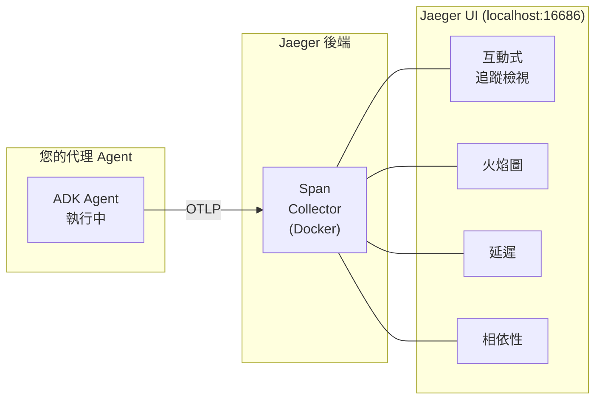
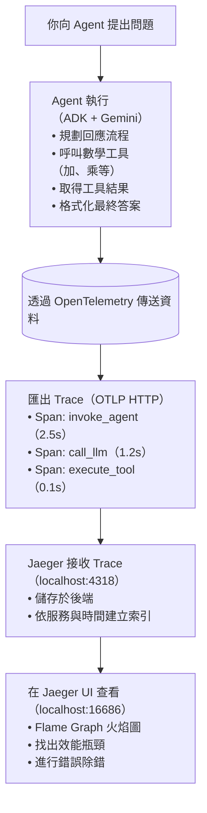

# OpenTelemetry + ADK + Jaeger

使用 Google ADK、OpenTelemetry 和 Jaeger 視覺化實現 AI 代理的分散式追蹤。

## 什麼是 Jaeger？

Jaeger 是一個開源的分散式追蹤系統，可視覺化代理的執行流程：



**為什麼 Jaeger 很重要**：在同一個地方除錯代理行為、尋找瓶頸，並驗證 LLM 呼叫。

## 快速開始 (3 步驟)

### 1. 設定

```bash
make setup
cp .env.example .env  # 新增您的 GOOGLE_GENAI_API_KEY
```

### 2. 啟動 Jaeger

```bash
make jaeger-up  # 在 http://localhost:16686 開啟 UI
```

### 3. 執行代理

```bash
make demo          # 帶有範例查詢的示範腳本
# 或
make web           # 位於 http://localhost:8000 的互動式 Web UI
```

檢視追蹤：在 Jaeger 中選擇 `google-adk-math-agent` 服務並點擊 "Find Traces" (尋找追蹤)。

## 運作方式



## 專案結構

```
math-agent/
├── math_agent/
│   ├── __init__.py          # 套件標記
│   ├── agent.py             # 主要 ADK 代理 (匯出 root_agent)
│   ├── otel_config.py       # OpenTelemetry 初始化
│   └── tools.py             # 數學工具實作
├── tests/
│   ├── __init__.py
│   └── test_agent.py        # 完整的測試套件 (30+ 測試)
├── Makefile                 # 標準指令
├── requirements.txt         # Python 相依套件
├── pyproject.toml          # 專案元資料
├── .env.example            # 環境範本
└── README.md               # 本檔案
```

## 關鍵概念

### ADK 搭配 OpenTelemetry：兩種方法

| 步驟 | 方法 1：adk web (推薦) | 方法 2：示範腳本 |
|------|------------------------|------------------|
| 1 | 設定環境變數 | 呼叫 `initialize_otel()` |
| 2 | `adk web` 載入 `agent.py` | 手動建立 provider |
| 3 | ADK 讀取環境變數 | 新增 OTLP 匯出器 |
| 4 | ADK 建立 TracerProvider | 設定為全域 provider |
| 5 | 您的程式碼繼承它 ✓<br/>(無衝突！) | 執行代理 ✓<br/>(完全控制！) |

#### ✅ 方法 1：環境變數 (推薦用於 `adk web`)

讓 ADK 內建的 OpenTelemetry 支援處理一切：

```bash
# 設定環境變數
export OTEL_SERVICE_NAME=google-adk-math-agent
export OTEL_EXPORTER_OTLP_ENDPOINT=http://localhost:4318
export OTEL_EXPORTER_OTLP_PROTOCOL=http/protobuf
export OTEL_INSTRUMENTATION_GENAI_CAPTURE_MESSAGE_CONTENT=true

# 執行 adk web - ADK 自動設定 OTel
adk web .
```

**為什麼這對 `adk web` 有效**：

- ADK 在載入代理之前初始化它自己的 TracerProvider
- 一旦設定後我們無法覆蓋它 (OpenTelemetry 限制)
- 解決方案：設定環境變數並讓 ADK 使用它們
- `Makefile` 自動執行此操作：`make web`

**在您的代理程式碼中**：

```python
from math_agent.otel_config import initialize_otel_env

# 僅設定環境變數 - 其餘由 ADK 處理
initialize_otel_env(
    service_name="google-adk-math-agent",
    jaeger_endpoint="http://localhost:4318/v1/traces",
)
```

#### ✅ 方法 2：手動設定 (用於獨立示範)

在您的程式碼中手動初始化 TracerProvider：

```python
from math_agent.otel_config import initialize_otel

# 完全手動控制 - 適用於示範腳本
tracer_provider, logger_provider = initialize_otel(
    service_name="google-adk-math-agent",
    jaeger_endpoint="http://localhost:4318/v1/traces"
)
```

**為什麼這對示範有效**：

- 您完全控制初始化順序
- TracerProvider 在 ADK 匯入發生**之前**設定
- 與 ADK 的 provider 無衝突

**何時使用**：

- 獨立腳本 (`python -m math_agent.agent`)
- 對 span processors 有詳細控制需求
- 需要自訂取樣 (sampling) 或匯出器 (exporters)

### 重要：TracerProvider 衝突

⚠️ **關鍵學習**：OpenTelemetry 每個程序只允許**一個**全域 TracerProvider。

當使用 `adk web` 時：

1. ADK FastAPI 伺服器首先啟動
2. ADK 自動初始化一個 TracerProvider
3. 如果您的代理程式碼嘗試設定另一個 → 警告 → 被忽略
4. 您的自訂 Jaeger 匯出器永遠不會被附加！

**解決方案**：使用環境變數 (方法 1)。ADK 讀取它們並正確設定一切。

### 程式碼組織

`otel_config.py` 模組提供兩種方法：

```python
# 推薦用於 adk web - 僅設定環境變數
from math_agent.otel_config import initialize_otel_env
initialize_otel_env()

# 或詳細控制 - 用於獨立腳本
from math_agent.otel_config import initialize_otel
tracer_provider, logger_provider = initialize_otel()

# 在代理執行後呼叫以將 spans 刷新至 Jaeger
from math_agent.otel_config import force_flush
force_flush()
```

### 數學代理 (Math Agent)

`agent.py` 模組定義了具有 4 個工具的 root agent：

- `add_numbers(a, b)` - 加法
- `subtract_numbers(a, b)` - 減法
- `multiply_numbers(a, b)` - 乘法
- `divide_numbers(a, b)` - 除法 (含零檢查)

該代理使用 Gemini-2.5-Flash 並接收自動的 OTel 儀表化用於：

- 代理規劃步驟
- 工具選擇與呼叫
- 對 Gemini 的 LLM 請求
- 工具執行時間
- 最終回應生成

### Jaeger 中的追蹤結構

當您執行代理時，Jaeger 擷取完整的追蹤階層：

```
Invocation (root span)
├─ invoke_agent
│  ├─ call_llm (使用者查詢)
│  │  └─ 🕐 ~1.5s (Gemini API)
│  ├─ execute_tool (add_numbers)
│  │  └─ result: 579
│  └─ call_llm (最終答案)
│     └─ 🕐 ~2s
└─ status: SUCCESS (成功) ✓
```

**您在 Jaeger UI 中看到的**：

- 火焰圖 (span 持續時間視覺化)
- 每個操作的確切時間
- 工具輸入/輸出資料
- LLM 提示詞 (prompts) 和回應
- 錯誤堆疊追蹤 (如果有的話)

## 測試

```bash
make test                                          # 執行所有測試與覆蓋率
pytest tests/test_agent.py::TestToolFunctions -v  # 特定測試類別
```

**覆蓋率**：42 個單元測試，涵蓋工具函式、OTel 設定、邊界案例和文件。

## 設定

### 環境變數

從 `.env.example` 建立 `.env`：

```bash
# 必填
GOOGLE_GENAI_API_KEY=your-api-key-here

# 選用 (提供預設值)
OTEL_EXPORTER_OTLP_ENDPOINT=http://localhost:4318/v1/traces
OTEL_EXPORTER_OTLP_PROTOCOL=http/protobuf
OTEL_SERVICE_NAME=google-adk-math-agent
OTEL_SERVICE_VERSION=0.1.0
```

### Jaeger 端點

**本地 Docker (all-in-one)**：

- OTLP HTTP: `http://localhost:4318/v1/traces`
- OTLP gRPC: `localhost:4317`
- Query UI: http://localhost:16686

**遠端 Jaeger**：

```python
initialize_otel(jaeger_endpoint="http://jaeger.company.com:4318/v1/traces")
```

## 疑難排解

| 問題              | 解決方案                                                                                           |
| ----------------- | -------------------------------------------------------------------------------------------------- |
| Jaeger 中沒有追蹤 | 檢查：`docker ps \| grep jaeger` 並驗證 OTEL_EXPORTER_OTLP_ENDPOINT 是否為 `http://localhost:4318` |
| API 金鑰錯誤      | 在 `.env` 檔案中設定 GOOGLE_GENAI_API_KEY                                                          |
| 匯入錯誤          | 執行 `make setup` 以安裝所有相依套件                                                               |
| Span 批次處理緩慢 | 減少 BatchSpanProcessor 中的 `schedule_delay_millis` 或對高流量追蹤使用取樣                        |

## 指令

```bash
make setup          # 安裝相依套件
make jaeger-up      # 啟動 Jaeger 容器 (http://localhost:16686)
make jaeger-down    # 停止 Jaeger
make demo           # 執行示範腳本
make web            # 啟動 ADK Web UI (http://localhost:8000)
make test           # 執行所有測試
make clean          # 移除快取檔案
make help           # 顯示所有指令
```

## 資源

- [ADK 文件](https://github.com/google/adk-python)
- [OpenTelemetry 儀表化](https://opentelemetry.io/docs/instrumentation/python/)
- [Jaeger UI 指南](https://www.jaegertracing.io/docs/)

---

## 重點摘要

- **核心概念**：結合 Google ADK、OpenTelemetry 和 Jaeger 來實現 AI 代理的分散式追蹤與視覺化。
- **關鍵技術**：
  - Jaeger (開源分散式追蹤系統)。
  - OpenTelemetry (OTel) 標準與 TracerProvider。
  - 環境變數設定 (`OTEL_EXPORTER_OTLP_ENDPOINT` 等)。
  - Docker (用於執行 Jaeger)。
- **重要結論**：
  - **TracerProvider 衝突**：每個程序只能有一個 TracerProvider。使用 `adk web` 時，應透過環境變數設定，避免在程式碼中重複初始化。
  - **兩種整合方法**：
    1.  `adk web` (推薦)：透過環境變數，由 ADK 自動處理。
    2.  獨立示範腳本：手動初始化 TracerProvider (需在 ADK 匯入前)。
- **行動項目**：
  - 執行 `make setup` 安裝環境。
  - 執行 `make jaeger-up` 啟動 Jaeger。
  - 設定 `.env` 檔案。
  - 執行 `make web` 或 `make demo` 開始使用並觀察追蹤。
