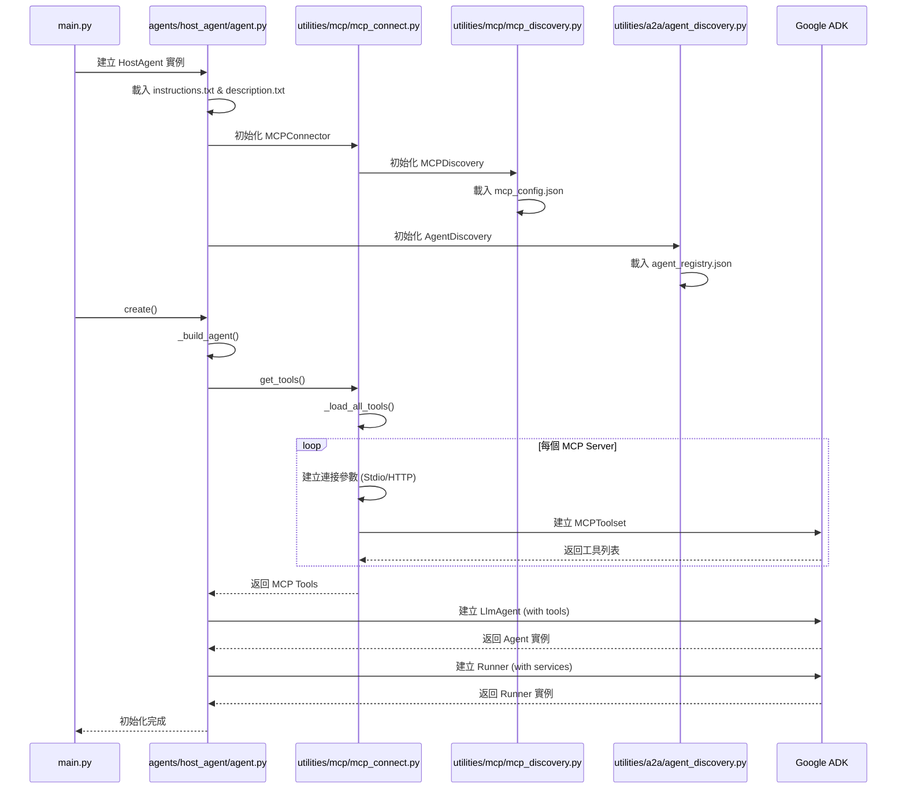
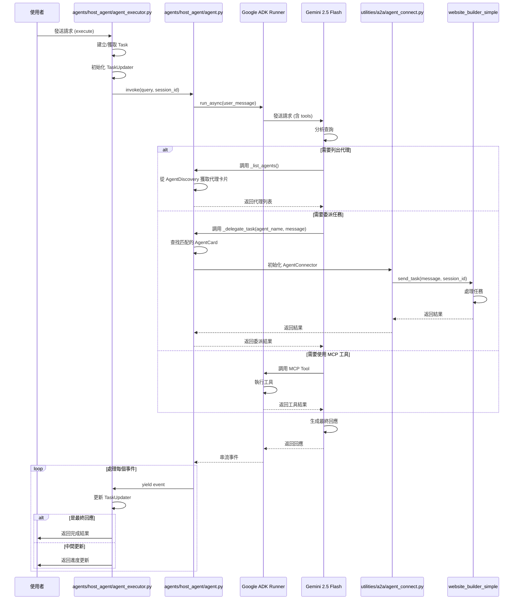
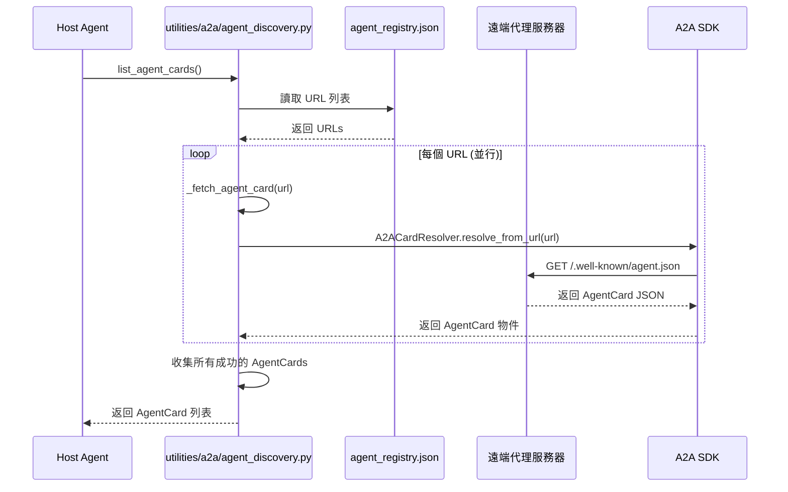
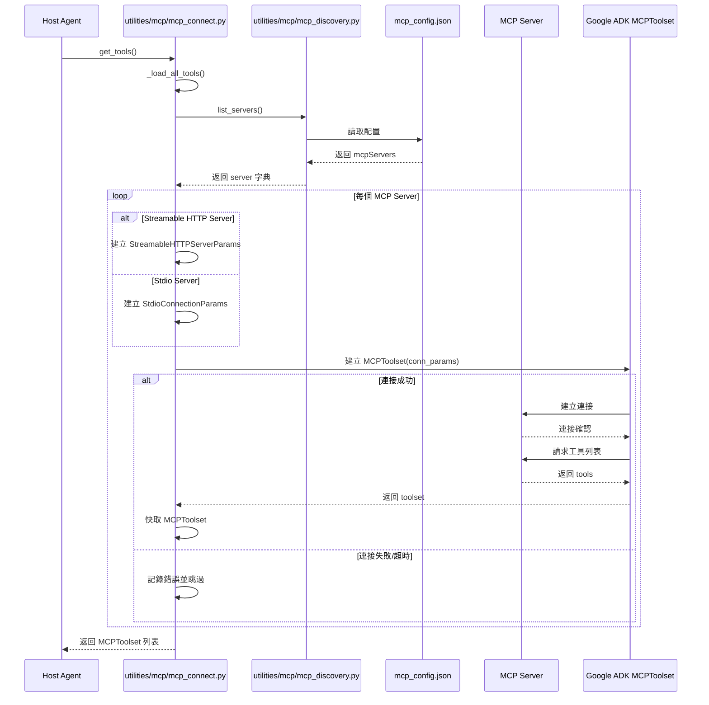
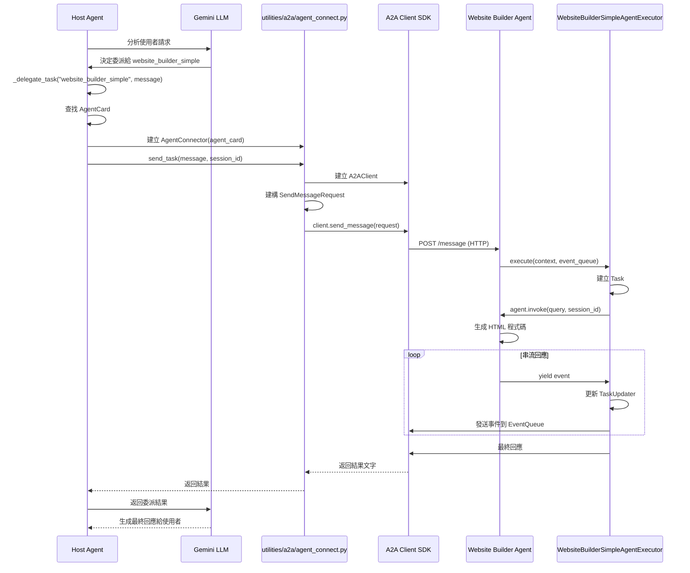
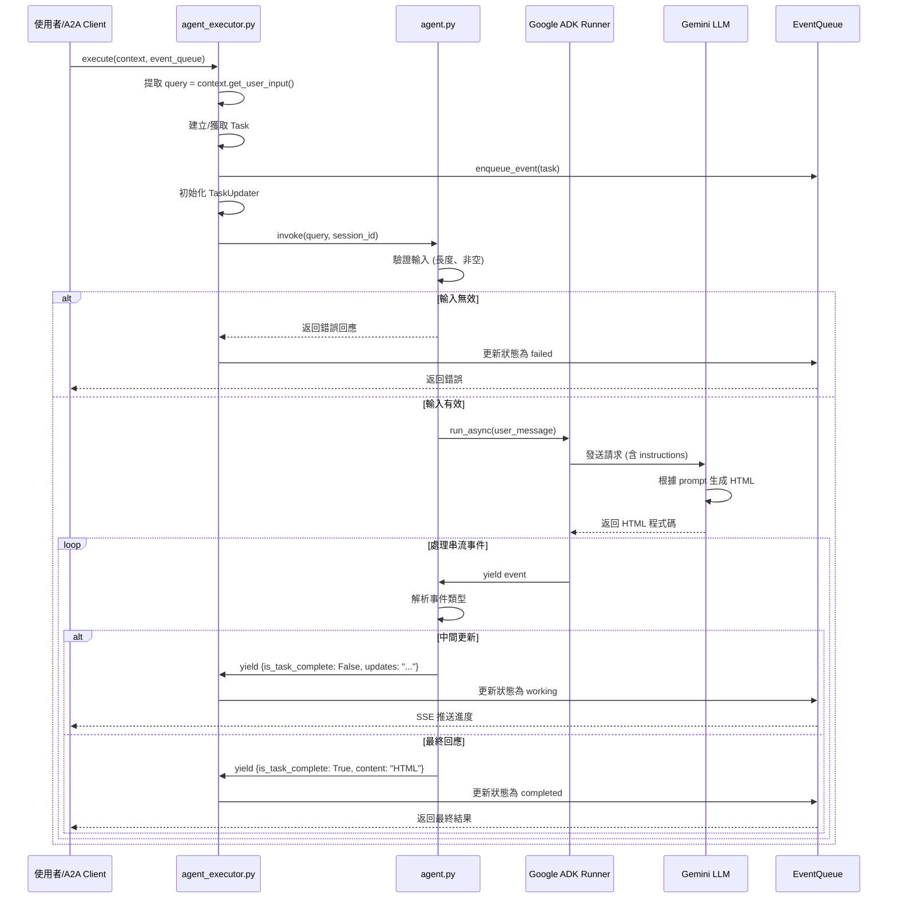

# MCP A2A 多代理系統架構文件

## 系統概覽

本專案是一個基於 **MCP (Mission Control Protocol)** 和 **A2A (Agent-to-Agent)** 協議的多代理系統，展示了如何建構可擴展、模組化的智能代理架構。

### 核心設計原則

- **模組化設計**：各模組職責明確，低耦合高內聚
- **協議驅動**：基於標準化的 MCP 和 A2A 協議
- **非同步架構**：全面採用 `async/await` 提升併發效能
- **可擴展性**：支援動態發現和註冊新代理/工具

---

## 模組說明

### 1. **核心代理模組 (agents/)**

#### 1.1 Host Agent (主機代理)

- **職責**：任務協調、代理發現、工具發現、任務委派
- **核心文件**：
  - `agent.py`：代理核心邏輯（LLM 整合、工具註冊）
  - `agent_executor.py`：A2A 框架整合、任務生命週期管理
  - `instructions.txt`：系統提示詞
  - `description.txt`：代理能力描述

#### 1.2 Website Builder Simple (網站建構代理)

- **職責**：接收指令生成 HTML 網站
- **核心文件**：
  - `agent.py`：網站生成邏輯
  - `agent_executor.py`：A2A 任務處理
  - `instructions.txt`：網站建構提示詞

### 2. **工具模組 (utilities/)**

#### 2.1 A2A 工具

- `agent_discovery.py`：代理發現機制（基於 `/.well-known/agent.json`）
- `agent_connect.py`：代理連接器（HTTP 通訊封裝）
- `agent_registry.json`：代理註冊表（URL 列表）

#### 2.2 MCP 工具

- `mcp_discovery.py`：MCP 伺服器發現（基於 JSON 配置）
- `mcp_connect.py`：MCP 連接器（工具載入與快取）
- `mcp_config.json`：MCP 伺服器配置

#### 2.3 共用工具

- `file_loader.py`：檔案載入工具

### 3. **MCP 伺服器模組 (mcp/servers/)**

- `streamable_http_server.py`：支援串流的 HTTP 伺服器
- `terminal_server/terminal_server.py`：終端機命令執行伺服器

### 4. **應用程式模組 (app/cmd/)**

- `cmd.py`：命令列介面
- `tree.py`：目錄樹展示工具

---

## 核心流程時序圖

### 流程 1：系統初始化流程



### 流程 2：使用者查詢處理流程（透過 Host Agent）



### 流程 3：A2A 代理發現流程



### 流程 4：MCP 工具發現與載入流程



### 流程 5：任務委派流程（Host Agent → Sub Agent）



### 流程 6：Website Builder Agent 獨立執行流程



---

## 關鍵設計模式

### 1. **工廠模式 (Factory Pattern)**

- **位置**：`HostAgent.create()`, `AgentExecutor.create()`
- **用途**：非同步初始化複雜物件

### 2. **適配器模式 (Adapter Pattern)**

- **位置**：`MCPConnector`, `AgentConnector`
- **用途**：將不同的協議（MCP/A2A）適配到統一介面

### 3. **發現模式 (Service Discovery Pattern)**

- **位置**：`MCPDiscovery`, `AgentDiscovery`
- **用途**：動態發現和註冊服務

### 4. **觀察者模式 (Observer Pattern)**

- **位置**：`EventQueue`, `TaskUpdater`
- **用途**：任務狀態變更通知

### 5. **策略模式 (Strategy Pattern)**

- **位置**：不同的 Agent 實作相同的執行介面
- **用途**：可插拔的代理實作

---

## 資料流向圖

```
使用者查詢
    │
    ↓
[CLI / A2A Server]
    │
    ↓
[Host Agent Executor]
    │
    ├──→ [Task Management] ──→ [EventQueue]
    │
    ↓
[Host Agent]
    │
    ├──→ [MCP Discovery] ──→ [MCP Servers] ──→ [Tools]
    │
    ├──→ [A2A Discovery] ──→ [Agent Registry] ──→ [Sub Agents]
    │
    ↓
[Google ADK Runner]
    │
    ↓
[Gemini LLM]
    │
    ├──→ [Tool Calls] ──→ [MCP Tools / A2A Delegation]
    │
    ↓
[Response Stream]
    │
    ↓
[EventQueue] ──→ [SSE / HTTP] ──→ 使用者
```

---

## 錯誤處理策略

### 1. **連接層級**

- **超時處理**：所有網路請求設定 timeout (5-300 秒)
- **重試機制**：暫未實作（可擴展點）
- **降級策略**：單一 MCP Server 失敗不影響其他服務

### 2. **任務層級**

- **狀態追蹤**：created → working → completed/failed/cancelled
- **錯誤傳播**：透過 TaskUpdater 更新錯誤狀態
- **日誌記錄**：完整的錯誤堆疊記錄

### 3. **代理層級**

- **輸入驗證**：檢查查詢長度和內容有效性
- **異常捕獲**：捕獲 LLM 調用異常並返回友善錯誤訊息

---

## 效能優化點

### 1. **並行處理**

- A2A 代理發現使用 `asyncio.gather()` 並行請求
- MCP 工具載入採用非阻塞式載入

### 2. **快取機制**

- MCPToolset 在 `MCPConnector` 中快取，避免重複載入
- AgentCard 可進一步實作快取（目前每次重新獲取）

### 3. **串流處理**

- 使用 `AsyncIterable` 串流回應，降低延遲
- SSE (Server-Sent Events) 即時推送任務進度

---

## 擴展點

### 1. **新增代理**

1. 在 `agents/` 下建立新資料夾
2. 實作 `agent.py` 和 `agent_executor.py`
3. 在 `agent_registry.json` 註冊 URL

### 2. **新增 MCP Server**

1. 實作符合 MCP 協議的伺服器
2. 在 `mcp_config.json` 中註冊
3. 重啟 Host Agent 即可載入

### 3. **自訂工具**

1. 使用 `FunctionTool` 包裝 Python 函式
2. 在 `HostAgent._build_agent()` 中註冊
3. 添加對應的 docstring 供 LLM 理解

---

## 安全性考量

### 1. **API Key 管理**

- 使用 `.env` 檔案管理敏感資訊
- 不將憑證硬編碼或提交到版本控制

### 2. **輸入驗證**

- 限制查詢長度（1-10000 字元）
- 防止注入攻擊（目前依賴 LLM 安全機制）

### 3. **網路安全**

- HTTPS 連接（需在部署時配置）
- 請求超時防止資源耗盡

---

## 技術棧總覽

| 層級     | 技術                             | 用途               |
| -------- | -------------------------------- | ------------------ |
| 框架     | Google ADK                       | 代理開發框架       |
| LLM      | Gemini 2.5 Flash / 2.0 Flash Exp | 大語言模型         |
| 協議     | A2A Protocol                     | 代理間通訊         |
| 協議     | MCP Protocol                     | 工具/伺服器通訊    |
| 網路     | HTTPX                            | 非同步 HTTP 客戶端 |
| 語言     | Python 3.12+                     | 主要開發語言       |
| 套件管理 | uv                               | 依賴管理           |
| 資料驗證 | Pydantic                         | 類型安全與驗證     |
| 日誌     | logging / rich                   | 日誌記錄與美化     |

---

## 開發最佳實踐

### 1. **程式碼組織**

- 一個模組一個職責
- 使用清晰的命名規範
- 添加完整的 docstring（中英雙語）

### 2. **錯誤處理**

- 使用 try-except 捕獲預期錯誤
- 記錄完整的錯誤堆疊
- 返回友善的錯誤訊息

### 3. **測試策略**

- 單元測試：測試單一函式/方法
- 整合測試：測試模組間互動
- 端到端測試：測試完整流程

### 4. **效能監控**

- 記錄關鍵操作的執行時間
- 監控記憶體使用
- 追蹤 LLM Token 消耗

---

## 常見問題排查

### 問題 1: MCP Server 連接失敗

**症狀**：啟動時顯示 "Timeout loading tools from server"

**排查步驟**：

1. 檢查 `mcp_config.json` 中的命令和參數是否正確
2. 手動執行命令測試 Server 是否可啟動
3. 檢查防火牆設置
4. 查看 Server 日誌

### 問題 2: A2A 代理無法發現

**症狀**：`list_agent_cards()` 返回空列表

**排查步驟**：

1. 檢查 `agent_registry.json` 中的 URL 是否可訪問
2. 測試 `GET /.well-known/agent.json` 端點
3. 確認代理服務器正在運行
4. 檢查網路連接

### 問題 3: LLM 回應異常

**症狀**：生成的內容不符合預期

**排查步驟**：

1. 檢查 `instructions.txt` 提示詞是否清晰
2. 確認工具的 docstring 是否完整
3. 查看 LLM 的完整請求和回應日誌
4. 調整溫度參數或切換模型

---

## 未來發展方向

### 短期目標

- [ ] 實作 AgentCard 快取機制
- [ ] 添加完整的單元測試覆蓋
- [ ] 實作請求重試機制
- [ ] 添加效能監控儀表板

### 中期目標

- [ ] 支援多模態輸入（圖片、音訊）
- [ ] 實作代理版本控制
- [ ] 添加分散式追蹤（OpenTelemetry）
- [ ] 建立 Web UI 管理介面

### 長期目標

- [ ] 支援自動代理生成
- [ ] 實作自我學習機制
- [ ] 建立代理市場平台
- [ ] 企業級部署方案（K8s）

---

## 參考資料

- [Google ADK 官方文檔](https://github.com/google/generative-ai-python)
- [A2A Protocol 規範](https://github.com/google/a2a)
- [MCP Protocol 規範](https://modelcontextprotocol.io/)
- [Pydantic 文檔](https://docs.pydantic.dev/)
- [HTTPX 文檔](https://www.python-httpx.org/)

---

## 版本歷史

| 版本  | 日期       | 變更說明         |
| ----- | ---------- | ---------------- |
| 1.0.0 | 2025-12-09 | 初始架構文件建立 |

---

**維護者**：MCP A2A Master Team
**最後更新**：2025 年 12 月 9 日
