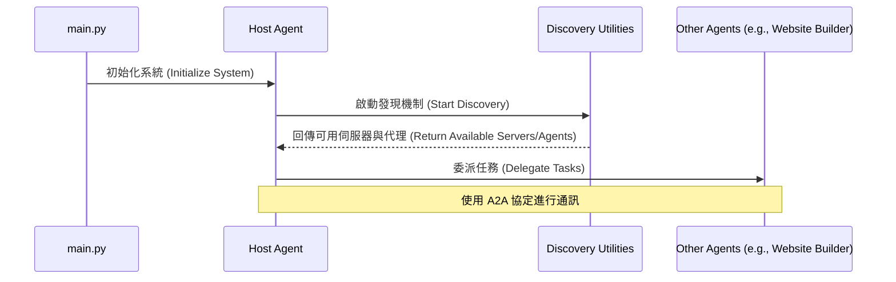

# MCP A2A 多代理系統實戰課程

本專案是一個關於從頭開始建構多代理系統的綜合實戰課程。它涵蓋了使用任務控制協定 (Mission Control Protocol, MCP) 和代理對代理 (Agent-to-Agent, A2A) 通訊來創建穩健且可擴展的多代理架構的基礎知識。

## 專案概覽

本專案展示了如何建構一個包含 `host_agent` 的多代理系統，該代理透過發現並委派任務給其他代理來協調工作。通訊和發現機制建立在 MCP 和 A2A 協定之上。

### 涵蓋的核心概念

- **多代理系統設計**：學習如何設計和建構具有清晰權責分離的多代理系統。
- **主機代理 (Host Agent)**：負責任務編排、委派和協調的中心代理。
- **A2A 相容代理**：建構能夠使用 A2A 協定相互通訊和互動的代理。
- **MCP 伺服器**：實作 MCP 伺服器以進行代理和工具的發現。
  - **可串流 HTTP 伺服器**：用於即時通訊的可串流 HTTP 伺服器。
  - **Stdio 伺服器**：用於簡單、直接通訊的標準 I/O 伺服器。
- **MCP 和 A2A 連接器**：用於建立代理與伺服器之間通訊的連接器。
- **發現機制**：
  - **MCP 伺服器和工具發現**：動態發現可用的 MCP 伺服器及其工具。
  - **A2A 代理發現**：發現並註冊 A2A 相容的代理。
- **任務委派**：將任務從主機代理委派給專業代理。

## 專案結構

```
├── LICENSE (授權文件)
├── README.md (專案說明文件)
├── agents (代理程式目錄)
│   ├── host_agent (主機代理)
│   │   ├── README.md (主機代理說明文件)
│   │   ├── __init__.py (模組初始化)
│   │   ├── __main__.py (主程式入口)
│   │   ├── agent.py (代理核心邏輯)
│   │   ├── agent_executor.py (代理執行器)
│   │   ├── description.txt (代理描述)
│   │   └── instructions.txt (代理指令)
│   └── website_builder_simple (簡易網站建構代理)
│       ├── README.md (網站建構代理說明文件)
│       ├── __init__.py (模組初始化)
│       ├── __main__.py (主程式入口)
│       ├── agent.py (代理核心邏輯)
│       ├── agent_executor.py (代理執行器)
│       ├── description.txt (代理描述)
│       └── instructions.txt (代理指令)
├── app (應用程式目錄)
│   └── cmd (命令列應用程式)
│       ├── README.md (命令列應用說明文件)
│       ├── __init__.py (模組初始化)
│       ├── __main__.py (主程式入口)
│       ├── cmd.py (命令列核心邏輯)
│       └── tree.py (目錄樹工具)
├── main.py (系統主入口程式)
├── mcp (MCP 協定目錄)
│   └── servers (MCP 伺服器)
│       ├── README.md (伺服器說明文件)
│       ├── streamable_http_server.py (可串流 HTTP 伺服器)
│       └── terminal_server (終端機伺服器)
│           └── terminal_server.py (終端機伺服器實作)
├── pyproject.toml (專案配置檔)
├── utilities (工具程式目錄)
│   ├── a2a (A2A 通訊工具)
│   │   ├── agent_connect.py (代理連接工具)
│   │   ├── agent_discovery.py (代理發現工具)
│   │   └── agent_registry.json (代理註冊表)
│   ├── common (共用工具)
│   │   └── file_loader.py (檔案載入工具)
│   └── mcp (MCP 通訊工具)
│       ├── mcp_config.json (MCP 配置檔)
│       ├── mcp_connect.py (MCP 連接工具)
│       └── mcp_discovery.py (MCP 發現工具)
└── uv.lock (依賴鎖定檔)
```

## 專案架構設計

參考 ✏️：[多代理系統架構設計說明文件](./ARCHI.md)

## 資料夾說明

- [**agents/**](./agents)：包含系統中的不同代理。
  - [**host_agent/**](./agents/host_agent)：主要的協調代理。
  - [**website_builder_simple/**](./agents/website_builder_simple)：一個可以建立網站的簡單代理。
- [**app/cmd/**](./app/cmd)：用於與系統互動的命令列應用程式。
- [**mcp/servers/**](./mcp/servers)：包含 MCP 伺服器的實作。
- [**utilities/**](./utilities)：包含用於 A2A 和 MCP 通訊與發現的工具。

## 開始使用

### 先決條件

- Python 3.12+
- `uv` - Python 套件管理工具
- Google API Key 或 Service Account 憑證

### 安裝

1.  **複製儲存庫：**

    ```bash
    git clone https://github.com/your-username/mcp-a2a-master.git
    cd mcp-a2a-master
    ```

2.  **安裝依賴項目：**

    ```bash
    make setup
    ```

    此指令會使用 `uv` 安裝所有必要的套件。

3.  **設定驗證資訊：**

    選擇以下其中一種驗證方式：

    **方式 1 - API Key (Gemini API)：**

    ```bash
    export GOOGLE_API_KEY=你的_API_Key
    ```

    申請金鑰：https://aistudio.google.com/app/apikey

    **方式 2 - Service Account (VertexAI)：**

    ```bash
    export GOOGLE_APPLICATION_CREDENTIALS=/path/to/service-account.json
    export GOOGLE_CLOUD_PROJECT=your_project_id
    ```

    建立憑證：https://console.cloud.google.com/iam-admin/serviceaccounts

    💡 提示：可以複製 `.env.example` 為 `.env` 並填入相關設定

## 如何執行

### 快速開始

**啟動所有服務：**

```bash
make start
```

此指令會依序啟動：

- MCP Server (port 3000)
- Host Agent (port 10000)
- Website Builder (port 10001)

**停止所有服務：**

```bash
make stop
```

### 個別服務控制

1.  **僅啟動 MCP Server：**

    ```bash
    make start-mcp
    ```

2.  **僅啟動 Host Agent：**

    ```bash
    make start-host
    ```

3.  **僅啟動 Website Builder：**

    ```bash
    make start-builder
    ```

4.  **啟動命令列介面：**
    ```bash
    make cmd
    ```

### 進階指令

**執行測試：**

```bash
make test              # 執行所有測試
make test-unit         # 僅執行單元測試
make test-integration  # 僅執行整合測試
make test-coverage     # 執行測試涵蓋率分析
```

**清理端口：**

```bash
make kill-ports  # 清理 3000, 10000, 10001 端口
```

**清理專案：**

```bash
make clean  # 清理 __pycache__, *.pyc 等檔案
```

**查看所有可用指令：**

```bash
make help
```

## 運作原理

`main.py` 腳本初始化多代理系統。`host_agent` 啟動並使用 `mcp_discovery` 和 `a2a_discovery` 工具來尋找可用的伺服器和代理。一旦發現，`host_agent` 可以使用 A2A 通訊協定將任務委派給其他代理，例如 `website_builder_simple` 代理。

`mcp` 資料夾包含伺服器實作，而 `utilities` 資料夾提供發現和連接所需的工具。


---
## 重點摘要

- **核心概念**：
  <div style='text-align: left;'>
  - 基於 MCP 和 A2A 協定的多代理系統架構
  - 透過 Host Agent 進行任務編排與委派
  - 代理與伺服器的動態發現機制
  </div>
- **關鍵技術**：
  <div style='text-align: left;'>
  - Mission Control Protocol (MCP)
  - Agent-to-Agent (A2A) 通訊協定
  - Python 3.11+
  - Streamable HTTP Server
  </div>
- **重要結論**：
  <div style='text-align: left;'>
  - 透過明確的職責分離（Host Agent vs. 專用 Agent），可以建立可擴展且靈活的 AI 系統。
  - MCP 和 A2A 提供了標準化的通訊與發現方式，簡化了多代理系統的整合複雜度。
  </div>
- **行動項目**：
  <div style='text-align: left;'>
  - 依照安裝步驟設定環境。
  - 依序啟動伺服器與代理以體驗系統運作。
  - 探索 `agents` 和 `utilities` 資料夾以深入理解實作細節。
  </div>
