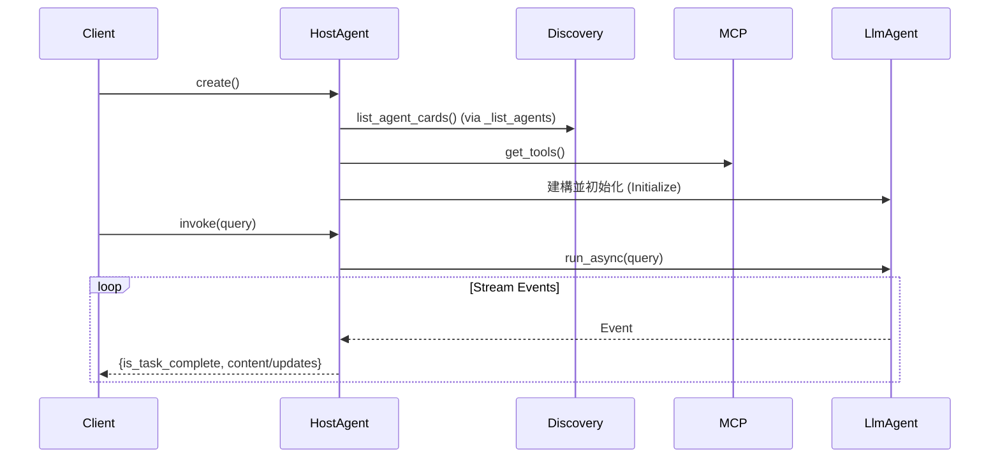
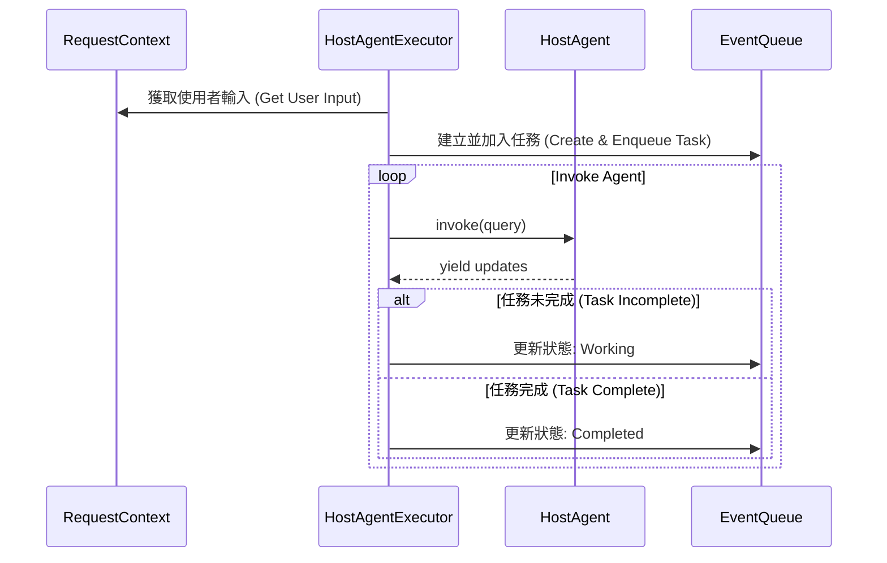

 ## Mermaid 流程圖:

```mermaid
sequenceDiagram
    participant Client
    participant HostAgent
    participant Discovery
    participant MCP
    participant LlmAgent

    Client->>HostAgent: create()
    HostAgent->>Discovery: list_agent_cards() (via _list_agents)
    HostAgent->>MCP: get_tools()
    HostAgent->>LlmAgent: 建構並初始化 (Initialize)

    Client->>HostAgent: invoke(query)
    HostAgent->>LlmAgent: run_async(query)
    loop Stream Events
        LlmAgent-->>HostAgent: Event
        HostAgent-->>Client: {is_task_complete, content/updates}
    end
```

## 任務執行流程圖:

```mermaid
sequenceDiagram
    participant Context as RequestContext
    participant Executor as HostAgentExecutor
    participant Agent as HostAgent
    participant Queue as EventQueue

    Executor->>Context: 獲取使用者輸入 (Get User Input)
    Executor->>Queue: 建立並加入任務 (Create & Enqueue Task)
    loop Invoke Agent
        Executor->>Agent: invoke(query)
        Agent-->>Executor: yield updates
        alt 任務未完成 (Task Incomplete)
            Executor->>Queue: 更新狀態: Working
        else 任務完成 (Task Complete)
            Executor->>Queue: 更新狀態: Completed
        end
    end
```