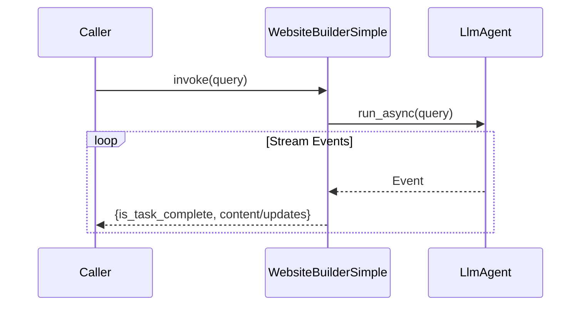

# Mermaid 流程圖:

```mermaid
sequenceDiagram
    participant Caller
    participant Builder as WebsiteBuilderSimple
    participant LlmAgent

    Caller->>Builder: invoke(query)
    Builder->>LlmAgent: run_async(query)
    loop Stream Events
        LlmAgent-->>Builder: Event
        Builder-->>Caller: {is_task_complete, content/updates}
    end
```
