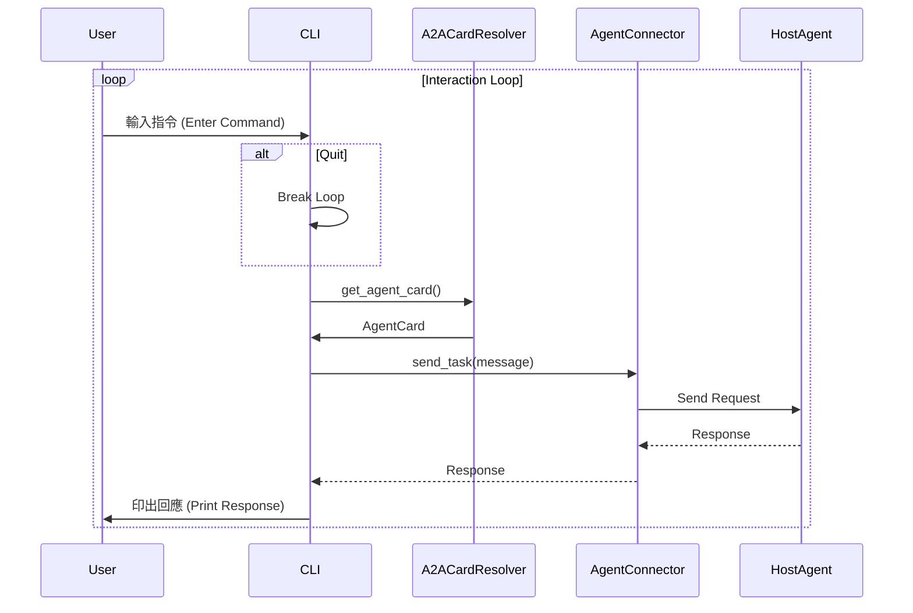

# CMD 應用程式 (CMD App)

## 概覽

CMD 應用程式 (CMD App) 是一個命令列介面 (CLI)，作為與多代理系統互動的主要使用者介面。它允許使用者連接到 Host Agent、發出指令並監控系統活動。

## 主要功能

- **互動式 Shell**：CMD 應用程式提供了一個互動式 Shell，使用者可以在其中輸入指令並獲得立即回饋。
- **Host Agent 通訊**：該應用程式連接到 Host Agent 以傳送指令並接收回應。這允許使用者控制多代理系統的行為。
- **系統監控**：CMD 應用程式可用於監控系統中各種代理和伺服器的日誌與狀態，提供系統運作的即時檢視。

## 如何執行

若要執行 CMD 應用程式，請從專案根目錄執行以下指令：

```bash
uv run python3 -m app.cmd.cmd
```

## 與其他元件的互動

- **Host Agent**：CMD 應用程式的主要互動對象是 Host Agent。它將使用者指令傳送給 Host Agent 並顯示結果。

## CMD 流程圖:



---

## 重點摘要

- **核心概念**：
  <div style='text-align: left;'>
  - 使用者互動介面 (UI)。
  - 基於 CLI 的控制台。
  </div>
- **關鍵技術**：
  <div style='text-align: left;'>
  - Python CLI 開發。
  - HTTP 客戶端 (與 Host Agent 通訊)。
  </div>
- **重要結論**：
  <div style='text-align: left;'>
  - 提供了一個簡單但強大的方式來測試和操作多代理系統。
  </div>
- **行動項目**：
  <div style='text-align: left;'>
  - 熟悉 CMD App 的指令，以有效地測試 Host Agent 的功能。
  </div>
