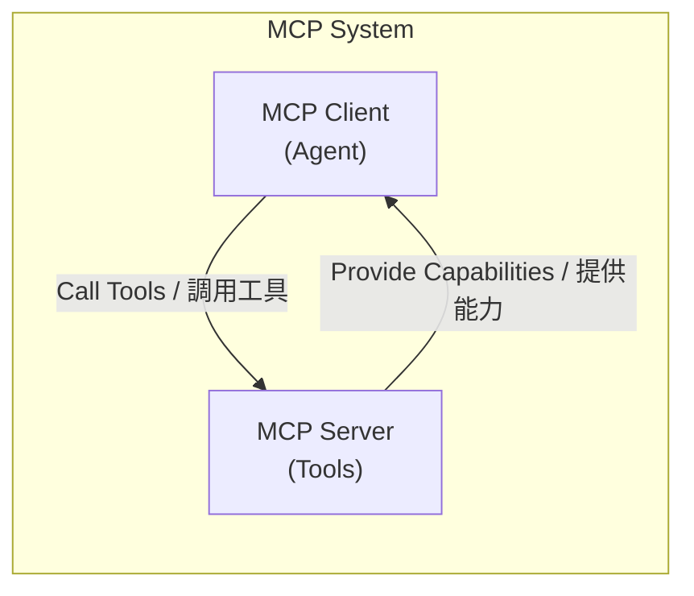
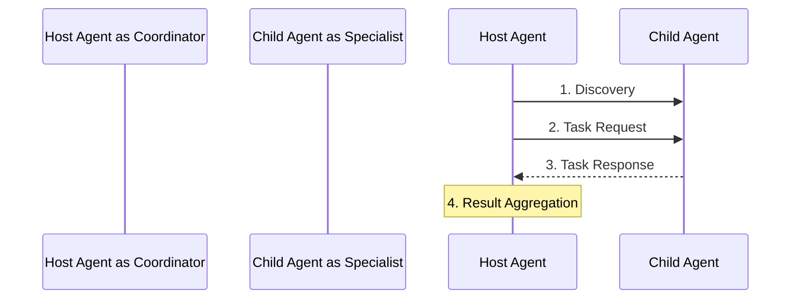
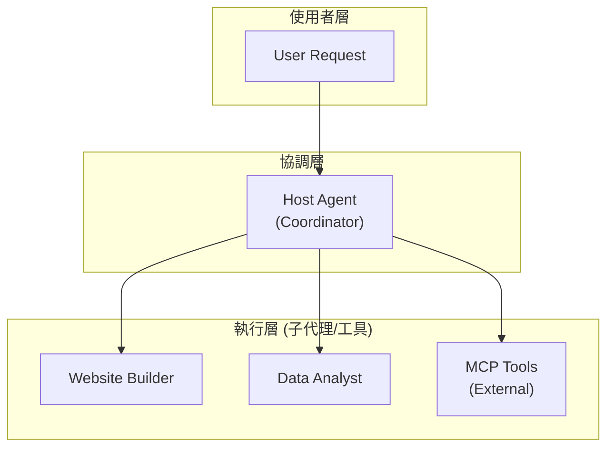

# MCP A2A 多代理系統實戰教學課程

> 從零開始建構企業級多代理系統：掌握 MCP 協議與 A2A 通訊的完整實踐指南

## 📚 課程概覽

### 學習目標

完成本課程後，你將能夠：

1. ✅ 理解 MCP (Mission Control Protocol) 和 A2A (Agent-to-Agent) 協議的核心概念
2. ✅ 建構可擴展的多代理系統架構
3. ✅ 實作主機代理（Host Agent）進行任務協調與委派
4. ✅ 開發符合 A2A 標準的專業代理
5. ✅ 整合 Google ADK 與 MCP 工具生態系統
6. ✅ 實作代理發現與動態工具註冊機制
7. ✅ 建立完整的測試與除錯策略

### 課程特色

- 🎯 **實戰導向**：每個章節都包含可執行的程式碼範例
- 🏗️ **架構清晰**：從基礎到進階，循序漸進
- 🔧 **工具整合**：涵蓋 Google ADK、MCP、A2A SDK
- 📊 **最佳實踐**：企業級程式碼品質與測試標準
- 🌐 **生態系統**：連接多個 AI 代理形成協作網路

### 先備知識

- Python 3.11+ 基礎語法
- 異步程式設計 (async/await) 基本概念
- RESTful API 基礎
- 終端機命令列操作
- Git 版本控制

### 技術堆疊

```yaml
核心框架:
  - Google ADK (Agent Development Kit): ^1.7.0
  - A2A SDK: ^0.2.15
  - MCP (Model Context Protocol): ^1.12.0

開發工具:
  - Python: 3.11+
  - uv: 套件管理器
  - pytest: 測試框架
  - rich: 終端機輸出美化

LLM 模型:
  - Gemini 2.5 Flash (預設)
  - 支援其他 Google Generative AI 模型
```

---

## 📋 課程大綱

### 🎓 基礎篇 (Foundation)

#### Day 1: 環境設置與專案初始化

- 安裝 Python 3.11+ 與 uv 工具
- 建立專案結構與虛擬環境
- 設定 Google API 認證
- 執行第一個 Hello World 代理

#### Day 2: MCP 協議基礎

- 理解 MCP 協議設計理念
- MCP Server 與 Client 架構
- Stdio 與 HTTP 連接模式
- 建立第一個 MCP Server

#### Day 3: A2A 協議基礎

- Agent-to-Agent 通訊模型
- AgentCard 規範與 `.well-known/agent.json`
- 任務生命週期管理
- 實作簡單的 A2A 代理

### 🏗️ 核心篇 (Core Concepts)

#### Day 4: Host Agent 架構設計

- 主機代理的職責與設計模式
- Google ADK LlmAgent 整合
- 系統提示詞 (System Instructions) 設計
- 工具註冊與函式呼叫機制

#### Day 5: 代理發現機制 (Agent Discovery)

- 基於檔案的代理註冊表
- 動態代理發現流程
- HTTP 並行查詢優化
- 錯誤處理與容錯設計

#### Day 6: MCP 工具整合

- MCP Connector 實作
- MCPToolset 動態載入
- 工具快取與效能優化
- 多種連接參數配置

#### Day 7: 任務委派與路由

- 智能任務路由策略
- 代理選擇演算法
- 任務上下文傳遞
- 結果聚合與回傳

### 🚀 進階篇 (Advanced Topics)

#### Day 8: 專業代理開發 - Website Builder

- 專業代理架構設計
- 業務邏輯封裝
- 輸出驗證與品質控制
- 代理能力描述最佳實踐

#### Day 9: 異步處理與並發控制

- Python asyncio 深入應用
- 並行任務管理
- 超時與重試機制
- 資源清理與優雅關閉

#### Day 10: 會話管理與記憶服務

- InMemorySessionService 實作
- 會話狀態持久化
- 記憶體管理策略
- 多使用者會話隔離

#### Day 11: 錯誤處理與日誌記錄

- 分層錯誤處理策略
- 結構化日誌記錄
- 異常追蹤與除錯
- 監控與告警設計

### 🧪 實踐篇 (Practice & Testing)

#### Day 12: 單元測試策略

- Pytest 測試框架配置
- Mock 與 Fixture 設計
- 異步測試最佳實踐
- 測試覆蓋率分析

#### Day 13: 整合測試與 E2E 測試

- 端到端測試場景設計
- 多代理協作測試
- 測試資料管理
- CI/CD 整合

#### Day 14: 效能優化與除錯

- 代理效能分析
- 記憶體洩漏檢測
- 網路請求優化
- 快取策略實作

### 🌟 專案篇 (Capstone Projects)

#### Day 15: 建構多代理協作系統

- 設計完整的業務場景
- 實作 3+ 專業代理
- 建立代理編排邏輯
- 部署與監控

---

## 🎯 Day 1: 環境設置與專案初始化

### 學習目標

- 安裝所有必要的開發工具
- 建立專案骨架
- 設定 Google API 認證
- 執行第一個代理程式

### 1.1 安裝 Python 與 uv

#### macOS / Linux

```bash
# 安裝 Python 3.12 (推薦使用 pyenv)
curl https://pyenv.run | bash
pyenv install 3.12
pyenv global 3.12

# 安裝 uv 套件管理器
curl -LsSf https://astral.sh/uv/install.sh | sh

# 驗證安裝
python --version  # 應顯示 Python 3.12.x
uv --version      # 應顯示 uv 版本
```

#### Windows

```powershell
# 使用 Scoop 安裝 Python
scoop install python

# 安裝 uv
powershell -c "irm https://astral.sh/uv/install.ps1 | iex"

# 驗證安裝
python --version
uv --version
```

### 1.2 複製並初始化專案

```bash
# 複製專案
git clone https://github.com/your-username/mcp-a2a-master.git
cd mcp-a2a-master

# 使用 uv 安裝相依套件
uv sync

# 安裝開發相依套件（包含測試工具）
uv sync --extra dev
```

### 1.3 設定 Google API 認證

#### 方法一：使用 API Key（開發環境推薦）

1. 前往 [Google AI Studio](https://aistudio.google.com/apikey)
2. 建立新的 API Key
3. 複製 `.env.example` 為 `.env`：

```bash
cp .env.example .env
```

4. 編輯 `.env` 檔案：

```env
# .env
GOOGLE_API_KEY=your_api_key_here
```

#### 方法二：使用 Service Account（生產環境推薦）

```bash
# 設定 Service Account 憑證路徑
export GOOGLE_APPLICATION_CREDENTIALS="/path/to/service-account.json"
```

### 1.4 驗證環境設置

```bash
# 執行匯入測試
uv run pytest tests/test_imports.py -v

# 執行結構測試
uv run pytest tests/test_structure.py -v

# 執行主程式
uv run python main.py
```

**預期輸出：**

```
來自 mcp-a2a-master 的問好！
```

### 1.5 專案結構導覽

```
mcp-a2a-master/
├── agents/                    # 代理程式目錄
│   ├── host_agent/           # 主機代理（協調者）
│   └── website_builder_simple/ # 網站建構代理
├── utilities/                # 工具類別
│   ├── a2a/                  # A2A 通訊工具
│   ├── mcp/                  # MCP 連接工具
│   └── common/               # 共用工具
├── mcp/servers/              # MCP 伺服器實作
├── tests/                    # 測試檔案
├── main.py                   # 主程式入口
├── pyproject.toml            # 專案設定
└── .env                      # 環境變數（需自行建立）
```

### 📝 實作練習

#### 練習 1：建立自訂代理骨架

在 `agents/` 目錄下建立一個名為 `hello_agent` 的新代理：

```python
# agents/hello_agent/agent.py
class HelloAgent:
    def __init__(self):
        self.name = "HelloAgent"

    async def greet(self, name: str) -> str:
        return f"Hello, {name}! Welcome to MCP-A2A world!"
```

#### 練習 2：執行你的第一個代理

```python
# agents/hello_agent/__main__.py
import asyncio
from .agent import HelloAgent

async def main():
    agent = HelloAgent()
    message = await agent.greet("Student")
    print(message)

if __name__ == "__main__":
    asyncio.run(main())
```

執行：

```bash
uv run python -m agents.hello_agent
```

### ✅ 檢查點

- [ ] Python 3.11+ 安裝完成
- [ ] uv 套件管理器可正常使用
- [ ] 專案相依套件安裝成功
- [ ] Google API 認證設定完成
- [ ] 測試通過
- [ ] 理解專案結構

### 🎓 延伸學習

- [uv 官方文檔](https://docs.astral.sh/uv/)
- [Python asyncio 教學](https://docs.python.org/3/library/asyncio.html)
- [Google ADK 文檔](https://google.adk.dev/)

---

## 🎯 Day 2: MCP 協議基礎

### 學習目標

- 理解 MCP 協議的設計理念與架構
- 掌握 Server-Client 通訊模型
- 實作基本的 MCP Server
- 配置不同的連接模式

### 2.1 什麼是 MCP？

**Model Context Protocol (MCP)** 是一個開放標準，用於 AI 模型與外部工具、資料來源之間的通訊。



#### MCP 的優勢

1. **標準化通訊**：統一的協議介面
2. **工具發現**：動態發現可用工具
3. **型別安全**：JSON Schema 驗證
4. **可擴展性**：支援自訂工具
5. **多種傳輸**：Stdio、HTTP、WebSocket

### 2.2 MCP Server 架構

#### 傳輸層選擇

**Stdio 模式**（適用於本地工具）

```python
# 優點：簡單、低延遲
# 缺點：僅限本地、無法並行
from mcp import StdioServerParameters

params = StdioServerParameters(
    command="python",
    args=["-m", "my_mcp_server"]
)
```

**HTTP 模式**（適用於遠端服務）

```python
# 優點：網路可達、支援並行
# 缺點：需要網路、延遲較高
from google.adk.tools.mcp_tool.mcp_session_manager import StreamableHTTPServerParams

params = StreamableHTTPServerParams(
    url="http://localhost:8000/mcp"
)
```

### 2.3 實作第一個 MCP Server

#### 步驟 1：建立 Server 檔案

```python
# mcp/servers/calculator_server.py
"""
簡單的計算器 MCP Server
提供基本的數學運算工具
"""

import asyncio
from mcp import Server
from mcp.server.stdio import stdio_server
from mcp.types import Tool, TextContent


# 建立 MCP Server 實例
app = Server("calculator-server")


@app.list_tools()
async def list_tools() -> list[Tool]:
    """列出可用的工具"""
    return [
        Tool(
            name="add",
            description="Add two numbers",
            inputSchema={
                "type": "object",
                "properties": {
                    "a": {"type": "number", "description": "First number"},
                    "b": {"type": "number", "description": "Second number"},
                },
                "required": ["a", "b"],
            },
        ),
        Tool(
            name="multiply",
            description="Multiply two numbers",
            inputSchema={
                "type": "object",
                "properties": {
                    "a": {"type": "number"},
                    "b": {"type": "number"},
                },
                "required": ["a", "b"],
            },
        ),
    ]


@app.call_tool()
async def call_tool(name: str, arguments: dict) -> list[TextContent]:
    """執行工具呼叫"""
    if name == "add":
        result = arguments["a"] + arguments["b"]
        return [TextContent(type="text", text=f"Result: {result}")]

    elif name == "multiply":
        result = arguments["a"] * arguments["b"]
        return [TextContent(type="text", text=f"Result: {result}")]

    else:
        raise ValueError(f"Unknown tool: {name}")


async def main():
    """啟動 Stdio Server"""
    async with stdio_server() as (read_stream, write_stream):
        await app.run(
            read_stream,
            write_stream,
            app.create_initialization_options()
        )


if __name__ == "__main__":
    asyncio.run(main())
```

#### 步驟 2：註冊到 MCP 配置檔

```json
// utilities/mcp/mcp_config.json
{
  "mcpServers": {
    "calculator": {
      "command": "python",
      "args": ["-m", "mcp.servers.calculator_server"]
    }
  }
}
```

#### 步驟 3：測試 MCP Server

```python
# tests/test_calculator_server.py
import pytest
from google.adk.tools.mcp_tool import StdioConnectionParams, MCPToolset
from mcp import StdioServerParameters


@pytest.mark.asyncio
async def test_calculator_server():
    """測試計算器 Server"""

    # 建立連接參數
    conn = StdioConnectionParams(
        server_params=StdioServerParameters(
            command="python",
            args=["-m", "mcp.servers.calculator_server"]
        ),
        timeout=5
    )

    # 建立 Toolset
    toolset = MCPToolset(connection_params=conn)
    tools = await toolset.get_tools()

    # 驗證工具載入
    assert len(tools) >= 2
    tool_names = [tool.name for tool in tools]
    assert "add" in tool_names
    assert "multiply" in tool_names
```

### 2.4 整合到 Host Agent

```python
# agents/host_agent/agent.py 中的使用範例

async def _build_agent(self):
    """建構包含 MCP 工具的代理"""

    # 載入 MCP 工具
    mcp_tools = await self.MCPConnector.get_tools()

    # 建立 Agent
    agent = LlmAgent(
        model="gemini-2.0-flash-exp",
        system_instruction=self.system_instruction,
        tools=mcp_tools,  # 註冊 MCP 工具
    )

    return agent
```

### 2.5 進階：Streamable HTTP Server

```python
# mcp/servers/streamable_http_server.py
"""
可串流的 HTTP MCP Server
支援長時間執行的任務與即時回饋
"""

from fastapi import FastAPI
from fastapi.responses import StreamingResponse
import asyncio


app = FastAPI()


@app.post("/mcp/execute")
async def execute_tool(request: dict):
    """執行工具並串流結果"""

    async def generate():
        # 模擬長時間執行的任務
        for i in range(10):
            yield f"Progress: {i*10}%\n"
            await asyncio.sleep(0.5)
        yield "Complete!\n"

    return StreamingResponse(
        generate(),
        media_type="text/event-stream"
    )


if __name__ == "__main__":
    import uvicorn
    uvicorn.run(app, host="0.0.0.0", port=8000)
```

### 📝 實作練習

#### 練習 1：建立天氣查詢 MCP Server

實作一個提供天氣查詢功能的 MCP Server：

```python
# 要求：
# 1. 提供 get_weather(city: str) 工具
# 2. 返回模擬的天氣資料
# 3. 支援至少 3 個城市
# 4. 加入錯誤處理（未知城市）
```

#### 練習 2：整合到 Host Agent

將你建立的天氣 Server 整合到 Host Agent，並測試呼叫。

### ✅ 檢查點

- [ ] 理解 MCP 協議的核心概念
- [ ] 能夠建立基本的 MCP Server
- [ ] 掌握 Stdio 與 HTTP 連接模式
- [ ] 成功將 MCP Server 整合到 Agent
- [ ] 通過單元測試

### 🎓 延伸學習

- [MCP 官方規範](https://spec.modelcontextprotocol.io/)
- [Google ADK MCP 整合文檔](https://google.adk.dev/mcp)
- [FastAPI 文檔](https://fastapi.tiangolo.com/)

---

## 🎯 Day 3: A2A 協議基礎

### 學習目標

- 理解 Agent-to-Agent 通訊模型
- 掌握 AgentCard 規範
- 實作符合 A2A 標準的代理
- 建立代理間的通訊機制

### 3.1 什麼是 A2A？

**Agent-to-Agent (A2A)** 協議定義了代理之間如何發現、通訊和協作。



### 3.2 AgentCard 規範

每個 A2A 代理必須提供 **AgentCard** 來描述自己的能力。

#### AgentCard 結構

```json
{
  "id": "website-builder-simple",
  "name": "WebsiteBuilderSimple",
  "description": "A simple agent that builds HTML websites",
  "url": "http://localhost:8001",
  "capabilities": ["html_generation", "css_styling", "responsive_design"],
  "version": "1.0.0",
  "metadata": {
    "author": "Your Name",
    "license": "MIT"
  }
}
```

#### 暴露 AgentCard 的標準端點

```python
# agents/website_builder_simple/agent_executor.py
from fastapi import FastAPI
from a2a.types import AgentCard

app = FastAPI()


@app.get("/.well-known/agent.json")
async def get_agent_card() -> AgentCard:
    """返回代理卡片（標準端點）"""
    return AgentCard(
        id="website-builder-simple",
        name="WebsiteBuilderSimple",
        description="A simple agent that builds HTML websites",
        url="http://localhost:8001",
        capabilities=["html_generation"],
        version="1.0.0"
    )
```

### 3.3 實作 A2A 代理

#### 完整的 Website Builder Agent

```python
# agents/website_builder_simple/agent.py
"""
網站建構代理
接收使用者需求，生成 HTML 網站
"""

from google.adk.agents import LlmAgent
from google.adk import Runner
from utilities.common.file_loader import load_instructions_file


class WebsiteBuilderAgent:
    """簡單的網站建構代理"""

    def __init__(self):
        self.system_instruction = load_instructions_file(
            "agents/website_builder_simple/instructions.txt"
        )
        self.description = load_instructions_file(
            "agents/website_builder_simple/description.txt"
        )
        self._agent = None
        self._runner = None

    async def create(self):
        """建立代理實例"""
        self._agent = await self._build_agent()
        self._runner = Runner(
            app_name=self._agent.name,
            agent=self._agent
        )

    async def _build_agent(self) -> LlmAgent:
        """建構 LLM 代理"""
        return LlmAgent(
            model="gemini-2.0-flash-exp",
            system_instruction=self.system_instruction,
            name="website_builder_simple"
        )

    async def build_website(self, requirements: str) -> str:
        """
        根據需求建構網站

        Args:
            requirements: 網站需求描述

        Returns:
            生成的 HTML 程式碼
        """
        session_id = "website_build_session"
        response = ""

        async for event in self._runner.run_async(
            user_message=f"Build a website with these requirements: {requirements}",
            user_id=session_id,
            session_id=session_id
        ):
            if hasattr(event, "text"):
                response += event.text

        return response
```

#### 系統提示詞設計

```text
# agents/website_builder_simple/instructions.txt

You are a professional web developer agent specialized in creating HTML websites.

Your responsibilities:
1. Analyze user requirements carefully
2. Generate clean, semantic HTML5 code
3. Include responsive CSS styling
4. Ensure accessibility standards (WCAG)
5. Add helpful comments in the code

Output format:
- Return ONLY the HTML code
- Use modern HTML5 practices
- Include inline CSS in <style> tags
- Make it mobile-friendly

Quality standards:
- Valid HTML syntax
- Properly indented code
- Semantic HTML elements
- No external dependencies
```

### 3.4 A2A 通訊實作

#### Agent Executor (HTTP Server)

```python
# agents/website_builder_simple/agent_executor.py
"""
A2A Agent Executor
處理 HTTP 請求，執行代理任務
"""

from fastapi import FastAPI, HTTPException
from pydantic import BaseModel
from a2a.types import AgentCard, Task, TaskResult
from .agent import WebsiteBuilderAgent
import asyncio


app = FastAPI()
agent_instance = None


class TaskRequest(BaseModel):
    """任務請求模型"""
    message: str
    session_id: str


@app.on_event("startup")
async def startup_event():
    """啟動時初始化代理"""
    global agent_instance
    agent_instance = WebsiteBuilderAgent()
    await agent_instance.create()


@app.get("/.well-known/agent.json")
async def get_agent_card() -> dict:
    """返回代理卡片"""
    return {
        "id": "website-builder-simple",
        "name": "WebsiteBuilderSimple",
        "description": agent_instance.description if agent_instance else "A simple website builder",
        "url": "http://localhost:8001",
        "capabilities": ["html_generation"],
        "version": "1.0.0"
    }


@app.post("/task")
async def execute_task(request: TaskRequest) -> dict:
    """
    執行代理任務

    Args:
        request: 包含 message 和 session_id 的任務請求

    Returns:
        任務執行結果
    """
    if not agent_instance:
        raise HTTPException(status_code=503, detail="Agent not initialized")

    try:
        result = await agent_instance.build_website(request.message)

        return {
            "status": "completed",
            "result": result,
            "session_id": request.session_id
        }

    except Exception as e:
        raise HTTPException(status_code=500, detail=str(e))


@app.get("/health")
async def health_check():
    """健康檢查端點"""
    return {"status": "healthy", "agent": "website_builder_simple"}
```

#### 啟動 Agent Server

```python
# agents/website_builder_simple/__main__.py
"""
啟動 Website Builder Agent HTTP Server
"""

import uvicorn
from .agent_executor import app


if __name__ == "__main__":
    uvicorn.run(
        app,
        host="0.0.0.0",
        port=8001,
        log_level="info"
    )
```

執行：

```bash
# 啟動 Website Builder Agent
uv run python -m agents.website_builder_simple

# 在另一個終端測試
curl http://localhost:8001/.well-known/agent.json
```

### 3.5 代理發現與註冊

#### 註冊代理

```json
// utilities/a2a/agent_registry.json
["http://localhost:8001", "http://localhost:8002", "http://localhost:8003"]
```

#### Agent Discovery 實作

```python
# utilities/a2a/agent_discovery.py
"""
A2A 代理發現服務
從註冊表中查詢所有代理的 AgentCard
"""

import asyncio
import httpx
from a2a.client import A2ACardResolver
from a2a.types import AgentCard


class AgentDiscovery:
    """代理發現服務"""

    def __init__(self, registry_file: str = "utilities/a2a/agent_registry.json"):
        self.registry_file = registry_file
        self.base_urls = self._load_registry()

    def _load_registry(self) -> list[str]:
        """載入註冊表"""
        import json
        with open(self.registry_file, 'r') as f:
            return json.load(f)

    async def list_agent_cards(self) -> list[AgentCard]:
        """
        並行查詢所有代理的 AgentCard

        Returns:
            成功取得的 AgentCard 列表
        """
        cards = []

        async with httpx.AsyncClient(timeout=30.0) as client:
            tasks = [
                self._fetch_agent_card(url, client)
                for url in self.base_urls
            ]

            # 並行執行所有查詢
            results = await asyncio.gather(*tasks, return_exceptions=True)

            # 過濾成功的結果
            for result in results:
                if isinstance(result, AgentCard):
                    cards.append(result)

        return cards

    async def _fetch_agent_card(
        self,
        base_url: str,
        client: httpx.AsyncClient
    ) -> AgentCard:
        """
        從單一代理獲取 AgentCard

        Args:
            base_url: 代理的基礎 URL
            client: HTTP 客戶端

        Returns:
            AgentCard 物件
        """
        try:
            # 使用 A2A SDK 的解析器
            card = await A2ACardResolver.resolve_from_url(
                base_url,
                httpx_client=client
            )
            return card

        except Exception as e:
            print(f"Failed to fetch agent card from {base_url}: {e}")
            raise
```

### 📝 實作練習

#### 練習 1：建立資料分析代理

建立一個 `data_analyst_agent`，提供以下功能：

```python
# 要求：
# 1. 接收 CSV 資料
# 2. 執行基本統計分析
# 3. 返回分析報告
# 4. 暴露標準的 AgentCard
# 5. 實作 HTTP Server
```

#### 練習 2：測試代理通訊

使用 `AgentConnector` 連接到你的代理並發送任務：

```python
from utilities.a2a.agent_connect import AgentConnector
from a2a.types import AgentCard

# 建立測試
async def test_data_analyst():
    card = AgentCard(
        id="data-analyst",
        name="DataAnalyst",
        url="http://localhost:8002"
    )

    connector = AgentConnector(agent_card=card)
    result = await connector.send_task(
        message="Analyze this data: [1, 2, 3, 4, 5]",
        session_id="test_session"
    )

    print(result)
```

### ✅ 檢查點

- [ ] 理解 A2A 協議的通訊模型
- [ ] 能夠建立符合標準的 AgentCard
- [ ] 實作 HTTP Server 暴露代理端點
- [ ] 實作代理發現機制
- [ ] 測試代理間通訊

### 🎓 延伸學習

- [A2A 協議規範](https://github.com/google/a2a-sdk)
- [FastAPI 進階教學](https://fastapi.tiangolo.com/advanced/)
- [HTTP 協議基礎](https://developer.mozilla.org/en-US/docs/Web/HTTP)

---

## 🎯 Day 4: Host Agent 架構設計

### 學習目標

- 理解主機代理的職責與設計模式
- 整合 Google ADK LlmAgent
- 設計高品質的系統提示詞
- 實作工具註冊與函式呼叫

### 4.1 Host Agent 的角色

Host Agent 是多代理系統的**協調中心**，負責：

1. **任務分析**：理解使用者需求
2. **代理發現**：找到合適的子代理
3. **任務委派**：分配任務給專業代理
4. **結果聚合**：整合多個代理的回應
5. **錯誤處理**：處理失敗與重試

#### 架構圖


### 4.2 完整的 Host Agent 實作

```python
# agents/host_agent/agent.py
"""
主機代理 - 系統協調者
整合 MCP 工具與 A2A 代理發現
"""

from typing import AsyncIterable
from google.adk.agents import LlmAgent
from google.adk import Runner
from google.adk.tools.function_tool import FunctionTool
from utilities.mcp.mcp_connect import MCPConnector
from utilities.a2a.agent_discovery import AgentDiscovery
from utilities.a2a.agent_connect import AgentConnector
from utilities.common.file_loader import load_instructions_file
from uuid import uuid4


class HostAgent:
    """主機代理類別"""

    def __init__(self):
        # 載入配置
        self.system_instruction = load_instructions_file(
            "agents/host_agent/instructions.txt"
        )
        self.description = load_instructions_file(
            "agents/host_agent/description.txt"
        )

        # 初始化連接器
        self.MCPConnector = MCPConnector()
        self.AgentDiscovery = AgentDiscovery()

        # 內部狀態
        self._agent = None
        self._runner = None
        self._user_id = "host_agent_user"

    async def create(self):
        """初始化代理與 Runner"""
        self._agent = await self._build_agent()
        self._runner = Runner(
            app_name=self._agent.name,
            agent=self._agent
        )

    async def _build_agent(self) -> LlmAgent:
        """
        建構 LLM 代理
        整合 MCP 工具與 A2A 函式
        """
        # 1. 載入 MCP 工具
        mcp_tools = await self.MCPConnector.get_tools()

        # 2. 建立 A2A 函式工具
        a2a_tools = [
            FunctionTool(
                func=self._list_agents,
                name="list_agents",
                description="List all available A2A agents with their capabilities"
            ),
            FunctionTool(
                func=self._delegate_task,
                name="delegate_task",
                description="Delegate a task to a specific agent by name"
            )
        ]

        # 3. 合併所有工具
        all_tools = mcp_tools + a2a_tools

        # 4. 建立 LlmAgent
        agent = LlmAgent(
            model="gemini-2.0-flash-exp",
            system_instruction=self.system_instruction,
            tools=all_tools,
            name="host_agent"
        )

        return agent

    async def _list_agents(self) -> list[dict]:
        """
        列出所有可用的 A2A 代理

        Returns:
            代理卡片字典列表
        """
        cards = await self.AgentDiscovery.list_agent_cards()
        return [card.model_dump(exclude_none=True) for card in cards]

    async def _delegate_task(self, agent_name: str, message: str) -> str:
        """
        委派任務給指定代理

        Args:
            agent_name: 代理名稱或 ID
            message: 任務訊息

        Returns:
            代理的執行結果
        """
        # 1. 查找代理
        cards = await self.AgentDiscovery.list_agent_cards()

        matched_card = None
        for card in cards:
            if card.name.lower() == agent_name.lower():
                matched_card = card
                break
            elif getattr(card, "id", "").lower() == agent_name.lower():
                matched_card = card
                break

        if not matched_card:
            return f"❌ Agent '{agent_name}' not found. Available agents: {[c.name for c in cards]}"

        # 2. 建立連接器
        connector = AgentConnector(agent_card=matched_card)

        # 3. 發送任務
        try:
            result = await connector.send_task(
                message=message,
                session_id=str(uuid4())
            )
            return result

        except Exception as e:
            return f"❌ Error delegating to {agent_name}: {str(e)}"

    async def invoke(
        self,
        query: str,
        session_id: str = None
    ) -> AsyncIterable[str]:
        """
        處理使用者查詢

        Args:
            query: 使用者查詢
            session_id: 會話 ID（選填）

        Yields:
            回應事件串流
        """
        if not session_id:
            session_id = str(uuid4())

        async for event in self._runner.run_async(
            user_message=query,
            user_id=self._user_id,
            session_id=session_id
        ):
            if hasattr(event, "text") and event.text:
                yield event.text
```

### 4.3 系統提示詞設計最佳實踐

```text
# agents/host_agent/instructions.txt

You are the Host Agent - the central coordinator in a multi-agent system.

## Your Responsibilities

1. **Understand User Requests**
   - Carefully analyze what the user wants to accomplish
   - Break down complex requests into manageable subtasks
   - Identify which capabilities are needed

2. **Discover Available Resources**
   - Use `list_agents()` to see what A2A agents are available
   - Check their capabilities before delegating
   - Consider using MCP tools for standard operations

3. **Delegate Tasks Intelligently**
   - Choose the most appropriate agent for each subtask
   - Use `delegate_task(agent_name, message)` to assign work
   - Provide clear, specific instructions to child agents

4. **Aggregate Results**
   - Collect responses from all delegated tasks
   - Synthesize information into a coherent answer
   - Present results clearly to the user

5. **Handle Errors Gracefully**
   - If an agent fails, try alternative approaches
   - Explain any limitations or failures to the user
   - Never leave a user request unhandled

## Decision-Making Process

```

User Request
↓
Can I handle this with MCP tools alone?
├─ YES → Use MCP tools directly
└─ NO → Continue ↓
↓
List available agents
↓
Is there a suitable agent?
├─ YES → Delegate to agent
└─ NO → Explain limitation to user

```

## Examples

**Example 1: Building a website**
User: "Create a landing page for my coffee shop"
Your actions:
1. Call `list_agents()` to find website builder
2. Call `delegate_task("WebsiteBuilderSimple", "Create a landing page for a coffee shop with hours, menu, and contact form")`
3. Return the generated HTML to user

**Example 2: Complex multi-agent task**
User: "Analyze sales data and create a dashboard"
Your actions:
1. Delegate data analysis to DataAnalyst agent
2. Delegate visualization to ChartBuilder agent
3. Combine results into final dashboard

## Output Style

- Be concise and professional
- Show progress when delegating ("Contacting WebsiteBuilder...")
- Clearly attribute work to child agents
- Provide actionable results
```

### 4.4 工具註冊與函式呼叫

#### FunctionTool 深入解析

```python
from google.adk.tools.function_tool import FunctionTool
from typing import Annotated


# 方法 1：簡單函式
async def simple_calculator(a: int, b: int) -> int:
    """Add two numbers"""
    return a + b


tool1 = FunctionTool(
    func=simple_calculator,
    name="calculator",
    description="Adds two numbers together"
)


# 方法 2：帶型別註解的函式
async def advanced_search(
    query: Annotated[str, "The search query"],
    limit: Annotated[int, "Maximum number of results"] = 10
) -> list[dict]:
    """Search for items with detailed parameters"""
    # 實作搜尋邏輯
    return [{"title": "Result 1"}]


tool2 = FunctionTool(func=advanced_search)


# 方法 3：類別方法
class MyAgent:
    async def _internal_tool(self, param: str) -> str:
        """Internal tool function"""
        return f"Processed: {param}"

    async def create(self):
        tool = FunctionTool(
            func=self._internal_tool,
            name="process_data",
            description="Process data internally"
        )
```

#### 工具執行流程

```python
# LLM 決定呼叫工具時的流程：

1. LLM 生成工具呼叫請求：
{
  "tool": "delegate_task",
  "args": {
    "agent_name": "WebsiteBuilderSimple",
    "message": "Build a landing page"
  }
}

2. ADK Runner 攔截並執行函式：
result = await agent._delegate_task(
    agent_name="WebsiteBuilderSimple",
    message="Build a landing page"
)

3. 將結果返回給 LLM：
{
  "tool_result": {
    "output": "<html>...</html>"
  }
}

4. LLM 整合結果生成最終回應
```

### 📝 實作練習

#### 練習 1：擴展 Host Agent 功能

為 Host Agent 新增以下工具：

```python
async def _save_conversation_history(
    self,
    session_id: str,
    filename: str
) -> str:
    """
    儲存對話歷史到檔案

    Args:
        session_id: 會話 ID
        filename: 儲存的檔案名稱

    Returns:
        儲存成功訊息
    """
    # 實作儲存邏輯
    pass
```

#### 練習 2：實作智能路由

建立一個決策函式，根據使用者查詢自動選擇最適合的代理：

```python
def _select_best_agent(self, query: str, agents: list[AgentCard]) -> AgentCard:
    """
    根據查詢內容選擇最合適的代理

    策略：
    1. 關鍵字匹配
    2. 能力評分
    3. 歷史成功率
    """
    pass
```

### ✅ 檢查點

- [ ] 理解 Host Agent 的核心職責
- [ ] 掌握 LlmAgent 建構流程
- [ ] 能夠設計高品質系統提示詞
- [ ] 實作 FunctionTool 工具註冊
- [ ] 整合 MCP 與 A2A 工具

### 🎓 延伸學習

- [Google ADK Agent 文檔](https://google.adk.dev/agents)
- [提示工程最佳實踐](https://ai.google.dev/docs/prompt_best_practices)
- [函式呼叫指南](https://ai.google.dev/docs/function_calling)

---

## 🎯 Day 5-15: 其他章節大綱

由於篇幅限制，後續章節將包含以下主題（每個章節結構與前面相同）：

### Day 5: 代理發現機制

- 並行 HTTP 請求優化
- 錯誤處理與重試策略
- 代理健康檢查

### Day 6: MCP 工具整合

- 多種連接參數配置
- 工具快取與效能優化
- 超時與資源管理

### Day 7: 任務委派與路由

- 智能任務路由演算法
- 上下文傳遞策略
- 結果驗證與回饋

### Day 8: 專業代理開發

- 業務邏輯封裝
- 輸出驗證機制
- 代理版本管理

### Day 9: 異步處理與並發

- asyncio 進階應用
- 並發任務管理
- 背壓與流量控制

### Day 10: 會話管理

- 會話持久化
- 記憶體服務整合
- 多使用者隔離

### Day 11: 錯誤處理與日誌

- 分層錯誤處理
- 結構化日誌
- 監控與告警

### Day 12: 單元測試

- Pytest 進階技巧
- Mock 與 Fixture
- 測試覆蓋率

### Day 13: 整合測試

- E2E 測試設計
- 測試資料管理
- CI/CD 整合

### Day 14: 效能優化

- 效能分析工具
- 記憶體優化
- 網路請求優化

### Day 15: 專案實戰

- 完整專案開發
- 部署策略
- 運維監控

---

## 📚 附錄

### A. 常用指令速查表

```bash
# 專案設置
uv sync                    # 安裝相依套件
uv sync --extra dev        # 安裝開發相依套件

# 執行代理
uv run python main.py      # 執行主程式
uv run python -m agents.host_agent  # 執行 Host Agent
uv run python -m agents.website_builder_simple  # 執行 Website Builder

# 測試
uv run pytest              # 執行所有測試
uv run pytest tests/test_host_agent.py -v  # 執行特定測試
uv run pytest --cov        # 測試覆蓋率

# MCP Server 測試
uv run python -m mcp.servers.calculator_server

# 開發工具
uv run black .             # 程式碼格式化
uv run ruff check .        # 程式碼檢查
```

### B. 故障排除指南

#### 問題 1：Google API 認證失敗

```bash
# 檢查環境變數
echo $GOOGLE_API_KEY

# 重新載入 .env
source .env
```

#### 問題 2：MCP Server 連接超時

```python
# 增加超時時間
conn = StdioConnectionParams(
    server_params=...,
    timeout=30  # 從 5 增加到 30 秒
)
```

#### 問題 3：代理發現失敗

```bash
# 檢查代理是否運行
curl http://localhost:8001/.well-known/agent.json

# 檢查註冊表
cat utilities/a2a/agent_registry.json
```

### C. 最佳實踐清單

#### 代理開發

- ✅ 使用清晰的系統提示詞
- ✅ 實作完整的錯誤處理
- ✅ 提供詳細的 AgentCard 描述
- ✅ 加入日誌記錄
- ✅ 撰寫單元測試

#### 效能優化

- ✅ 使用並行請求
- ✅ 實作工具快取
- ✅ 設定合理的超時
- ✅ 監控記憶體使用
- ✅ 限制並發數量

#### 安全性

- ✅ 驗證輸入參數
- ✅ 使用環境變數管理密鑰
- ✅ 實作速率限制
- ✅ 記錄安全事件
- ✅ 定期更新相依套件

### D. 參考資源

#### 官方文檔

- [Google ADK 文檔](https://google.adk.dev/)
- [A2A SDK GitHub](https://github.com/google/a2a-sdk)
- [MCP 規範](https://spec.modelcontextprotocol.io/)

#### 社群資源

- [Google ADK Discord](https://discord.gg/google-adk)
- [Stack Overflow - google-adk](https://stackoverflow.com/questions/tagged/google-adk)

#### 延伸閱讀

- 《Building LLM Apps》
- 《Multi-Agent Systems: An Introduction》
- 《Designing Data-Intensive Applications》

---

## 🎉 結語

恭喜你完成 MCP A2A 多代理系統實戰課程！

### 你已經掌握的技能

1. ✅ 多代理系統架構設計
2. ✅ MCP 協議實作與整合
3. ✅ A2A 代理開發與通訊
4. ✅ Google ADK 進階應用
5. ✅ 企業級程式碼品質

### 下一步學習方向

1. **擴展代理生態**：建立更多專業代理
2. **生產環境部署**：使用 Docker、Kubernetes
3. **進階 LLM 技術**：RAG、Fine-tuning
4. **監控與可觀測性**：OpenTelemetry、Jaeger
5. **安全與權限管理**：OAuth、RBAC

### 保持聯繫

如有任何問題或建議，歡迎：

- 📧 Email: your-email@example.com
- 💬 Discord: 加入我們的社群
- 🐙 GitHub: 提交 Issue 或 PR

**祝你在 AI 代理開發的旅程中順利！** 🚀

---

## 📄 授權

本教學課程採用 MIT License 授權。

```
MIT License

Copyright (c) 2025 MCP-A2A-Master Contributors

Permission is hereby granted, free of charge, to any person obtaining a copy
of this software and associated documentation files (the "Software"), to deal
in the Software without restriction...
```

---

**最後更新：** 2025-12-11
**版本：** 1.0.0
**作者：** GitHub Copilot
