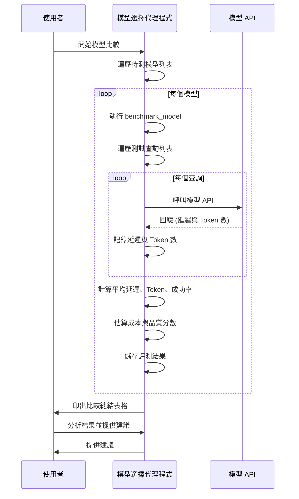

# 教學 22: 模型選擇與最佳化 - 可運作的實作

這是 ADK 訓練儲存庫中 **教學 22: 模型選擇與最佳化** 的完整可運作實作。

## 總覽

此實作展示了一個用於選擇、基準測試和比較 AI 模型的綜合框架，包括：

- **模型選擇工具**：為特定使用情境推薦合適的模型
- **模型資訊檢索**：取得每個模型的詳細功能和定價
- **基準測試框架**：在效能、成本和品質方面比較模型
- **互動式代理程式**：用於模型推薦的對話式介面

## 流程圖



## 快速入門

```bash
# 安裝依賴套件
make setup

# 以開發模式執行代理程式
make dev

# 執行自動化模型比較
make demo
```

## 專案結構

```text
tutorial22/
├── model_selector/          # 代理程式實作
│   ├── __init__.py         # 套件匯出
│   ├── agent.py            # 模型選擇框架
│   └── .env.example        # 環境變數範本
├── model_specs.py           # 獨立的模型規格
├── tests/                  # 完整的測試套件
│   ├── __init__.py         # 測試套件
│   ├── test_agent.py       # 代理程式與工具測試
│   ├── test_imports.py     # 匯入驗證
│   └── test_structure.py   # 專案結構測試
├── requirements.txt        # Python 依賴套件
├── pyproject.toml          # 專案設定
├── Makefile               # 開發指令
└── README.md              # 本檔案
```

## 代理程式功能

### 根代理程式: `model_selector_agent`

一個對話式 AI 助理，幫助使用者：

1.  **選擇正確的模型**：根據使用情境需求推薦模型
2.  **比較模型**：解釋不同模型之間的權衡
3.  **了解功能**：詳細說明功能、定價和限制
4.  **最佳化成本**：建議具成本效益的替代方案

### 可用工具

#### 1. `recommend_model_for_use_case(use_case: str)`

為給定的使用情境推薦最佳模型。

**使用情境範例：**

-   "即時語音助理" → `gemini-2.0-flash-live`
-   "複雜的策略規劃" → `gemini-2.5-pro`
-   "大量的內容審核" → `gemini-2.5-flash-lite`
-   "一般客戶服務" → `gemini-2.5-flash` (建議的預設選項)

#### 2. `get_model_info(model_name: str)`

回傳關於特定模型的詳細資訊，包括：

-   Context window (上下文視窗) 大小
-   主要功能
-   最佳使用情境
-   定價等級
-   速度特性

### ModelSelector 框架

`ModelSelector` 類別提供以程式化方式進行模型比較：

```python
from model_selector.agent import ModelSelector

selector = ModelSelector()

# 在測試查詢上進行模型基準測試
await selector.compare_models(
    models=['gemini-2.5-flash', 'gemini-2.0-flash'],
    test_queries=[...],
    instruction="..."
)
```

## 品質分數計算

**品質分數** 使用以下公式衡量模型的 **效能**：

```python
quality_score = success_rate * (1.0 / (1.0 + avg_latency))
```

**衡量指標：**

-   **`success_rate`**：成功查詢的百分比 (可靠性)
-   **`avg_latency`**：平均回應時間 (秒) (速度)
-   **分數越高** = 效能越好 (更快且更可靠)

**重要提示：** 此分數衡量的是 **效能** (速度 + 可靠性)，而非 **回應品質** (準確性、實用性或正確性)。目前的實作專注於可透過程式化方式衡量的操作指標。

**分數解讀：**

-   **0.8-1.0**：絕佳效能 (非常快，高度可靠)
-   **0.5-0.8**：良好效能 (速度與可靠性均衡)
-   **0.2-0.5**：尚可效能 (適用於某些使用情境)
-   **<0.2**：效能不佳 (緩慢或不可靠)

**計算範例：**

-   **gemini-2.5-flash-lite** (平均 0.73 秒) → `1.0 / (1.0 + 0.73)` = **0.579**
-   **gemini-2.0-flash** (平均 1.24 秒) → `1.0 / (1.0 + 1.24)` = **0.447**
-   **gemini-2.5-flash** (平均 3.31 秒) → `1.0 / (1.0 + 3.31)` = **0.232**

**未來增強功能：** 可以使用 BLEU、ROUGE 或人工評估等指標來增加回應品質的評估，但這需要有標準答案和更複雜的評估邏輯。

## 測試

### 單元測試

執行完整的測試套件：

```bash
make test
```

**測試覆蓋範圍：**

-   ✅ 代理程式設定 (8 個測試)
-   ✅ 工具功能 (12 個測試)
-   ✅ ModelSelector 類別 (2 個測試)
-   ✅ ModelBenchmark 資料類別 (1 個測試)
-   ✅ 匯入驗證 (10 個測試)
-   ✅ 專案結構 (14 個測試)

總計：47 個測試

### 覆蓋率報告

產生覆蓋率報告：

```bash
make test-cov
```

開啟 `htmlcov/index.html` 以查看詳細的覆蓋率分析。

## 示範提示

在 ADK 網頁介面中嘗試這些範例提示：

```bash
make demo
```

### 互動模式 (Web UI)

1.  **模型推薦**："我應該使用哪個模型進行即時語音聊天？"
2.  **模型比較**："比較 gemini-2.5-flash 和 gemini-2.5-pro"
3.  **模型資訊**："告訴我關於 gemini-2.5-flash-lite 的資訊"
4.  **使用情境建議**："哪個模型最適合複雜的推理任務？"

### 獨立基準測試模式

此示範也會執行自動化比較：

```bash
python -m model_selector.agent
```

這會在標準測試查詢上對多個模型進行基準測試，並提供：

-   每個查詢的平均延遲
-   Token (權杖) 使用統計
-   成本估算
-   品質分數
-   按類別推薦 (最快、最便宜、最佳品質)

## 設定

### 環境變數

選擇一種驗證方法：

**方法 1 - API 金鑰 (Gemini API)：**

```bash
export GOOGLE_API_KEY=your_api_key_here
```

免費取得金鑰：<https://aistudio.google.com/app/apikey>

**方法 2 - 服務帳號 (Vertex AI)：**

```bash
export GOOGLE_APPLICATION_CREDENTIALS=/path/to/service-account.json
export GOOGLE_CLOUD_PROJECT=your_project_id
```

### 模型設定

代理程式預設使用 `gemini-2.5-flash`，但也可以使用：

-   **gemini-2.5-flash**：最佳性價比 (建議)
-   **gemini-2.5-flash-lite**：用於簡單任務的超快模型
-   **gemini-2.5-pro**：用於複雜推理的最高品質模型
-   **gemini-2.0-flash-live**：即時雙向串流
-   **gemini-1.5-pro**：200 萬 token 上下文，適用於大型文件

## 開發指令

### 設定

```bash
make setup              # 安裝依賴套件並設定環境
```

### 開發

```bash
make dev                # 啟動 ADK 網頁介面 (localhost:8000)
make demo               # 顯示示範提示並執行基準測試
make benchmark          # 執行自動化模型效能測試
make compare-models     # 並排比較特定模型
make model-info         # 顯示詳細模型規格
make full-demo          # 完整的體驗 (所有示範)
```

### 測試指令

```bash
make test               # 使用 pytest 執行所有測試
make test-cov           # 執行測試並產出覆蓋率報告
```

### 清理

```bash
make clean              # 移除快取檔案與產物
```

## 主要學習重點

### 模型選擇最佳實踐

1.  **永遠明確指定模型**

    ```python
    agent = Agent(
        model='gemini-2.5-flash',  # 建議
        name='my_agent'
    )
    ```

2.  **根據使用情境匹配模型**

    -   即時串流 → `gemini-2.0-flash-live`
    -   複雜推理 → `gemini-2.5-pro`
    -   大量簡單任務 → `gemini-2.5-flash-lite`
    -   一般用途 → `gemini-2.5-flash`

3.  **考量權衡**

    -   成本 vs 品質
    -   速度 vs 功能
    -   Context window (上下文視窗) vs 價格

4.  **在生產環境前進行基準測試**
    -   使用真實的查詢進行測試
    -   衡量延遲、成本和品質
    -   比較多個模型

### 成本最佳化

-   對簡單任務使用較便宜的模型 (flash-lite)
-   僅在需要時使用昂貴的模型 (pro)
-   根據查詢的複雜性實作動態模型選擇
-   監控並最佳化 token 使用量

## 預期輸出範例

### 互動式代理程式回應

**使用者：** "我應該使用哪個模型進行即時語音聊天？"

**代理程式：** "對於即時語音聊天應用，我推薦
**gemini-2.0-flash-live**。此模型專為以下目的設計：

-   ✅ 即時雙向串流
-   ✅ 低延遲音訊處理
-   ✅ 多模態語音 + 文字互動

這是 Gemini 家族中唯一支援即時、雙向串流的模型，使其成為語音助理和即時對話應用的理想選擇。"

### 基準測試輸出

```
======================================================================
基準測試: gemini-2.5-flash
======================================================================

GOOGLE_API_KEY 和 GEMINI_API_KEY 都已設定。將使用 GOOGLE_API_KEY。
✅ 查詢: 法國的首都是哪裡?...
   延遲: 0.56秒, Tokens: ~1
✅ 查詢: 用簡單的術語解釋量子計算...
   延遲: 6.69秒, Tokens: ~126
✅ 查詢: 寫一首關於人工智慧的俳句...
   延遲: 2.67秒, Tokens: ~14

📊 結果:
   平均延遲: 3.31秒
   平均 Tokens: 47
   成功率: 100.0%
   成本估算: 每個查詢 $0.000004
   品質分數: 0.232

======================================================================
基準測試: gemini-2.0-flash
======================================================================

GOOGLE_API_KEY 和 GEMINI_API_KEY 都已設定。將使用 GOOGLE_API_KEY。
✅ 查詢: 法國的首都是哪裡?...
   延遲: 0.56秒, Tokens: ~6
✅ 查詢: 用簡單的術語解釋量子計算...
   延遲: 2.31秒, Tokens: ~149
✅ 查詢: 寫一首關於人工智慧的俳句...
   延遲: 0.84秒, Tokens: ~10

📊 結果:
   平均延遲: 1.24秒
   平均 Tokens: 55
   成功率: 100.0%
   成本估算: 每個查詢 $0.000006
   品質分數: 0.447

======================================================================
基準測試: gemini-2.5-flash-lite
======================================================================

GOOGLE_API_KEY 和 GEMINI_API_KEY 都已設定。將使用 GOOGLE_API_KEY。
✅ 查詢: 法國的首都是哪裡?...
   延遲: 0.61秒, Tokens: ~6
✅ 查詢: 用簡單的術語解釋量子計算...
   延遲: 1.24秒, Tokens: ~172
✅ 查詢: 寫一首關於人工智慧的俳句...
   延遲: 0.33秒, Tokens: ~15

📊 結果:
   平均延遲: 0.73秒
   平均 Tokens: 64
   成功率: 100.0%
   成本估算: 每個查詢 $0.000003
   品質分數: 0.579

======================================================================
比較摘要
======================================================================

模型                          延遲    Tokens       成本    品質
----------------------------------------------------------------------
gemini-2.5-flash                    3.31秒       47 $ 0.000004      0.232
gemini-2.0-flash                    1.24秒       55 $ 0.000006      0.447
gemini-2.5-flash-lite               0.73秒       64 $ 0.000003      0.579

======================================================================

🎯 推薦：

⚡ 最快：gemini-2.5-flash-lite (0.73秒)
💰 最便宜：gemini-2.5-flash-lite ($0.000003)
🏆 最佳品質：gemini-2.5-flash-lite (0.579)
```

## 連結

-   **教學文件**：[docs/tutorial/22_model_selection.md](../../docs/tutorial/22_model_selection.md)
-   **ADK 文件**：<https://github.com/google/adk-python>
-   **Gemini API 文件**：<https://ai.google.dev/gemini-api/docs/models>
-   **Vertex AI Gemini**：<https://cloud.google.com/vertex-ai/docs/generative-ai/models>

## 貢獻

此實作遵循 ADK 最佳實踐：

-   ✅ 根代理程式匯出為 `root_agent`
-   ✅ 工具回傳包含 `status` 和 `report` 的結構化字典
-   ✅ 完整的測試覆蓋率
-   ✅ 標準的專案結構
-   ✅ 透過 `.env.example` 進行環境設定

## 授權

為 ADK 訓練儲存庫的一部分。詳細資訊請參見主儲存庫的 LICENSE。

---

**🎉 教學 22 完成！** 您現在擁有一個可運作的模型選擇框架。準備好最佳化您的 AI 應用程式吧！

### 重點摘要
- **核心概念**：提供一個全面的框架，用於智慧選擇、基準測試和比較不同的 AI 模型，以針對特定使用情境進行最佳化。
- **關鍵技術**：
    - **模型推薦**：`recommend_model_for_use_case` 工具根據使用情境（如即時語音、複雜推理）推薦最佳模型。
    - **模型資訊檢索**：`get_model_info` 工具提供模型的詳細規格，包括上下文視窗、定價和速度。
    - **基準測試**：`ModelSelector` 類別以程式化方式比較模型在延遲、Token 使用量和成本方面的效能。
    - **品質分數**：一個綜合考慮成功率和平均延遲的效能指標，用於量化模型的速度和可靠性。
- **重要結論**：
    - 應根據特定使用情境的需求（成本、速度、品質）明確選擇模型。
    - 在部署到生產環境前，對模型進行基準測試至關重要。
    - `gemini-2.5-flash` 是大多數一般用途的建議模型，而 `gemini-2.5-flash-lite` 在成本和速度上表現最佳，`gemini-2.5-pro` 則適用於複雜任務。
- **行動項目**：
    - 使用 `make setup` 安裝依賴套件。
    - 設定 `GOOGLE_API_KEY` 或其他驗證方法。
    - 透過 `make dev` 執行互動式代理程式以取得模型推薦。
    - 執行 `make demo` 或 `make benchmark` 以對模型進行自動化效能比較。
