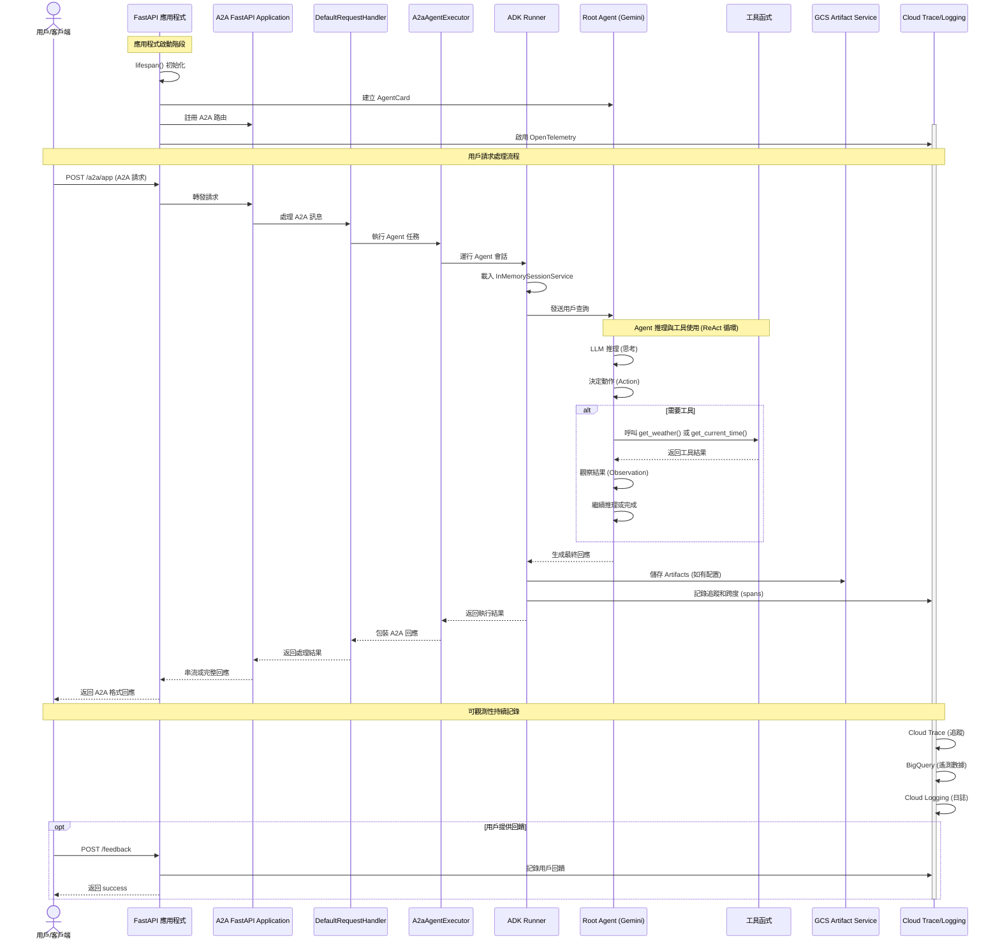

# pack-adk-a2a-agent

這是一個使用 Google 的 Agent Development Kit (ADK) 和 Agent2Agent (A2A) 協議構建的基礎 ReAct 代理程式。 #experimental
本代理程式使用 [`googleCloudPlatform/agent-starter-pack`](https://github.com/GoogleCloudPlatform/agent-starter-pack) 版本 `0.27.0` 生成。

## 專案結構

本專案組織如下：

```
pack-adk-a2a-agent/
├── app/                 # 核心應用程式程式碼
│   ├── agent.py         # 主要代理程式邏輯
│   ├── fast_api_app.py  # FastAPI 後端伺服器
│   └── app_utils/       # 應用程式工具和輔助函式
├── .github/             # GitHub Actions 的 CI/CD 流程配置
├── deployment/          # 基礎設施和部署腳本
├── notebooks/           # 用於原型設計和評估的 Jupyter notebooks
├── tests/               # 單元測試、整合測試和負載測試
├── Makefile             # 常用指令的 Makefile
├── GEMINI.md            # AI 輔助開發指南
└── pyproject.toml       # 專案依賴和配置
```

## Agent 設計流程時序圖

以下時序圖展示了從用戶請求到 Agent 回應的完整執行流程：



### 時序圖說明

**關鍵流程階段：**

1. **初始化階段**：FastAPI 啟動時建立 AgentCard、註冊 A2A 路由、啟用遙測
2. **請求處理**：用戶請求經由 A2A 協議層轉換並路由至 Agent 執行器
3. **Agent 推理**：Root Agent 使用 ReAct 模式（推理 → 動作 → 觀察）處理查詢
4. **工具執行**：根據需要呼叫 `get_weather()` 或 `get_current_time()` 工具
5. **回應生成**：Agent 生成最終回應並透過 A2A 協議返回
6. **可觀測性**：全程記錄追蹤、日誌和遙測數據至 Google Cloud

**核心元件角色：**

- **A2A Layer**：提供跨框架的 Agent 互通性標準協議
- **ADK Runner**：管理 Agent 的會話和執行生命週期
- **Root Agent**：基於 Gemini 模型的核心推理引擎
- **Artifact Service**：儲存執行產物（本地使用記憶體，部署使用 GCS）
- **Telemetry**：完整的可觀測性堆疊（Trace、Logging、BigQuery）

> 💡 **提示：** 使用 [Gemini CLI](https://github.com/google-gemini/gemini-cli) 進行 AI 輔助開發 - `GEMINI.md` 中已預先配置專案上下文。

## 需求

在開始之前，請確保您已安裝：

- **uv**: Python 套件管理器（本專案用於所有依賴管理）- [安裝](https://docs.astral.sh/uv/getting-started/installation/)（使用 `uv add <package>` [新增套件](https://docs.astral.sh/uv/concepts/dependencies/)）
- **Google Cloud SDK**: 用於 GCP 服務 - [安裝](https://cloud.google.com/sdk/docs/install)
- **Terraform**: 用於基礎設施部署 - [安裝](https://developer.hashicorp.com/terraform/downloads)
- **make**: 建置自動化工具 - [安裝](https://www.gnu.org/software/make/)（大多數 Unix 系統已預裝）

## 快速開始（本地測試）

安裝所需套件並啟動本地開發環境：

```bash
make install && make playground
```

> **📊 可觀測性說明：** 代理程式遙測 (Cloud Trace) 始終啟用。提示-回應記錄 (GCS, BigQuery, Cloud Logging) 在本地**預設停用**，在部署環境中**預設啟用**（僅詮釋資料 - 不包含提示/回應內容）。詳情請參閱 [監控與可觀測性](#監控與可觀測性)。

## 指令

| 指令                 | 說明                                                                                                |
| -------------------- | --------------------------------------------------------------------------------------------------- |
| `make install`       | 使用 uv 安裝所有所需的依賴項目                                                                      |
| `make playground`    | 啟動包含後端和前端的本地開發環境 - 利用 `adk web` 指令。                                            |
| `make deploy`        | 將代理程式部署到 Cloud Run（使用 `IAP=true` 啟用 Identity-Aware Proxy，`PORT=8080` 指定容器連接埠） |
| `make local-backend` | 啟動具有熱重載功能的本地開發伺服器                                                                  |
| `make inspector`     | 啟動 A2A 協議檢查器以測試您的代理程式實作                                                           |
| `make test`          | 執行單元測試和整合測試                                                                              |
| `make lint`          | 執行程式碼品質檢查 (codespell, ruff, mypy)                                                          |
| `make setup-dev-env` | 使用 Terraform 設定開發環境資源                                                                     |

有關完整的指令選項和用法，請參閱 [Makefile](Makefile)。

## 使用 A2A 檢查器

此代理程式實作了 [Agent2Agent (A2A) 協議](https://a2a-protocol.org/)，實現與不同框架和語言的代理程式之間的互通性。

[A2A 檢查器](https://github.com/a2aproject/a2a-inspector) 提供以下核心功能：

- 🔍 查看代理程式卡片 (agent card) 和功能
- ✅ 驗證 A2A 規範的合規性
- 💬 透過即時聊天介面測試通訊
- 🐛 使用原始訊息控制台進行除錯

### 本地測試

1. 啟動您的代理程式：

   ```bash
   make local-backend
   ```

2. 在另一個終端機中，啟動 A2A 協議檢查器：

   ```bash
   make inspector
   ```

3. 開啟 http://localhost:5001 並連線至 `http://localhost:8000`

### 遠端測試

1. 部署您的代理程式：

   ```bash
   make deploy
   ```

2. 啟動檢查器：

   ```bash
   make inspector
   ```

3. 取得驗證權杖 (authentication token)：

   ```bash
   gcloud auth print-identity-token
   ```

4. 在檢查器 UI (http://localhost:5001) 中：
   - 新增一個 HTTP 標頭，名稱為：`Authorization`
   - 將值設定為：`Bearer <步驟 3 中的權杖>`
   - 連線至您部署的 Cloud Run URL

## 使用方式

此範本遵循「自帶代理程式 (bring your own agent)」方法 - 您專注於您的業務邏輯，範本處理其餘部分（UI、基礎設施、部署、監控）。

1. **原型設計：** 參考 `notebooks/` 中的介紹筆記本構建您的生成式 AI 代理程式。使用 Vertex AI Evaluation 評估效能。
2. **整合：** 透過編輯 `app/agent.py` 將您的代理程式匯入應用程式。
3. **測試：** 使用 `make playground` 透過本地遊樂場探索您的代理程式功能。遊樂場會在程式碼變更時自動重新載入您的代理程式。
4. **部署：** 設定並啟動 CI/CD 流程，視需要自訂測試。請參閱 [部署章節](#部署) 以獲取完整說明。若要簡化基礎設施部署，只需執行 `uvx agent-starter-pack setup-cicd`。查看 [`agent-starter-pack setup-cicd` CLI 指令](https://googlecloudplatform.github.io/agent-starter-pack/cli/setup_cicd.html)。目前支援 GitHub 以及 Google Cloud Build 和 GitHub Actions 作為 CI/CD 執行器。
5. **監控：** 使用 BigQuery 遙測數據、Cloud Logging 和 Cloud Trace 追蹤效能並收集洞察，以迭代您的應用程式。

本專案包含一個 `GEMINI.md` 檔案，當詢問有關您的範本的問題時，它為 Gemini CLI 等 AI 工具提供上下文。

## 部署

> **注意：** 若要使用 Terraform 簡化整個 CI/CD 流程和基礎設施的一鍵部署，您可以使用 [`agent-starter-pack setup-cicd` CLI 指令](https://googlecloudplatform.github.io/agent-starter-pack/cli/setup_cicd.html)。目前支援 GitHub 以及 Google Cloud Build 和 GitHub Actions 作為 CI/CD 執行器。

### 開發環境

您可以使用以下指令測試對開發環境的部署：

```bash
gcloud config set project <your-dev-project-id>
make deploy
```

儲存庫包含用於設定開發 Google Cloud 專案的 Terraform 配置。
請參閱 [deployment/README.md](deployment/README.md) 以獲取說明。

### 生產環境部署

儲存庫包含用於設定生產 Google Cloud 專案的 Terraform 配置。請參閱 [deployment/README.md](deployment/README.md) 以獲取有關如何部署基礎設施和應用程式的詳細說明。

## 監控與可觀測性

本應用程式提供兩個層級的可觀測性：

**1. 代理程式遙測事件（始終啟用）**

- OpenTelemetry 追蹤和跨度 (spans) 匯出至 **Cloud Trace**
- 追蹤代理程式執行、延遲和系統指標

**2. 提示-回應記錄（可配置）**

- GenAI 儀器捕獲 LLM 互動（token、模型、時間）
- 匯出至 **Google Cloud Storage** (JSONL)、**BigQuery** (外部資料表) 和 **Cloud Logging** (專用儲存桶)

| 環境                             | 提示-回應記錄                                           |
| -------------------------------- | ------------------------------------------------------- |
| **本地開發** (`make playground`) | ❌ 預設停用                                             |
| **部署環境** (via Terraform)     | ✅ **預設啟用** (隱私保護：僅詮釋資料，無提示/回應內容) |

**要在本地啟用：** 設定 `LOGS_BUCKET_NAME` 和 `OTEL_INSTRUMENTATION_GENAI_CAPTURE_MESSAGE_CONTENT=NO_CONTENT`。

**要在部署中停用：** 編輯 Terraform 配置以設定 `OTEL_INSTRUMENTATION_GENAI_CAPTURE_MESSAGE_CONTENT=false`。

請參閱 [可觀測性指南](https://googlecloudplatform.github.io/agent-starter-pack/guide/observability.html) 以獲取詳細說明、範例查詢和視覺化選項。

## 重點摘要

- **核心概念**：ADK 代理程式開發套件、A2A 協議、Google Agent Starter Pack。
- **關鍵技術**：Google ADK, Agent2Agent (A2A), Python, FastAPI, Terraform, Cloud Run, Gemini CLI。
- **重要結論**：這是一個基於 ReAct 架構的基礎代理程式，支援 A2A 協議，便於跨框架互通，並提供完整的開發、測試、部署與監控流程。
- **行動項目**：安裝相依套件 (`uv`, `gcloud`, `terraform`, `make`)，使用 `make playground` 進行本地測試，並透過 `make deploy` 部署至 Cloud Run。
