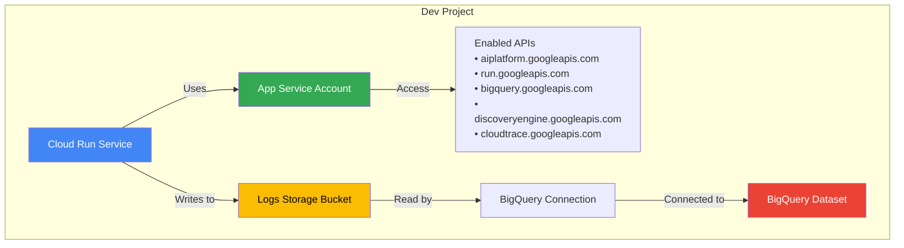
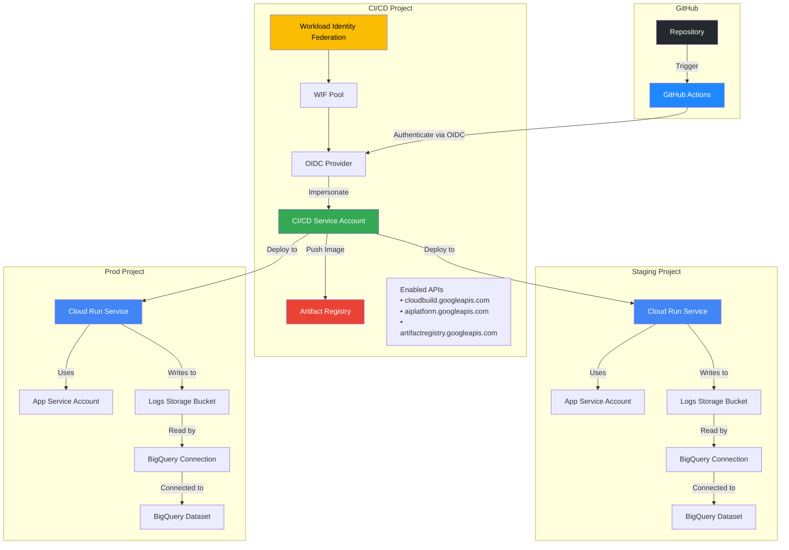

# 部署說明

## 檔案結構

```
├── apis.tf
├── dev
│   ├── apis.tf
│   ├── iam.tf
│   ├── providers.tf
│   ├── service.tf
│   ├── storage.tf
│   ├── telemetry.tf
│   ├── variables.tf
│   └── vars
│       └── env.tfvars
├── github.tf
├── iam.tf
├── locals.tf
├── providers.tf
├── service.tf
├── service_accounts.tf
├── sql
│   └── completions.sql
├── storage.tf
├── telemetry.tf
├── variables.tf
├── vars
│   └── env.tfvars
└── wif.tf
```

## 架構設計圖

### Dev 環境架構



### Prod/Staging 環境架構（完整 CI/CD）



## 元件配置清單

### Terraform 配置檔案

| 環境                    | 檔案                  | 元件說明                                          | 注意事項                                               |
| ----------------------- | --------------------- | ------------------------------------------------- | ------------------------------------------------------ |
| **共用 (Prod/Staging)** | `apis.tf`             | 啟用 CI/CD 專案及部署專案所需的 Google Cloud APIs | 包含 Cloud Build、AI Platform、Discovery Engine 等服務 |
| 共用 (Prod/Staging)     | `service.tf`          | 定義 Cloud Run 服務配置（Staging & Prod）         | 預設容器映像為 placeholder，由 CI/CD 替換              |
| 共用 (Prod/Staging)     | `storage.tf`          | 建立日誌儲存 Bucket 和 Artifact Registry          | Logs bucket 啟用 uniform bucket level access           |
| 共用 (Prod/Staging)     | `telemetry.tf`        | 設定 BigQuery 資料集、連線和日誌接收器            | 用於收集和分析 GenAI 遙測資料                          |
| 共用 (Prod/Staging)     | `iam.tf`              | 配置 IAM 角色綁定（CI/CD SA 和 App SA）           | CI/CD SA 需要跨專案的部署權限                          |
| 共用 (Prod/Staging)     | `service_accounts.tf` | 建立 CI/CD Runner 和應用程式服務帳號              | 每個環境獨立的 App SA                                  |
| 共用 (Prod/Staging)     | `wif.tf`              | 設定 Workload Identity Federation 與 GitHub OIDC  | 實現無金鑰的 GitHub Actions 認證                       |
| 共用 (Prod/Staging)     | `github.tf`           | 管理 GitHub Repository 和 Actions 變數/密鑰       | 可選擇建立新 repo 或使用現有 repo                      |
| 共用 (Prod/Staging)     | `locals.tf`           | 定義本地變數（API 列表、專案 ID 對應）            | 中央化管理重複使用的值                                 |
| 共用 (Prod/Staging)     | `variables.tf`        | 定義 Terraform 輸入變數                           | 包含專案 ID、區域、角色列表等                          |
| 共用 (Prod/Staging)     | `providers.tf`        | 配置 Terraform Provider（Google、GitHub）         | -                                                      |
| 共用 (Prod/Staging)     | `vars/env.tfvars`     | 環境特定的變數值                                  | 需根據實際環境填寫                                     |
| **Dev**                 | `dev/apis.tf`         | 啟用 Dev 專案所需的 Google Cloud APIs             | 與 Prod/Staging 類似，但僅針對單一專案                 |
| Dev                     | `dev/service.tf`      | 定義 Dev 環境 Cloud Run 服務配置                  | 預設啟用 session affinity，最小實例數為 1              |
| Dev                     | `dev/storage.tf`      | 建立 Dev 環境的日誌儲存 Bucket                    | 無 Artifact Registry（手動部署）                       |
| Dev                     | `dev/telemetry.tf`    | 設定 Dev 環境的 BigQuery 遙測資源                 | 與 Prod/Staging 架構相同                               |
| Dev                     | `dev/iam.tf`          | 配置 Dev 環境的 IAM 角色                          | 為 default compute SA 授予 Cloud Build 權限            |
| Dev                     | `dev/variables.tf`    | Dev 環境的 Terraform 變數定義                     | 包含 telemetry 和 feedback 日誌篩選器                  |
| Dev                     | `dev/providers.tf`    | Dev 環境的 Provider 配置                          | 簡化版，僅需 Google Provider                           |
| Dev                     | `dev/vars/env.tfvars` | Dev 環境變數值                                    | 需填寫 `dev_project_id`                                |
| **其他**                | `sql/completions.sql` | BigQuery SQL 查詢範例                             | 用於查詢 AI completions 遙測資料                       |

### 關鍵差異比較

| 項目                  | Dev 環境             | Prod/Staging 環境                |
| --------------------- | -------------------- | -------------------------------- |
| **部署方式**          | 手動部署（無 CI/CD） | GitHub Actions 自動化 CI/CD      |
| **專案數量**          | 1 個專案             | 3 個專案（CI/CD、Staging、Prod） |
| **Workload Identity** | ❌ 不需要            | ✅ 必須（GitHub OIDC）           |
| **Artifact Registry** | ❌ 不需要            | ✅ 必須                          |
| **Service Account**   | 僅 App SA            | App SA + CI/CD Runner SA         |
| **最小實例數**        | 1（預設）            | 依配置（Staging/Prod）           |
| **部署權限**          | Default Compute SA   | CI/CD SA 跨專案權限              |
| **適用場景**          | 本地開發、快速測試   | 正式環境、自動化部署             |

### 重要注意事項

1. **專案 ID 配置**：

   - Dev: 僅需 `dev_project_id`
   - Prod/Staging: 需要 `cicd_runner_project_id`、`staging_project_id`、`prod_project_id`

2. **API 啟用順序**：

   - 所有資源都 `depends_on` API 服務啟用
   - 建議先手動啟用 Cloud Resource Manager API

3. **BigQuery 連線**：

   - 需要等待 10 秒讓服務帳號傳播（`time_sleep` 資源）
   - 連線服務帳號需要 Storage Object Viewer 角色

4. **Cloud Run 映像**：

   - Prod/Staging 使用 `lifecycle.ignore_changes` 避免 Terraform 覆寫 CI/CD 部署的映像
   - Dev 環境也使用相同機制，但通常手動更新

5. **Workload Identity Federation**：

   - 僅限 Prod/Staging 環境
   - 需要預先配置 GitHub repository owner 和 name
   - OIDC provider 限制特定 repository 存取

6. **遙測資料收集**：
   - 所有環境都配置 BigQuery 外部表格
   - Dev 環境包含自定義的日誌篩選器變數
   - 預設捕獲 `agent_telemetry` 和 `feedback` 類型日誌

## 說明

此目錄包含用於佈建您的代理程式所需的 Google Cloud 基礎設施的 Terraform 配置。

部署基礎設施和設定 CI/CD 管道的推薦方法是從專案根目錄使用 `agent-starter-pack setup-cicd` 指令。

但是，如果您偏好更實作的方法，您始終可以手動應用 Terraform 配置以進行自行設定。

有關部署流程、基礎設施和 CI/CD 管道的詳細資訊，請參閱官方文件：

**[Agent Starter Pack 部署指南](https://googlecloudplatform.github.io/agent-starter-pack/guide/deployment.html)**
