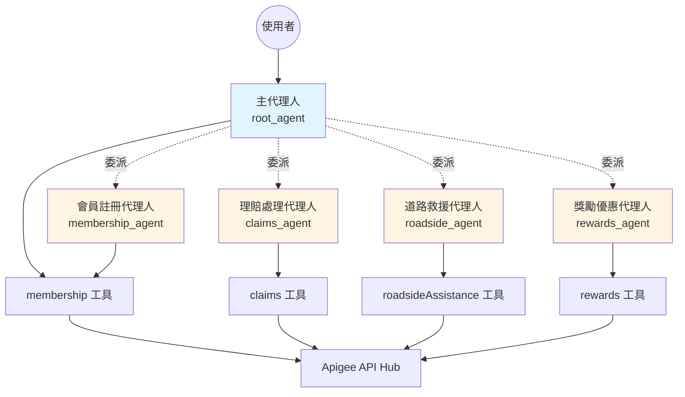
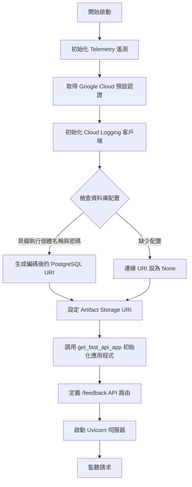
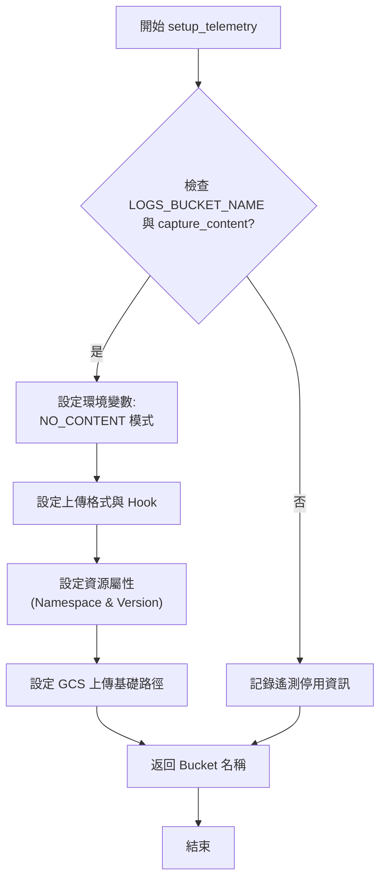
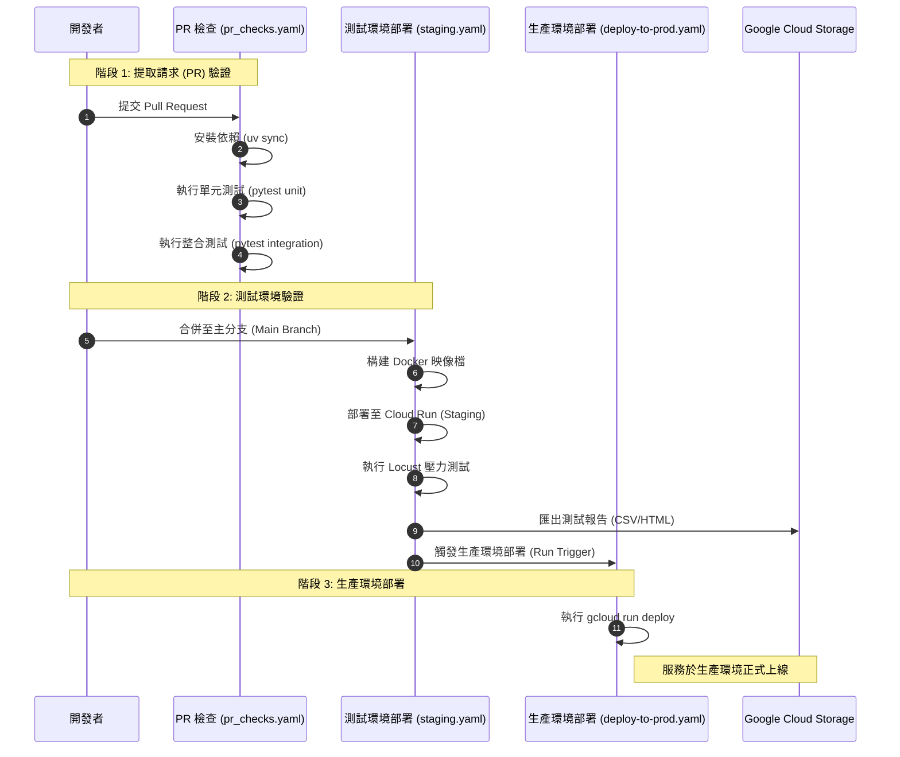
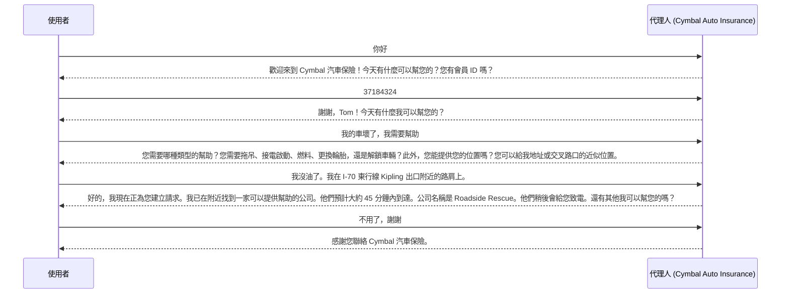

# 使用 Apigee API Hub 的汽車保險代理人 (Auto insurance Agent)

## 概述 (Overview)

此代理人範例作為汽車保險公司的虛擬助手。它能夠註冊新會員並為現有會員執行多項功能，包括理賠申報、提供道路救援以及回傳合作公司的獎勵優惠資訊。該代理人使用多個工具來完成這些任務。這些工具是註冊在 [Apigee API hub](https://cloud.google.com/apigee/docs/apihub/what-is-api-hub) 中的自定義 API。

## 代理人詳細資訊 (Agent Details)

| 屬性 | 詳細內容 |
|---|---|
| 互動類型 (Interaction Type) | 對話式 (Conversational) |
| 複雜度 (Complexity) | 簡單 (Easy) |
| 代理人類型 (Agent Type) | 多代理人 (Multi Agent) |
| 組件 (Components) | Tools, ApiHubToolset |
| 垂直領域 (Vertical) | 金融服務 (Financial Services) |

### 代理人架構 (Agent Architecture)


### 服務架構圖

---
### 系統流程圖



---
### Telemetry 啟動流程圖

---
### 整合開發流程 (CI/CD Pipeline Sequence)

---

### 關鍵特性 (Key Features)

#### 工具 (Tools)

代理人可以存取以下工具：

- `membership`：註冊新會員。
- `claims`：處理理賠。
- `roadsideAssistance`：提供道路救援，包括拖吊服務。
- `rewards`：尋找附近的合作夥伴獎勵優惠。

這些工具由自定義 API 提供。規格已導入 [API hub](https://cloud.google.com/apigee/docs/apihub/what-is-api-hub)，然後在代理人程式碼中使用 ADK 內建的 [ApiHubToolset](https://google.github.io/adk-docs/tools/google-cloud-tools/#apigee-api-hub-tools) 進行引用。這讓代理人開發者只需幾行程式碼，即可輕鬆將組織 API 目錄中的任何現有 API 轉換為工具。在此範例中，API 本身是使用 [Apigee](https://cloud.google.com/apigee) 提供服務的。

## 設置與安裝 (Setup and Installation)

### 前提條件 (Prerequisites)

- Python 3.12+
- Poetry 用於依賴管理和打包
    - 更多資訊請參見 [Poetry 官方網站](https://python-poetry.org/docs/)。安裝 Poetry 請執行：
    ```bash
    pip install poetry
    ```
- 分配有以下角色的 Google Cloud 專案：
  - Apigee Organization Admin
  - Secret Manager Admin
  - Storage Admin
  - Service Usage Consumer
  - Logs Viewer

建立專案後，[安裝 Google Cloud SDK](https://cloud.google.com/sdk/docs/install)。然後執行以下指令進行驗證：
```bash
gcloud auth login
```
您還需要啟用某些 API。執行以下指令進行啟用：
```bash
gcloud services enable aiplatform.googleapis.com
```

### Apigee 與 API hub

對於此範例，您還必須在專案中佈署 Apigee 和 API hub，以提供作為代理人工具的 API 服務。

API 資產和額外的前提指令可在 Apigee Samples 儲存庫中找到：[汽車保險代理人 API](https://github.com/GoogleCloudPlatform/apigee-samples/tree/main/adk-auto-insurance-agent)。

如果您已在專案中佈署了 Apigee 和 API hub，只需按照下方的快速入門進行資產部署。

### 快速入門：使用 Cloud Shell 部署 API 資產

按照此 GCP Cloud Shell 教學中的說明進行操作。

[](https://ssh.cloud.google.com/cloudshell/open?cloudshell_git_repo=https://github.com/GoogleCloudPlatform/apigee-samples&cloudshell_git_branch=main&cloudshell_workspace=.&cloudshell_tutorial=adk-auto-insurance-agent/docs/cloudshell-tutorial.md)

## 代理人設置 (Agent Setup)

1.  複製儲存庫：

    ```bash
    git clone https://github.com/google/adk-samples.git
    cd python/agents/auto-insurance-agent
    ```

    在接下來的教學中，**請確保您留在 `python/agents/auto-insurance-agent` 目錄中**。

2.  安裝依賴：

    **Linux 用戶注意：** 如果在安裝過程中遇到與 `keyring` 相關的錯誤，可以透過執行以下指令將其停用：
    ```bash
    poetry config keyring.enabled false
    ```
    這是一次性設置。

    ```bash
    poetry install
    ```

3.  配置設定：

    - 設定以下環境變數。您可以在 `.env` 檔案中設定（修改並重新命名 `.env.example` 檔案為 `.env`）或直接在 shell 中設定。例如：

    ```bash
    export GOOGLE_GENAI_USE_VERTEXAI=1
    export GOOGLE_CLOUD_PROJECT=my-project
    export GOOGLE_CLOUD_LOCATION=my-region
    export GOOGLE_CLOUD_STORAGE_BUCKET=my-storage-bucket  # 僅在 Agent Engine 部署時需要
    ```

## 本地運行代理人 (Running the Agent Locally)

您可以在終端機中使用 `adk` 指令本地運行代理人：

1.  從 CLI 運行代理人：

    ```bash
    adk run auto_insurance_agent
    ```

2.  從 ADK Web UI 運行代理人：

    ```bash
    adk web
    ```
    然後從下拉選單中選擇 `auto-insurance-agent`。

## 遠端部署代理人 (Deploying the Agent Remotely)

### 部署至 Agent Engine

代理人也可以使用以下指令部署到 [Vertex AI Agent Engine](https://cloud.google.com/vertex-ai/generative-ai/docs/agent-engine/overview)：

```bash
poetry install --with deployment
python3 deployment/deploy.py
```

部署完成後，它將輸出遠端代理人部署的資源 ID，例如：
```
Created remote agent: projects/<PROJECT_NUMBER>/locations/<PROJECT_LOCATION>/reasoningEngines/<AGENT_ENGINE_ID>
```

有關部署到 Agent Engine 的更多資訊，請參見[此處](https://google.github.io/adk-docs/deploy/agent-engine/#install-vertex-ai-sdk)。

部署腳本會將 `AGENT_ENGINE_ID` 加入到您的 `.env` 檔案中。要測試遠端代理人，只需執行：
```bash
python3 deployment/test_deployment.py
```

隨後您可以從 shell 與部署的代理人進行互動。您可以隨時輸入 `quit` 退出。

## 互動範例 (Example Interaction)

以下是使用者可能如何與代理人互動的快速範例：



## 重點摘要

- **核心概念**：
  - <div style='text-align: left;'> 展示如何利用 Google ADK 與 Apigee API Hub 快速構建具備實用功能的企業級 AI 代理人。</div>
  - <div style='text-align: left;'> 透過虛擬汽車保險助手場景，示範自動化處理會員註冊、理賠、道路救援及獎勵推薦。</div>
- **關鍵技術**：
  - <div style='text-align: left;'> **Apigee API Hub**: 用於管理與整合自定義工具 API（membership, claims, roadside, rewards）。</div>
  - <div style='text-align: left;'> **Google ADK (ApiHubToolset)**: 簡化從 API Hub 導入 API 規格並轉化為代理人工具的過程。</div>
  - <div style='text-align: left;'> **Vertex AI Agent Engine (Reasoning Engine)**: 提供代理人的遠端託管與執行環境。</div>
  - <div style='text-align: left;'> **Python & Poetry**: 開發語言與依賴管理工具。</div>
- **重要結論**：
  - <div style='text-align: left;'> 結合 API 管理平台與 AI 開發框架，能大幅縮短從現有企業 API 到智慧對話服務的開發路徑。</div>
  - <div style='text-align: left;'> 代理人能根據上下文自動調用合適的 API 解決使用者問題，提升服務效率與用戶體驗。</div>
- **行動項目**：
  - [ ] 確保 Google Cloud 專案權限正確配置（Apigee, Secret Manager 等）。
  - [ ] 部署 Apigee 範例 API 資產以供代理人調用。
  - [ ] 本地測試後，將代理人部署至 Vertex AI Agent Engine 進行正式測試。
