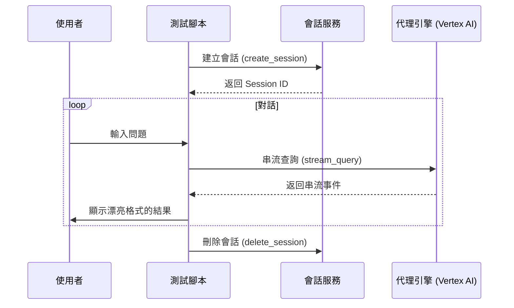
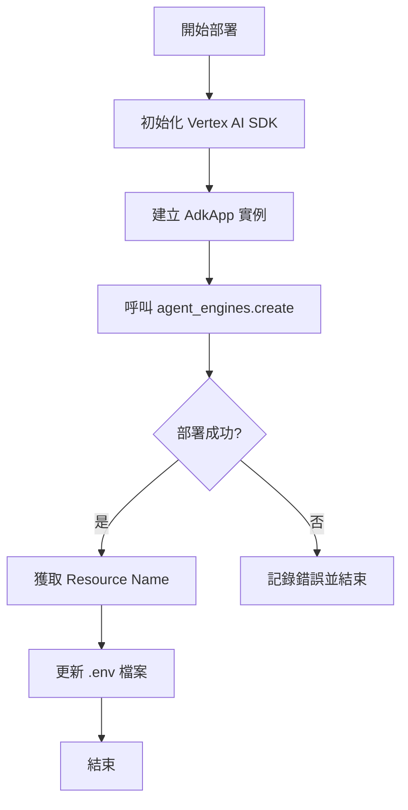

# 部署 (Deployment)

此目錄包含為您的代理 (Agent) 配置必要的 Google Cloud 基礎設施所需的 Terraform 設定。

建議部署基礎設施並設置 CI/CD 流行的做法是從專案根目錄使用 `agent-starter-pack setup-cicd` 命令。

然而，如果您想要更實際的操作方式，您隨時可以手動應用 Terraform 設定來進行自行設置。

有關部署過程、基礎設施和 CI/CD 流行的詳細資訊，請參閱官方文檔：

**[Agent Starter Pack 部署指南](https://googlecloudplatform.github.io/agent-starter-pack/guide/deployment.html)**

## 部署流程概述

### 測試部署 (`test_deployment.py`)

### 執行部署 (`deploy.py`)

## 資源整合

| 部署環境 | 相關檔案 / 目錄 | 主要資源與功能描述 |
| :--- | :--- | :--- |
| **開發環境 (Dev)** | `terraform/dev/` | 
 <ul><li>`apis.tf`: 啟用開發所需的 GCP API (Vertex AI, Cloud Run 等)。</li><li>`iam.tf`: 配置開發環境應用程式服務帳號與權限。</li><li>`service.tf`: 部署開發用 Cloud SQL (PostgreSQL 15) 與 Cloud Run 服務。</li><li>`storage.tf`: 建立開發專屬的日誌存儲桶。</li><li>`telemetry.tf`: 設置 BigQuery 遙測分析鏈。</li></ul>
 |
| **測試與生產環境 (Staging/Prod)** | `terraform/` (根目錄) | 
 <ul><li>`service.tf`: 同時管理 Staging 與 Prod 的 Cloud SQL 與 Cloud Run 資源。</li><li>`iam.tf`: 處理跨專案的服務帳號角色分配與鏡像拉取權限。</li><li>`storage.tf`: 建立全域日誌桶與中心化鏡像倉庫。</li><li>`telemetry.tf`: 配置長達 10 年保留期的正式遙測數據分析。</li></ul>
 |
| **CI/CD 自動化流程** | `terraform/` | 
 <ul><li>`github.tf`: 管理 GitHub 與 Cloud Build 的安全連接。</li><li>`build_triggers.tf`: 定義 PR 檢查、Staging 自動部署與生產手動核准觸發器。</li><li>`service_accounts.tf`: 定義專用的 CICD 執行器服務帳號。</li></ul>
 |
| **本機部署與測試** | `deploy.py` `test_deployment.py` | 
 <ul><li>`deploy.py`: 手動部署 Agent 到 Vertex AI Agent Engine 的 Python 腳本。</li><li>`test_deployment.py`: 模擬使用者對話以驗證雲端 Agent 功能的互動式測試工具。</li></ul>
 |

## 重點摘要
- **核心概念**：提供自動化與手動部署 Google Cloud 基礎設施的工具與設定。
- **關鍵技術**：Terraform, Google Cloud Platform (GCP), CI/CD, Agent Starter Pack。
- **重要結論**：優先推薦使用 `agent-starter-pack` 工具進行自動化部署，但保留手動設定的靈活性。
- **行動項目**：
  - 考慮使用 `agent-starter-pack setup-cicd` 進行快速設定。
  - 若需自定義，請檢查 `terraform/` 目錄。
