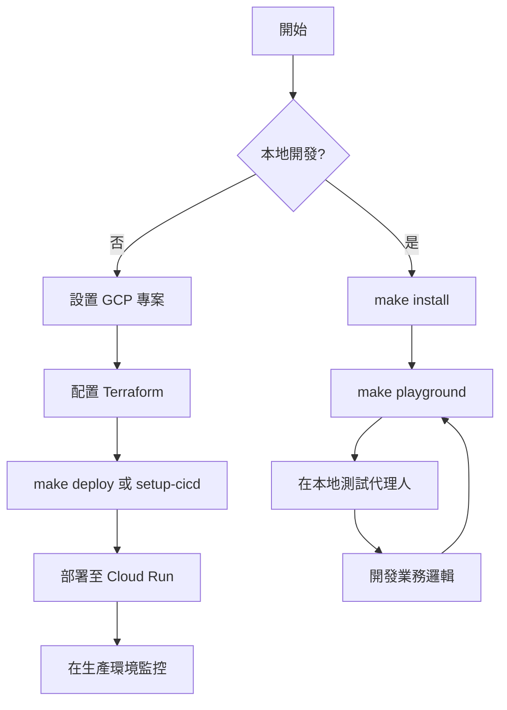

# 汽車保險代理人套件 (pack-auto-insurance-agent)

使用 Apigee API Hub 作為工具的汽車保險 AI 代理人。
此代理人是使用 [`googleCloudPlatform/agent-starter-pack`](https://github.com/GoogleCloudPlatform/agent-starter-pack) 版本 `0.31.5` 生成的。

## 專案結構 (Project Structure)

```
pack-auto-insurance-agent/
├── auto_insurance_agent/         # 核心代理人程式碼
│   ├── agent.py               # 主要代理人邏輯
│   ├── fast_api_app.py        # FastAPI 後端伺服器
│   └── app_utils/             # 應用程式公用程式與輔助工具
├── .cloudbuild/               # Google Cloud Build 的 CI/CD 管線配置
├── deployment/                # 基礎設施與部署指令碼
├── notebooks/                 # 用於原型設計與評估的 Jupyter notebooks
├── tests/                     # 單元測試、整合測試與負載測試
├── GEMINI.md                  # AI 輔助開發指南
├── Makefile                   # 開發指令
└── pyproject.toml             # 專案依賴項
```

> 💡 **提示：** 使用 [Gemini CLI](https://github.com/google-gemini/gemini-cli) 進行 AI 輔助開發 - 專案上下文已預先配置在 `GEMINI.md` 中。

## 需求 (Requirements)

在開始之前，請確保您已安裝：
- **uv**: Python 套件管理器（用於本專案的所有依賴管理） - [安裝](https://docs.astral.sh/uv/getting-started/installation/)（使用 `uv add <package>` [新增套件](https://docs.astral.sh/uv/concepts/dependencies/)）
- **Google Cloud SDK**: 用於 GCP 服務 - [安裝](https://cloud.google.com/sdk/docs/install)
- **Terraform**: 用於基礎設施部署 - [安裝](https://developer.hashicorp.com/terraform/downloads)
- **make**: 建構自動化工具 - [安裝](https://www.gnu.org/software/make/)（大多數類 Unix 系統已預裝）

## 快速開始 (Quick Start)

安裝所需的套件並啟動本地開發環境：

```bash
make install && make playground
```
> **📊 可觀測性說明：** 代理人遙測 (Cloud Trace) 始終啟用。提示-回應記錄 (GCS, BigQuery, Cloud Logging) 在本地為**停用**，在部署環境中預設為**啟用**（僅限中繼資料 - 無提示/回應內容）。詳情請參閱 [監控與可觀測性](#監控與可觀測性)。

## 指令 (Commands)

| 指令 | 描述 |
| -------------------- | ------------------------------------------------------------------------------------------- |
| `make install`       | 使用 uv 安裝依賴項 |
| `make playground`    | 啟動本地開發環境 |
| `make lint`          | 執行程式碼品質檢查 |
| `make test`          | 執行單元測試與整合測試 |
| `make deploy`        | 將代理人部署至 Cloud Run |
| `make local-backend` | 啟動具備熱重載功能的本地開發伺服器 |
| `make setup-dev-env` | 使用 Terraform 設置開發環境資源 |

有關完整指令選項與用法，請參閱 [Makefile](Makefile)。

## 用法 (Usage)

此模板遵循「自備代理人 (Bring Your Own Agent)」方法 - 您專注於業務邏輯，模板處理其他所有事項（UI、基礎設施、部署、監控）。
1. **原型設計 (Prototype):** 參考 `notebooks/` 中的入門筆記本建立您的生成式 AI 代理人。使用 Vertex AI Evaluation 評估效能。
2. **整合 (Integrate):** 編輯 `auto_insurance_agent/agent.py` 將您的代理人導入應用程式。
3. **測試 (Test):** 使用 `make playground` 透過本地遊樂場探索代理人功能。遊樂場會在程式碼變更時自動重載代理人。
4. **部署 (Deploy):** 設置並啟動 CI/CD 管線，根據需要自定義測試。有關完整說明，請參閱 [部署章節](#生產部署-production-deployment)。如需簡化基礎設施部署，只需執行 `uvx agent-starter-pack setup-cicd`。查看 [`agent-starter-pack setup-cicd` CLI 指令](https://googlecloudplatform.github.io/agent-starter-pack/cli/setup_cicd.html)。目前支持 GitHub，並使用 Google Cloud Build 或 GitHub Actions 作為 CI/CD 執行器。
5. **監控 (Monitor):** 使用 BigQuery 遙測數據、Cloud Logging 和 Cloud Trace 追蹤效能並收集洞察，以迭代優化您的應用程式。

專案包含一個 `GEMINI.md` 檔案，為 Gemini CLI 等 AI 工具在詢問模板相關問題時提供上下文。

## 部署 (Deployment)

> **注意：** 如需使用 Terraform 一鍵部署整個 CI/CD 管線和基礎設施，可以使用 [`agent-starter-pack setup-cicd` CLI 指令](https://googlecloudplatform.github.io/agent-starter-pack/cli/setup_cicd.html)。目前支持 GitHub，並使用 Google Cloud Build 或 GitHub Actions 作為 CI/CD 執行器。

### 開發環境 (Dev Environment)

您可以使用以下指令測試向開發環境的部署：

```bash
gcloud config set project <your-dev-project-id>
make deploy
```

存儲庫包含用於設置開發 Google Cloud 專案的 Terraform 配置。
請參閱 [deployment/README.md](deployment/README.md) 了解說明。

### 生產部署 (Production Deployment)

存儲庫包含用於設置生產 Google Cloud 專案的 Terraform 配置。有關如何部署基礎設施和應用程式的詳細說明，請參閱 [deployment/README.md](deployment/README.md)。

## 監控與可觀測性 (Monitoring and Observability)

應用程式提供兩個層級的可觀測性：

**1. 代理人遙測事件（始終啟用）**
- 導出至 **Cloud Trace** 的 OpenTelemetry 追蹤 (Traces) 與跨度 (Spans)
- 追蹤代理人執行、延遲與系統指標

**2. 提示-回應記錄（可配置）**
- GenAI 檢測擷取 LLM 互動（權杖、模型、時間）
- 導出至 **Google Cloud Storage** (JSONL)、**BigQuery**（外部表）與 **Cloud Logging**（專用儲存庫）

| 環境 | 提示-回應記錄 |
|-------------|-------------------------|
| **本地開發** (`make playground`) | ❌ 預設停用 |
| **部署環境** (透過 Terraform) | ✅ **預設啟用**（保護隱私：僅限中繼資料，無提示/回應） |

**要在本地啟用：** 設置 `LOGS_BUCKET_NAME` 且 `OTEL_INSTRUMENTATION_GENAI_CAPTURE_MESSAGE_CONTENT=NO_CONTENT`。

**要在部署中停用：** 編輯 Terraform 配置以設置 `OTEL_INSTRUMENTATION_GENAI_CAPTURE_MESSAGE_CONTENT=false`。

有關詳細說明、範例查詢與視覺化選項，請參閱 [可觀測性指南](https://googlecloudplatform.github.io/agent-starter-pack/guide/observability.html)。

## 流程圖 (Flowchart)



## 重點摘要

- **核心概念**：
  - **自動化 AI 代理人開發框架**: 利用 `agent-starter-pack` 快速生成具備 UI、CI/CD 與監控功能的汽車保險代理人。
  - **Apigee API Hub 整合**: 將企業 API 作為代理人的工具集，實現理賠、救援等業務功能。
- **關鍵技術**：
  - **uv**: 高效的 Python 套件與環境管理工具。
  - **Terraform**: 實現代碼化基礎設施 (IaC) 部署。
  - **OpenTelemetry & Cloud Trace**: 提供完整的系統遙測與效能監控。
  - **CI/CD (Google Cloud Build/GitHub Actions)**: 自動化部署流程。
- **重要結論**：
  - 該模板大幅降低了從原型設計到生產部署的複雜度，使開發者能專注於 `agent.py` 中的業務邏輯。
  - 內建的可觀測性架構確保了代理人在生產環境中的穩定性與透明度。
- **行動項目**：
  - [ ] 安裝 `uv`、`gcloud SDK` 與 `Terraform` 等開發環境必備工具。
  - [ ] 執行 `make install` 與 `make playground` 進行初步測試。
  - [ ] 根據需求修改 `auto_insurance_agent/agent.py` 整合特定保險業務邏輯。
  - [ ] 使用 `setup-cicd` 指令配置自動化部署管線。
