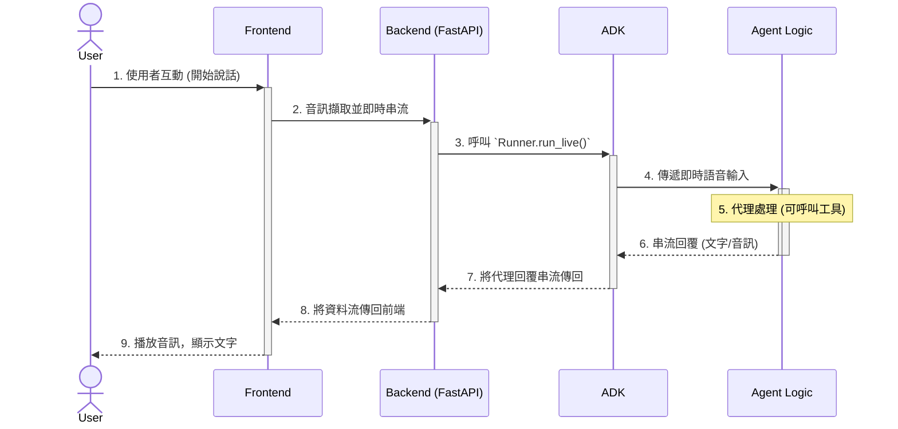

# 專案架構與設計流程

本文檔旨在說明 `pack-bidi-streaming` 專案的技術架構、核心元件以及建議的開發與部署流程。本專案是基於 `agent-starter-pack` 範本所建立，用於展示如何使用 Google Agent Development Kit (ADK) 建構一個支援雙向串流（bidirectional streaming）的 AI 代理。

## 1. 核心技術棧

- **後端框架**: [FastAPI](https://fastapi.tiangolo.com/) - 用於建構高效能的非同步 API 服務。
- **AI 代理開發**: [Google ADK (Agent Development Kit)](https://github.com/google/adk-python) - 用於定義、協調和執行 AI 代理的核心框架。
- **前端**: 原生 HTML, CSS, JavaScript - 建構一個簡單的網頁介面，用於與代理進行即時語音和文字互動。
- **依賴管理**: [uv](https://github.com/astral-sh/uv) - 一個極速的 Python 套件安裝與解析器。
- **基礎設施即代碼 (IaC)**: [Terraform](https://www.terraform.io/) - 用於宣告式地管理和部署 Google Cloud 資源。
- **CI/CD**: [Google Cloud Build](https://cloud.google.com/build) - 用於自動化測試、建構和部署流程。

## 2. 目錄結構解析

專案的目錄結構經過精心設計，將不同關注點分離：

- **`app/`**: 包含前端 UI (`static/`) 以及一個可選的 Google 搜尋代理 (`google_search_agent/`)。`main.py` 則作為 `adk web` 或 `adk run` 的進入點。
- **`bidi_demo/`**: 這是專案的核心商業邏輯所在。
  - `agent.py`: 定義了主要的雙向串流代理 `root_agent`。所有 AI 代理的行為、工具使用和指令都在此定義。
  - `fast_api_app.py`: FastAPI 應用程式的定義，它將 ADK 代理包裝成一個可供前端呼叫的 API 服務。
- **`deployment/`**: 存放所有與部署相關的配置。
  - `terraform/`: 包含了部署到 Google Cloud 所需的所有 Terraform 腳本，如 Cloud Run 服務、IAM 權限、儲存桶等。
- **`.cloudbuild/`**: 定義了 CI/CD 的工作流程，例如在 Pull Request 時執行檢查 (`pr_checks.yaml`)，以及部署到 Staging (`staging.yaml`) 和 Production (`deploy-to-prod.yaml`) 環境。
- **`tests/`**: 包含了單元測試 (`unit/`) 和整合測試 (`integration/`)，用於確保代理行為的正確性。
- **`pyproject.toml`**: Python 專案的設定檔，定義了專案依賴、元數據和工具配置。
- **`Makefile`**: 提供了一系列方便的指令，如 `make install` (安裝依賴) 和 `make playground` (啟動本地測試環境)。

## 3. 系統架構

本專案採用經典的前後端分離架構，並透過 WebSocket 或串流 HTTP 請求實現即時通訊。



### 資料流（Data Flow）

1.  **使用者互動**: 使用者在前端網頁（`app/static/index.html`）上點擊按鈕並開始說話。
2.  **音訊擷取**: 前端的 `audio-recorder.js` 擷取麥克風的音訊流，並將其即時傳送到後端 FastAPI 服務。
3.  **後端接收**: `bidi_demo/fast_api_app.py` 中的 API 端點接收到音訊流。
4.  **ADK 執行**: 後端服務呼叫 ADK 的 `Runner.run_live()` 方法，並將使用者的音訊流傳遞給 `bidi_demo/agent.py` 中定義的 `root_agent`。
5.  **代理處理**: `root_agent` 接收到即時的語音輸入，並開始處理。它可能會呼叫內部工具（如 `google_search_agent`）來獲取資訊。
6.  **串流回覆**: 代理在生成回覆的同時，會將文字和/或語音的資料流（`AUDIO` modality）透過 `Runner` 即時回傳。
7.  **後端回傳**: FastAPI 服務將從代理收到的資料流即時傳回給前端。
8.  **前端播放**: `audio-player.js` 接收並播放後端傳來的語音流，同時網頁上也會顯示代理回覆的文字。

這個雙向串流的設計讓使用者可以隨時打斷代理，實現更自然、低延遲的對話體驗。

## 4. 開發與設計流程

我們強烈建議遵循以下 MLOps 流程來進行開發、測試和部署，以確保程式碼品質和系統穩定性。

### 步驟 1: 安裝依賴

在開始開發前，請先確保已安裝所有必要的 Python 套件。

```bash
make install
```

### 步驟 2: 本地開發

所有的代理邏輯修改都應該在 `bidi_demo/agent.py` 中進行。你可以修改 `root_agent` 的 `instruction`，或者為其增加新的工具。

### 步驟 3: 本地測試

本地測試是驗證代理行為最快速的方式。

#### 方法 A：程式化測試 (建議)

建立一個 `run_agent.py` 腳本，透過編寫程式碼來呼叫你的 agent 並印出結果。這是自動化測試和快速迭代的基礎。

```python
# run_agent.py
import asyncio
from google.adk.runners import Runner
from google.adk.sessions import InMemorySessionService
from bidi_demo.agent import root_agent
from google.genai import types as genai_types

async def main():
    session_service = InMemorySessionService()
    await session_service.create_session(
        app_name="bidi_demo", user_id="test_user", session_id="test_session"
    )
    runner = Runner(
        agent=root_agent, app_name="bidi_demo", session_service=session_service
    )
    query = "給我一個關於鬆餅的食譜"
    async for event in runner.run_async(
        user_id="test_user",
        session_id="test_session",
        new_message=genai_types.Content(
            role="user",
            parts=[genai_types.Part.from_text(text=query)]
        ),
    ):
        if event.is_final_response():
            print(event.content.parts[0].text)

if __name__ == "__main__":
    asyncio.run(main())
```

然後透過 `uv` 執行它：

```bash
uv run python run_agent.py
```

#### 方法 B：UI 遊樂場 (手動測試)

如果你需要透過 UI 進行手動互動測試，可以使用以下指令啟動本地伺服器。它支援熱加載，當你修改程式碼時會自動重啟。

```bash
make playground
```

### 步驟 4: 部署

本專案已設定好完整的 CI/CD 流程。

1.  將你的程式碼提交到 Git。
2.  建立一個 Pull Request 到 `main` 分支。
3.  `pr_checks.yaml` 中定義的 Cloud Build 流程會自動執行測試。
4.  當 Pull Request 被合併後，`staging.yaml` 的部署流程會被觸發，將應用程式部署到 Staging 環境。
5.  在確認 Staging 環境運作正常後，可以手動觸發 `deploy-to-prod.yaml` 流程，完成正式環境的部署。
