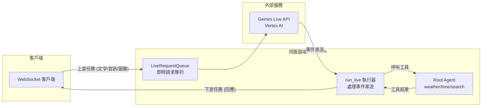

# Pack Bidi-streaming - ADK 雙向串流演示

> 基於 Google Agent Development Kit (ADK) 的即時雙向串流代理演示專案

這是一個使用 Google Agent Development Kit (ADK) 實現即時雙向串流 (Bidirectional Streaming) 的完整生產級專案。透過 FastAPI 和 WebSocket 技術，展示與 Gemini Live 模型進行多模態互動，支援文字、語音、圖像輸入及靈活的文字/音訊輸出。


## 概覽

本專案實現了完整的 ADK 雙向串流生命週期：

1.  **應用程式初始化**：啟動時建立 `Agent`（代理）、`SessionService`（會話服務）和 `Runner`（執行器）
2.  **會話初始化**：為每個 WebSocket 連線建立 `Session`（會話）、`RunConfig`（執行配置）和 `LiveRequestQueue`（即時請求隊列）
3.  **雙向串流**：並行執行上游（客戶端 → 隊列）和下游（事件 → 客戶端）任務
4.  **優雅終止**：妥善清理 `LiveRequestQueue` 和 WebSocket 連線

### 代理能力

本專案包含一個 `root_agent`，配備以下工具：

- **get_weather**: 模擬取得城市天氣資訊
- **get_current_time**: 取得指定城市的當前時間
- **google_search**: 整合 Google 搜尋進行網路查詢

## 核心特性

### 通訊與互動
- ✅ **WebSocket 即時通訊**：透過 `/ws/{user_id}/{session_id}` 進行雙向串流
- ✅ **多模態輸入**：支援文字、語音、圖像/影片輸入，具備自動音訊轉錄
- ✅ **靈活輸出**：根據模型架構自動選擇文字或音訊輸出
- ✅ **會話恢復**：透過 `RunConfig` 支援斷線重連

### 開發與部署
- ✅ **並發任務處理**：獨立的非同步上游/下游任務，優化效能
- ✅ **互動式 UI**：具備事件控制台的網頁介面，監控即時 API 事件
- ✅ **多環境支援**：支援本地開發、Cloud Run 部署
- ✅ **完整測試套件**：單元測試、整合測試、E2E 測試
- ✅ **CI/CD 整合**：使用 Cloud Build 自動化部署流程

## 系統架構

應用程式遵循 ADK 推薦的並發任務模式：



### 核心元件

- **上游任務 (Upstream Task)**：接收 WebSocket 訊息並轉發至 `LiveRequestQueue`
- **下游任務 (Downstream Task)**：處理 `run_live()` 事件並傳送回 WebSocket 客戶端
- **Runner**：協調代理執行與會話管理
- **SessionService**：支援 InMemory、Database 或 VertexAI 三種會話儲存模式

## 前置作業

### 系統需求

- **Python**: 3.10 - 3.13
- **套件管理器**: [uv](https://docs.astral.sh/uv/)（推薦）或 pip
- **Google Cloud 憑證**：
  - Vertex AI Live API：需要 Google Cloud 專案與認證
  - Gemini Live API：需要 API 金鑰（可選）

### 安裝 uv

uv 是一個高效能的 Python 套件管理器，安裝方式：

```bash
# macOS/Linux
curl -LsSf https://astral.sh/uv/install.sh | sh

# Windows
powershell -ExecutionPolicy ByPass -c "irm https://astral.sh/uv/install.ps1 | iex"
```

### 設定 Google Cloud 認證

本專案預設使用 Vertex AI，需要 Application Default Credentials (ADC)：

```bash
# 設定預設專案
gcloud config set project YOUR_PROJECT_ID

# 建立 ADC 憑證
gcloud auth application-default login
```

## 快速開始

### 1. 安裝依賴

在專案根目錄執行：

```bash
make install
```

此指令會：
- 自動檢查並安裝 uv（如未安裝）
- 使用 `uv sync` 建立虛擬環境
- 安裝所有專案依賴

### 2. 配置環境變數

複製範例環境檔案並編輯：

```bash
cp .env.example .env
```

編輯 `.env` 檔案：

```bash
# 會話儲存模式（開發建議使用 true）
USE_IN_MEMORY_SESSION=true

# Agent Engine 名稱
AGENT_ENGINE_SESSION_NAME=pack-bidi-streaming

# 使用 Vertex AI
GOOGLE_GENAI_USE_VERTEXAI=TRUE

# 模型選擇
DEMO_AGENT_MODEL=gemini-live-2.5-flash

# Google Cloud 設定（自動從 gcloud 讀取）
# GOOGLE_CLOUD_PROJECT=your-project-id
# GOOGLE_CLOUD_LOCATION=us-central1
```

### 3. 啟動應用程式

#### 方式一：ADK Playground（推薦入門）

```bash
make playground
```

- 自動開啟瀏覽器至 `http://localhost:8501`
- 提供互動式代理測試介面
- 支援熱重載（修改代碼自動更新）
- 選擇 `bidi_demo` 資料夾進行互動

#### 方式二：FastAPI 本地後端

```bash
make local-backend
```

- 啟動 FastAPI 伺服器於 `http://localhost:8000`
- 支援 `--reload` 熱重載
- 適合前端開發與 WebSocket 測試

### 4. 開始使用

開啟瀏覽器訪問應用程式後：

**文字互動**：
1. 在輸入欄位輸入問題（例如：「舊金山的天氣如何？」）
2. 點擊 "Send" 或按 Enter
3. 觀察事件控制台的即時 API 事件
4. 接收串流回應

**語音互動**：
1. 點擊 "Start Audio" 開始語音對話
2. 對麥克風說話
3. 即時接收音訊回應與轉錄
4. 點擊 "Stop Audio" 結束對話

## 完整使用流程

本節詳細說明基於 Makefile 的所有開發與部署指令。

### 開發環境設定

#### 1. 安裝與初始化

```bash
# 安裝依賴（自動安裝 uv）
make install
```

**執行內容**：
- 檢查 uv 是否已安裝，未安裝則自動安裝
- 執行 `uv sync` 建立虛擬環境
- 安裝 `pyproject.toml` 中定義的所有依賴

#### 2. 啟動本地開發

**方式 A：ADK Playground（互動式測試）**

```bash
make playground
```

**功能說明**：
- 啟動 ADK Web UI（預設埠口：8501）
- 支援代理熱重載 (`--reload_agents`)
- 提供視覺化的代理互動介面
- 需選擇 `bidi_demo` 資料夾進行互動

**方式 B：FastAPI 後端（WebSocket 開發）**

```bash
make local-backend
```

**功能說明**：
- 啟動 FastAPI 伺服器於 `http://localhost:8000`
- 支援程式碼熱重載 (`--reload`)
- 適合前端開發與 WebSocket 除錯

### 程式碼品質檢查

#### 執行測試

```bash
# 執行所有測試（單元測試 + 整合測試）
make test
```

**測試範圍**：
- `tests/unit/`: 單元測試（代理邏輯、模型、工具）
- `tests/integration/`: 整合測試（E2E 場景、WebSocket 通訊）

#### 程式碼檢查

```bash
# 執行 linting 與格式化檢查
make lint
```

**檢查項目**：
- `codespell`: 拼字檢查
- `ruff check`: 程式碼風格檢查
- `ruff format --check`: 格式化檢查
- `ty check`: 型別檢查（Astral Rust 型別檢查器）

### 雲端部署

#### 部署到 Cloud Run

**基本部署**：

```bash
make deploy
```

**自訂部署設定**：

```bash
# 啟用 IAP (Identity-Aware Proxy)
make deploy IAP=true

# 指定埠口
make deploy PORT=8080

# 組合使用
make deploy IAP=true PORT=8080
```

**部署參數說明**：
- `--source .`: 從當前目錄建構容器
- `--memory "4Gi"`: 配置 4GB 記憶體
- `--no-cpu-throttling`: 停用 CPU 節流
- `--no-allow-unauthenticated`: 需要身份驗證
- `--update-build-env-vars`: 從 `pyproject.toml` 讀取版本號

**部署前置作業**：
1. 確保已設定 Google Cloud 專案：`gcloud config set project YOUR_PROJECT_ID`
2. 確保已啟用 Cloud Run API
3. 確保有足夠的 IAM 權限

#### 設定開發環境基礎設施

```bash
make setup-dev-env
```

**執行內容**：
- 使用 Terraform 初始化並建立開發環境
- 建立必要的 Google Cloud 資源：
  - Cloud Storage buckets
  - IAM 服務帳號與權限
  - Telemetry 配置
  - Cloud Run 服務

**Terraform 配置位置**：`deployment/terraform/dev/`

### 清理與維護

#### 清理專案檔案

```bash
make clean
```

**清理項目**：
- Python 快取：`__pycache__/`, `*.pyc`, `*.pyo`, `*.pyd`
- 測試檔案：`.pytest_cache/`, `.coverage`, `htmlcov/`, `.tox/`
- 程式碼檢查快取：`.ruff_cache/`, `.mypy_cache/`
- 建置檔案：`*.egg-info/`, `dist/`, `build/`
- Terraform 狀態：`.terraform/`, `terraform.tfstate*`, `.terraform.lock.hcl`

**注意事項**：
- 此指令**不會**刪除虛擬環境 (`.venv`)
- 如需完整清理，手動執行：`rm -rf .venv`

### 常用開發工作流程

#### 日常開發循環

```bash
# 1. 安裝依賴
make install

# 2. 啟動本地開發伺服器
make playground  # 或 make local-backend

# 3. 修改程式碼後執行測試
make test

# 4. 檢查程式碼品質
make lint

# 5. 清理快取（可選）
make clean
```

#### 部署前檢查清單

```bash
# 1. 執行所有測試
make test

# 2. 確保程式碼品質
make lint

# 3. 清理舊檔案
make clean

# 4. 部署到 Cloud Run
make deploy
```

### Makefile 指令速查表

| 指令                 | 用途                   | 適用場景               |
| -------------------- | ---------------------- | ---------------------- |
| `make install`       | 安裝/同步依賴          | 初次設定、依賴更新     |
| `make playground`    | 啟動 ADK Playground    | 互動測試代理、UI 開發   |
| `make local-backend` | 啟動 FastAPI 伺服器    | WebSocket/後端開發     |
| `make debug-backend` | FastAPI 伺服器除錯模式 | 後端 Debug、API 除錯   |
| `make debug-playground` | Playground 除錯模式 | 互動 UI Debug、熱重載  |
| `make test`          | 執行單元/整合測試      | CI、開發驗證           |
| `make lint`          | 程式碼/型別/拼字檢查   | 提交前檢查、品質控管   |
| `make deploy`        | 部署至 Cloud Run       | 生產部署、雲端上線     |
| `make backend`       | 部署（deploy 別名）    | 與 deploy 相同         |
| `make setup-dev-env` | 建立開發雲端資源       | 初次雲端設定、IaC      |
| `make clean`         | 清理快取/建置檔案      | 維護、除錯、重建環境   |

## 開發指南

### WebSocket API 規格

#### 端點 (Endpoint)

```
ws://localhost:8000/ws/{user_id}/{session_id}
```

**路徑參數：**
*   `user_id`：使用者的唯一識別碼
*   `session_id`：對話的唯一識別碼

**查詢參數（選填）：**
*   `proactivity`：啟用主動音訊（僅限原生音訊模型）
*   `affective_dialog`：啟用情感對話（僅限原生音訊模型）

**回應模態 (Modality)：**
*   根據模型架構自動判定
*   原生音訊 (Native audio) 模型使用 AUDIO 回應模態
*   半串聯 (Half-cascade) 模型使用 TEXT 回應模態

#### 訊息格式

**客戶端 → 伺服器（文字）：**
```json
{
  "type": "text",
  "text": "您的訊息"
}
```

**客戶端 → 伺服器（圖像）：**
```json
{
  "type": "image",
  "data": "base64_編碼的圖像數據",
  "mimeType": "image/jpeg"
}
```

**客戶端 → 伺服器（音訊）：**
*   傳送原始二進位影格（PCM 音訊, 16kHz, 16-bit）

**伺服器 → 客戶端：**
*   JSON 編碼的 ADK `Event` 物件
*   請參閱 [ADK 事件文件](https://google.github.io/adk-docs/) 獲取事件綱要

### 程式碼架構說明

#### 代理定義 (bidi_demo/agent.py)

```python
root_agent = Agent(
    name="root_agent",
    model=os.getenv("DEMO_AGENT_MODEL", "gemini-live-2.5-flash"),
    instruction="你是一個可以搜尋網路的得力助手...",
    tools=[get_weather, get_current_time, google_search]
)
```

**工具實作範例**：

```python
def get_weather(query: str) -> str:
    """模擬網路搜尋以獲取天氣資訊"""
    if "sf" in query.lower() or "san francisco" in query.lower():
        return "舊金山氣溫 60 度，有霧。"
    return "天氣晴朗，氣溫 90 度。"
```

#### FastAPI 應用程式初始化 (bidi_demo/fast_api_app.py)

```python
# 初始化 SessionService
session_service = VertexAiSessionService(
    project=project_id,
    location=os.environ.get("GOOGLE_CLOUD_LOCATION", "global"),
    agent_engine_id=agent_engine_id
)

# 建立 Runner
runner = Runner(
    app_name="bidi-demo",
    agent=agent,
    session_service=session_service
)
```

#### WebSocket 處理器關鍵邏輯

**1. 模態自動檢測**：

```python
model_name = agent.model
is_native_audio = "native-audio" in model_name.lower()

if is_native_audio:
    response_modalities = ["AUDIO"]
    run_config = RunConfig(
        streaming_mode=StreamingMode.BIDI,
        response_modalities=response_modalities,
        input_audio_transcription=types.AudioTranscriptionConfig(),
        output_audio_transcription=types.AudioTranscriptionConfig()
    )
else:
    response_modalities = ["TEXT"]
    run_config = RunConfig(
        streaming_mode=StreamingMode.BIDI,
        response_modalities=response_modalities
    )
```

**2. 並發任務處理**：

```python
# 建立請求隊列
queue = LiveRequestQueue()

# 啟動並發任務
await asyncio.gather(
    upstream_task(websocket, queue),  # 接收客戶端訊息
    downstream_task(websocket, runner, queue, run_config)  # 處理代理回應
)
```

### 本地開發最佳實踐

#### 環境變數管理

建議使用不同的 `.env` 檔案管理多環境配置：

```bash
# 開發環境
.env.development

# 測試環境
.env.test

# 生產環境
.env.production
```

載入特定環境：

```python
from dotenv import load_dotenv

env = os.getenv("ENV", "development")
load_dotenv(f".env.{env}")
```

#### 除錯技巧

**啟用詳細日誌**：

```python
import logging

logging.basicConfig(
    level=logging.DEBUG,
    format="%(asctime)s - %(name)s - %(levelname)s - %(message)s"
)
```

**WebSocket 除錯**：

使用瀏覽器開發者工具的 Network → WS 分頁監控 WebSocket 流量。

#### 熱重載注意事項

- ADK Playground：修改 `bidi_demo/agent.py` 會自動重載
- FastAPI：修改 `bidi_demo/fast_api_app.py` 會自動重啟伺服器
- 靜態檔案（HTML/CSS/JS）：需手動重新整理瀏覽器

## 部署指南

### Cloud Run 部署

#### 基本部署流程

```bash
# 1. 設定 Google Cloud 專案
gcloud config set project YOUR_PROJECT_ID

# 2. 部署到 Cloud Run
make deploy
```

#### 進階部署選項

**啟用 Identity-Aware Proxy (IAP)**：

```bash
make deploy IAP=true
```

**自訂埠口**：

```bash
make deploy PORT=8080
```

**組合使用**：

```bash
make deploy IAP=true PORT=8080
```

#### 部署配置說明

部署時的關鍵參數（定義於 Makefile）：

- `--memory "4Gi"`：配置 4GB 記憶體
- `--no-cpu-throttling`：停用 CPU 節流，確保即時效能
- `--no-allow-unauthenticated`：需要身份驗證
- `--labels "created-by=adk"`：標記資源來源
- `--update-build-env-vars "AGENT_VERSION=..."`：從 `pyproject.toml` 讀取版本

### Terraform 基礎設施

#### 建立開發環境

```bash
make setup-dev-env
```

此指令會使用 Terraform 建立以下資源：

- **Cloud Storage Buckets**：儲存日誌與資料
- **IAM 服務帳號**：管理權限
- **Cloud Run 服務**：部署應用程式
- **Telemetry 配置**：監控與日誌

#### 手動 Terraform 操作

```bash
cd deployment/terraform/dev

# 初始化
terraform init

# 檢視計畫
terraform plan --var-file vars/env.tfvars

# 套用變更
terraform apply --var-file vars/env.tfvars

# 銷毀資源
terraform destroy --var-file vars/env.tfvars
```

### CI/CD 整合

專案包含 Cloud Build 配置檔案（位於 `.cloudbuild/`）：

- **pr_checks.yaml**：Pull Request 時執行測試與檢查
- **staging.yaml**：部署到 Staging 環境
- **deploy-to-prod.yaml**：部署到 Production 環境

#### 設定 CI/CD Triggers

```bash
# 使用 Terraform 自動建立 Triggers
cd deployment/terraform
terraform apply

# 或手動在 Google Cloud Console 設定
```

## 測試

### 執行測試

```bash
# 執行所有測試
make test

# 僅執行單元測試
uv run pytest tests/unit

# 僅執行整合測試
uv run pytest tests/integration
```

### 測試結構

- **tests/unit/**：單元測試
  - `test_agent.py`：代理邏輯測試
  - `test_models.py`：資料模型測試
  - `test_telemetry.py`：遙測功能測試
- **tests/integration/**：整合測試
  - `test_server_e2e.py`：端到端伺服器測試
  - `test_agent.py`：代理整合測試

### 測試覆蓋率

```bash
# 執行測試並產生覆蓋率報告
uv run pytest --cov=bidi_demo --cov-report=html

# 開啟報告
open htmlcov/index.html
```

## 專案結構

```
pack-bidi-streaming/
├── ARCHITECTURE.md                (架構說明文件)
├── Dockerfile                     (容器化部署設定)
├── GEMINI.md                      (Gemini 模型說明)
├── Makefile                       (開發/部署指令)
├── README.md                      (專案總覽文件)
├── assets                         (靜態資源資料夾)
│   └── bidi-demo-screen.png       (示意圖)
├── bidi_demo                      (主要應用程式目錄)
│   ├── README.md                  (子模組說明)
│   ├── __init__.py                (套件初始化)
│   ├── agent.py                   (代理定義與工具)
│   ├── app_utils                  (工具/型別輔助模組)
│   │   ├── telemetry.py           (遙測工具)
│   │   └── typing.py              (型別定義)
│   ├── fast_api_app.py            (FastAPI 主程式)
│   └── static                     (前端靜態檔案)
│       ├── css
│       │   └── style.css          (樣式表)
│       ├── index.html             (前端入口頁)
│       └── js
│           ├── app.js             (前端主程式)
│           ├── audio-player.js    (音訊播放)
│           ├── audio-recorder.js  (音訊錄製)
│           ├── pcm-player-processor.js   (PCM 播放處理)
│           └── pcm-recorder-processor.js (PCM 錄音處理)
├── deployment                     (部署與基礎設施)
│   ├── README.md                  (部署說明)
│   └── terraform                  (Terraform IaC)
│       ├── apis.tf                (API 啟用)
│       ├── build_triggers.tf      (CI/CD 觸發器)
│       ├── dev                    (開發環境 IaC)
│       │   ├── apis.tf            (開發 API)
│       │   ├── iam.tf             (IAM 權限)
│       │   ├── providers.tf       (提供者設定)
│       │   ├── service.tf         (服務設定)
│       │   ├── storage.tf         (儲存資源)
│       │   ├── telemetry.tf       (遙測設定)
│       │   ├── variables.tf       (變數定義)
│       │   └── vars
│       │       └── env.tfvars     (變數值)
│       ├── github.tf              (GitHub 整合)
│       ├── iam.tf                 (IAM 權限)
│       ├── locals.tf              (區域變數)
│       ├── providers.tf           (提供者設定)
│       ├── service.tf             (服務設定)
│       ├── service_accounts.tf    (服務帳號)
│       ├── sql
│       │   └── completions.sql    (SQL 範例)
│       ├── storage.tf             (儲存資源)
│       ├── telemetry.tf           (遙測設定)
│       ├── variables.tf           (變數定義)
│       └── vars
│           └── env.tfvars         (變數值)
├── notebooks                      (筆記本/測試腳本)
│   ├── adk_app_testing.ipynb      (ADK 測試)
│   └── evaluating_adk_agent.ipynb (代理評估)
├── pyproject.toml                 (Python 專案設定)
├── tests                          (測試資料夾)
│   ├── TEST_GENERATION_REPORT.md  (測試報告)
│   ├── conftest.py                (測試初始化)
│   ├── integration                (整合測試)
│   │   ├── test_agent.py          (代理整合測試)
│   │   └── test_server_e2e.py     (端到端測試)
│   ├── load_test                  (壓力測試)
│   │   ├── README.md              (壓測說明)
│   │   └── load_test.py           (壓測腳本)
│   ├── test_bidi_demo.md          (測試紀錄)
│   ├── test_bidi_demo_e2e.md      (E2E 測試紀錄)
│   ├── test_log_20251209_143549.md(測試日誌)
│   └── unit                       (單元測試)
│       ├── README.md              (單元測試說明)
│       ├── __init__.py            (初始化)
│       ├── test_agent.py          (代理單元測試)
│       ├── test_dummy.py          (範例測試)
│       ├── test_imports.py        (匯入測試)
│       ├── test_models.py         (模型測試)
│       ├── test_structure.py      (結構測試)
│       └── test_telemetry.py      (遙測測試)
└── uv.lock                        (依賴鎖定檔)
```

### 核心檔案說明

| 檔案                                                   | 用途         | 關鍵內容                    |
| ------------------------------------------------------ | ------------ | --------------------------- |
| [bidi_demo/agent.py](bidi_demo/agent.py)               | 代理定義     | `root_agent`、工具註冊      |
| [bidi_demo/fast_api_app.py](bidi_demo/fast_api_app.py) | FastAPI 應用 | WebSocket 端點、並發任務    |
| [Makefile](Makefile)                                   | 開發指令     | install, playground, deploy |
| [pyproject.toml](pyproject.toml)                       | 專案配置     | 依賴、版本、工具設定        |
| [Dockerfile](Dockerfile)                               | 容器化       | Cloud Run 部署映像          |
| [.env.example](.env.example)                           | 環境變數     | 配置範例                    |

## 配置說明

### 支援模型

演示支援任何與 Live API 相容的 Gemini 模型：

**Vertex AI Live API 模型**（推薦）：
*   `gemini-live-2.5-flash`：快速回應，適合即時對話
*   `gemini-live-2.0-flash-exp`：實驗版本

**Gemini Live API 模型**（需 API 金鑰）：
*   `gemini-2.5-flash-native-audio-preview-12-2025`

透過 `.env` 中的 `DEMO_AGENT_MODEL` 設定模型，或修改 `bidi_demo/agent.py`。

獲取最新模型資訊：
*   **Vertex AI**: [官方 Vertex AI 模型文件](https://cloud.google.com/vertex-ai/generative-ai/docs/learn/models)
*   **Gemini API**: [官方 Gemini API 模型文件](https://ai.google.dev/gemini-api/docs/models)

### RunConfig 選項

演示會根據模型架構自動配置雙向串流（[fast_api_app.py](bidi_demo/fast_api_app.py#L190-L220)）：

**原生音訊模型**（模型名稱包含 "native-audio"）：
```python
run_config = RunConfig(
    streaming_mode=StreamingMode.BIDI,
    response_modalities=["AUDIO"],
    input_audio_transcription=types.AudioTranscriptionConfig(),
    output_audio_transcription=types.AudioTranscriptionConfig(),
    session_resumption=types.SessionResumptionConfig()
)
```

**半串聯模型**（其他模型）：
```python
run_config = RunConfig(
    streaming_mode=StreamingMode.BIDI,
    response_modalities=["TEXT"],
    input_audio_transcription=None,
    output_audio_transcription=None,
    session_resumption=types.SessionResumptionConfig()
)
```

### 環境變數參考

| 變數                        | 預設值                  | 說明                     |
| --------------------------- | ----------------------- | ------------------------ |
| `USE_IN_MEMORY_SESSION`     | `true`                  | 使用記憶體會話（開發用） |
| `AGENT_ENGINE_SESSION_NAME` | `pack-bidi-streaming`   | Agent Engine 名稱        |
| `DEMO_AGENT_MODEL`          | `gemini-live-2.5-flash` | 使用的模型名稱           |
| `GOOGLE_GENAI_USE_VERTEXAI` | `TRUE`                  | 使用 Vertex AI           |
| `GOOGLE_CLOUD_PROJECT`      | -                       | Google Cloud 專案 ID     |
| `GOOGLE_CLOUD_LOCATION`     | `us-central1`           | Google Cloud 區域        |
| `ALLOW_ORIGINS`             | `http://localhost:8000` | CORS 允許來源            |
| `LOGS_BUCKET_NAME`          | -                       | GCS 日誌 bucket          |

## 常見問題

### 連線與認證問題

**Q: WebSocket 連線失敗**

A: 檢查以下項目：
1. 驗證 `.env` 中的憑證設定
2. 確認 FastAPI 伺服器正在執行：`lsof -i:8000`
3. 檢查瀏覽器控制台錯誤訊息
4. 確認防火牆未封鎖 WebSocket 連線

**Q: Vertex AI 認證錯誤**

A: 執行以下步驟：
```bash
# 重新建立 ADC
gcloud auth application-default login

# 確認專案設定
gcloud config get-value project

# 檢查憑證檔案
echo $GOOGLE_APPLICATION_CREDENTIALS
```

### 音訊問題

**Q: 音訊輸入/輸出無法運作**

A: 排查清單：
1. 在瀏覽器中授予麥克風權限
2. 驗證瀏覽器支援 Web Audio API（Chrome/Edge 推薦）
3. 檢查模型是否支援音訊（需原生音訊模型）
4. 查看瀏覽器控制台的 JavaScript 錯誤
5. 測試麥克風是否正常：`navigator.mediaDevices.getUserMedia({ audio: true })`

**Q: 音訊延遲過高**

A: 優化方案：
- 使用原生音訊模型（`gemini-live-2.5-flash`）
- 確認 Cloud Run 部署時未啟用 CPU 節流
- 檢查網路連線品質
- 考慮調整音訊緩衝區大小（`pcm-recorder-processor.js`）

### 模型與配額

**Q: 找不到模型或配額錯誤**

A: 解決步驟：
1. 驗證模型名稱與平台匹配（Vertex AI vs Gemini API）
2. 在 Google Cloud Console 檢查 API 配額限制
3. 確保已啟用 Vertex AI API
4. 確保專案已啟用計費（對於 Vertex AI）
5. 檢視配額使用量：`gcloud alpha billing quotas list`

**Q: 如何切換模型？**

A: 修改 `.env` 檔案：
```bash
# 使用 Vertex AI 模型
DEMO_AGENT_MODEL=gemini-live-2.5-flash
GOOGLE_GENAI_USE_VERTEXAI=TRUE

# 或使用 Gemini API 模型
DEMO_AGENT_MODEL=gemini-2.5-flash-native-audio-preview-12-2025
GOOGLE_GENAI_USE_VERTEXAI=FALSE
GOOGLE_API_KEY=your_api_key
```

### 部署問題

**Q: Cloud Run 部署失敗**

A: 常見原因：
1. 未設定 Google Cloud 專案：`gcloud config set project YOUR_PROJECT_ID`
2. 未啟用必要的 API（Cloud Run, Container Registry）
3. IAM 權限不足：需要 `roles/run.admin` 和 `roles/iam.serviceAccountUser`
4. 記憶體配置不足：確認 Makefile 中 `--memory "4Gi"`

**Q: 部署後無法訪問服務**

A: 檢查項目：
1. 確認服務已部署：`gcloud run services list`
2. 檢查 IAM 權限：部署時使用 `--no-allow-unauthenticated`，需要身份驗證
3. 取得服務 URL：`gcloud run services describe pack-bidi-streaming --format='value(status.url)'`
4. 測試端點：`curl -H "Authorization: Bearer $(gcloud auth print-identity-token)" SERVICE_URL`

### 開發問題

**Q: `make install` 失敗**

A: 可能的解決方案：
```bash
# 手動安裝 uv
curl -LsSf https://astral.sh/uv/install.sh | sh

# 清理並重新安裝
rm -rf .venv
make install

# 或使用 pip 作為備選
python3 -m venv .venv
source .venv/bin/activate
pip install -e .
```

**Q: 測試失敗**

A: 除錯步驟：
```bash
# 執行特定測試並顯示詳細輸出
uv run pytest tests/unit/test_agent.py -v

# 啟用日誌輸出
uv run pytest --log-cli-level=DEBUG

# 檢查依賴是否完整
uv sync --dev
```

**Q: Lint 檢查失敗**

A: 自動修復：
```bash
# 自動格式化程式碼
uv run ruff format .

# 自動修復可修復的問題
uv run ruff check . --fix

# 修正拼字錯誤
uv run codespell --write-changes
```

### 效能優化

**Q: 如何提升回應速度？**

A: 優化建議：
1. 使用 `gemini-live-2.5-flash` 快速模型
2. 部署時停用 CPU 節流（已在 Makefile 中設定）
3. 選擇離使用者較近的 Google Cloud 區域
4. 使用 `VertexAiSessionService` 而非 `InMemorySessionService`（生產環境）
5. 實作請求快取機制（針對重複查詢）

**Q: 如何處理高併發？**

A: 擴展策略：
```bash
# 調整 Cloud Run 並發設定
gcloud run services update pack-bidi-streaming \
  --max-instances=10 \
  --concurrency=80 \
  --cpu=2 \
  --memory=4Gi
```

## 配置 (Configuration)

### 支援模型

演示支援任何與 Live API 相容的 Gemini 模型：

**原生音訊模型 (Native Audio Models)**（推薦語音使用）：
*   `gemini-2.5-flash-native-audio-preview-12-2025` (Gemini Live API)
*   `gemini-live-2.5-flash-native-audio` (Vertex AI)

透過 `.env` 中的 `DEMO_AGENT_MODEL` 設定模型，或修改 `app/google_search_agent/agent.py`。

獲取最新模型資訊：
*   **Gemini Live API**: 查看 [官方 Gemini API 模型文件](https://ai.google.dev/gemini-api/docs/models)
*   **Vertex AI Live API**: 查看 [官方 Vertex AI 模型文件](https://cloud.google.com/vertex-ai/generative-ai/docs/learn/models)

### RunConfig 選項

演示會根據模型架構自動配置雙向串流 (app/main.py:76-104)：

**原生音訊模型**（模型名稱包含 "native-audio"）：
```python
run_config = RunConfig(
    streaming_mode=StreamingMode.BIDI,
    response_modalities=["AUDIO"],
    input_audio_transcription=types.AudioTranscriptionConfig(),
    output_audio_transcription=types.AudioTranscriptionConfig(),
    session_resumption=types.SessionResumptionConfig()
)
```

**半串聯模型**（其他模型）：
```python
run_config = RunConfig(
    streaming_mode=StreamingMode.BIDI,
    response_modalities=["TEXT"],
    input_audio_transcription=None,
    output_audio_transcription=None,
    session_resumption=types.SessionResumptionConfig()
)
```

模態檢測會根據模型名稱自動執行。原生音訊模型使用 AUDIO 回應模態並啟用轉錄，而半串聯模型則使用 TEXT 回應模態以獲得更好的效能。

## 常見問題排除 (Troubleshooting)

### 學習資源

- [程式碼設計與架構說明](./bidi_demo/README.md)
- [ARCHITECTURE.md](ARCHITECTURE.md)：專案架構與設計流程
- [GEMINI.md](GEMINI.md)：Gemini 模型說明
- [tests/](tests/)：測試範例與文件

## 📚 重點摘要

### 核心概念
展示如何使用 Google ADK 建立基於 WebSocket 的即時雙向多模態串流應用程式。

### 關鍵技術
- **Google ADK**: 代理開發框架
- **FastAPI**: Web 伺服器與 WebSocket 端點
- **Gemini Live API / Vertex AI**: 即時對話模型後端
- **多模態處理**: 支援文字、語音、圖像輸入與自動轉錄
- **Terraform**: 基礎設施即代碼
- **Cloud Build**: CI/CD 自動化

### 快速開始步驟
1. 安裝依賴：`make install`
2. 配置環境變數：`cp .env.example .env`
3. 啟動應用：`make playground` 或 `make local-backend`
4. 開始互動：開啟瀏覽器至 `http://localhost:8000`

### 主要 Make 指令
- `make install`：安裝依賴
- `make playground`：啟動 ADK Playground
- `make local-backend`：啟動 FastAPI 伺服器
- `make test`：執行測試
- `make lint`：程式碼檢查
- `make deploy`：部署到 Cloud Run
- `make clean`：清理專案檔案

### 適用場景
- 即時語音助理
- 多模態對話系統
- 客戶服務機器人
- 教育互動平台
- 遊戲 NPC 對話系統

## 參考資源
- [**[ADK Docs] [streaming] 官方文件**](https://google.github.io/adk-docs/streaming/)
- [**[ADK Samples] [bidi-demo] GitHub 儲存庫**](https://github.com/google/adk-samples/tree/main/python/agents/bidi-demo)
- [**Agent Starter Pack**](https://googlecloudplatform.github.io/agent-starter-pack/)

## 📝 免責聲明

本文件僅為個人學習與教育目的而創建。其內容主要是參考線上資源，並基於個人在學習 Google ADK 過程中的理解與整理，並非 Google 的官方觀點或文件。所有資訊請以 Google 官方發布為準。