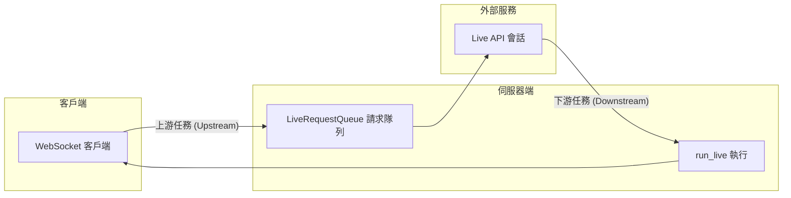

# ADK 雙向串流演示 (ADK Bidi-streaming Demo)

這是使用 Google Agent Development Kit (ADK) 實現即時雙向串流 (Bidirectional Streaming) 的完整演示。此 FastAPI 應用程式展示了與 Gemini 模型進行基於 WebSocket 的通訊，支持多模態請求（文本、音訊和圖像/影片輸入）以及靈活的響應（文本或音訊輸出）。


## 概覽 (Overview)

本演示實現了完整的 ADK 雙向串流生命週期：

1.  **應用程式初始化**：啟動時建立 `Agent`（代理）、`SessionService`（對話服務）和 `Runner`（執行器）。
2.  **會話初始化**：為每個連線建立 `Session`（會話）、`RunConfig`（執行配置）和 `LiveRequestQueue`（即時請求隊列）。
3.  **雙向串流**：並行執行上游（客戶端 → 隊列）和下游（事件 → 客戶端）任務。
4.  **優雅終止**：妥善清理 `LiveRequestQueue` 和 WebSocket 連線。

## 功能特性 (Features)

*   **WebSocket 通訊**：透過 `/ws/{user_id}/{session_id}` 進行即時雙向串流。
*   **多模態請求**：支持文本、音訊和圖像/影片輸入，具備自動音訊轉錄功能。
*   **靈活響應**：支持文本或音訊輸出，根據模型架構自動判定。
*   **對話恢復**：透過 `RunConfig` 配置連線恢復支援。
*   **並發任務**：獨立的異步上游/下游任務，優化效能。
*   **互動式 UI**：具備事件控制台的網頁介面，用於監控即時 API 事件。
*   **Google 搜尋整合**：代理配備 `google_search` 工具。

## 架構 (Architecture)

應用程式遵循 ADK 推薦的並發任務模式：



*   **上游任務 (Upstream Task)**：接收 WebSocket 訊息並轉發至 `LiveRequestQueue`。
*   **下游任務 (Downstream Task)**：處理 `run_live()` 事件並傳送回 WebSocket 客戶端。

## 前置作業 (Prerequisites)

*   Python 3.10 或更高版本
*   [uv](https://docs.astral.sh/uv/)（推薦）或 pip
*   Google API 金鑰（用於 Gemini Live API）或 Google Cloud 專案（用於 Vertex AI Live API）

**安裝 uv（如果尚未安裝）：**

```bash
# macOS/Linux
curl -LsSf https://astral.sh/uv/install.sh | sh

# Windows
powershell -ExecutionPolicy ByPass -c "irm https://astral.sh/uv/install.ps1 | iex"
```

## 安裝步驟 (Installation)

### 1. 切換至演示目錄

```bash
cd src/bidi-demo
```

### 2. 安裝依賴項目

**使用 uv（推薦）：**

```bash
uv sync
```

這會自動建立虛擬環境、安裝所有依賴，並生成用於可重現構建的鎖定檔案。

**使用 pip（替代方案）：**

```bash
python3 -m venv .venv
source .venv/bin/activate  # Windows: .venv\Scripts\activate
pip install -e .
```

### 3. 配置環境變數

建立或編輯 `app/.env` 並填入您的憑證：

```bash
# 選擇您的 Live API 平台
GOOGLE_GENAI_USE_VERTEXAI=FALSE

# 用於 Gemini Live API (當 GOOGLE_GENAI_USE_VERTEXAI=FALSE)
GOOGLE_API_KEY=your_api_key_here

# 用於 Vertex AI Live API (當 GOOGLE_GENAI_USE_VERTEXAI=TRUE)
# GOOGLE_CLOUD_PROJECT=your_project_id
# GOOGLE_CLOUD_LOCATION=us-central1

# 模型選擇 (選填，預設使用原生音訊模型)
# 可用的模型名稱請參見下方的「支援模型」章節
DEMO_AGENT_MODEL=gemini-2.5-flash-native-audio-preview-12-2025
```

#### 獲取 API 憑證

**Gemini Live API:**
1. 訪問 [Google AI Studio](https://aistudio.google.com/apikey)
2. 建立 API 金鑰
3. 在 `.env` 中設定 `GOOGLE_API_KEY`

**Vertex AI Live API:**
1. 在 [Google Cloud Console](https://console.cloud.google.com) 啟用 Vertex AI API
2. 使用 `gcloud auth application-default login` 設定認證
3. 在 `.env` 中設定 `GOOGLE_CLOUD_PROJECT` 和 `GOOGLE_CLOUD_LOCATION`
4. 設定 `GOOGLE_GENAI_USE_VERTEXAI=TRUE`

### 4. 設定 SSL 憑證路徑

為安全連線設定 SSL 憑證檔案路徑：

```bash
# 如果使用 uv
export SSL_CERT_FILE=$(uv run python -m certifi)

# 如果使用已啟動虛擬環境的 pip
export SSL_CERT_FILE=$(python -m certifi)
```

## 執行演示 (Running the Demo)

### 啟動伺服器

在 `src/bidi-demo` 目錄下，先切換到 `app` 子目錄：

```bash
cd app
```

> **注意：** 您必須在 `app` 目錄內執行，Python 才能找到 `google_search_agent` 模組。從父目錄執行會導致 `ModuleNotFoundError: No module named 'google_search_agent'` 錯誤。

**使用 uv（推薦）：**

```bash
uv run --project .. uvicorn main:app --reload --host 0.0.0.0 --port 8000
```

**使用 pip（已啟動虛擬環境）：**

```bash
uvicorn main:app --reload --host 0.0.0.0 --port 8000
```

`--reload` 參數可在開發過程中自動重新啟動伺服器。

#### 背景模式（測試/生產）

在背景執行並輸出日誌：

```bash
# 使用 uv (在 app 目錄下)
uv run --project .. uvicorn main:app --host 0.0.0.0 --port 8000 > server.log 2>&1 &

# 使用 pip (在 app 目錄下)
uvicorn main:app --host 0.0.0.0 --port 8000 > server.log 2>&1 &
```

檢查伺服器日誌：

```bash
tail -f server.log  # 即時查看日誌
```

停止背景伺服器：

```bash
kill $(lsof -ti:8000)
```

### 訪問應用程式

開啟瀏覽器並導覽至：

```
http://localhost:8000
```

## 使用說明 (Usage)

### 文字模式

1. 在輸入欄位輸入訊息。
2. 點擊 "Send" 或按 Enter。
3. 觀察事件控制台以獲取 Live API 事件。
4. 即時接收串流回應。

### 音訊模式

1. 點擊 "Start Audio" 開始語音互動。
2. 對著麥克風說話。
3. 接收帶有即時轉錄的音訊回應。
4. 點擊 "Stop Audio" 結束音訊對話。

## WebSocket API

### 端點 (Endpoint)

```
ws://localhost:8000/ws/{user_id}/{session_id}
```

**路徑參數：**
*   `user_id`：使用者的唯一識別碼。
*   `session_id`：對話的唯一識別碼。

**回應模態 (Modality)：**
*   根據模型架構自動判定。
*   原生音訊 (Native audio) 模型使用 AUDIO 回應模態。
*   半級聯 (Half-cascade) 模型使用 TEXT 回應模態。

### 訊息格式

**客戶端 → 伺服器 (文字)：**
```json
{
  "type": "text",
  "text": "您的訊息"
}
```

**客戶端 → 伺服器 (圖像)：**
```json
{
  "type": "image",
  "data": "base64_編碼的圖像數據",
  "mimeType": "image/jpeg"
}
```

**客戶端 → 伺服器 (音訊)：**
*   傳送原始二進位影格（PCM 音訊, 16kHz, 16-bit）。

**伺服器 → 客戶端：**
*   JSON 編碼的 ADK `Event` 物件。
*   請參閱 [ADK 事件文件](https://google.github.io/adk-docs/) 獲取事件綱要。

## 專案結構 (Project Structure)

```
bidi-demo/
├── app/
│   ├── google_search_agent/      # 代理定義模組
│   │   ├── __init__.py           # 套件導出
│   │   └── agent.py              # 代理配置
│   ├── main.py                   # FastAPI 應用程式與 WebSocket 端點
│   ├── .env                      # 環境配置 (不包含在 git 中)
│   └── static/                   # 前端檔案
│       ├── index.html            # 主要 UI
│       ├── css/
│       │   └── style.css         # 樣式
│       └── js/
│           ├── app.js                    # 主要應用邏輯
│           ├── audio-player.js           # 音訊播放
│           ├── audio-recorder.js         # 音訊錄製
│           ├── pcm-player-processor.js   # 音訊處理
│           └── pcm-recorder-processor.js # 音訊處理
├── tests/                        # E2E 測試與測試日誌
├── pyproject.toml               # Python 專案配置
└── README.md                    # 本檔案
```

## 程式碼概覽 (Code Overview)

### 代理定義 (app/google_search_agent/agent.py)

代理在獨立模組中定義，遵循 ADK 最佳實踐：

```python
agent = Agent(
    name="google_search_agent",
    model=os.getenv("DEMO_AGENT_MODEL", "gemini-2.5-flash-native-audio-preview-12-2025"),
    tools=[google_search],
    instruction="You are a helpful assistant that can search the web."
)
```

### 應用程式初始化 (app/main.py:37-50)

```python
from google_search_agent.agent import agent

app = FastAPI()
session_service = InMemorySessionService()
runner = Runner(app_name="bidi-demo", agent=agent, session_service=session_service)
```

### WebSocket 處理器 (app/main.py:65-209)

WebSocket 端點實現了完整的雙向串流模式：

1.  **接受連線**：建立 WebSocket 連線。
2.  **配置對話**：使用自動模態檢測建立 `RunConfig`。
3.  **初始化隊列**：建立用於訊息傳遞的 `LiveRequestQueue`。
4.  **啟動並發任務**：發啟上游和下游任務。
5.  **處理清理**：在 `finally` 區塊中關閉隊列。

### 並發任務

**上游任務 (Upstream Task)** (app/main.py:125-172):
*   接收 WebSocket 訊息（文字、圖像或音訊二進位）。
*   轉換為 ADK 格式 (`Content` 或 `Blob`)。
*   透過 `send_content()` 或 `send_realtime()` 傳送到 `LiveRequestQueue`。

**下游任務 (Downstream Task)** (app/main.py:174-187):
*   使用隊列和配置呼叫 `runner.run_live()`。
*   從 Live API 接收 `Event` 串流。
*   將事件序列化為 JSON 並傳送到 WebSocket。

## 配置 (Configuration)

### 支援模型

演示支援任何與 Live API 相容的 Gemini 模型：

**原生音訊模型 (Native Audio Models)**（推薦語音使用）：
*   `gemini-2.5-flash-native-audio-preview-12-2025` (Gemini Live API)
*   `gemini-live-2.5-flash-native-audio` (Vertex AI)

透過 `.env` 中的 `DEMO_AGENT_MODEL` 設定模型，或修改 `app/google_search_agent/agent.py`。

獲取最新模型資訊：
*   **Gemini Live API**: 查看 [官方 Gemini API 模型文件](https://ai.google.dev/gemini-api/docs/models)
*   **Vertex AI Live API**: 查看 [官方 Vertex AI 模型文件](https://cloud.google.com/vertex-ai/generative-ai/docs/learn/models)

### RunConfig 選項

演示會根據模型架構自動配置雙向串流 (app/main.py:76-104)：

**原生音訊模型**（模型名稱包含 "native-audio"）：
```python
run_config = RunConfig(
    streaming_mode=StreamingMode.BIDI,
    response_modalities=["AUDIO"],
    input_audio_transcription=types.AudioTranscriptionConfig(),
    output_audio_transcription=types.AudioTranscriptionConfig(),
    session_resumption=types.SessionResumptionConfig()
)
```

**半級聯模型**（其他模型）：
```python
run_config = RunConfig(
    streaming_mode=StreamingMode.BIDI,
    response_modalities=["TEXT"],
    input_audio_transcription=None,
    output_audio_transcription=None,
    session_resumption=types.SessionResumptionConfig()
)
```

模態檢測會根據模型名稱自動執行。原生音訊模型使用 AUDIO 回應模態並啟用轉錄，而半級聯模型則使用 TEXT 回應模態以獲得更好的效能。

## 常見問題排除 (Troubleshooting)

### 連線問題

**問題**：WebSocket 連線失敗
**解決方案**：
*   驗證 `app/.env` 中的 API 憑證。
*   檢查控制台錯誤訊息。
*   確保 uvicorn 正在正確的埠口執行。

### 音訊失效

**問題**：音訊輸入/輸出無法運作
**解決方案**：
*   在瀏覽器中授予麥克風權限。
*   驗證瀏覽器支援 Web Audio API。
*   檢查音訊模型配置（需要原生音訊模型）。
*   查看瀏覽器控制台錯誤。

### 模型錯誤

**問題**：找不到模型或配額錯誤
**解決方案**：
*   驗證模型名稱與您的平台匹配（Gemini vs Vertex AI）。
*   在控制台中檢查 API 配額限制。
*   確保已啟用計費（對於 Vertex AI）。

## 開發 (Development)

### 程式碼格式化

專案使用 black、isort 和 flake8 進行程式碼格式化與檢查。配置繼承自儲存庫根目錄。

**使用 uv：**
```bash
uv run black .
uv run isort .
uv run flake8 .
```

**使用 pip（已啟動虛擬環境）：**
```bash
black .
isort .
flake8 .
```

## 其他資源

*   **ADK 文件**: https://google.github.io/adk-docs/
*   **Gemini Live API**: https://ai.google.dev/gemini-api/docs/live
*   **Vertex AI Live API**: https://cloud.google.com/vertex-ai/generative-ai/docs/live-api
*   **ADK GitHub 儲存庫**: https://github.com/google/adk-python

## 授權 (License)

Apache 2.0 - 詳情請參閱儲存庫 LICENSE 檔案。

---

## 重點摘要
- **核心概念**：展示如何使用 Google ADK 建立基於 WebSocket 的即時雙向多模態串流應用程式。
- **關鍵技術**：
    - **Google ADK (Agent Development Kit)**: 用於開發代理的工具包。
    - **FastAPI**: 用於建立 Web 伺服器和 WebSocket 端點。
    - **Gemini Live API / Vertex AI Live API**: 提供即時對話能力的後端模型。
    - **多模態處理**: 支援文本、音訊、圖像輸入與自動語音轉錄。
- **重要結論**：ADK 透過 `LiveRequestQueue` 和並發處理模式，簡化了複雜的即時雙向串流開發，能有效處理語音對話與多模態互動。
- **行動項目**：
    1. 準備 Google API Key 或 Vertex AI 憑證。
    2. 使用 `uv` 安裝依賴並配置 `.env` 環境變數。
    3. 在 `app` 目錄下啟動伺服器並透過瀏覽器存取。
