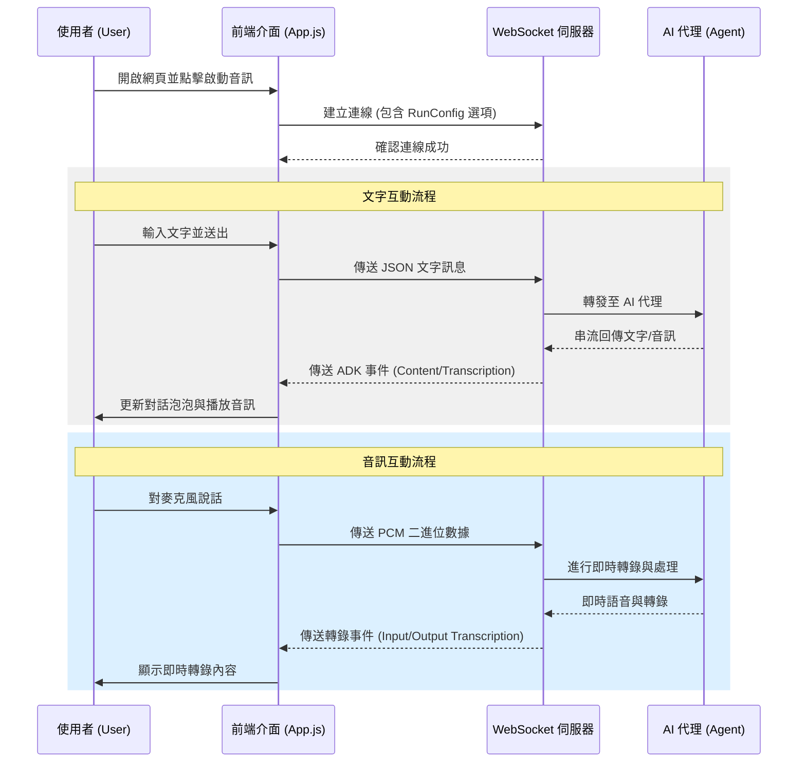
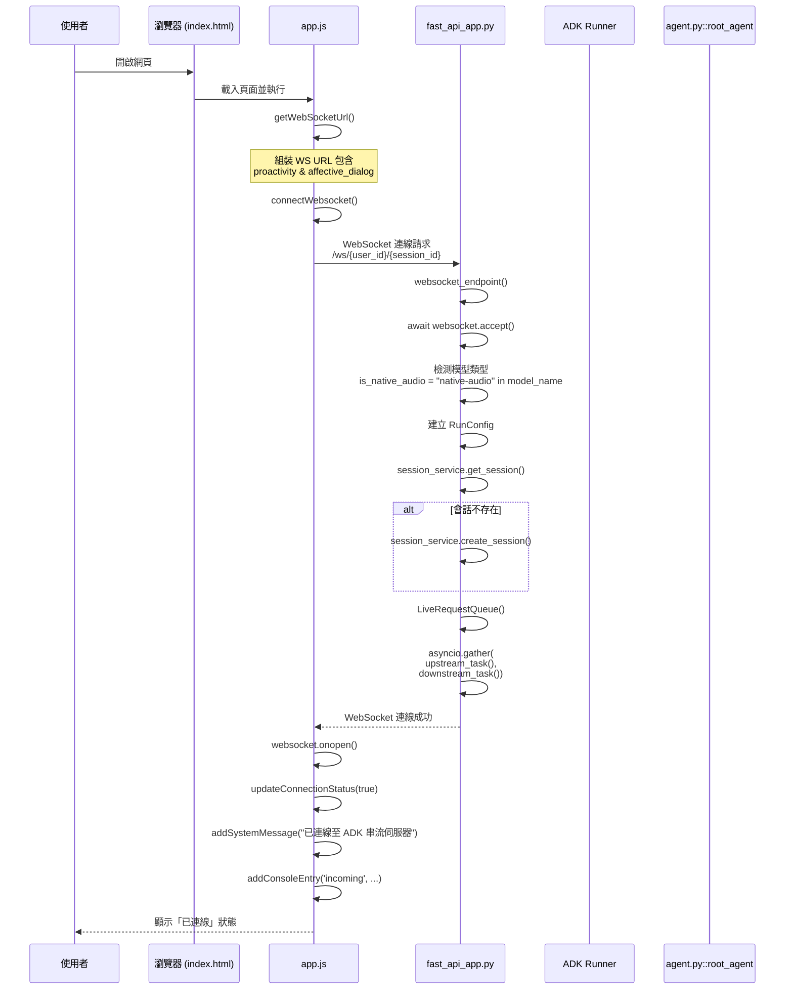
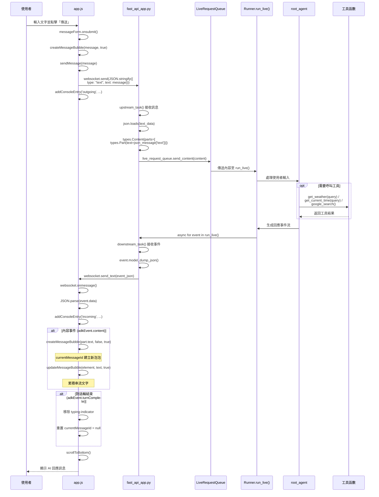
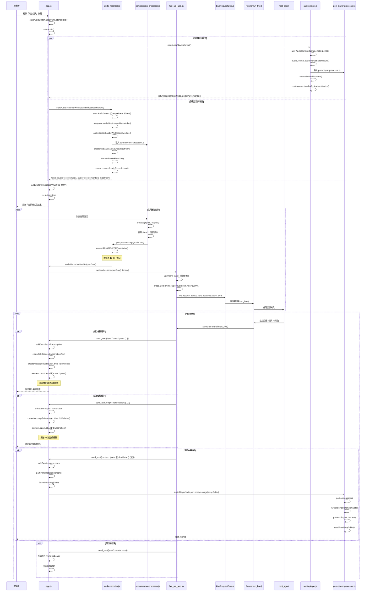
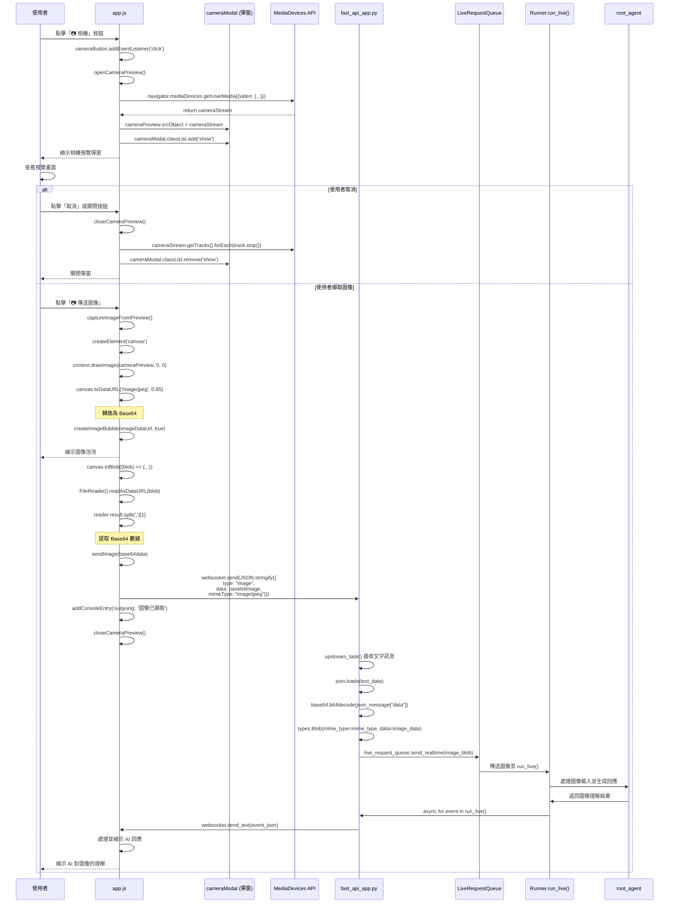
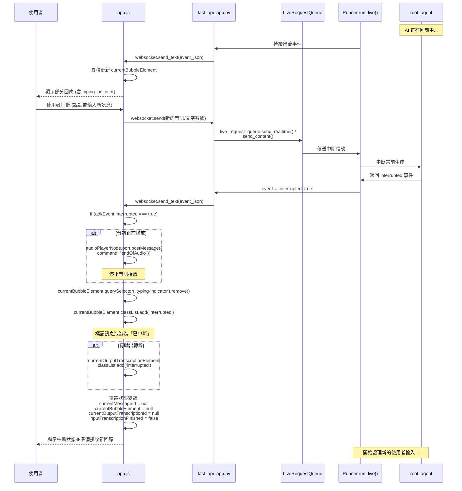
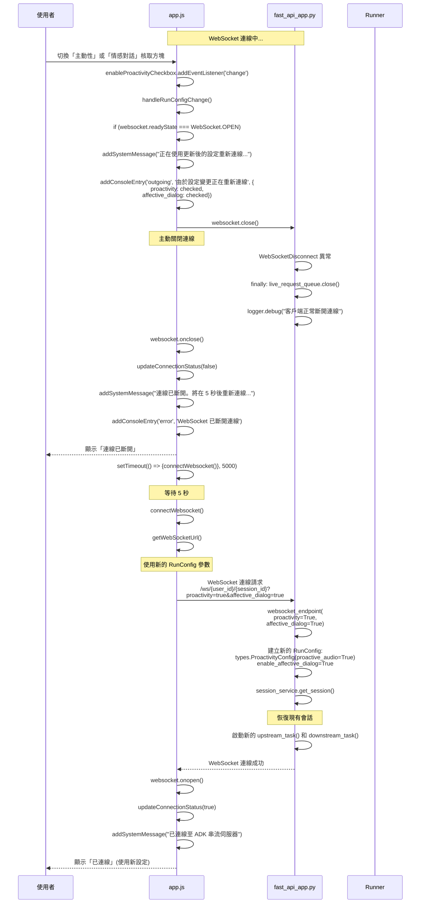
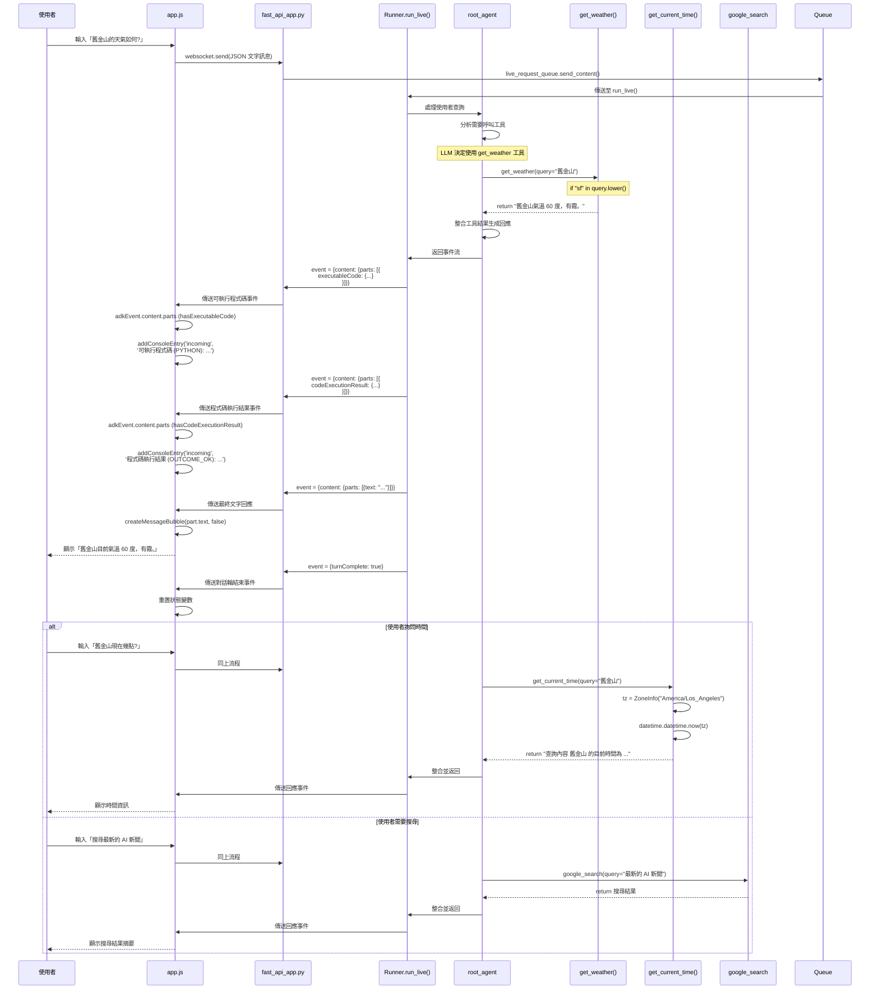

# ADK 雙向串流演示應用 - 技術文件

本文件詳細說明了 `bidi_demo` 應用的前後端架構與實作細節。該應用基於 Google ADK (Agent Development Kit)，展示了如何透過 WebSocket 實現與 AI 代理的多模態（文字、音訊、影像）即時雙向串流互動。

## 1. 系統架構概觀

本應用採前後端分離架構。前端利用 Web Audio API 進行低延遲音訊處理，後端基於 FastAPI 與 ADK Runner 實現非同步雙向串流通訊。

### 核心檔案說明

#### 前端 (Static)
- **`app.js`**: 應用主程式，負責 WebSocket 連線管理、UI 更新、事件處理及多媒體擷取。
- **`audio-player.js`**: 初始化音訊播放環境，載入播放 Worklet。
- **`audio-recorder.js`**: 初始化麥克風擷取環境，載入錄音 Worklet。
- **`pcm-player-processor.js`**: 運行於獨立線程的音訊播放處理器，使用環形緩衝區管理 PCM 串流。
- **`pcm-recorder-processor.js`**: 運行於獨立線程的音訊錄製處理器，擷取原始音訊樣本。

#### 後端 (Python)
- **`fast_api_app.py`**: 主進入點，提供 WebSocket 端點及會話管理邏輯。
- **`agent.py`**: 定義 AI 代理行為、模型配置與註冊工具（天氣、時間、搜尋）。
- **`app_utils/`**: 包含遙測 (Telemetry) 與類型定義等輔助工具。

## 2. 系統互動流程

## 3. 技術實作細節

### 3.1 WebSocket 通訊
使用標準 WebSocket 與後端通訊，URL 支援 `RunConfig` 選項：
- `proactivity`: 主動性開關。
- `affective_dialog`: 情感對話開關。

### 3.2 即時音訊處理
- **播放 (Output)**:
  - 取樣率：24000 Hz。
  - 機制：使用 **環形緩衝區 (Ring Buffer)** 緩存非同步抵達的 PCM 數據包，在 `AudioWorklet` 的 `process` 函數中穩定輸出。
- **錄製 (Input)**:
  - 取樣率：16000 Hz。
  - 格式轉換：在主線程將 Float32 樣本轉換為 **16-bit PCM (Int16)**，以減少網路頻寬消耗並符合後端 ASR 引擎需求。

### 3.3 圖像擷取
透過 `MediaDevices API` 存取相機，並在 `Canvas` 上擷取影格。擷取後的影格會轉換為 **JPEG (Base64)** 格式透過 WebSocket 傳送至代理進行影像理解。

## 4. 後端實作細節

### 4.1 代理定義與工具
後端使用 `google.adk.agents.Agent` 定義根代理，並註冊多個 Python 函式作為 LLM 的工具：
- **`get_weather(query)`**: 提供模擬的即時天氣數據。
- **`get_current_time(query)`**: 透過時區處理獲取精確的地區時間。
- **`google_search`**: 整合 Google 搜尋工具，增強代理的資訊獲取能力。

### 4.2 會話管理 (Session Management)
系統支援多種會話持久化方案：
- **Vertex AI Session Service**: 整合 Google Cloud 的 `reasoning-engines`，支援大規模生產環境。
- **In-Memory Session Service**: 提供本地快速測試與開發使用的記憶體內會話緩存。

### 4.3 雙向串流邏輯
在 `fast_api_app.py` 的 WebSocket 端點中，透過 `asyncio.gather` 同時執行兩個核心任務：
- **上游 (Upstream)**: 從 WebSocket 接收用戶輸入（音訊二進位、文字或圖像 JSON），並將其推送至 `LiveRequestQueue`。
- **下游 (Downstream)**: 呼叫 `runner.run_live()` 啟動 ADK 執行器。執行器會根據模型類型（原生音訊或半串聯）自動選擇最優的串流模態，並將產生的事件即時傳回前端。

### 4.4 自動模型適配
伺服器會分析所選模型的屬性：
- **原生音訊模型**: 配置為 `AUDIO` 回應模態，並啟用輸入/輸出轉錄。
- **半串聯模型**: 預設使用 `TEXT` 模態以獲得更短的延遲。

## 5. 情境實作流程圖

本章節提供詳細的情境流程時序圖，展示系統在不同使用場景下的運作機制，包含具體的函數呼叫與資料流向。

### 情境 1: 初始連線建立流程

### 情境 2: 文字訊息互動流程

### 情境 3: 音訊對話互動流程

### 情境 4: 相機圖像傳送流程

### 情境 5: 對話中斷處理流程

### 情境 6: RunConfig 變更與重新連線流程

### 情境 7: 工具呼叫處理流程

---

**情境說明總結**:

以上 7 個情境涵蓋了系統的完整運作流程：

1. **初始連線建立** - 展示從頁面載入到 WebSocket 連線建立的完整過程
2. **文字訊息互動** - 說明文字對話的雙向串流機制
3. **音訊對話互動** - 詳細描述音訊錄製、傳輸、處理與播放的完整流程
4. **相機圖像傳送** - 展示圖像擷取與多模態理解的實作
5. **對話中斷處理** - 說明系統如何優雅地處理使用者中斷
6. **RunConfig 變更** - 展示動態配置更新與會話恢復機制
7. **工具呼叫處理** - 說明 AI 代理如何呼叫外部工具並整合結果

每個時序圖都包含具體的函數名稱與參數,方便開發者追蹤程式碼執行路徑並進行除錯。
