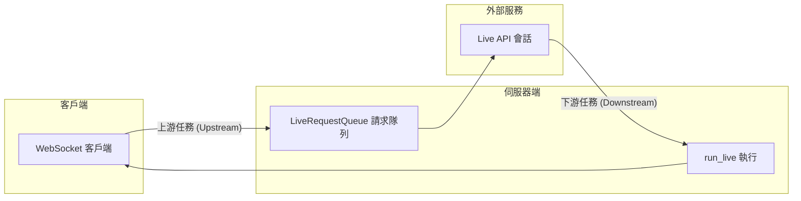

# ADK 雙向串流專案 (pack-bidi-streaming)

<!--
本檔案為 ADK Bidi-streaming 範例應用程式之完整技術文件。
由 [`googleCloudPlatform/agent-starter-pack`](https://github.com/GoogleCloudPlatform/agent-starter-pack) 版本 `0.33.0` 產生。
-->

這是使用 Google Agent Development Kit (ADK) 實現即時雙向串流 (Bidirectional Streaming) 的完整演示專案。此 FastAPI 應用程式展示了與 Gemini 模型進行基於 WebSocket 的通訊，支持多模態請求（文本、音訊和圖像/影片輸入）以及靈活的響應（文本或音訊輸出）。


## 概覽 (Overview)

本專案實現了完整的 ADK 雙向串流生命週期：

1.  **應用程式初始化**：啟動時建立 `Agent`（代理）、`SessionService`（對話服務）和 `Runner`（執行器）。
2.  **會話初始化**：為每個連線建立 `Session`（會話）、`RunConfig`（執行配置）和 `LiveRequestQueue`（即時請求隊列）。
3.  **雙向串流**：並行執行上游（客戶端 → 隊列）和下游（事件 → 客戶端）任務。
4.  **優雅終止**：妥善清理 `LiveRequestQueue` 和 WebSocket 連線。

## 功能特性 (Features)

*   **WebSocket 通訊**：透過 `/ws/{user_id}/{session_id}` 進行即時雙向串流。
*   **多模態請求**：支持文本、音訊和圖像/影片輸入，具備自動音訊轉錄功能。
*   **靈活響應**：支持文本或音訊輸出，根據模型架構自動判定。
*   **對話恢復**：透過 `RunConfig` 配置連線恢復支援。
*   **並發任務**：獨立的異步上游/下游任務，優化效能。
*   **互動式 UI**：具備事件控制台的網頁介面，用於監控即時 API 事件。
*   **Google 搜尋整合**：代理配備 `google_search` 工具。
*   **企業級部署**：整合 CI/CD 管線與 Terraform 基礎建設配置。

## 架構 (Architecture)

應用程式遵循 ADK 推薦的並發任務模式：



*   **上游任務 (Upstream Task)**：接收 WebSocket 訊息並轉發至 `LiveRequestQueue`。
*   **下游任務 (Downstream Task)**：處理 `run_live()` 事件並傳送回 WebSocket 客戶端。

## 專案結構 (Project Structure)

<!--
說明專案目錄結構與各資料夾/檔案用途。
-->

### 整體目錄結構

```
├── ARCHITECTURE.md
├── Dockerfile
├── GEMINI.md
├── Makefile
├── README.md
├── assets
│   └── bidi-demo-screen.png
├── bidi_demo
│   ├── README.md
│   ├── __init__.py
│   ├── agent.py
│   ├── app_utils
│   │   ├── telemetry.py
│   │   └── typing.py
│   ├── fast_api_app.py
│   └── static
│       ├── css
│       │   └── style.css
│       ├── index.html
│       └── js
│           ├── app.js
│           ├── audio-player.js
│           ├── audio-recorder.js
│           ├── pcm-player-processor.js
│           └── pcm-recorder-processor.js
├── deployment
│   ├── README.md
│   └── terraform
│       ├── apis.tf
│       ├── build_triggers.tf
│       ├── dev
│       │   ├── apis.tf
│       │   ├── iam.tf
│       │   ├── providers.tf
│       │   ├── service.tf
│       │   ├── storage.tf
│       │   ├── telemetry.tf
│       │   ├── variables.tf
│       │   └── vars
│       │       └── env.tfvars
│       ├── github.tf
│       ├── iam.tf
│       ├── locals.tf
│       ├── providers.tf
│       ├── service.tf
│       ├── service_accounts.tf
│       ├── sql
│       │   └── completions.sql
│       ├── storage.tf
│       ├── telemetry.tf
│       ├── variables.tf
│       └── vars
│           └── env.tfvars
├── notebooks
│   ├── adk_app_testing.ipynb
│   └── evaluating_adk_agent.ipynb
├── pyproject.toml
├── starter_pack_README.md
├── tests
│   ├── TEST_GENERATION_REPORT.md
│   ├── conftest.py
│   ├── integration
│   │   ├── test_agent.py
│   │   └── test_server_e2e.py
│   ├── load_test
│   │   ├── README.md
│   │   └── load_test.py
│   ├── test_bidi_demo.md
│   ├── test_bidi_demo_e2e.md
│   ├── test_log_20251209_143549.md
│   └── unit
│       ├── README.md
│       ├── __init__.py
│       ├── test_agent.py
│       ├── test_dummy.py
│       ├── test_imports.py
│       ├── test_models.py
│       ├── test_structure.py
│       └── test_telemetry.py
└── uv.lock
```

> 💡 **提示：** 建議使用 [Gemini CLI](https://github.com/google-gemini/gemini-cli) 進行 AI 輔助開發，專案上下文已預先設定於 `GEMINI.md`。

## 環境需求 (Prerequisites)

<!--
列出開始前需安裝的工具與其用途。
-->

### 必要工具

開始前請確保已安裝：
- **Python 3.10 或更高版本**：專案執行環境
- **uv**：Python 套件管理工具（本專案所有相依套件皆以 uv 管理） - [安裝說明](https://docs.astral.sh/uv/getting-started/installation/)（[新增套件](https://docs.astral.sh/uv/concepts/dependencies/)請用 `uv add <package>`）
- **Google Cloud SDK**：GCP 服務工具 - [安裝說明](https://cloud.google.com/sdk/docs/install)
- **Terraform**：基礎建設部署工具 - [安裝說明](https://developer.hashicorp.com/terraform/downloads)
- **make**：建置自動化工具 - [安裝說明](https://www.gnu.org/software/make/)（大多數 Unix 系統預設已安裝）

### API 憑證

需要以下其中一種 API 憑證：
- **Google API 金鑰**（用於 Gemini Live API）
- **Google Cloud 專案**（用於 Vertex AI Live API）

**安裝 uv（如果尚未安裝）：**

```bash
# macOS/Linux
curl -LsSf https://astral.sh/uv/install.sh | sh

# Windows
powershell -ExecutionPolicy ByPass -c "irm https://astral.sh/uv/install.ps1 | iex"
```

## 快速開始 (Quick Start)

<!--
說明如何安裝相依套件並啟動本地開發環境。
-->

### 方式一：使用 Makefile（推薦）

安裝所需套件並啟動本地開發環境：

```bash
make install && make playground
```

> **📊 可觀測性說明：** 代理遙測（Cloud Trace）永遠啟用。提示-回應紀錄（GCS、BigQuery、Cloud Logging）本地預設停用，部署環境預設啟用（僅記錄中繼資料，不含提示/回應內容）。詳見[監控與可觀測性](#監控與可觀測性)。

### 方式二：手動設定

#### 1. 安裝依賴項目

**使用 uv（推薦）：**

```bash
uv sync
```

這會自動建立虛擬環境、安裝所有依賴，並生成用於可重現構建的鎖定檔案。

**使用 pip（替代方案）：**

```bash
python3 -m venv .venv
source .venv/bin/activate  # Windows: .venv\Scripts\activate
pip install -e .
```

#### 2. 配置環境變數

建立或編輯 `app/.env` 並填入您的憑證：

```bash
# 選擇您的 Live API 平台
GOOGLE_GENAI_USE_VERTEXAI=FALSE

# 用於 Gemini Live API (當 GOOGLE_GENAI_USE_VERTEXAI=FALSE)
GOOGLE_API_KEY=your_api_key_here

# 用於 Vertex AI Live API (當 GOOGLE_GENAI_USE_VERTEXAI=TRUE)
# GOOGLE_CLOUD_PROJECT=your_project_id
# GOOGLE_CLOUD_LOCATION=us-central1

# 模型選擇 (選填，預設使用原生音訊模型)
# 可用的模型名稱請參見下方的「支援模型」章節
DEMO_AGENT_MODEL=gemini-2.5-flash-native-audio-preview-12-2025
```

#### 獲取 API 憑證

**Gemini Live API:**
1. 訪問 [Google AI Studio](https://aistudio.google.com/apikey)
2. 建立 API 金鑰
3. 在 `.env` 中設定 `GOOGLE_API_KEY`

**Vertex AI Live API:**
1. 在 [Google Cloud Console](https://console.cloud.google.com) 啟用 Vertex AI API
2. 使用 `gcloud auth application-default login` 設定認證
3. 在 `.env` 中設定 `GOOGLE_CLOUD_PROJECT` 和 `GOOGLE_CLOUD_LOCATION`
4. 設定 `GOOGLE_GENAI_USE_VERTEXAI=TRUE`

#### 3. 設定 SSL 憑證路徑

為安全連線設定 SSL 憑證檔案路徑：

```bash
# 如果使用 uv
export SSL_CERT_FILE=$(uv run python -m certifi)

# 如果使用已啟動虛擬環境的 pip
export SSL_CERT_FILE=$(python -m certifi)
```

#### 4. 啟動伺服器

在 `src/bidi-demo` 目錄下，先切換到 `app` 子目錄：

```bash
cd app
```

> **注意：** 您必須在 `app` 目錄內執行，Python 才能找到 `google_search_agent` 模組。從父目錄執行會導致 `ModuleNotFoundError: No module named 'google_search_agent'` 錯誤。

**使用 uv（推薦）：**

```bash
uv run --project .. uvicorn main:app --reload --host 0.0.0.0 --port 8000
```

**使用 pip（已啟動虛擬環境）：**

```bash
uvicorn main:app --reload --host 0.0.0.0 --port 8000
```

`--reload` 參數可在開發過程中自動重新啟動伺服器。

#### 5. 訪問應用程式

開啟瀏覽器並導覽至：

```
http://localhost:8000
```

## 指令說明 (Command Reference)

<!--
列出常用 make 指令與說明。
-->

### 開發指令

| 指令                 | 說明                             |
| -------------------- | -------------------------------- |
| `make install`       | 使用 uv 安裝相依套件             |
| `make playground`    | 啟動本地開發環境                 |
| `make lint`          | 執行程式碼品質檢查               |
| `make test`          | 執行單元與整合測試               |
| `make deploy`        | 部署代理至 Cloud Run             |
| `make local-backend` | 啟動本地後端伺服器（支援熱重載） |
| `make setup-dev-env` | 使用 Terraform 建立開發環境資源  |

完整指令與用法請參閱 [Makefile](Makefile)。

### 背景模式執行（測試/生產）

在背景執行並輸出日誌：

```bash
# 使用 uv (在 app 目錄下)
uv run --project .. uvicorn main:app --host 0.0.0.0 --port 8000 > server.log 2>&1 &

# 使用 pip (在 app 目錄下)
uvicorn main:app --host 0.0.0.0 --port 8000 > server.log 2>&1 &
```

檢查伺服器日誌：

```bash
tail -f server.log  # 即時查看日誌
```

停止背景伺服器：

```bash
kill $(lsof -ti:8000)
```

## 使用方式 (Usage)

<!--
說明開發流程與各步驟。
-->

### 開發工作流程

本範本採「自帶代理」模式——您專注於業務邏輯，範本處理 UI、基礎建設、部署與監控。

1. **原型設計：** 於 `notebooks/` 內的 Jupyter 筆記本設計生成式 AI 代理，並用 Vertex AI Evaluation 評估效能。
2. **整合：** 編輯 `bidi_demo/agent.py` 匯入您的代理。
3. **測試：** 使用 `make playground` 啟動本地 playground 測試代理功能，支援程式碼熱重載。
4. **部署：** 設定並啟動 CI/CD 管線，可依需求自訂測試。詳見[部署說明](#部署)。如需快速部署基礎建設，可執行 `uvx agent-starter-pack setup-cicd`。參考 [`agent-starter-pack setup-cicd` CLI 指令](https://googlecloudplatform.github.io/agent-starter-pack/cli/setup_cicd.html)。目前支援 GitHub，CI/CD 執行器可選 Google Cloud Build 或 GitHub Actions。
5. **監控：** 利用 BigQuery 遙測資料、Cloud Logging 與 Cloud Trace 追蹤效能並優化應用。

專案內含 `GEMINI.md`，可供 Gemini CLI 等 AI 工具查詢專案上下文。

### 使用者介面操作

#### 文字模式

1. 在輸入欄位輸入訊息。
2. 點擊 "Send" 或按 Enter。
3. 觀察事件控制台以獲取 Live API 事件。
4. 即時接收串流回應。

#### 音訊模式

1. 點擊 "Start Audio" 開始語音互動。
2. 對著麥克風說話。
3. 接收帶有即時轉錄的音訊回應。
4. 點擊 "Stop Audio" 結束音訊對話。

## WebSocket API 說明

### 端點 (Endpoint)

```
ws://localhost:8000/ws/{user_id}/{session_id}
```

**路徑參數：**
*   `user_id`：使用者的唯一識別碼。
*   `session_id`：對話的唯一識別碼。

**回應模態 (Modality)：**
*   根據模型架構自動判定。
*   原生音訊 (Native audio) 模型使用 AUDIO 回應模態。
*   半級聯 (Half-cascade) 模型使用 TEXT 回應模態。

### 訊息格式

**客戶端 → 伺服器 (文字)：**
```json
{
  "type": "text",
  "text": "您的訊息"
}
```

**客戶端 → 伺服器 (圖像)：**
```json
{
  "type": "image",
  "data": "base64_編碼的圖像數據",
  "mimeType": "image/jpeg"
}
```

**客戶端 → 伺服器 (音訊)：**
*   傳送原始二進位影格（PCM 音訊, 16kHz, 16-bit）。

**伺服器 → 客戶端：**
*   JSON 編碼的 ADK `Event` 物件。
*   請參閱 [ADK 事件文件](https://google.github.io/adk-docs/) 獲取事件綱要。

## 程式碼概覽 (Code Overview)

### 代理定義 (bidi_demo/agent.py)

代理在獨立模組中定義，遵循 ADK 最佳實踐：

```python
agent = Agent(
    name="google_search_agent",
    model=os.getenv("DEMO_AGENT_MODEL", "gemini-2.5-flash-native-audio-preview-12-2025"),
    tools=[google_search],
    instruction="You are a helpful assistant that can search the web."
)
```

### 應用程式初始化 (app/main.py:37-50)

```python
from google_search_agent.agent import agent

app = FastAPI()
session_service = InMemorySessionService()
runner = Runner(app_name="bidi-demo", agent=agent, session_service=session_service)
```

### WebSocket 處理器 (app/main.py:65-209)

WebSocket 端點實現了完整的雙向串流模式：

1.  **接受連線**：建立 WebSocket 連線。
2.  **配置對話**：使用自動模態檢測建立 `RunConfig`。
3.  **初始化隊列**：建立用於訊息傳遞的 `LiveRequestQueue`。
4.  **啟動並發任務**：發啟上游和下游任務。
5.  **處理清理**：在 `finally` 區塊中關閉隊列。

### 並發任務實現

**上游任務 (Upstream Task)** (app/main.py:125-172):
*   接收 WebSocket 訊息（文字、圖像或音訊二進位）。
*   轉換為 ADK 格式 (`Content` 或 `Blob`)。
*   透過 `send_content()` 或 `send_realtime()` 傳送到 `LiveRequestQueue`。

**下游任務 (Downstream Task)** (app/main.py:174-187):
*   使用隊列和配置呼叫 `runner.run_live()`。
*   從 Live API 接收 `Event` 串流。
*   將事件序列化為 JSON 並傳送到 WebSocket。

## 配置說明 (Configuration)

### 支援模型

專案支援任何與 Live API 相容的 Gemini 模型：

**原生音訊模型 (Native Audio Models)**（推薦語音使用）：
*   `gemini-2.5-flash-native-audio-preview-12-2025` (Gemini Live API)
*   `gemini-live-2.5-flash-native-audio` (Vertex AI)

透過 `.env` 中的 `DEMO_AGENT_MODEL` 設定模型，或修改 `bidi_demo/agent.py`。

獲取最新模型資訊：
*   **Gemini Live API**: 查看 [官方 Gemini API 模型文件](https://ai.google.dev/gemini-api/docs/models)
*   **Vertex AI Live API**: 查看 [官方 Vertex AI 模型文件](https://cloud.google.com/vertex-ai/generative-ai/docs/learn/models)

### RunConfig 選項

應用程式會根據模型架構自動配置雙向串流 (app/main.py:76-104)：

**原生音訊模型**（模型名稱包含 "native-audio"）：
```python
run_config = RunConfig(
    streaming_mode=StreamingMode.BIDI,
    response_modalities=["AUDIO"],
    input_audio_transcription=types.AudioTranscriptionConfig(),
    output_audio_transcription=types.AudioTranscriptionConfig(),
    session_resumption=types.SessionResumptionConfig()
)
```

**半級聯模型**（其他模型）：
```python
run_config = RunConfig(
    streaming_mode=StreamingMode.BIDI,
    response_modalities=["TEXT"],
    input_audio_transcription=None,
    output_audio_transcription=None,
    session_resumption=types.SessionResumptionConfig()
)
```

模態檢測會根據模型名稱自動執行。原生音訊模型使用 AUDIO 回應模態並啟用轉錄,而半級聯模型則使用 TEXT 回應模態以獲得更好的效能。

## 部署 (Deployment)

<!--
說明如何一鍵部署 CI/CD 與基礎建設。
-->

> **注意：** 可用 [`agent-starter-pack setup-cicd` CLI 指令](https://googlecloudplatform.github.io/agent-starter-pack/cli/setup_cicd.html) 一鍵部署完整 CI/CD 管線與基礎建設。目前支援 GitHub，CI/CD 執行器可選 Google Cloud Build 或 GitHub Actions。

### 開發環境部署

可用下列指令部署至開發環境：

```bash
gcloud config set project <your-dev-project-id>
make deploy
```

本儲存庫已包含 Terraform 設定檔，可用於建立 Dev Google Cloud 專案。
詳見 [deployment/README.md](deployment/README.md)。

### 正式環境部署

本儲存庫亦包含正式環境的 Terraform 設定檔。請參閱 [deployment/README.md](deployment/README.md) 取得詳細部署說明。

## 常見問題排除 (Troubleshooting)

### 連線問題

**問題**：WebSocket 連線失敗

**解決方案**：
*   驗證 `app/.env` 中的 API 憑證。
*   檢查控制台錯誤訊息。
*   確保 uvicorn 正在正確的埠口執行。

### 音訊失效

**問題**：音訊輸入/輸出無法運作

**解決方案**：
*   在瀏覽器中授予麥克風權限。
*   驗證瀏覽器支援 Web Audio API。
*   檢查音訊模型配置（需要原生音訊模型）。
*   查看瀏覽器控制台錯誤。

### 模型錯誤

**問題**：找不到模型或配額錯誤

**解決方案**：
*   驗證模型名稱與您的平台匹配（Gemini vs Vertex AI）。
*   在控制台中檢查 API 配額限制。
*   確保已啟用計費（對於 Vertex AI）。

### 模組載入錯誤

**問題**：`ModuleNotFoundError: No module named 'google_search_agent'`

**解決方案**：
*   確保從 `app` 目錄內執行啟動指令。
*   檢查 `PYTHONPATH` 環境變數設定。
*   使用 `uv run --project ..` 指定專案根目錄。

## 監控與可觀測性

<!--
說明遙測與提示-回應紀錄的啟用方式與差異。
-->
本應用提供兩層級可觀測性：

**1. 代理遙測事件（永遠啟用）**
- OpenTelemetry 追蹤與 span 匯出至 **Cloud Trace**
- 追蹤代理執行、延遲與系統指標

**2. 提示-回應紀錄（可設定）**
- GenAI 工具記錄 LLM 互動（token、模型、時間）
- 匯出至 **Google Cloud Storage**（JSONL）、**BigQuery**（外部表）、**Cloud Logging**（專屬 bucket）

| 環境                             | 提示-回應紀錄                                                 |
| -------------------------------- | ------------------------------------------------------------- |
| **本地開發** (`make playground`) | ❌ 預設停用                                                    |
| **部署環境** (Terraform)         | ✅ **預設啟用**（隱私保護：僅記錄中繼資料，不含提示/回應內容） |

**本地啟用方式：** 設定 `LOGS_BUCKET_NAME` 與 `OTEL_INSTRUMENTATION_GENAI_CAPTURE_MESSAGE_CONTENT=NO_CONTENT`。

**部署環境停用方式：** 編輯 Terraform 設定檔，將 `OTEL_INSTRUMENTATION_GENAI_CAPTURE_MESSAGE_CONTENT=false`。

詳見[可觀測性指南](https://googlecloudplatform.github.io/agent-starter-pack/guide/observability.html)，內含詳細說明、查詢範例與視覺化方式。

## 開發最佳實踐 (Development Best Practices)

### 程式碼格式化

專案使用 black、isort 和 flake8 進行程式碼格式化與檢查。配置繼承自儲存庫根目錄。

**使用 uv：**
```bash
uv run black .
uv run isort .
uv run flake8 .
```

**使用 pip（已啟動虛擬環境）：**
```bash
black .
isort .
flake8 .
```

### 測試策略

專案提供多層級測試支援：

1. **單元測試**：測試個別功能模組
2. **整合測試**：測試 WebSocket 連線與 API 整合
3. **E2E 測試**：位於 `tests/` 目錄，測試完整使用者流程

執行測試：
```bash
make test
```

### AI 輔助開發

專案包含 `GEMINI.md` 檔案，提供專案上下文給 AI 工具：

```bash
# 使用 Gemini CLI 進行開發協助
gemini chat
```

## 保持最新

<!--
說明如何升級範本版本並保留自訂內容。
-->
如需升級至最新版 agent-starter-pack：

```bash
uvx agent-starter-pack upgrade
```

此指令會智慧合併更新並保留您的自訂內容。可加上 `--dry-run` 預覽變更。詳見 [升級 CLI 說明](https://googlecloudplatform.github.io/agent-starter-pack/cli/upgrade.html)。

## 其他資源 (Additional Resources)

### 官方文件

*   **ADK 文件**: https://google.github.io/adk-docs/
*   **Gemini Live API**: https://ai.google.dev/gemini-api/docs/live
*   **Vertex AI Live API**: https://cloud.google.com/vertex-ai/generative-ai/docs/live-api
*   **ADK GitHub 儲存庫**: https://github.com/google/adk-python
*   **Agent Starter Pack**: https://github.com/GoogleCloudPlatform/agent-starter-pack
*   **可觀測性指南**: https://googlecloudplatform.github.io/agent-starter-pack/guide/observability.html

### 相關範例

*   [ADK Python 範例](https://github.com/google/adk-python/tree/main/examples)
*   [ADK Samples Repository](https://github.com/google/adk-samples)
*   [Agent Starter Pack 範例](https://github.com/GoogleCloudPlatform/agent-starter-pack/tree/main/examples)

## 授權 (License)

Apache 2.0 - 詳情請參閱儲存庫 LICENSE 檔案。

---

## 重點摘要 (Key Takeaways)

### 核心概念
展示如何使用 Google ADK 建立基於 WebSocket 的即時雙向多模態串流應用程式，整合企業級部署工具與最佳實踐。

### 關鍵技術
*   **Google ADK (Agent Development Kit)**: 用於開發代理的工具包
*   **FastAPI**: 用於建立 Web 伺服器和 WebSocket 端點
*   **Gemini Live API / Vertex AI Live API**: 提供即時對話能力的後端模型
*   **多模態處理**: 支援文本、音訊、圖像輸入與自動語音轉錄
*   **LiveRequestQueue**: ADK 的核心並發處理機制
*   **Terraform**: 基礎建設即程式碼 (IaC)
*   **Cloud Build / GitHub Actions**: CI/CD 自動化

### 重要結論
ADK 透過 `LiveRequestQueue` 和並發處理模式，簡化了複雜的即時雙向串流開發，能有效處理語音對話與多模態互動。Agent Starter Pack 提供了從開發到生產的完整工作流程。

### 開發流程
1. **原型設計** → 在 Jupyter Notebooks 中實驗
2. **本地開發** → 使用 `make playground` 測試
3. **品質控管** → 執行 lint 與測試
4. **部署** → 透過 CI/CD 自動部署至 Cloud Run
5. **監控** → 使用 Cloud Trace、BigQuery 和 Cloud Logging 追蹤效能

### 行動項目
1. ✅ 準備 Google API Key 或 Vertex AI 憑證
2. ✅ 安裝 uv 和其他必要工具
3. ✅ 配置 `.env` 環境變數
4. ✅ 執行 `make install && make playground` 啟動本地環境
5. ✅ 透過瀏覽器存取 http://localhost:8000
6. ✅ 使用 `uvx agent-starter-pack setup-cicd` 設定部署管線
