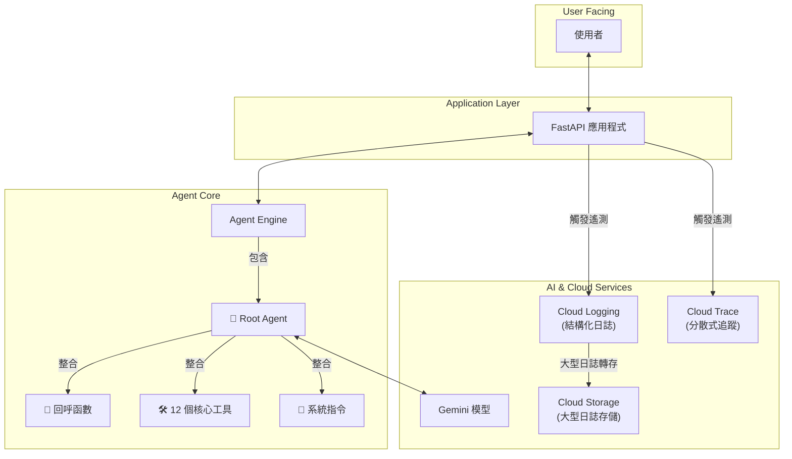
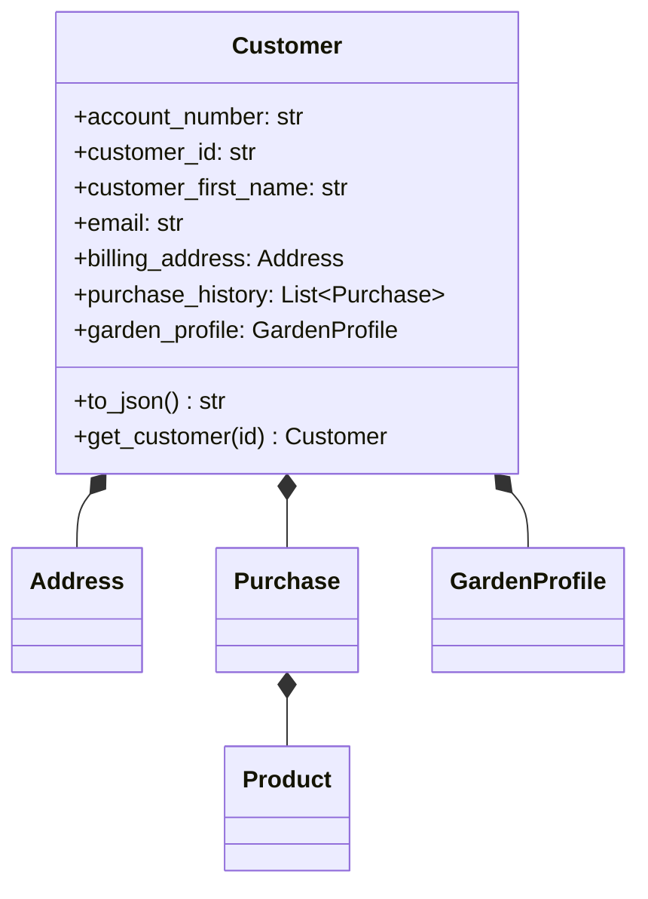
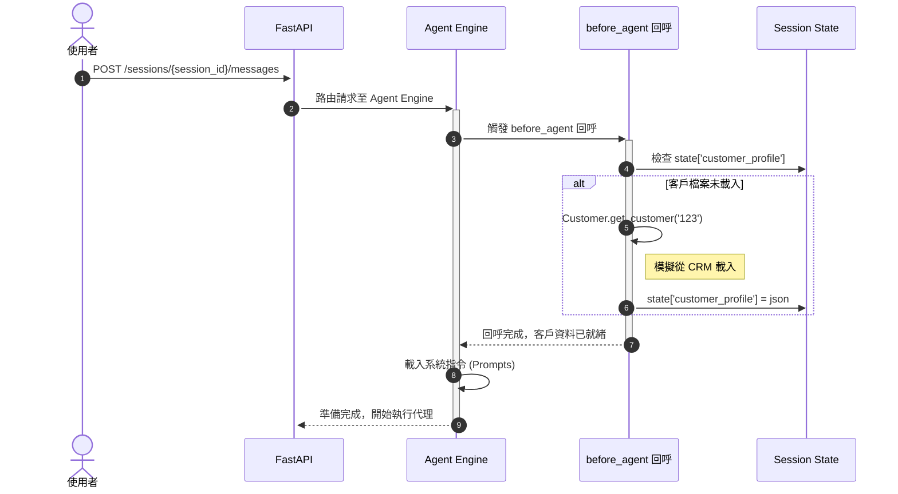
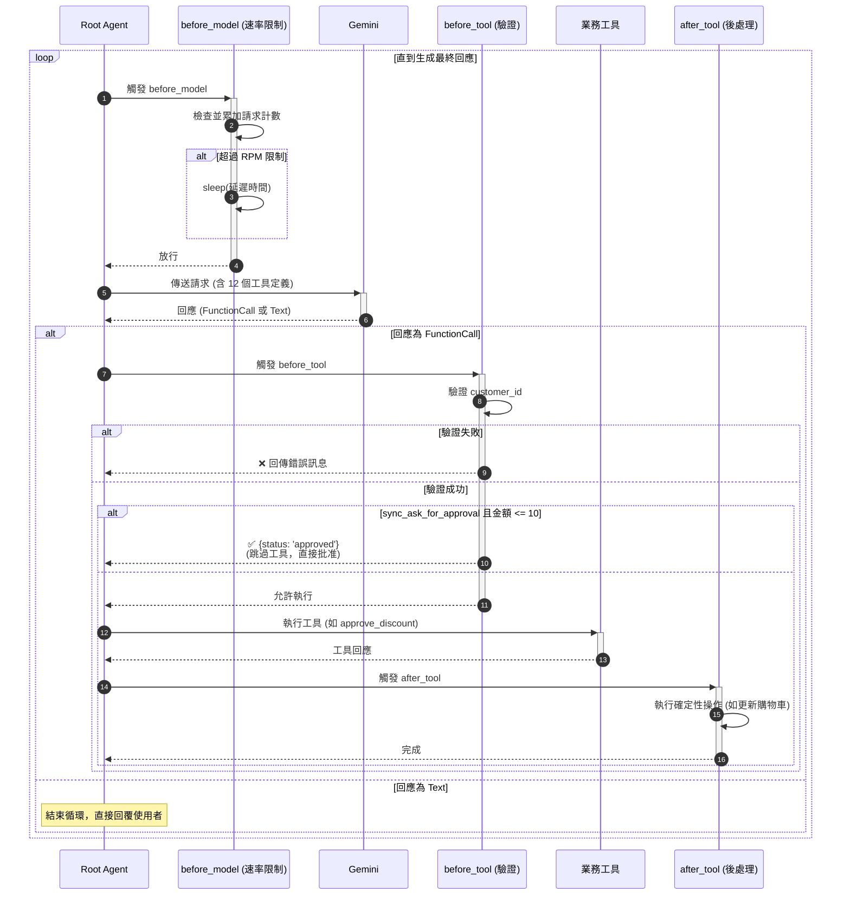

# 客戶服務 AI 代理系統設計文件

## 1. 系統總覽 (System Overview)

本文件旨在闡述一個整合 Google Cloud 服務與大型語言模型 (LLM) 的進階客戶服務 AI 代理系統。

此系統的核心是一個由 Gemini 模型驅動的 AI 代理，能夠理解使用者意圖、與外部工具互動，並執行複雜的業務邏輯，例如：查詢客戶資料、管理購物車、批准折扣、提供產品建議等。

系統透過 FastAPI 提供標準化的 API 介面，並整合了完整的可觀測性 (Observability) 機制，包含分散式追蹤與結構化日誌，確保系統在生產環境中的穩定性與可維護性。

### 1.1. 核心功能
- **智慧對話**: 透過 LLM 理解並回應客戶需求。
- **工具整合**: 呼叫外部 API (如 CRM、庫存系統) 以執行實際操作。
- **業務流程自動化**: 自動處理如小額折扣批准、預約安排等流程。
- **個人化服務**: 根據客戶歷史資料提供客製化建議。
- **完整的可觀測性**: 追蹤、記錄並分析每一次的互動細節。

### 1.2. 關鍵技術棧
- **Web 框架**: FastAPI
- **AI 代理核心**: Google ADK (Agent Development Kit)
- **語言模型**: Google Gemini
- **可觀測性**: OpenTelemetry, Google Cloud Logging, Google Cloud Trace
- **資料儲存**: Google Cloud Storage (GCS)
- **資料模型**: Pydantic

## 2. 系統架構 (System Architecture)

本系統採用模組化架構，各元件職責分明，透過明確定義的介面進行互動。

**架構流程說明**:
1.  **使用者** 透過 API 介面發送請求。
2.  **FastAPI 應用程式** 接收請求，並啟動 OpenTelemetry 追蹤。
3.  請求被路由至 **Agent Engine** 進行處理。
4.  **Root Agent** 作為系統大腦，根據 **系統指令 (Prompts)** 和對話歷史，決定下一步行動。
5.  在與 **Gemini 模型** 互動的各個階段，會觸發相應的 **回呼函數 (Callbacks)**，執行如速率限制、權限驗證等邏輯。
6.  若 LLM 決定使用工具，代理會從 **工具集 (Tools)** 中選擇並執行。
7.  整個過程中的所有操作、屬性與元數據都會被記錄到 **Cloud Logging** 與 **Cloud Trace**。大型日誌會被自動轉存至 **GCS**。

---

## 3. 核心組件詳解 (Core Components)

### 3.1. API 層: FastAPI 應用程式

此模組負責將代理功能以 RESTful API 的形式對外提供服務。

- **職責**:
    - 接收 HTTP 請求並將其轉發給 Agent Engine。
    - 提供 `/feedback` 端點以收集使用者回饋。
    - 初始化系統基礎設施，包括 GCS Bucket 與 OpenTelemetry。
    - 管理 CORS (跨來源資源共用) 設定。
- **啟動流程**:
    1.  **Google Auth 認證**: 獲取雲端專案權限。
    2.  **GCS Bucket 建立**: 確保用於存儲大型日誌的 Bucket 存在。
    3.  **OpenTelemetry 初始化**: 設定 `CloudTraceLoggingSpanExporter` 以啟用遙測。
    4.  **Agent Engine 連接**: 建立或連接到名為 `pack-customer-service` 的代理引擎。
    5.  **FastAPI App 初始化**: 建立 FastAPI 實例並掛載代理路由。
    6.  **Uvicorn 啟動**: 運行伺服器並監聽指定埠號 (如 :8000)。

### 3.2. 代理核心: Agent

此模組是系統的「大腦」，定義了代理的行為、能力與生命週期。

- **職責**:
    - 初始化並配置 Gemini 模型。
    - 綁定 12 個核心服務工具，賦予代理與外部系統互動的能力。
    - 註冊生命週期回呼函數，以在關鍵節點注入自定義邏輯。
- **結構**:
    - **模型 (Model)**: `Gemini`，負責生成回應與決策。
    - **工具 (Tools)**: 一組 Python 函數，讓代理能執行具體操作。
    - **回呼 (Callbacks)**: 在模型呼叫前、工具執行前後觸發的邏輯鉤子。

### 3.3. 代理邏輯與生命週期: 回呼函數 (Callbacks)

回呼機制是將非確定性的 LLM 輸出轉化為可控、安全的業務流程的關鍵。它在代理的生命週期中注入了必要的「護欄」(Guardrails)。

| 回呼           | 觸發時機   | 主要職責                                                                                                                  |
| :------------- | :--------- | :------------------------------------------------------------------------------------------------------------------------ |
| `before_agent` | 會話開始時 | **前置處理**: 載入客戶完整資料 (`customer_profile`) 到會話狀態中，確保後續流程能取用。                                    |
| `before_model` | LLM 調用前 | **速率限制**: 實作 RPM (每分鐘請求數) 限制 (例如 10 req/min)，避免超出配額。                                              |
| `before_tool`  | 工具執行前 | **驗證與預處理**: 1. 參數標準化 (如轉小寫)。 2. 安全驗證 (如 `customer_id` 匹配)。 3. 業務規則捷徑 (如小額折扣自動批准)。 |
| `after_tool`   | 工具執行後 | **確定性操作**: 根據工具的執行結果，執行必須成功的後續步驟 (如更新購物車狀態、記錄業務日誌)。                             |

### 3.4. 代理能力擴展: 工具集 (Tools)

工具是賦予 LLM 執行實際操作能力的函數。此系統定義了 12 種工具來滿足客戶服務場景的需求。

- **工具清單**:
    - `send_call_companion_link`: 發送視訊支援連結。
    - `approve_discount`: **(有業務規則)** 直接批准小額折扣。
    - `sync_ask_for_approval`: 向經理請求大額折扣批准。
    - `update_salesforce_crm`: 更新 CRM 中的客戶記錄。
    - `access_cart_information`: 查詢購物車內容。
    - `modify_cart`: 修改購物車 (新增/刪除商品)。
    - `get_product_recommendations`: 根據客戶資料獲取產品推薦。
    - `check_product_availability`: 檢查商品庫存。
    - `schedule_planting_service`: 預約園藝種植服務。
    - `get_available_planting_times`: 查詢可預約的時段。
    - `send_care_instructions`: 發送植物護理指南。
    - `generate_qr_code`: 生成折扣 QR Code。

### 3.5. 資料結構: 客戶實體 (Customer Entity)

為了讓代理能準確理解與操作客戶相關資訊，系統使用 Pydantic 定義了嚴格的資料模型。

- **核心模型**: `Customer`
- **結構**: 包含客戶基本資料、地址、購買歷史、通訊偏好以及特有的 `GardenProfile` (園藝檔案)。
- **優勢**:
    - **資料驗證**: 確保資料的正確性與完整性。
    - **結構化**: 便於 LLM 進行資訊提取與推理。
    - **序列化**: 提供 `to_json` 方法，方便在系統各層之間傳遞。

### 3.6. 可觀測性: 遙測與日誌 (Tracing & Logging)

為了應對雲端服務對日誌大小的限制，系統實作了自定義的 `CloudTraceLoggingSpanExporter`。

- **核心問題**: Cloud Trace 的屬性有 256 字元限制，Cloud Logging 有 256 KB 限制，無法完整記錄包含大量 Token 的 LLM 請求與回應。
- **解決方案**: 混合儲存策略。
    1.  在匯出 Span (跨度) 資料前，檢查其屬性大小。
    2.  若屬性大小 **超過 250 KB**，則將完整的屬性內容上傳至 GCS，路徑為 `spans/{span_id}.json`。
    3.  用 GCS 的 URI 替換原有的 Span 屬性。
    4.  將處理過的 Span 結構化地記錄到 Cloud Logging。
    5.  最後，調用原始的匯出器將不含大型屬性的 Span 元數據發送到 Cloud Trace。
- **優勢**:
    - ✅ **無損記錄**: 完整保留 LLM 互動的所有細節，便於除錯與分析。
    - ✅ **成本效益**: 結合不同儲存服務的優勢。
    - ✅ **關聯性**: Cloud Logging 中的日誌與 Cloud Trace 中的追蹤透過 `trace_id` 和 `span_id` 相互關聯。

---

## 4. 關鍵工作流程 (Key Workflows)

以下時序圖展示了系統在幾個關鍵場景下的詳細互動流程。

### 4.1. 會話管理與前置處理流程

此流程展示了從使用者發送訊息到代理準備好執行的完整過程。

### 4.2. LLM 推理與工具執行流程

此流程是代理的核心循環，展示了速率限制、工具驗證與業務邏輯的運作方式。

