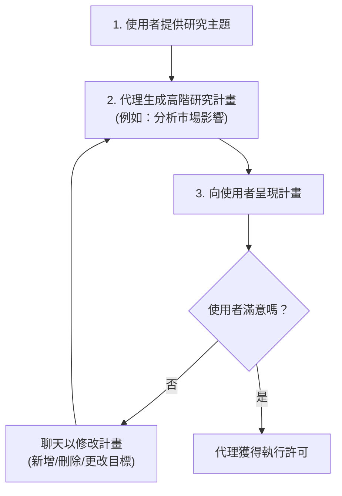
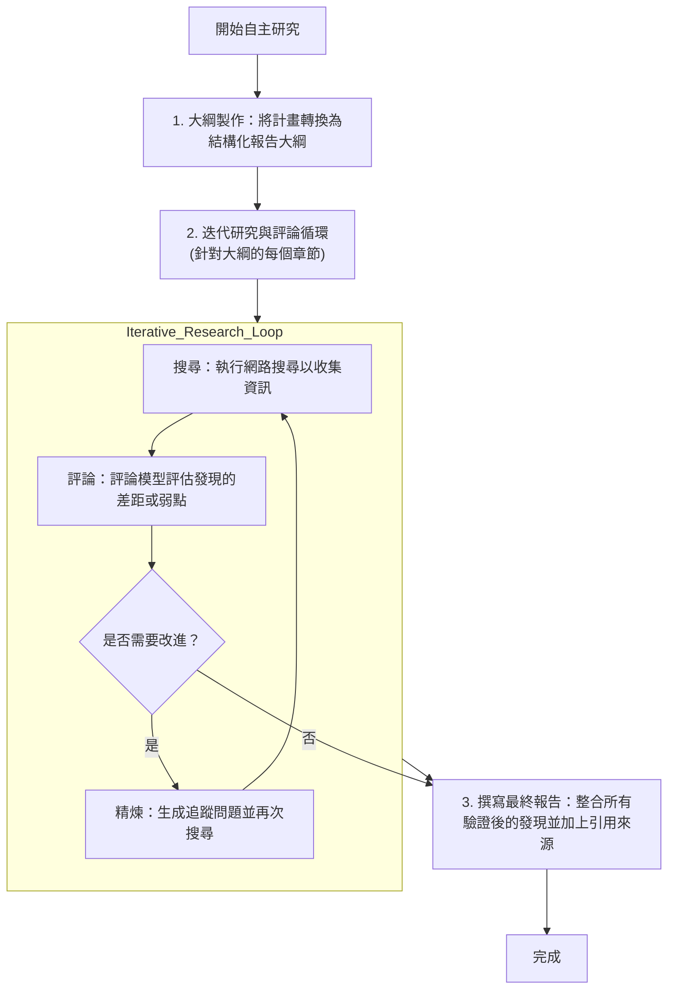
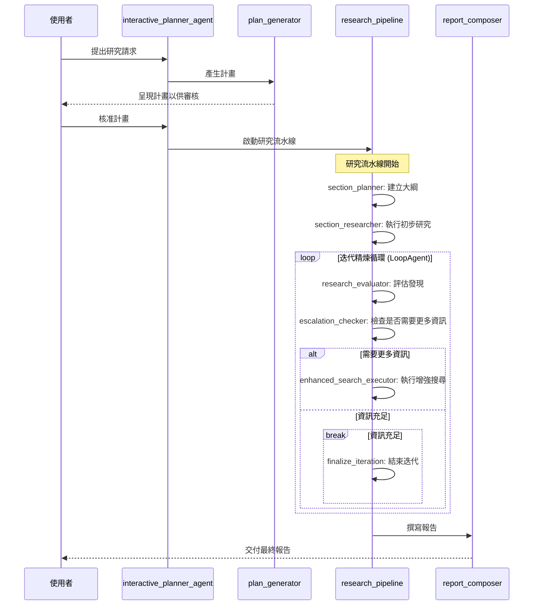

# 深層搜尋代理 (Deep Search Agent) 開發套件 (ADK) 快速入門

## 📋 重點摘要

- **核心概念**：
  - **ADK (Agent Development Kit)**: Google 提供的代理開發套件，用於構建複雜的代理工作流。
  - **HITL (Human-in-the-Loop)**: 在代理執行任務過程中引入人類審核與干預，確保方向正確。
  - **多代理協作**: 透過計畫者、研究員、評論家等多個專業化子代理共同完成複雜任務。

- **關鍵技術**：
  - **Gemini**: 作為核心 LLM，處理推理、計畫與生成。
  - **Function Calling**: 讓代理能動態調用外部工具（如網路搜尋）。
  - **Iterative Loop**: 研究與評論的閉環，自動檢查並填補資訊空白。
  - **FastAPI & React**: 現代化的全端架構。

- **重要結論**：
  - Deep Search 代理能從單一主題出發，透過與使用者的初期互動確定計畫，隨後自主進行高品質的深度研究並產出帶有引用的報告。
  - 此套件提供了生產級的部署選項（Google Cloud Run / Vertex AI），適合快速原型開發到正式部署。

- **行動項目**：
  - 獲取 Google AI Studio API Key 或準備 Google Cloud 專案。
  - 實現專案測試案例 (包含 e2e, integration, unit 測試案例共 108 個)，參考測試文件參考連結： [tests](./tests/README.md)
  - 前端設計參考 [UI 設計文件](./frontend/APP.md) 進行自定義。
  - 根據 README 指引使用 `make install && make dev` 在本地啟動。
  - 若需雲端部署，考慮使用 `agent-starter-pack` 工具生成專案架構。

> **注意：** 此代理（Agent）原名為 `gemini-fullstack`，現已更名為 `deep-search`。如果您正在尋找舊版的 `gemini-fullstack` 代理，這裡就是正確的地方！所有功能均維持不變。

**深層搜尋代理開發套件 (Deep Search Agent Development Kit, ADK) 快速入門**是一個生產級的藍圖，用於使用 Gemini 構建複雜的全端（Fullstack）研究代理。它的設計旨在展示 ADK 如何幫助組織複雜的代理工作流、構建模組化代理，並納入關鍵的人機協作（Human-in-the-Loop, HITL）步驟。

<table>
  <thead>
    <tr>
      <th colspan="2">核心特性</th>
    </tr>
  </thead>
  <tbody>
    <tr>
      <td>🏗️</td>
      <td><strong>全端且生產就緒：</strong> 包含完整的 React 前端和由 ADK 驅動的 FastAPI 後端，並提供 <a href="https://cloud.google.com/run">Google Cloud Run</a> 和 <a href="https://cloud.google.com/vertex-ai/generative-ai/docs/agent-engine/overview">Vertex AI Agent Engine</a> 的部署選項。</td>
    </tr>
    <tr>
      <td>🧠</td>
      <td><strong>進階代理工作流：</strong> 代理使用 Gemini 來<strong>制定</strong>多步驟計畫、<strong>反思</strong>發現以識別差距，並<strong>合成</strong>一份最終的綜合報告。</td>
    </tr>
    <tr>
      <td>🔄</td>
      <td><strong>迭代與人機協作研究：</strong> 涉及使用者進行計畫審查，然後自動循環執行搜尋（透過 Gemini 函式調用）並改進其結果，直到收集到足夠的資訊。</td>
    </tr>
  </tbody>
</table>

以下是代理運作中的示意：


此專案的前端應用程式改編自 [Gemini FullStack LangGraph 快速入門](https://github.com/google-gemini/gemini-fullstack-langgraph-quickstart) 的概念。

## 🚀 快速入門：1 分鐘從零到運行代理
**先決條件：** **[Python 3.10+](https://www.python.org/downloads/)**、**[Node.js](https://nodejs.org/)**、**[uv](https://github.com/astral-sh/uv)**

您有兩種開始方式。請選擇最適合您的設置：

*   A. **[Google AI Studio (推薦)](#a-google-ai-studio-推薦)**：使用 **Google AI Studio API 金鑰** 開始的最快方式。此方法涉及複製（Clone）範例儲存庫。
*   B. **[Google Cloud Vertex AI](#b-google-cloud-vertex-ai)**：如果您想使用現有的 **Google Cloud 專案** 進行身分驗證和部署，請選擇此路徑。此方法使用 [agent-starter-pack](https://goo.gle/agent-starter-pack) 生成一個新的、生產就緒的專案，包括所有必要的部署腳本。

---

### A. Google AI Studio (推薦)

您需要一個 **[Google AI Studio API 金鑰](https://aistudio.google.com/app/apikey)**。

#### 步驟 1：複製儲存庫
複製儲存庫並切換（cd）到專案目錄。

```bash
git clone https://github.com/google/adk-samples.git
cd adk-samples/python/agents/deep-search
```

#### 步驟 2：設置環境變數
在 `app` 資料夾中創建一個 `.env` 檔案，並填入您的 API 金鑰（參考 `.env.example`）：

```bash
echo "GOOGLE_API_KEY=您的_AI_STUDIO_API_金鑰" >> app/.env
```

#### 步驟 3：安裝與執行
在 `deep-search` 目錄下，安裝依賴並啟動伺服器。

```bash
make install && make dev
```
您的代理現在運行在 `http://localhost:5173`。

---

### B. Google Cloud Vertex AI (經由 Agent Starter Pack)

使用 [Agent Starter Pack](https://goo.gle/agent-starter-pack) 創建一個帶有部署腳本的生產就緒專案。這對於雲端部署情境非常理想。

您需要：**[Google Cloud SDK](https://cloud.google.com/sdk/docs/install)** 和一個已啟用 **Vertex AI API** 的 **Google Cloud 專案**。

<details>
<summary>📁 替代方案：在 Vertex AI 中使用已複製的儲存庫</summary>

如果您已經複製了儲存庫（如選項 A）並想改用 Vertex AI 而非 AI Studio，請在 `app` 資料夾中創建 `.env` 檔案並加入：

```bash
echo "GOOGLE_GENAI_USE_VERTEXAI=TRUE" >> app/.env
echo "GOOGLE_CLOUD_PROJECT=您的_專案_ID" >> app/.env
echo "GOOGLE_CLOUD_LOCATION=us-central1" >> app/.env
```

請確保您已通過 Google Cloud 身分驗證：
```bash
gcloud auth application-default login
```

然後運行 `make install && make dev` 來啟動代理。
</details>

#### 步驟 1：從範本創建專案
此命令使用 [Agent Starter Pack](https://goo.gle/agent-starter-pack) 創建一個包含所有必要代碼的新目錄（`my-fullstack-agent`）。
```bash
# 創建並啟用虛擬環境
python -m venv .venv && source .venv/bin/activate # Windows 上：.venv\Scripts\activate

# 安裝啟動包並創建您的專案
pip install --upgrade agent-starter-pack
agent-starter-pack create my-fullstack-agent -a adk@deep-search
```
<details>
<summary>⚡️ 替代方案：使用 uv</summary>

如果您安裝了 [`uv`](https://github.com/astral-sh/uv)，可以使用單一命令創建並設置專案：
```bash
uvx agent-starter-pack create my-fullstack-agent -a adk@deep-search
```
此命令會處理專案創建，無需預先將套件安裝到虛擬環境中。
</details>

系統會提示您選擇部署選項（Agent Engine 或 Cloud Run）並驗證您的 Google Cloud 憑據。

#### 步驟 2：安裝與執行
導航到您**新創建的專案資料夾**，然後安裝依賴並啟動伺服器。
```bash
cd my-fullstack-agent && make install && make dev
```
您的代理現在運行在 `http://localhost:5173`。

## ☁️ 雲端部署

> **注意：** 雲端部署僅適用於使用 **agent-starter-pack** 創建的專案（選項 B）。

**先決條件：**
```bash
gcloud components update
gcloud config set project 您的_專案_ID
```

#### 選項 1：使用 ADK Web UI 部署 (預設)

使用內建的 [adk-web](https://github.com/google/adk-web) 介面進行快速部署：

```bash
make deploy IAP=true
```

#### 選項 2：使用自定義 UI 部署 (React 前端)

此代理包含自定義的 React 前端。若要部署它：

1.  **配置 Dockerfile** - 參閱 [部署 UI 指南](https://googlecloudplatform.github.io/agent-starter-pack/guide/deploy-ui.html) 了解所需的 Dockerfile 更改。

2.  **使用前端埠號部署：**
```bash
make deploy IAP=true PORT=5173
```

#### 部署後

部署完成後，請按照 [管理使用者存取權限](https://cloud.google.com/run/docs/securing/identity-aware-proxy-cloud-run#manage_user_or_group_access) 文件，授予使用者存取受 IAP 保護服務的權限。

對於使用 CI/CD 的生產部署，請參閱 [Agent Starter Pack 開發指南](https://googlecloudplatform.github.io/agent-starter-pack/guide/development-guide.html#b-production-ready-deployment-with-ci-cd)。

## 代理細節

| 屬性 | 描述 |
| :--- | :--- |
| **互動類型** | 工作流 (Workflow) |
| **複雜度** | 進階 (Advanced) |
| **代理類型** | 多代理 (Multi Agent) |
| **元件** | 多代理、函式調用 (Function calling)、網路搜尋、React 前端、人機協作 (Human-in-the-Loop) |
| **垂直領域** | 水平領域 (Horizontal) |

## 代理如何思考：兩階段工作流

在 `app/agent.py` 中定義的後端代理遵循一個精密的工作流，從簡單的主題轉變為經過充分研究的報告。

下圖說明了代理的架構與工作流：


此過程分為兩個主要階段：

### 第一階段：計畫與精煉 (人機協作)

這是協作腦力激盪階段。



計畫將包含以下標籤作為下游代理的訊號：
*   研究計畫標籤
    *   `[RESEARCH]`: 引導透過搜尋收集資訊。
    *   `[DELIVERABLE]`: 引導創建最終輸出（如表格、報告）。
*   計畫精煉標籤
    *   `[MODIFIED]`: 目標已更新。
    *   `[NEW]`: 根據使用者要求新增的目標。
    *   `[IMPLIED]`: AI 主動增加的交付成果。

### 第二階段：執行自主研究

一旦您批准計畫，代理的 `research_pipeline` 就會接管並自主運作。



### Agent 互動流程圖


您可以在 `app/config.py` 內的 `ResearchConfiguration` 資料類別中編輯關鍵參數（如 Gemini 模型、研究循環迭代次數）。

## 自定義

您可以透過編輯後端代碼來修改和擴展此代理的行為。

*   **修改代理邏輯：** 所有子代理（計畫者、研究員、評論家、作曲家）的核心邏輯都在 `app/agent.py` 中定義。您可以透過修改這裡的代理定義來更改提示（Prompts）、工具或推理步驟。
*   **調整研究參數：** 關鍵參數（如使用的 Gemini 模型或研究循環迭代次數）可以在 `app/config.py` 的 `ResearchConfiguration` 資料類別中調整。
*   **與前端同步：** 前端 UI 透過特定的代理名稱與後端整合，這些名稱會以不同方式處理輸出（例如研究發現 vs 最終報告）、更新帶有適當標題/圖示的活動時間軸，並追蹤研究指標（如參考網站數量）。
    重要的代理名稱包括：
    *   `section_researcher` & `enhanced_search_executor` - 追蹤參考的網站
    *   `report_composer_with_citations` - 處理最終報告
    *   `interactive_planner_agent` - 在計畫階段更新 AI 訊息
    *   `plan_generator` 和 `section_planner` - 用於時間軸標籤

    如果您在 `app/agent.py` 中重命名了代理，則必須在前端代碼 (`/ui`) 中同步更新其名稱以維持功能。

### 互動範例

> **使用者：** 關於最近一次 Google I/O 的報告
>
> **代理：** 這是關於最近一次 Google I/O 報告的研究計畫：
>
> *   分析 Google I/O 2025 發表的主要公告和產品更新。
> *   識別 Google 在活動期間強調的核心主題和戰略方向，特別是關於 AI、Android 以及 Android XR 等新興技術。
> *   調查主要產品發布和功能增強後的市場反饋與行業影響。
> *   檢視大會中所呈現的 Google 開發者策略的重大轉變或延續性。
> *   評估發表的技術和計畫對開發者、消費者及整體科技領域的影響。
>
> 這個計畫看起來可以嗎？或者您想進一步調整？一旦批准，我就能開始研究。
>
> **使用者：** 看起來不錯！
> *(代理開始自動執行研究，並在時間軸上顯示進度。)*
>
> **代理：**
>
> Google I/O 2025：關鍵公告與亮點
> ....

## 疑難排解

如果您在設置或執行此代理時遇到問題，可以參考以下資源：
- [ADK 文件](https://google.github.io/adk-docs/): 代理開發套件的綜合文件
- [Vertex AI 身分驗證指南](https://cloud.google.com/vertex-ai/docs/authentication): 設置身分驗證的詳細說明
- [Agent Starter Pack 疑難排解](https://googlecloudplatform.github.io/agent-starter-pack/guide/troubleshooting.html): 常見問題解答

## 🛠️ 使用技術

### 後端
*   [**代理開發套件 (ADK)**](https://github.com/google/adk-python): 構建具備狀態、多輪對話代理的核心框架。
*   [**FastAPI**](https://fastapi.tiangolo.com/): 用於後端 API 的高效能 Web 框架。
*   [**Google Gemini**](https://cloud.google.com/vertex-ai/generative-ai/docs): 用於計畫、推理、搜尋查詢生成及最終合成。

### 前端
*   [**React**](https://reactjs.org/) (使用 [Vite](https://vitejs.dev/)): 用於構建互動式使用者介面。
*   [**Tailwind CSS**](https://tailwindcss.com/): 用於實用優先（Utility-first）的樣式設計。
*   [**Shadcn UI**](https://ui.shadcn.com/): 一組設計精美、具備無障礙特性的元件。

## 📝 免責聲明

本文件僅為個人學習與教育目的而創建。其內容主要是參考線上資源，並基於個人在學習 Google ADK 過程中的理解與整理，並非 Google 的官方觀點或文件。所有資訊請以 Google 官方發布為準。
