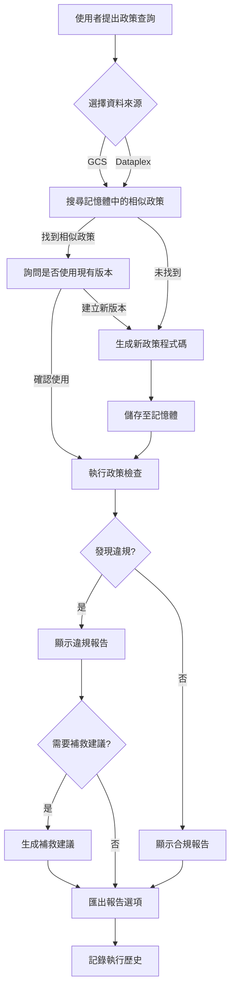

## 專案程式碼架構

```
./policy_as_code_agent/
├── README.md                       # 專案架構說明文件
├── __init__.py                     # Python 套件初始化檔案
├── agent.py                        # 核心 Agent 實作，包含政策驗證、補救措施、Dataplex 整合等主要邏輯
├── app_utils                       # 應用程式工具模組
│   ├── telemetry.py                # OpenTelemetry 遙測設定，將日誌上傳至 GCS
│   └── typing.py                   # 共用型別定義，包含 Request 和 Feedback 資料模型
├── config.py                       # 集中管理環境變數與設定參數（GCP 專案、Firestore、LLM 模型等）
├── fast_api_app.py                 # FastAPI 應用程式進入點，整合 ADK、Cloud SQL、遙測功能
├── mcp.py                          # Model Context Protocol (MCP) 工具集，連接 Dataplex MCP Server
├── memory.py                       # Firestore 記憶體管理，包含政策儲存、向量搜尋、執行歷史記錄等功能
├── prompts                         # LLM 提示詞模板目錄
│   ├── code_generation.md          # 政策程式碼生成的提示詞範本
│   ├── instructions.md             # Agent 指令說明的提示詞範本
│   └── remediation.md              # 政策補救措施的提示詞範本
├── simulation.py                   # 政策程式碼安全驗證與模擬執行，包含 AST 分析和安全檢查
└── utils                           # 共用工具函式模組
    ├── __init__.py                 # 工具模組初始化檔案
    ├── dataplex.py                 # Dataplex 資料轉換工具（Proto 轉 Dict、Entry 處理等）
    ├── gcs.py                      # Google Cloud Storage 操作工具（載入 metadata、schema 檔案等）
    ├── json_tools.py               # JSON 資料遍歷與處理工具
    └── llm.py                      # LLM 相關工具（生成政策程式碼、JSON Schema 解析等）
```

## 實作步驟流程

### 階段一：專案初始化與環境設定

#### 步驟 1：建立專案結構
建立基本的目錄結構，包含以下檔案：
- `policy_as_code_agent/` 主目錄
- `app_utils/`、`prompts/`、`utils/` 子目錄
- 各模組的 `__init__.py` 檔案

#### 步驟 2：設定配置管理 (`config.py`)
1. 定義 Google Cloud 專案相關環境變數：
   - `PROJECT_ID`：GCP 專案 ID
   - `LOCATION`：服務部署區域（預設 us-central1）
2. 配置 Firestore 記憶體功能：
   - `ENABLE_MEMORY_BANK`：啟用/停用記憶體功能
   - `FIRESTORE_DATABASE`：Firestore 資料庫名稱
   - `FIRESTORE_COLLECTION_POLICIES`：政策集合名稱
   - `FIRESTORE_COLLECTION_EXECUTIONS`：執行歷史集合名稱
   - `EMBEDDING_MODEL_NAME`：向量嵌入模型（text-embedding-004）
3. 設定 LLM 模型配置：
   - `GEMINI_MODEL_PRO`：主要模型（gemini-2.5-pro）
   - `GEMINI_MODEL_FLASH`：快速模型（gemini-2.5-flash）
4. 定義提示詞檔案路徑和 MCP Server URL
5. 設定預設核心政策列表

#### 步驟 3：建立共用型別定義 (`app_utils/typing.py`)
1. 定義 `Request` 資料模型：
   - 包含 message、events、user_id、session_id 欄位
   - 使用 Pydantic BaseModel 進行驗證
2. 定義 `Feedback` 資料模型：
   - 包含評分、回饋文字、日誌類型等欄位

### 階段二：核心工具函式實作

#### 步驟 4：實作 GCS 工具 (`utils/gcs.py`)
1. 建立 `load_metadata` 函式：
   - 從 GCS URI 載入 metadata 檔案
   - 處理 JSONL 格式資料
   - 錯誤處理（檔案不存在、解析失敗等）
2. 建立 `get_content_from_gcs_for_schema` 函式：
   - 支援單檔案或目錄讀取
   - 自動選擇第一個可用檔案（目錄情況）
   - 返回檔案內容供 schema 生成使用

#### 步驟 5：實作 Dataplex 工具 (`utils/dataplex.py`)
1. 建立 `get_project_id` 函式：
   - 從環境變數或 gcloud 配置獲取專案 ID
2. 建立 `convert_proto_to_dict` 函式：
   - 遞迴轉換 Protobuf 物件為 Python 字典
3. 建立 `entry_to_dict` 函式：
   - 將 Dataplex Entry 物件轉換為模擬邏輯可用的字典格式
   - 處理 entry name、type、aspects 等屬性

#### 步驟 6：實作 JSON 處理工具 (`utils/json_tools.py`)
1. 建立 `traverse` 函式：
   - 遞迴遍歷 JSON 物件
   - 提取樣本值供程式碼生成參考
   - 處理嵌套字典和列表結構

#### 步驟 7：實作 LLM 工具 (`utils/llm.py`)
1. 建立 `generate_sample_values_str` 函式：
   - 從 metadata 樣本生成值字串
   - 選擇最具代表性的項目（最大的 JSON 物件）
2. 建立 `get_json_schema_from_content` 函式：
   - 讀取 JSON/JSONL 內容
   - 生成 schema 表示所有物件結構
   - 合併多個 schema
3. 建立 `llm_generate_policy_code` 函式：
   - 使用 Gemini 模型生成政策檢查程式碼
   - 載入 `code_generation.md` 提示詞範本
   - 傳入 schema 和樣本值供參考
   - 返回可執行的 Python 函式

### 階段三：記憶體管理系統

#### 步驟 8：建立 Firestore 記憶體 (`memory.py`)
1. **初始化 Firestore 客戶端**：
   - 根據 `ENABLE_MEMORY_BANK` 決定是否啟用
   - 連接指定的 Firestore 資料庫
2. **建立向量嵌入功能**：
   - `_get_embedding` 函式使用 Vertex AI Text Embedding 模型
   - 將政策查詢轉換為向量進行相似度搜尋
3. **政策儲存功能**：
   - `save_policy_to_memory`：儲存新政策或建立新版本
   - 自動生成 UUID 或使用現有 policy_id
   - 儲存元資料：query、source、author、code、embedding 等
4. **政策檢索功能**：
   - `find_policy_in_memory`：使用向量搜尋找相似政策
   - 支援篩選條件：source、author、日期範圍
   - `get_policy_by_id`：根據 ID 和版本取得特定政策
   - `list_policy_versions`：列出政策的所有版本
5. **執行歷史記錄**：
   - `log_policy_execution`：記錄每次政策執行結果
   - 儲存狀態、違規資源、執行時間等
   - `get_execution_history`：查詢歷史記錄
   - `analyze_execution_history`：分析歷史趨勢與模式
6. **核心政策管理**：
   - `get_active_core_policies`：取得當前核心政策列表
   - `save_core_policies`：批次儲存核心政策
   - `add_core_policy`：新增單一政策
   - `remove_core_policy`：移除單一政策
7. **記憶體維護功能**：
   - `prune_memory`：清理舊政策
   - `rate_policy`：為政策評分以改善推薦品質

### 階段四：安全執行與模擬

#### 步驟 9：建立安全模擬環境 (`simulation.py`)
1. **程式碼安全分析 `validate_code_safety`**：
   - 使用 Python AST 解析生成的程式碼
   - 檢查不安全的模組匯入（os、sys、subprocess 等）
   - 檢查危險函式呼叫（eval、exec、open 等）
   - 返回安全違規列表
2. **政策模擬執行 `run_simulation`**：
   - 執行安全檢查
   - 建立受限執行環境（safe_globals）
   - 僅允許安全的內建函式和模組（json、re、datetime）
   - 執行生成的 `check_policy` 函式
   - 捕獲並報告執行錯誤
   - 返回違規項目列表

### 階段五：MCP 整合

#### 步驟 10：實作 MCP 工具集 (`mcp.py`)
1. **建立安全 MCP 包裝器 `SafeMCPToolset`**：
   - 繼承 `McpToolset`
   - 覆寫 `get_tools` 方法
   - 捕獲連線錯誤，確保 server 故障時 agent 仍可運作
2. **建立 Dataplex MCP 連接 `_get_dataplex_mcp_toolset`**：
   - 檢查 `DATAPLEX_MCP_SERVER_URL` 環境變數
   - 使用 ID Token 認證（優先使用 gcloud，備用 ADC）
   - 建立 SSE 連線參數
   - 返回 `SafeMCPToolset` 實例

### 階段六：Agent 核心邏輯

#### 步驟 11：實作 Agent 主要功能 (`agent.py`)
1. **初始化 Vertex AI**：
   - 設定專案 ID 和區域
2. **從 GCS 生成政策程式碼 `generate_policy_code_from_gcs`**：
   - 從 GCS 載入 schema 檔案
   - 解析內容生成 JSON schema
   - 呼叫 LLM 生成 Python 政策程式碼
3. **從 Dataplex 生成政策程式碼 `generate_policy_code_from_dataplex`**：
   - 執行 Dataplex 搜尋查詢
   - 轉換搜尋結果為字典格式
   - 生成 schema 並呼叫 LLM
4. **執行政策模擬**：
   - `run_policy_from_gcs`：對 GCS 檔案執行政策檢查
   - `run_policy_on_dataplex`：對 Dataplex 搜尋結果執行檢查
   - 記錄執行結果到 Firestore
   - 格式化違規報告
5. **補救建議 `suggest_remediation`**：
   - 使用 LLM 針對違規項目生成修復建議
   - 支援平行處理多個違規項目
   - 載入 `remediation.md` 提示詞範本
6. **合規性評分卡 `generate_compliance_scorecard`**：
   - 取得核心政策列表
   - 平行執行所有核心政策
   - 生成整體合規性報告
7. **報告匯出 `export_report`**：
   - 支援 CSV 和 HTML 格式
   - 可上傳至 GCS bucket
   - 本地儲存選項
8. **建立 Agent 實例**：
   - 載入 `instructions.md` 提示詞
   - 註冊所有工具函式（記憶體、生成、執行、分析等）
   - 加入 MCP toolset（如可用）
   - 配置 `auto_save_session_to_memory_callback`
   - 使用 `GEMINI_MODEL_FLASH` 作為預設模型

### 階段七：遙測與監控

#### 步驟 12：設定 OpenTelemetry (`app_utils/telemetry.py`)
1. 建立 `setup_telemetry` 函式：
   - 檢查 `LOGS_BUCKET_NAME` 環境變數
   - 配置 GenAI 遙測設定
   - 設定僅記錄 metadata（NO_CONTENT 模式）
   - 指定上傳格式為 JSONL
   - 設定 GCS 上傳路徑
   - 記錄服務版本和 commit SHA

### 階段八：FastAPI 應用程式

#### 步驟 13：建立 FastAPI 應用 (`fast_api_app.py`)
1. **初始化遙測**：
   - 呼叫 `setup_telemetry()`
2. **設定日誌**：
   - 使用 Google Cloud Logging
3. **配置 Cloud SQL**：
   - 從環境變數讀取資料庫連線資訊
   - 建立 session_service_uri（PostgreSQL + asyncpg）
   - URL 編碼特殊字元以避免解析錯誤
   - 使用 Unix socket 連接 Cloud SQL
4. **建立 FastAPI 應用**：
   - 使用 ADK 的 `get_fast_api_app` 函式
   - 傳入 agents_dir、artifact_service_uri、session_service_uri
   - 啟用 web UI 和 CORS
   - 啟用 OpenTelemetry 到 Cloud 整合
5. **新增自訂端點**：
   - `/feedback`：收集使用者回饋並記錄到 Cloud Logging
6. **啟動伺服器**：
   - 使用 uvicorn 在 0.0.0.0:8000 執行

### 階段九：提示詞工程

#### 步驟 14：撰寫提示詞範本 (`prompts/`)
1. **instructions.md**：
   - 定義 Agent 的主要工作流程
   - 說明如何使用記憶體功能
   - 描述 GCS 和 Dataplex 兩種資料來源
   - 指導如何處理政策版本
   - 說明合規性評分卡流程
   - 定義報告格式與匯出選項
2. **code_generation.md**：
   - 提供 LLM 生成政策程式碼的指引
   - 包含 schema 和樣本值範例
   - 定義 `check_policy` 函式規格
   - 說明錯誤處理方式
3. **remediation.md**：
   - 指導 LLM 生成補救建議
   - 提供違規項目分析模式
   - 定義修復步驟格式

### 階段十：測試與部署

#### 步驟 15：整合測試
1. 測試 GCS 政策生成與執行
2. 測試 Dataplex 整合
3. 測試記憶體功能（儲存、檢索、版本控制）
4. 測試安全性檢查
5. 測試補救建議生成
6. 測試合規性評分卡

#### 步驟 16：部署至 Cloud Run
1. 設定 Dockerfile
2. 配置環境變數
3. 建立 Firestore 資料庫和索引
4. 設定 Cloud SQL（如需 session 管理）
5. 部署 MCP Server
6. 部署 Agent 服務
7. 驗證遙測與日誌

## 工作流程概覽



## 核心技術說明

### [`memory.py`](../policy_as_code_agent/memory.py) 程式碼分析

#### 使用的主要服務

1. **Firestore** - Google Cloud 的 NoSQL 文件資料庫
2. **Vertex AI** - Google Cloud 的機器學習平台（文字嵌入模型）

#### 服務函數對應表

| 服務                      | 函數名稱                      | 功能分類     | 詳細說明                                                                        |
| ------------------------- | ----------------------------- | ------------ | ------------------------------------------------------------------------------- |
| **Vertex AI**             | `_get_embedding()`            | 向量嵌入     | 使用 Vertex AI 的 TextEmbeddingModel 為文字生成向量嵌入，用於語義搜尋           |
| **Firestore**             | `get_active_core_policies()`  | 核心策略管理 | 從 Firestore 檢索已配置的核心策略列表，若未設定則返回預設值                     |
| **Firestore**             | `save_core_policies()`        | 核心策略管理 | 在 Firestore 中儲存或覆寫核心策略列表                                           |
| **Firestore**             | `add_core_policy()`           | 核心策略管理 | 使用 ArrayUnion 將單一策略新增至核心策略列表（避免重複）                        |
| **Firestore**             | `remove_core_policy()`        | 核心策略管理 | 使用 ArrayRemove 從核心策略列表中移除指定策略                                   |
| **Firestore + Vertex AI** | `find_policy_in_memory()`     | 策略搜尋     | 使用向量搜尋（餘弦距離）在 Firestore 中尋找相似策略，支援按來源、作者、日期篩選 |
| **Firestore + Vertex AI** | `save_policy_to_memory()`     | 策略儲存     | 將新策略或現有策略的新版本儲存到 Firestore，包含嵌入向量和版本控制              |
| **Firestore**             | `list_policy_versions()`      | 策略版本管理 | 列出給定策略 ID 的所有可用版本，按版本號降序排序                                |
| **Firestore**             | `get_policy_by_id()`          | 策略檢索     | 依 ID 和版本號檢索特定策略，並更新 last_used 時間戳記                           |
| **Firestore**             | `prune_memory()`              | 記憶體維護   | 批次刪除在指定天數內未使用的舊策略（預設 30 天）                                |
| **Firestore**             | `rate_policy()`               | 策略評分     | 對策略進行 1-5 分評分並新增文字回饋，使用 ArrayUnion 原子更新                   |
| **Firestore**             | `log_policy_execution()`      | 執行記錄     | 記錄策略執行結果到 `policy_executions` 集合，並更新策略文件的匯總統計           |
| **Firestore**             | `get_execution_history()`     | 歷史查詢     | 檢索過去 N 天的執行歷史，支援按狀態和策略 ID 篩選                               |
| **Firestore**             | `analyze_execution_history()` | 進階分析     | 執行多種分析：摘要統計、違規排行、資源搜尋、最常違規資源                        |
| **輔助函數**              | `_policy_to_dict()`           | 資料轉換     | 將 Firestore 文件轉換為字典，處理時間戳記序列化並移除嵌入向量                   |

#### 資料集合結構

| 集合名稱                          | 用途         | 主要欄位                                                                      |
| --------------------------------- | ------------ | ----------------------------------------------------------------------------- |
| `FIRESTORE_COLLECTION_POLICIES`   | 儲存策略     | policy_id, version, query, embedding, code, source, author, ratings, feedback |
| `FIRESTORE_COLLECTION_EXECUTIONS` | 執行記錄     | policy_id, version, timestamp, status, violation_count, violated_resources    |
| 核心策略文件                      | 核心策略清單 | policies (陣列), updated_at                                                   |

#### 關鍵技術特點

1. **向量搜尋**: 使用 Firestore 的 `find_nearest()` 進行語義相似度搜尋（餘弦距離）
2. **版本控制**: 每個策略可有多個版本，使用 policy_id + version 組合鍵
3. **原子操作**: 使用 Firestore 的 ArrayUnion、ArrayRemove、Increment 確保並發安全
4. **批次處理**: 在 prune_memory 中每 400 筆提交一次批次，避免超過 Firestore 限制
5. **後篩選策略**: 為避免複雜索引需求，先執行向量搜尋後在 Python 中進行二次篩選
6. **時區處理**: 使用 UTC 時區感知的 datetime 物件以符合 Firestore 時間戳記

---
### [`telemetry.py`](../policy_as_code_agent/app_utils/telemetry.py) 程式碼分析

#### 🎯 核心概念：環境變數的魔力

`setup_telemetry()` 函數之所以能"神奇地"完成遙測設定，是因為它利用了一個重要的軟體開發模式：**通過設定環境變數來控制第三方套件的行為**。

#### 📚 運作原理

1. **OpenTelemetry 的自動化機制**
OpenTelemetry（簡稱 OTEL）是一個遙測框架，它會在程式啟動時：
   - 自動檢查特定的環境變數（例如 `OTEL_INSTRUMENTATION_GENAI_CAPTURE_MESSAGE_CONTENT`）
   - 根據這些環境變數的值，自動啟用或配置遙測功能
   - **不需要你手動呼叫其他函數！**

2. **setup_telemetry() 做了什麼？**

```python
def setup_telemetry():
    bucket = os.environ.get("LOGS_BUCKET_NAME")  # ① 檢查你有沒有設定儲存桶

    if bucket and capture_content != "false":    # ② 如果有設定
        # ③ 設定一系列「魔法開關」（環境變數）
        os.environ["OTEL_INSTRUMENTATION_GENAI_CAPTURE_MESSAGE_CONTENT"] = "NO_CONTENT"
        os.environ["OTEL_INSTRUMENTATION_GENAI_UPLOAD_FORMAT"] = "jsonl"
        os.environ["OTEL_INSTRUMENTATION_GENAI_COMPLETION_HOOK"] = "upload"
        # ... 等等

        # ④ OpenTelemetry 會自動讀取這些設定並啟動！
```

**關鍵點**：你不需要直接呼叫 OpenTelemetry 的初始化函數，因為：
1. OpenTelemetry 套件已經在你的專案中被安裝
2. 當你的 Python 程式執行時，OpenTelemetry 會自動啟動
3. 它會尋找這些特定的環境變數
4. 根據環境變數的值自動配置自己

#### 🔍 詳細說明各個環境變數的作用

| 環境變數                                             | 作用                     | 初學者解釋                                         |
| ---------------------------------------------------- | ------------------------ | -------------------------------------------------- |
| `OTEL_INSTRUMENTATION_GENAI_CAPTURE_MESSAGE_CONTENT` | 控制是否記錄 AI 對話內容 | 設為 "NO_CONTENT" = 只記錄中繼資料，不記錄敏感對話 |
| `OTEL_INSTRUMENTATION_GENAI_UPLOAD_FORMAT`           | 設定上傳格式             | "jsonl" = 每行一個 JSON，方便後續分析              |
| `OTEL_INSTRUMENTATION_GENAI_COMPLETION_HOOK`         | 設定完成後的動作         | "upload" = 自動上傳到 GCS                          |
| `OTEL_SEMCONV_STABILITY_OPT_IN`                      | 選擇遙測標準版本         | 使用最新的 GenAI 語意慣例                          |
| `OTEL_RESOURCE_ATTRIBUTES`                           | 設定資源標籤             | 標記服務名稱和版本，方便追蹤                       |
| `OTEL_INSTRUMENTATION_GENAI_UPLOAD_BASE_PATH`        | 設定上傳位置             | 告訴系統要把資料存到哪個 GCS 路徑                  |

#### 📖 參考資源

1. [**OpenTelemetry Python 官方文件**](https://opentelemetry.io/docs/languages/python/) - OpenTelemetry 的核心概念和使用方式
2. [**OpenTelemetry 環境變數配置**](https://opentelemetry.io/docs/specs/otel/configuration/sdk-environment-variables/) - 所有可用的環境變數及其作用
3. [**GenAI Instrumentation 套件 (GitHub)**](https://github.com/GoogleCloudPlatform/opentelemetry-operations-python) - Google Cloud 的 GenAI 遙測擴充套件
4. [**Google Cloud Storage (GCS) 文件**](https://cloud.google.com/storage/docs) - 了解日誌資料儲存的目的地
5. [**Cloud Trace 文件**](https://cloud.google.com/trace/docs) - 追蹤和分析應用程式效能
6. [**Python 環境變數教學**](https://docs.python.org/3/library/os.html#os.environ) - 了解如何使用 `os.environ`
7. [**OpenTelemetry 概念指南**](https://opentelemetry.io/docs/concepts/) - 了解遙測、追蹤、指標的基本概念
8. [**OpenTelemetry 自動檢測**](https://opentelemetry.io/docs/languages/python/automatic/) - 了解自動檢測如何運作