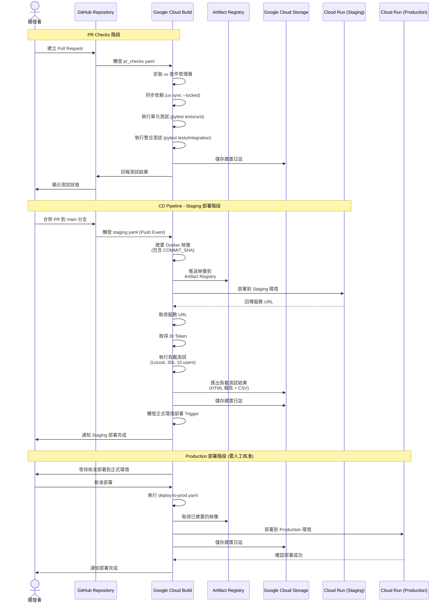

# CI/CD 流程文件

本文件描述 Policy as Code Agent 專案的完整 CI/CD 流程，包含開發、測試、部署到 Staging 環境以及正式環境的完整流程。

## CI/CD 架構概述

本專案使用 Google Cloud Build 作為 CI/CD 平台，透過 Terraform 管理基礎設施，並設定三個主要的建置觸發器：

1. **PR Checks Trigger** - 在 Pull Request 建立時執行
2. **CD Pipeline Trigger** - 在合併到 main 分支時執行
3. **Deploy to Production Trigger** - 手動核准後部署到正式環境

## 完整 CI/CD 流程圖



## 詳細流程說明

### 1. PR Checks 階段 (pr_checks.yaml)

**觸發條件：** 對 `main` 分支建立 Pull Request

**執行步驟：**

1. **安裝依賴**
   - 使用 Python 3.12-slim 映像
   - 安裝 uv 0.8.13 套件管理器
   - 執行 `uv sync --locked` 鎖定依賴版本

2. **單元測試**
   - 執行 `pytest tests/unit`
   - 驗證程式功能正確性

3. **整合測試**
   - 執行 `pytest tests/integration`
   - 驗證系統整體運作

4. **日誌儲存**
   - 儲存到 GCS: `gs://${PROJECT_ID}-pack-policy-as-code-logs/build-logs`

**監控檔案：**
```
policy_as_code_agent/**
data_ingestion/**
tests/**
deployment/**
uv.lock
```

### 2. Staging 部署階段 (staging.yaml)

**觸發條件：** Push 到 `main` 分支 (通常是 PR 合併後)

**執行步驟：**

1. **建置與推送映像**
   ```bash
   docker build -t ${REGION}-docker.pkg.dev/${PROJECT_ID}/${ARTIFACT_REGISTRY_REPO}/${CONTAINER_NAME} \
     --build-arg COMMIT_SHA=${COMMIT_SHA} .
   docker push ${REGION}-docker.pkg.dev/${PROJECT_ID}/${ARTIFACT_REGISTRY_REPO}/${CONTAINER_NAME}
   ```

2. **部署到 Staging**
   ```bash
   gcloud run deploy pack-policy-as-code \
     --image ${REGION}-docker.pkg.dev/${PROJECT_ID}/${ARTIFACT_REGISTRY_REPO}/${CONTAINER_NAME} \
     --region ${REGION} \
     --project ${STAGING_PROJECT_ID}
   ```

3. **取得服務資訊**
   - 取得 Cloud Run 服務 URL
   - 取得身分驗證 ID Token

4. **負載測試**
   ```bash
   locust -f tests/load_test/load_test.py \
     --headless \
     -H ${STAGING_URL} \
     -t 30s -u 10 -r 0.5 \
     --csv=tests/load_test/.results/results \
     --html=tests/load_test/.results/report.html
   ```

5. **匯出測試結果**
   - 將測試結果上傳到 GCS
   - 產生時間戳記資料夾
   - 路徑: `gs://${LOGS_BUCKET_NAME_STAGING}/load-test-results/results-${TIMESTAMP}`

6. **觸發正式部署**
   ```bash
   gcloud beta builds triggers run deploy-pack-policy-as-code \
     --region ${LOCATION} \
     --project ${PROJECT_ID} \
     --sha ${COMMIT_SHA}
   ```

### 3. Production 部署階段 (deploy-to-prod.yaml)

**觸發條件：**
- 從 Staging 階段觸發
- **需要人工核准** (approval_required: true)

**執行步驟：**

1. **等待核准**
   - Cloud Build 會等待授權人員核准
   - 可在 Cloud Build Console 查看與核准

2. **部署到正式環境**
   ```bash
   gcloud run deploy pack-policy-as-code \
     --image ${REGION}-docker.pkg.dev/${PROJECT_ID}/${ARTIFACT_REGISTRY_REPO}/${CONTAINER_NAME} \
     --region ${REGION} \
     --project ${PROD_PROJECT_ID}
   ```

3. **日誌儲存**
   - 儲存到 GCS: `gs://${PROJECT_ID}-pack-policy-as-code-logs/build-logs`

## Terraform 觸發器配置

### PR Checks Trigger
```terraform
resource "google_cloudbuild_trigger" "pr_checks" {
  name     = "pr-${var.project_name}"
  filename = ".cloudbuild/pr_checks.yaml"

  repository_event_config {
    pull_request {
      branch = "main"
    }
  }
}
```

### CD Pipeline Trigger
```terraform
resource "google_cloudbuild_trigger" "cd_pipeline" {
  name     = "cd-${var.project_name}"
  filename = ".cloudbuild/staging.yaml"

  repository_event_config {
    push {
      branch = "main"
    }
  }
}
```

### Production Deployment Trigger
```terraform
resource "google_cloudbuild_trigger" "deploy_to_prod_pipeline" {
  name     = "deploy-${var.project_name}"
  filename = ".cloudbuild/deploy-to-prod.yaml"

  approval_config {
    approval_required = true
  }
}
```

## Docker 映像建置

Dockerfile 配置重點：

```dockerfile
FROM python:3.11-slim
RUN pip install --no-cache-dir uv==0.8.13
WORKDIR /code

# 複製依賴檔案
COPY ./pyproject.toml ./README.md ./uv.lock* ./
COPY ./policy_as_code_agent ./policy_as_code_agent

# 安裝依賴
RUN uv sync --frozen

# 設定環境變數
ARG COMMIT_SHA=""
ENV COMMIT_SHA=${COMMIT_SHA}
ARG AGENT_VERSION=0.0.0
ENV AGENT_VERSION=${AGENT_VERSION}

# 啟動服務
EXPOSE 8080
CMD ["uv", "run", "uvicorn", "policy_as_code_agent.fast_api_app:app", "--host", "0.0.0.0", "--port", "8080"]
```

## Makefile 快速指令

### 本地開發

```bash
# 安裝依賴
make install

# 啟動 Playground
make playground

# 啟動本地後端服務 (熱重載)
make local-backend
```

### 測試

```bash
# 執行所有測試 (單元 + 整合)
make test

# 程式碼品質檢查
make lint
```

### 部署

```bash
# 部署到 Cloud Run
make deploy

# 部署並啟用 IAP
make deploy IAP=true

# 設定開發環境基礎設施
make setup-dev-env
```

## 環境變數與替換參數

### Staging 環境
- `_STAGING_PROJECT_ID`: Staging 專案 ID
- `_REGION`: 部署區域 (預設: us-central1)
- `_CONTAINER_NAME`: 容器名稱
- `_ARTIFACT_REGISTRY_REPO_NAME`: Artifact Registry 儲存庫名稱
- `_LOGS_BUCKET_NAME_STAGING`: Staging 日誌儲存桶名稱
- `_APP_SERVICE_ACCOUNT_STAGING`: Staging 服務帳號

### Production 環境
- `_PROD_PROJECT_ID`: Production 專案 ID
- `_LOGS_BUCKET_NAME_PROD`: Production 日誌儲存桶名稱
- `_APP_SERVICE_ACCOUNT_PROD`: Production 服務帳號

## 監控與日誌

### 建置日誌位置
- GCS 路徑: `gs://${PROJECT_ID}-pack-policy-as-code-logs/build-logs`
- 日誌類型: REGIONAL_USER_OWNED_BUCKET

### 負載測試結果
- GCS 路徑: `gs://${LOGS_BUCKET_NAME_STAGING}/load-test-results/results-${TIMESTAMP}`
- 包含檔案:
  - HTML 報告 (report.html)
  - CSV 結果資料
- Console 連結: https://console.cloud.google.com/storage/browser/${LOGS_BUCKET_NAME_STAGING}/load-test-results/

### Cloud Build Console
- 查看建置進度: https://console.cloud.google.com/cloud-build/builds;region=${LOCATION}

## 安全性設定

1. **服務帳號**
   - CI/CD Runner Service Account
   - App Service Account (Staging & Production)

2. **IAM 權限**
   - Cloud Build 服務帳號權限
   - Cloud Run 部署權限
   - Artifact Registry 存取權限
   - GCS 讀寫權限

3. **認證**
   - Cloud Run 預設不允許未認證存取 (--no-allow-unauthenticated)
   - 可選啟用 IAP (Identity-Aware Proxy)
   - 負載測試使用 ID Token 進行認證

## 最佳實踐

1. **版本控制**
   - 使用 `COMMIT_SHA` 追蹤部署版本
   - 使用 `AGENT_VERSION` 標記代理版本

2. **依賴管理**
   - 使用 `uv.lock` 鎖定依賴版本
   - 確保環境一致性

3. **測試策略**
   - PR 階段執行單元與整合測試
   - Staging 階段執行負載測試
   - 確保品質門檻

4. **部署策略**
   - 先部署到 Staging 環境
   - 執行負載測試驗證
   - 人工核准後部署到 Production
   - 實現安全的漸進式部署

5. **日誌與監控**
   - 所有建置日誌儲存到 GCS
   - 負載測試結果保留歷史記錄
   - 便於問題追蹤與分析

## 故障排除

### 建置失敗
- 檢查 Cloud Build 日誌
- 驗證環境變數設定
- 確認服務帳號權限

### 部署失敗
- 檢查 Cloud Run 服務狀態
- 驗證映像檔是否成功推送
- 確認網路與 IAM 設定

### 測試失敗
- 查看詳細測試輸出
- 檢查服務 URL 是否正確
- 驗證 ID Token 是否有效

## 相關資源

- [Agent Starter Pack 部署指南](https://googlecloudplatform.github.io/agent-starter-pack/guide/deployment.html)
- [Google Cloud Build 文件](https://cloud.google.com/build/docs)
- [Cloud Run 部署文件](https://cloud.google.com/run/docs/deploying)
- [Terraform Google Provider](https://registry.terraform.io/providers/hashicorp/google/latest/docs)
