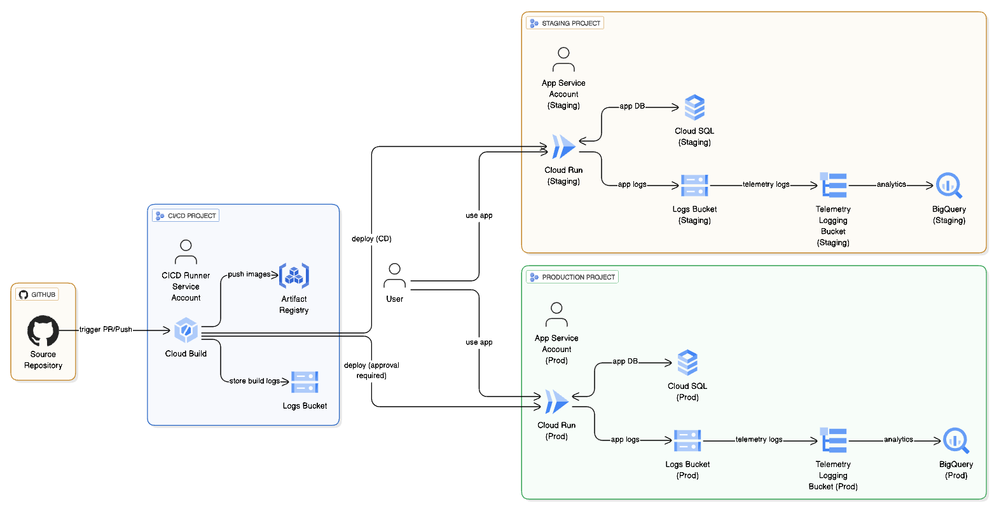

# 部署 (Deployment)

此目錄包含用於為您的 Agent 配置必要 Google Cloud 基礎架構的 Terraform 設定。

### 建議部署方式

部署基礎架構並設置 CI/CD 流水的推薦方式是在專案根目錄執行 `agent-starter-pack setup-cicd` 命令。

### 指令執行流程

根據不同部署環境，以下為各環境的 Makefile 指令執行流程：

#### 1️⃣ Development 環境（本地開發）

**環境初始化**

```bash
# 安裝專案相依性
make install

# 設定開發環境基礎設施（Cloud Run, Cloud SQL, BigQuery 等）
make setup-dev-env
```

**本地開發與測試**

```bash
# 啟動 Agent Playground（Web UI 互動介面）
make playground

# 啟動本地後端服務（具熱重載功能）
make local-backend

# 啟動 Debug 模式的 Playground（支援 debugpy，監聽 5678 埠）
make debug-playground [PORT=8501]

# 啟動 Debug 模式的後端服務
make debug-backend [PORT=8000]

# 執行單元與整合測試
make test

# 執行程式碼品質檢查（codespell, ruff, mypy）
make lint
```

**本地 Docker 測試**

```bash
# 建置 Docker 映像
make docker-build [TAG=custom-tag]

# 本地測試容器
make docker-run [PORT=8080] [TAG=image-tag]

# 清理容器與映像
make docker-clean
```

**檢視基礎設施變更計劃**

```bash
# 檢視 Terraform 變更計劃（不實際執行）
make terraform-plan-dev
```

**銷毀開發環境**

```bash
# 銷毀所有開發環境資源（需確認）
make destroy-dev-env
```

---

#### 2️⃣ Staging 環境（預發布/整合測試）

**前置作業（僅需執行一次）**

```bash
# 設定正式環境基礎設施（包含 CI/CD、Staging、Production）
make setup-prod-env
```

**Artifact Registry 設定**

```bash
# 建立 Docker 儲存庫
make create-artifact-repo [REGION=us-central1] [REPO_NAME=pack-policy-as-code-repo]

# 設定 Docker 認證
make docker-auth [REGION=us-central1]

# 列出現有映像
make list-artifact-images
```

**手動部署至 Staging**

```bash
# 建置並推送 Docker 映像至 Artifact Registry
make docker-publish

# 部署至 Cloud Run（Staging 環境）
make deploy [IAP=true] [PORT=8080]
```

**自動化部署流程**

- 當 PR 合併至 `main` 分支時，Cloud Build 觸發器 `cd-pipeline` 會自動：
  1. 建置 Docker 映像
  2. 推送至 Artifact Registry
  3. 部署至 Staging 環境的 Cloud Run
  4. 驗證部署狀態

---

#### 3️⃣ Production 環境（正式生產）

**手動部署至 Production**

```bash
# 建置並推送 Docker 映像
make docker-publish

# 部署至 Cloud Run（Production 環境）
make deploy [IAP=true] [PORT=8080]
```

**生產環境部署流程**

- 部署至 Production 需**手動觸發** Cloud Build 觸發器 `deploy-to-prod`
- 觸發器會執行：
  1. 使用最新的 Docker 映像（或指定版本）
  2. 部署至 Production Cloud Run 服務
  3. 執行健康檢查
  4. 記錄部署遙測資料

**檢視基礎設施變更計劃**

```bash
# 檢視 Terraform 變更計劃（Staging + Production）
make terraform-plan-prod
```

**銷毀正式環境（危險操作）**

```bash
# 銷毀 CI/CD、Staging、Production 所有資源（需輸入專案 ID 確認）
make destroy-prod-env
```

---

#### 4️⃣ CI/CD Runner 環境（自動化流水線）

參考連結：

- [Agent Starter Pack 部署指南 - CI/CD](https://googlecloudplatform.github.io/agent-starter-pack/guide/deployment.html#cicd)
- [CLI Commands - setup-cicd](https://googlecloudplatform.github.io/agent-starter-pack/cli/setup_cicd.html)

**Cloud Build 自動觸發器**

CI/CD Runner 環境中配置了三個主要 Cloud Build 觸發器：

1. **`pr-checks`** - Pull Request 檢查

   - **觸發條件**: 當有 PR 建立或更新時
   - **執行內容**:
     ```bash
     make lint    # 程式碼品質檢查
     make test    # 執行測試
     ```

2. **`cd-pipeline`** - 持續部署至 Staging

   - **觸發條件**: `main` 分支有新的 commit
   - **執行內容**:
     ```bash
     make docker-build          # 建置映像
     make docker-push           # 推送至 Artifact Registry
     make deploy                # 部署至 Staging Cloud Run
     ```

3. **`deploy-to-prod`** - 部署至 Production
   - **觸發條件**: 手動觸發
   - **執行內容**:
     ```bash
     make docker-publish        # 建置並推送映像
     make deploy                # 部署至 Production Cloud Run
     ```

**手動觸發 Production 部署**

```bash
# 透過 gcloud CLI 手動觸發
gcloud builds triggers run deploy-to-prod \
  --branch=main \
  --project=<cicd_runner_project_id>
```

---

### 常用指令速查表

| 指令                    | 環境     | 用途                     |
| ----------------------- | -------- | ------------------------ |
| `make install`          | Local    | 安裝專案相依性           |
| `make playground`       | Local    | 啟動 Agent Playground    |
| `make test`             | Local/CI | 執行測試                 |
| `make lint`             | Local/CI | 程式碼品質檢查           |
| `make docker-build`     | Local/CI | 建置 Docker 映像         |
| `make docker-publish`   | Local/CI | 建置並推送映像           |
| `make deploy`           | All      | 部署至 Cloud Run         |
| `make setup-dev-env`    | Dev      | 設定開發環境基礎設施     |
| `make setup-prod-env`   | Prod/Stg | 設定正式環境基礎設施     |
| `make terraform-plan-*` | Dev/Prod | 檢視 Terraform 變更計劃  |
| `make destroy-*-env`    | Dev/Prod | 銷毀環境資源（危險操作） |

### 手動部署

如果您偏好動手操作，隨時可以手動套用 Terraform 設定進行 DIY 設置。

### 部署重點說明：

- **Terraform**: 用於自動化建立 Google Cloud 資源（如 Vertex AI、Cloud SQL、Cloud Storage 等）。
- **CI/CD**: 確保程式碼變更能自動測試並部署到雲端環境。

## 服務架構圖



## 部署環境分類

本專案支援三種部署環境，每個環境具有獨立的 Google Cloud Project 和資源配置：

| 環境             | Project 變數             | 配置位置              | 用途                                       |
| ---------------- | ------------------------ | --------------------- | ------------------------------------------ |
| **Development**  | `dev_project_id`         | `terraform/dev/`      | 開發環境，供開發者本地測試和快速迭代使用   |
| **Staging**      | `staging_project_id`     | `terraform/` (根目錄) | 預發布環境，用於整合測試和 QA 驗證         |
| **Production**   | `prod_project_id`        | `terraform/` (根目錄) | 正式生產環境，服務實際用戶                 |
| **CI/CD Runner** | `cicd_runner_project_id` | `terraform/` (根目錄) | CI/CD 流水線執行環境，負責自動化建構和部署 |

## Google Cloud 服務部署環境對照表

| 服務類別                                 | 服務名稱          | API / 資源                            | Dev | Staging | Prod | CI/CD | 對應檔案                                                                                                           | 說明                                             |
| ---------------------------------------- | ----------------- | ------------------------------------- | --- | ------- | ---- | ----- | ------------------------------------------------------------------------------------------------------------------ | ------------------------------------------------ |
| **運算 (Compute)**                       | Cloud Run         | `run.googleapis.com`                  | ✅  | ✅      | ✅   | -     | [service.tf](../deployment/terraform/service.tf), [dev/service.tf](../deployment/terraform/dev/service.tf)         | 容器化應用程式部署平台，運行 Agent 服務          |
| **DevOps/CI-CD**                         | Cloud Build       | `cloudbuild.googleapis.com`           | ✅  | -       | -    | ✅    | [apis.tf](../deployment/terraform/apis.tf), [build_triggers.tf](../deployment/terraform/build_triggers.tf)         | 自動化建構和部署流水線                           |
| **容器 (Containers)**                    | Artifact Registry | Docker Repository                     | -   | -       | -    | ✅    | [storage.tf](../deployment/terraform/storage.tf)                                                                   | Docker 映像檔儲存庫                              |
| **資料庫 (Databases)**                   | Cloud SQL         | `sqladmin.googleapis.com`             | ✅  | ✅      | ✅   | ✅    | [service.tf](../deployment/terraform/service.tf), [dev/service.tf](../deployment/terraform/dev/service.tf)         | PostgreSQL 資料庫，用於 Session 管理和持久化儲存 |
| **安全性 (Security)**                    | Secret Manager    | `secretmanager.googleapis.com`        | ✅  | ✅      | ✅   | -     | [locals.tf](../deployment/terraform/locals.tf), [dev/apis.tf](../deployment/terraform/dev/apis.tf)                 | 安全儲存資料庫密碼和敏感資訊                     |
| **AI/ML**                                | Vertex AI         | `aiplatform.googleapis.com`           | ✅  | ✅      | ✅   | ✅    | [apis.tf](../deployment/terraform/apis.tf), [dev/apis.tf](../deployment/terraform/dev/apis.tf)                     | 提供 LLM 模型和 AI Agent 功能                    |
| **AI/ML**                                | Discovery Engine  | `discoveryengine.googleapis.com`      | ✅  | ✅      | ✅   | ✅    | [apis.tf](../deployment/terraform/apis.tf), [dev/apis.tf](../deployment/terraform/dev/apis.tf)                     | 企業級搜尋和推薦引擎（用於政策文件檢索）         |
| **儲存 (Storage)**                       | Cloud Storage     | Storage Buckets                       | ✅  | ✅      | ✅   | ✅    | [storage.tf](../deployment/terraform/storage.tf), [dev/storage.tf](../deployment/terraform/dev/storage.tf)         | 日誌資料儲存 (logs bucket)                       |
| **資料分析 (Analytics)**                 | BigQuery          | `bigquery.googleapis.com`             | ✅  | ✅      | ✅   | ✅    | [telemetry.tf](../deployment/terraform/telemetry.tf), [dev/telemetry.tf](../deployment/terraform/dev/telemetry.tf) | 遙測資料和 Session 完成記錄資料倉儲              |
| **作業與監控 (Operations & Monitoring)** | Cloud Logging     | `logging.googleapis.com`              | ✅  | ✅      | ✅   | -     | [locals.tf](../deployment/terraform/locals.tf), [dev/apis.tf](../deployment/terraform/dev/apis.tf)                 | 集中式日誌管理                                   |
| **作業與監控 (Operations & Monitoring)** | Cloud Trace       | `cloudtrace.googleapis.com`           | ✅  | ✅      | ✅   | ✅    | [locals.tf](../deployment/terraform/locals.tf), [dev/apis.tf](../deployment/terraform/dev/apis.tf)                 | 分散式追蹤和效能監控                             |
| **作業與監控 (Operations & Monitoring)** | Telemetry         | `telemetry.googleapis.com`            | ✅  | -       | -    | -     | [dev/apis.tf](../deployment/terraform/dev/apis.tf)                                                                 | Agent 運行時遙測資料收集                         |
| **資料分析 (Analytics)**                 | External Tables   | BigQuery External Tables              | ✅  | ✅      | ✅   | -     | [telemetry.tf](../deployment/terraform/telemetry.tf), [dev/telemetry.tf](../deployment/terraform/dev/telemetry.tf) | 從 GCS 讀取遙測日誌並建立 BigQuery 外部表        |
| **身份與存取管理 (IAM & Security)**      | IAM               | `iam.googleapis.com`                  | ✅  | ✅      | ✅   | -     | [iam.tf](../deployment/terraform/iam.tf), [dev/iam.tf](../deployment/terraform/dev/iam.tf)                         | 身份和存取管理                                   |
| **身份與存取管理 (IAM & Security)**      | Service Accounts  | IAM Service Accounts                  | ✅  | ✅      | ✅   | ✅    | [service_accounts.tf](../deployment/terraform/service_accounts.tf)                                                 | Agent 應用和 CI/CD 流水線的服務帳戶              |
| **資源管理 (Resource Management)**       | Resource Manager  | `cloudresourcemanager.googleapis.com` | ✅  | ✅      | ✅   | ✅    | [apis.tf](../deployment/terraform/apis.tf), [dev/apis.tf](../deployment/terraform/dev/apis.tf)                     | 專案和資源層級管理                               |
| **資源管理 (Resource Management)**       | Service Usage     | `serviceusage.googleapis.com`         | ✅  | ✅      | ✅   | ✅    | [locals.tf](../deployment/terraform/locals.tf), [dev/apis.tf](../deployment/terraform/dev/apis.tf)                 | API 啟用和配額管理                               |

## 環境特定配置

### Development 環境

- **特點**: 簡化配置，無 CI/CD 整合
- **資源**: Cloud Run (單一服務)、Cloud SQL (Session DB)、Service Account、Storage Bucket、BigQuery (遙測資料)
- **適用場景**: 本地開發、功能驗證、政策規則測試

### Staging 環境

- **特點**: 完整 CI/CD 整合、自動部署
- **觸發器**: `cd-pipeline` (main branch push)
- **資源**: 與 Production 相同架構但獨立專案
- **資料庫**: 獨立 PostgreSQL 實例 (`pack-policy-as-code-db-staging`)

### Production 環境

- **特點**: 手動觸發部署、嚴格的存取控制
- **觸發器**: `deploy-to-prod` (手動觸發)
- **資源配置**:
  - CPU: 預設配置（依 Cloud Run 設定）
  - Memory: 預設配置
  - Database: PostgreSQL 15 (db-custom-1-3840)
  - Scaling: 自動擴展
- **資料庫**: 生產級 PostgreSQL 實例 (`pack-policy-as-code-db-prod`)

### CI/CD Runner 環境

- **職責**:
  - 執行 PR 檢查 (`pr-checks`)
  - 建構 Docker 映像
  - 部署至 Staging 和 Production
- **整合**: GitHub repository 連結 (Cloud Build 2nd gen)

## Policy as Code 特殊配置

### Cloud SQL (Session Database)

本專案使用 Cloud SQL PostgreSQL 來儲存 Agent Session 資料：

- **版本**: PostgreSQL 15
- **認證**: IAM 驗證啟用
- **備份**: 每日 03:00 自動備份
- **實例規格**: db-custom-1-3840 (1 vCPU, 3.75 GB RAM)
- **連線方式**: 透過 Cloud Run 的 Cloud SQL 連接器

### BigQuery Telemetry Pipeline

遙測資料流程：

1. Agent 運行時產生日誌 → Cloud Logging
2. 日誌匯出至 GCS Bucket (`{project_id}-pack-policy-as-code-logs`)
3. BigQuery Connection 讀取 GCS 資料
4. 建立 External Tables 供分析查詢
5. Session Completions 透過 SQL 視圖 ([sql/completions.sql](../deployment/terraform/sql/completions.sql)) 進行分析

## 主要 Terraform 模組說明

| 檔案                  | 功能                                                               |
| --------------------- | ------------------------------------------------------------------ |
| `apis.tf`             | 啟用所需的 Google Cloud APIs                                       |
| `service.tf`          | 建立 Cloud Run 服務 + Cloud SQL 實例 (Staging & Production)        |
| `storage.tf`          | 建立 Storage Buckets (日誌) 和 Artifact Registry                   |
| `iam.tf`              | 配置 IAM 角色綁定 (含 Cloud SQL 連線權限)                          |
| `service_accounts.tf` | 建立應用和 CI/CD 服務帳戶                                          |
| `telemetry.tf`        | 設定遙測資料流水線 (BigQuery Dataset, Connection, External Tables) |
| `build_triggers.tf`   | 配置 Cloud Build 觸發器 (PR checks, CD, Deploy to Prod)            |
| `github.tf`           | 設定 GitHub 儲存庫連結                                             |
| `locals.tf`           | 定義共用變數和環境對應關係                                         |
| `sql/completions.sql` | BigQuery SQL 視圖，用於分析 Session 完成狀況                       |

## 變數配置

在 `terraform/vars/env.tfvars` 和 `terraform/dev/vars/env.tfvars` 中設定以下變數：

```hcl
project_name            = "pack-policy-as-code"
prod_project_id         = "your-prod-project-id"
staging_project_id      = "your-staging-project-id"
dev_project_id          = "your-dev-project-id"          # 僅限 dev 環境
cicd_runner_project_id  = "your-cicd-project-id"
region                  = "us-central1"
repository_name         = "your-github-repo-name"
```

關於部署流程、基礎架構和 CI/CD 流水的詳細資訊，請參考官方文件：

**[Agent Starter Pack 部署指南](https://googlecloudplatform.github.io/agent-starter-pack/guide/deployment.html)**
