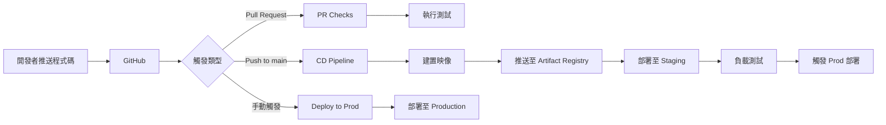

# Docker 映像建置與推送至 Artifact Registry 完整指南

本文件說明如何建置 Policy as Code Agent 的 Docker 映像，並將其推送至 Google Cloud Artifact Registry。

## 📋 目錄

- [前置需求](#前置需求)
- [Dockerfile 架構說明](#dockerfile-架構說明)
- [環境設定](#環境設定)
- [本地建置與測試](#本地建置與測試)
- [推送至 Artifact Registry](#推送至-artifact-registry)
- [使用 Cloud Build 自動建置](#使用-cloud-build-自動建置)
- [驗證與除錯](#驗證與除錯)
- [常見問題排解](#常見問題排解)

---

## 前置需求

### 必要工具

- **Docker Desktop** 或 **Docker Engine** (最新版本)
- **Google Cloud SDK (`gcloud`)** - 已安裝並完成身份驗證
- **Git** - 用於版本控制
- **Python 3.11+** - 用於本地測試

### 必要權限

確保您的 Google Cloud 帳號具有以下權限：

- `roles/artifactregistry.writer` - 推送映像至 Artifact Registry
- `roles/storage.admin` - 存取 Cloud Storage
- `roles/cloudbuild.builds.editor` - 使用 Cloud Build (如使用自動化建置)

### Google Cloud 專案設定

```bash
# 設定預設專案
export PROJECT_ID="your-project-id"
gcloud config set project ${PROJECT_ID}

# 確認當前專案
gcloud config get-value project
```

---

## Dockerfile 架構說明

本專案使用多階段建置策略，優化映像大小與安全性：

```dockerfile
# 基礎映像：使用 Python 3.11 精簡版
FROM python:3.11-slim

# 安裝 uv 套件管理器 (更快的 Python 套件管理工具)
RUN pip install --no-cache-dir uv==0.8.13

# 設定工作目錄
WORKDIR /code

# 複製依賴清單 (利用 Docker 層級快取)
COPY ./pyproject.toml ./README.md ./uv.lock* ./

# 複製應用程式原始碼
COPY ./policy_as_code_agent ./policy_as_code_agent

# 安裝依賴套件 (鎖定版本確保可重現性)
RUN uv sync --frozen

# 建置時參數
ARG COMMIT_SHA=""
ARG AGENT_VERSION=0.0.0

# 環境變數
ENV COMMIT_SHA=${COMMIT_SHA}
ENV AGENT_VERSION=${AGENT_VERSION}

# 開放服務埠號
EXPOSE 8080

# 啟動應用程式
CMD ["uv", "run", "uvicorn", "policy_as_code_agent.fast_api_app:app", "--host", "0.0.0.0", "--port", "8080"]
```

### 架構特點

- ✅ **精簡基礎映像**：使用 `python:3.11-slim` 減少映像大小
- ✅ **快取優化**：先複製依賴清單，充分利用 Docker 層級快取
- ✅ **版本控制**：透過 `COMMIT_SHA` 和 `AGENT_VERSION` 追蹤映像版本
- ✅ **安全性**：不使用快取 (`--no-cache-dir`)，避免潛在安全問題
- ✅ **可重現性**：使用 `uv sync --frozen` 鎖定依賴版本

---

## 環境設定

### 1. 建立 Artifact Registry 儲存庫

如果尚未建立，請執行以下命令：

```bash
# 設定環境變數
export PROJECT_ID="your-project-id"
export REGION="us-central1"
export REPOSITORY_NAME="pack-policy-as-code-repo"

# 建立 Docker 儲存庫
gcloud artifacts repositories create ${REPOSITORY_NAME} \
  --repository-format=docker \
  --location=${REGION} \
  --description="Policy as Code Agent 容器儲存庫" \
  --project=${PROJECT_ID}

# 驗證儲存庫已建立
gcloud artifacts repositories list --location=${REGION} --project=${PROJECT_ID}
```

### 2. 設定 Docker 認證

配置 Docker 以使用 Google Cloud 認證：

```bash
# 方法一：使用 gcloud 幫助工具 (推薦)
gcloud auth configure-docker ${REGION}-docker.pkg.dev

# 方法二：使用應用程式預設憑證
gcloud auth application-default login
```

### 3. 定義環境變數

建立一個環境變數檔案或直接設定：

```bash
# 專案資訊
export PROJECT_ID="your-project-id"
export REGION="us-central1"
export REPOSITORY_NAME="pack-policy-as-code-repo"
export CONTAINER_NAME="pack-policy-as-code"

# 版本資訊
export AGENT_VERSION=$(awk -F'"' '/^version = / {print $2}' pyproject.toml || echo '0.0.1')
export COMMIT_SHA=$(git rev-parse HEAD)

# 完整映像標籤
export IMAGE_TAG="${REGION}-docker.pkg.dev/${PROJECT_ID}/${REPOSITORY_NAME}/${CONTAINER_NAME}:${COMMIT_SHA}"
export IMAGE_LATEST="${REGION}-docker.pkg.dev/${PROJECT_ID}/${REPOSITORY_NAME}/${CONTAINER_NAME}:latest"
```

---

## 本地建置與測試

### 1. 建置 Docker 映像

在專案根目錄執行：

```bash
# 基本建置
docker build -t ${CONTAINER_NAME}:local .

# 包含版本資訊的建置
docker build \
  --build-arg COMMIT_SHA=${COMMIT_SHA} \
  --build-arg AGENT_VERSION=${AGENT_VERSION} \
  -t ${CONTAINER_NAME}:local \
  -t ${IMAGE_TAG} \
  -t ${IMAGE_LATEST} \
  .
```

### 2. 本地測試映像

啟動容器並測試應用程式：

```bash
# 啟動容器 (基本模式)
docker run -p 8080:8080 ${CONTAINER_NAME}:local

# 啟動容器 (包含環境變數)
docker run -p 8080:8080 \
  -e GOOGLE_CLOUD_PROJECT=${PROJECT_ID} \
  -e GOOGLE_CLOUD_LOCATION=${REGION} \
  -v ~/.config/gcloud:/root/.config/gcloud:ro \
  ${CONTAINER_NAME}:local
```

### 3. 驗證應用程式

開啟瀏覽器或使用 `curl` 測試：

```bash
# 健康檢查
curl http://localhost:8080/health

# 取得應用程式版本資訊
curl http://localhost:8080/version

# 檢查容器日誌
docker logs $(docker ps -q --filter ancestor=${CONTAINER_NAME}:local)
```

### 4. 停止與清理

```bash
# 停止所有執行中的容器
docker stop $(docker ps -q --filter ancestor=${CONTAINER_NAME}:local)

# 移除容器
docker rm $(docker ps -aq --filter ancestor=${CONTAINER_NAME}:local)

# 移除映像 (可選)
docker rmi ${CONTAINER_NAME}:local
```

---

## 推送至 Artifact Registry

### 方法一：手動推送 (適用於開發環境)

```bash
# 1. 重新標記映像 (如果尚未標記)
docker tag ${CONTAINER_NAME}:local ${IMAGE_TAG}
docker tag ${CONTAINER_NAME}:local ${IMAGE_LATEST}

# 2. 推送映像到 Artifact Registry
docker push ${IMAGE_TAG}
docker push ${IMAGE_LATEST}

# 3. 驗證推送成功
gcloud artifacts docker images list ${REGION}-docker.pkg.dev/${PROJECT_ID}/${REPOSITORY_NAME} \
  --project=${PROJECT_ID}
```

### 方法二：使用 Cloud Build 建置並推送

建立 Cloud Build 配置檔 (如果使用臨時建置)：

```bash
gcloud builds submit \
  --tag ${IMAGE_TAG} \
  --project=${PROJECT_ID} \
  --region=${REGION} \
  .
```

使用建置參數：

```bash
gcloud builds submit \
  --tag ${IMAGE_TAG} \
  --build-arg COMMIT_SHA=${COMMIT_SHA} \
  --build-arg AGENT_VERSION=${AGENT_VERSION} \
  --project=${PROJECT_ID} \
  --region=${REGION} \
  .
```

---

## 使用 Cloud Build 自動建置

本專案已配置完整的 CI/CD 流程，使用 Cloud Build 自動建置與部署。

### CI/CD 流程概覽



### 自動建置流程

#### 1. PR Checks 觸發器

**觸發條件：** 對 `main` 分支發起 Pull Request

```yaml
# .cloudbuild/pr_checks.yaml 重點步驟

steps:
  # 安裝依賴
  - name: 'python:3.12-slim'
    entrypoint: 'pip'
    args: ['install', '--no-cache-dir', 'uv==0.8.13']

  # 同步依賴
  - name: 'python:3.12-slim'
    entrypoint: 'uv'
    args: ['sync', '--locked']

  # 執行單元測試
  - name: 'python:3.12-slim'
    entrypoint: 'uv'
    args: ['run', 'pytest', 'tests/unit']

  # 執行整合測試
  - name: 'python:3.12-slim'
    entrypoint: 'uv'
    args: ['run', 'pytest', 'tests/integration']
```

#### 2. CD Pipeline 觸發器 (Staging 部署)

**觸發條件：** 推送至 `main` 分支 (PR 合併後)

```yaml
# .cloudbuild/staging.yaml 重點步驟

steps:
  # 建置 Docker 映像
  - name: 'gcr.io/cloud-builders/docker'
    args:
      - 'build'
      - '-t'
      - '${_REGION}-docker.pkg.dev/${PROJECT_ID}/${_ARTIFACT_REGISTRY_REPO_NAME}/${_CONTAINER_NAME}:${COMMIT_SHA}'
      - '-t'
      - '${_REGION}-docker.pkg.dev/${PROJECT_ID}/${_ARTIFACT_REGISTRY_REPO_NAME}/${_CONTAINER_NAME}:latest'
      - '--build-arg'
      - 'COMMIT_SHA=${COMMIT_SHA}'
      - '--build-arg'
      - 'AGENT_VERSION=${_AGENT_VERSION}'
      - '.'

  # 推送映像到 Artifact Registry
  - name: 'gcr.io/cloud-builders/docker'
    args:
      - 'push'
      - '--all-tags'
      - '${_REGION}-docker.pkg.dev/${PROJECT_ID}/${_ARTIFACT_REGISTRY_REPO_NAME}/${_CONTAINER_NAME}'

  # 部署到 Cloud Run (Staging)
  - name: 'gcr.io/cloud-builders/gcloud'
    args:
      - 'run'
      - 'deploy'
      - 'pack-policy-as-code'
      - '--image'
      - '${_REGION}-docker.pkg.dev/${PROJECT_ID}/${_ARTIFACT_REGISTRY_REPO_NAME}/${_CONTAINER_NAME}:${COMMIT_SHA}'
      - '--region'
      - '${_REGION}'
      - '--project'
      - '${_STAGING_PROJECT_ID}'
```

#### 3. Production 部署觸發器

**觸發條件：** 手動觸發 (需核准)

```bash
# 手動觸發 Production 部署
gcloud builds triggers run deploy-pack-policy-as-code \
  --branch=main \
  --project=${PROJECT_ID} \
  --region=${REGION}
```

### 設定 CI/CD Pipeline

使用 Terraform 自動設定所有觸發器：

```bash
# 進入 Terraform 目錄
cd deployment/terraform

# 初始化 Terraform
terraform init

# 檢視執行計劃
terraform plan --var-file vars/env.tfvars

# 套用設定
terraform apply --var-file vars/env.tfvars --auto-approve
```

需要的 `env.tfvars` 範例：

```hcl
# deployment/terraform/vars/env.tfvars

cicd_runner_project_id = "your-cicd-project-id"
staging_project_id     = "your-staging-project-id"
prod_project_id        = "your-prod-project-id"
region                 = "us-central1"
repository_name        = "your-github-repo-name"
project_name           = "pack-policy-as-code"
```

---

## 驗證與除錯

### 1. 檢查映像資訊

```bash
# 列出所有映像
gcloud artifacts docker images list \
  ${REGION}-docker.pkg.dev/${PROJECT_ID}/${REPOSITORY_NAME} \
  --project=${PROJECT_ID}

# 查看特定映像的詳細資訊
gcloud artifacts docker images describe \
  ${IMAGE_TAG} \
  --project=${PROJECT_ID}

# 列出映像標籤
gcloud artifacts docker tags list \
  ${REGION}-docker.pkg.dev/${PROJECT_ID}/${REPOSITORY_NAME}/${CONTAINER_NAME} \
  --project=${PROJECT_ID}
```

### 2. 拉取並檢查映像

```bash
# 從 Artifact Registry 拉取映像
docker pull ${IMAGE_TAG}

# 檢查映像層級
docker history ${IMAGE_TAG}

# 查看映像詳細資訊
docker inspect ${IMAGE_TAG}

# 檢查映像大小
docker images ${REGION}-docker.pkg.dev/${PROJECT_ID}/${REPOSITORY_NAME}/${CONTAINER_NAME}
```

### 3. 進入容器除錯

```bash
# 以互動模式啟動容器
docker run -it --rm ${IMAGE_TAG} /bin/bash

# 在執行中的容器內執行命令
docker exec -it <container_id> /bin/bash

# 檢查環境變數
docker exec <container_id> env

# 檢查已安裝的套件
docker exec <container_id> uv pip list
```

### 4. 查看 Cloud Build 日誌

```bash
# 列出最近的建置
gcloud builds list --limit=10 --project=${PROJECT_ID}

# 查看特定建置的日誌
gcloud builds log <BUILD_ID> --project=${PROJECT_ID}

# 串流即時建置日誌
gcloud builds log <BUILD_ID> --stream --project=${PROJECT_ID}
```

---

## 常見問題排解

### 問題 1：認證失敗

**錯誤訊息：**

```
Error response from daemon: Get "https://us-central1-docker.pkg.dev/v2/": unauthorized
```

**解決方案：**

```bash
# 重新設定 Docker 認證
gcloud auth configure-docker ${REGION}-docker.pkg.dev

# 或使用應用程式預設憑證
gcloud auth application-default login
gcloud auth login
```

### 問題 2：權限不足

**錯誤訊息：**

```
ERROR: (gcloud.artifacts.docker.images.list) Permission denied
```

**解決方案：**

```bash
# 確認當前帳號
gcloud auth list

# 檢查 IAM 權限
gcloud projects get-iam-policy ${PROJECT_ID} \
  --flatten="bindings[].members" \
  --filter="bindings.members:user:$(gcloud config get-value account)"

# 請管理員授予必要權限
# roles/artifactregistry.writer
# roles/cloudbuild.builds.editor
```

### 問題 3：映像建置失敗

**錯誤訊息：**

```
ERROR: failed to solve: failed to compute cache key
```

**解決方案：**

```bash
# 清除 Docker 快取
docker system prune -a

# 不使用快取重新建置
docker build --no-cache -t ${CONTAINER_NAME}:local .

# 檢查 .dockerignore 檔案
cat .dockerignore
```

### 問題 4：儲存庫不存在

**錯誤訊息：**

```
ERROR: (gcloud.artifacts.docker.images.list) NOT_FOUND: Repository not found
```

**解決方案：**

```bash
# 列出所有儲存庫
gcloud artifacts repositories list --location=${REGION} --project=${PROJECT_ID}

# 建立新儲存庫
gcloud artifacts repositories create ${REPOSITORY_NAME} \
  --repository-format=docker \
  --location=${REGION} \
  --project=${PROJECT_ID}
```

### 問題 5：映像標籤衝突

**解決方案：**

```bash
# 使用時間戳記作為標籤
export TIMESTAMP=$(date +%Y%m%d-%H%M%S)
export IMAGE_TAG="${REGION}-docker.pkg.dev/${PROJECT_ID}/${REPOSITORY_NAME}/${CONTAINER_NAME}:${TIMESTAMP}"

# 或使用 Git 短 SHA
export SHORT_SHA=$(git rev-parse --short HEAD)
export IMAGE_TAG="${REGION}-docker.pkg.dev/${PROJECT_ID}/${REPOSITORY_NAME}/${CONTAINER_NAME}:${SHORT_SHA}"
```

### 問題 6：容器啟動失敗

**除錯步驟：**

```bash
# 查看容器日誌
docker logs <container_id>

# 以互動模式啟動並除錯
docker run -it --rm --entrypoint /bin/bash ${IMAGE_TAG}

# 檢查應用程式依賴
docker run --rm ${IMAGE_TAG} uv pip list

# 測試應用程式啟動
docker run --rm ${IMAGE_TAG} uv run python -c "import policy_as_code_agent; print('OK')"
```

---

## 最佳實踐

### 1. 映像標籤策略

```bash
# 使用多重標籤
docker build \
  -t ${IMAGE_TAG}:${COMMIT_SHA} \      # Git commit SHA
  -t ${IMAGE_TAG}:${AGENT_VERSION} \   # 語義化版本
  -t ${IMAGE_TAG}:latest \             # 最新版本
  -t ${IMAGE_TAG}:$(date +%Y%m%d) \   # 日期標籤
  .
```

### 2. 安全性掃描

```bash
# 使用 Google Cloud 掃描映像漏洞
gcloud artifacts docker images scan ${IMAGE_TAG} \
  --project=${PROJECT_ID}

# 查看掃描結果
gcloud artifacts docker images list-vulnerabilities ${IMAGE_TAG} \
  --project=${PROJECT_ID}
```

### 3. 映像大小優化

```dockerfile
# 使用多階段建置
FROM python:3.11-slim as builder
# ... 建置步驟 ...

FROM python:3.11-slim
# 只複製必要的檔案
COPY --from=builder /code /code
```

### 4. 自動化清理舊映像

```bash
# 建立清理政策 (保留最近 10 個版本)
gcloud artifacts repositories set-cleanup-policy ${REPOSITORY_NAME} \
  --location=${REGION} \
  --project=${PROJECT_ID} \
  --keep-count=10
```

### 5. 使用 Makefile 簡化指令

在專案根目錄的 `Makefile` 中已包含相關指令：

```bash
# 部署到 Cloud Run (會自動建置並推送)
make deploy

# 使用 IAP 部署
make deploy IAP=true

# 指定埠號部署
make deploy PORT=8080
```

---

## 參考資源

- [Dockerfile 參考文件](./Dockerfile)
- [Makefile 指令總覽](./Makefile)
- [CI/CD 流程說明](./CICD.md)
- [專案 README](./README.md)
- [Google Cloud Artifact Registry 文件](https://cloud.google.com/artifact-registry/docs)
- [Google Cloud Build 文件](https://cloud.google.com/build/docs)
- [Docker 最佳實踐](https://docs.docker.com/develop/dev-best-practices/)

---

## 快速參考指令

```bash
# === 設定環境變數 ===
export PROJECT_ID="your-project-id"
export REGION="us-central1"
export REPOSITORY_NAME="pack-policy-as-code-repo"
export CONTAINER_NAME="pack-policy-as-code"
export AGENT_VERSION=$(awk -F'"' '/^version = / {print $2}' pyproject.toml)
export COMMIT_SHA=$(git rev-parse HEAD)
export IMAGE_TAG="${REGION}-docker.pkg.dev/${PROJECT_ID}/${REPOSITORY_NAME}/${CONTAINER_NAME}:${COMMIT_SHA}"

# === 建置映像 ===
docker build \
  --build-arg COMMIT_SHA=${COMMIT_SHA} \
  --build-arg AGENT_VERSION=${AGENT_VERSION} \
  -t ${IMAGE_TAG} \
  -t ${REGION}-docker.pkg.dev/${PROJECT_ID}/${REPOSITORY_NAME}/${CONTAINER_NAME}:latest \
  .

# === 本地測試 ===
docker run -p 8080:8080 ${IMAGE_TAG}

# === 推送至 Artifact Registry ===
docker push ${IMAGE_TAG}
docker push ${REGION}-docker.pkg.dev/${PROJECT_ID}/${REPOSITORY_NAME}/${CONTAINER_NAME}:latest

# === 使用 Cloud Build ===
gcloud builds submit --tag ${IMAGE_TAG} .

# === 驗證 ===
gcloud artifacts docker images list ${REGION}-docker.pkg.dev/${PROJECT_ID}/${REPOSITORY_NAME}

# === 使用 Makefile ===
make deploy
```
