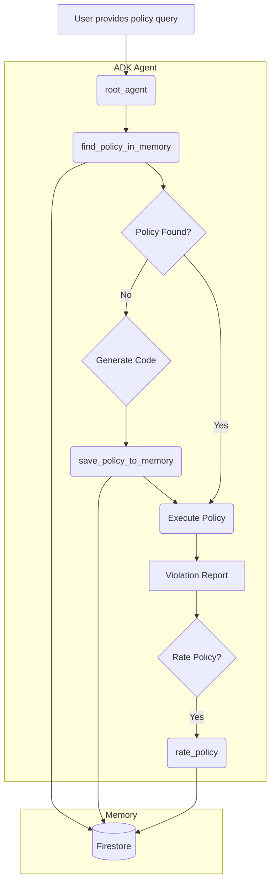

# Policy-as-Code Agent：低層細節

## 架構概述

Policy-as-Code Agent 採用「記憶優先」架構設計，以確保效率與一致性。在產生新程式碼前，會先檢查本地記憶體中先前生成的政策。



## 元件拆解

### 1. GCS 工作流程工具

-   **`generate_policy_code_from_gcs(query: str, gcs_uri: str)`**：ADK 工具，根據 GCS metadata 檔案推斷的 schema 產生 Python 政策程式碼。
-   **`run_policy_from_gcs(policy_code: str, gcs_uri: str)`**：ADK 工具，將生成的政策程式碼套用於指定 GCS URI 的 metadata。

### 2. Dataplex 搜尋工作流程工具

-   **`generate_policy_code_from_dataplex(policy_query: str, dataplex_query: str)`**：ADK 工具，負責即時驗證流程第一步。連接 Dataplex，取得符合查詢的小樣本，推斷 schema 並生成 Python 政策程式碼。
-   **`run_policy_on_dataplex(policy_code: str, dataplex_query: str)`**：ADK 工具，負責第二步。將生成的程式碼套用於 Dataplex，取得所有符合查詢的資料並執行政策。

### 3. 記憶體元件 (`policy_as_code/memory.py`)

為提升效率並提供一致體驗，Agent 具備強大的記憶體功能，使用 **Google Cloud Firestore** 與 **Vertex AI Vector Search** 來快取政策。

#### Firestore 設定
*   **Client 初始化：** Agent 以專案 ID 與資料庫名稱（預設：`policy-agent-db`）初始化 `google.cloud.firestore.Client`。
*   **向量搜尋：** 使用 `DistanceMeasure.COSINE` 找出語意相似政策。
*   **嵌入模型：** 使用 Vertex AI 的 `text-embedding-004` 產生 768 維向量，對自然語言查詢進行嵌入。

#### 集合 Schema

**A. `policies` 集合**（儲存可重用政策邏輯）
*   `policy_id` (String/UUID)：唯一識別碼。
*   `version` (Integer)：版本號（更新時遞增）。
*   `query` (String)：原始自然語言政策查詢。
*   `embedding` (Vector)：查詢的向量嵌入。
*   `code` (String)：生成的 Python 程式碼。
*   `source` (String)：'gcs' 或 'dataplex'。
*   `author` (String)：政策建立者。
*   `created_at` (Timestamp)：建立時間。
*   `last_used` (Timestamp)：最後存取時間。
*   `ratings` (Array[Int])：使用者評分（1-5）。
*   `feedback` (Array[String])：使用者回饋。
*   `total_runs` (Integer)：執行次數總計。
*   `total_violations_detected` (Integer)：違規次數總計。

**B. `policy_executions` 集合**（記錄每次執行以供稽核）
*   `policy_id` (String)：政策參照。
*   `version` (Integer)：執行版本。
*   `timestamp` (Timestamp)：執行時間。
*   `status` (String)：'success'、'failure' 或 'violations_found'。
*   `violation_count` (Integer)：偵測到的違規數。
*   `violated_resources` (Array[String])：違規資源名稱列表。
*   `summary` (String)：執行摘要。

**C. `configurations/core_policies` 文件**
*   `policies` (Array[String])：目前啟用的「核心政策」查詢列表。

### 4. LLM 與程式碼生成 (`policy_as_code/utils/llm.py`)

Agent 採用先進的提示工程技術，生成精確的 Python 程式碼。

*   **提示模板：** 位於 `prompts/code_generation.md`。
*   **動態注入：**
    *   `{{USER_POLICY_QUERY}}`：使用者請求。
    *   `{{INFERRED_JSON_SCHEMA}}`：根據實際 metadata 推斷的 JSON schema。
    *   `{{SAMPLE_VALUES}}`：從來源擷取的實際資料樣本，協助 LLM 理解欄位格式。
*   **解析：** 函式 `llm_generate_policy_code` 使用正則表達式（`r"```python\n(.*)\n```"`）從 LLM 的 markdown 回應中穩健擷取程式碼區塊。

### 5. 模擬與安全性 (`policy_as_code/simulation.py`)

`run_simulation` 函式是 Agent 的安全執行引擎。

*   **步驟 1：靜態分析（AST）：**
    *   使用 Python 的 `ast` 模組在執行前解析生成程式碼。
    *   **禁止匯入：** `os`、`sys`、`subprocess`、`shutil`、`requests`、`urllib` 等。
    *   **禁止函式：** `eval`、`exec`、`open`、`compile`。
*   **步驟 2：限制執行：**
    *   使用 `exec()` 並嚴格限制 `globals` 字典。
    *   **允許的全域：** 標準內建（`len`、`list`、`dict` 等）加上 `json`、`re`、`datetime`。
    *   **存取控制：** 程式碼無法存取 Agent 的檔案系統、網路或環境變數。

## 詳細資料流

1.  **使用者查詢：** 使用者提出「確保 'finance' 所有資料表都有描述」的請求。
2.  **向量搜尋：** `find_policy_in_memory` 將查詢轉為向量並查詢 Firestore。
    *   若找到相似度高於門檻的結果，則回傳快取程式碼。
3.  **樣本產生（若無相符）：**
    *   Agent 掃描 metadata 來源（GCS 檔案或 Dataplex 結果）。
    *   找出「最具代表性」的項目（欄位最多者）作為樣本。
4.  **程式碼生成：**
    *   組合 schema 與樣本，建立提示。
    *   呼叫 Gemini 2.5 Pro。
    *   擷取 Python 程式碼。
5.  **記憶體儲存：** 新程式碼與查詢嵌入儲存至 Firestore。
6.  **執行：**
    *   `validate_code_safety` 檢查惡意模式。
    *   使用 `exec()` 執行 `check_policy(metadata)` 函式。
7.  **回報：** 收集違規並回傳給使用者。
8.  **紀錄：** 執行結果寫入 Firestore 的 `policy_executions` 集合。

## 工具簽名

供參考，以下為主要工具的簽名：

| 工具名稱                        | 參數                                                                       | 說明                                    |
| :------------------------------ | :------------------------------------------------------------------------- | :-------------------------------------- |
| `find_policy_in_memory`         | `query` (str), `source` (str), `author` (opt), `start_date` (opt)          | 以向量搜尋現有政策。                    |
| `save_policy_to_memory`         | `natural_language_query` (str), `policy_code` (str), `source` (str)        | 儲存新政策版本。                        |
| `llm_generate_policy_code`      | `query` (str), `schema` (dict), `metadata_sample` (list)                   | 透過 Vertex AI 生成 Python 程式碼。     |
| `run_simulation`                | `policy_code` (str), `metadata` (list), `query` (str)                      | 安全執行政策邏輯。                      |
| `suggest_remediation`           | `violations` (list)                                                        | 使用 LLM 產生修正建議。                 |
| `generate_compliance_scorecard` | `source_type` (str), `source_target` (str)                                 | 執行核心政策並計算合規分數。            |
| `export_report`                 | `violations` (list), `format` (str), `filename` (str), `destination` (opt) | 將違規匯出為 CSV/HTML，可選擇存至 GCS。 |
| `get_execution_history`         | `days` (int), `status` (opt), `policy_id` (opt)                            | 取得過去政策執行紀錄。                  |
| `analyze_execution_history`     | `query_type` (str), `days` (int), `resource_name` (opt)                    | 分析違規熱點等。                        |
| `get_active_core_policies`      | None                                                                       | 取得目前啟用的核心政策列表。            |
| `save_core_policies`            | `policies` (list)                                                          | 儲存新的核心政策列表至記憶體。          |
