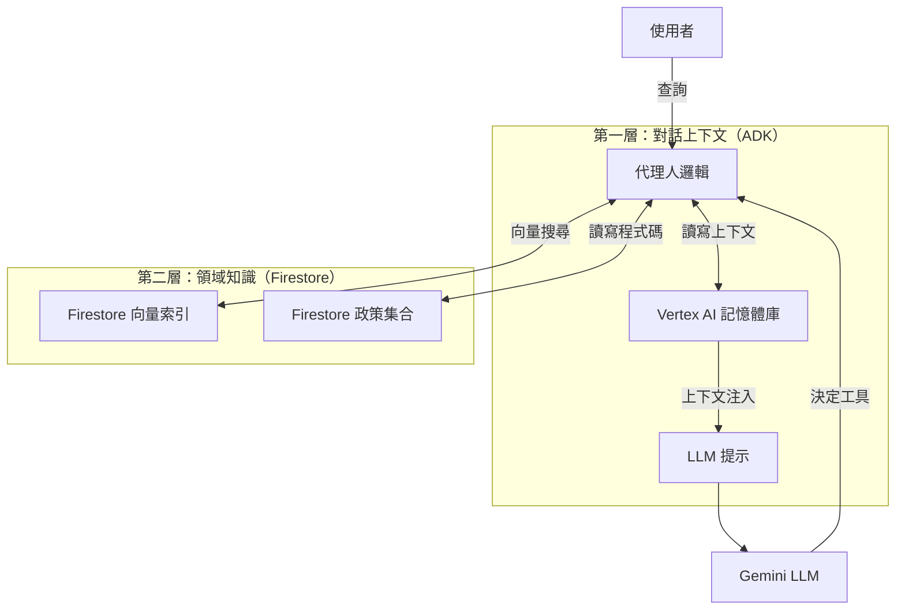

# 混合記憶體實作：Agent Engine + Firestore

Policy-as-Code 代理人採用**混合記憶體架構**，結合了代理引擎（ADK）的原生對話能力與建構於 Google Cloud Firestore 的專門結構化知識儲存。

這種方法確保代理人同時具備**對話感知**（記住聊天中的上下文）與**領域智慧**（永久記住複雜的政策邏輯與執行歷史）。

## 混合方法

我們區分企業級代理人所需的兩種記憶體：

1.  **對話上下文（短/中期）：** 由**Agent Engine 原生記憶體**處理。
2.  **程序與語意知識（長期）：** 由**Firestore + 向量搜尋**處理。

| 功能         | Agent Engine 原生記憶體（ADK）    | Firestore 自訂記憶體                   |
| :----------- | :--------------------------- | :------------------------------------- |
| **主要目標** | 維護聊天上下文與會話歷史。   | 儲存與擷取可執行的政策邏輯（程式碼）。 |
| **技術**     | `VertexAiMemoryBankService`  | Google Cloud Firestore + 向量搜尋      |
| **範圍**     | 以會話為基礎（使用者專屬）。 | 全域（所有使用者/代理人共享）。        |
| **資料型態** | 非結構化文字（聊天紀錄）。   | 結構化文件（JSON、向量、程式碼）。     |
| **範例**     | 「我指的是*另一個*表格。」   | 「這是檢查 PII 的 Python 程式碼。」    |

---

## 第一層：對話上下文（Agent Engine 原生）

代理人利用 Google Cloud Agent Engine（ADK）內建的記憶體功能來處理人類對話的細微差異。

### 元件
*   **`VertexAiMemoryBankService`**：儲存會話歷史與回合的後端服務。
*   **`PreloadMemoryTool`**：注入代理人工具集的特殊工具。在 LLM 產生回應前，此工具會搜尋會話歷史中相關的過往互動並注入提示上下文。
*   **`auto_save_session_to_memory_callback`**：在 `Agent` 定義中註冊的非同步回呼。確保每次互動（使用者查詢 + 代理人回應）都自動保存到記憶體庫。

### 運作方式
當使用者說：**「再執行一次那個檢查，不過針對 finance 資料集」** ，Agent Engine 記憶體會提供 **「那個檢查」** 所指涉的上下文（例如前一回合討論的政策）。沒有這個，代理人將無法理解參照。

```python
# policy_as_code/agent.py

# 1. 狀態保存回呼
async def auto_save_session_to_memory_callback(callback_context):
    await callback_context._invocation_context.memory_service.add_session_to_memory(
        callback_context._invocation_context.session)

# 2. 代理人初始化與記憶體工具
root_agent = Agent(
    # ...
    tools=[
        # ...
        adk.tools.preload_memory_tool.PreloadMemoryTool() # <--- 注入上下文
    ],
    after_agent_callback=auto_save_session_to_memory_callback # <--- 保存上下文
)
```

---

## 第二層：程序與領域知識（Firestore）

雖然 ADK 處理*聊天*，但它並不設計來儲存可執行程式碼或像政策版本、稽核紀錄等複雜結構化資料。為此，我們使用 **Google Cloud Firestore** 實作了自訂記憶體層。

### 元件
*   **`memory.py`**：作為 Firestore 介面的自訂模組。
*   **向量搜尋**：使用 Vertex AI 嵌入（`text-embedding-004`）建立所有已知政策的語意索引。
*   **結構化集合**：
    *   `policies`：儲存產生的 Python 程式碼、自然語言查詢與向量嵌入。
    *   `policy_executions`：儲存每次執行的稽核紀錄。

### 運作方式
當使用者請求政策時，代理人不僅查閱聊天歷史，還會查詢其「知識庫」。

1.  **語意檢索**：代理人將使用者查詢嵌入並搜尋 Firestore。
2.  **程式碼重用**：若存在類似政策（即使措辭不同），則擷取已測試、快取的 Python 程式碼。這就是「程序記憶」——記住*怎麼做*。
3.  **知識共享**：因 Firestore 為集中式資料庫，若使用者 A 建立「GDPR 合規」的複雜政策，使用者 B 可立即使用，無需重新建立。

---

## 「祕密武器」：兩層記憶如何協作

此代理人的強大之處在於這兩套記憶系統的交集。

### 範例情境

**使用者：**「建立一個檢查 customer_data 表格 PII 的政策。」

1.  **Firestore 記憶體（動作）：** 代理人產生程式碼、執行，並以政策 ID `123-abc` 儲存到 Firestore。
2.  **ADK 記憶體（觀察）：** ADK 記錄使用者正在處理政策 `123-abc` 並關注 `customer_data`。

**使用者：**「好，現在在 sales_data 表格執行它。」

1.  **ADK 記憶體（檢索）：** `PreloadMemoryTool` 辨識「它」指的是前一回合討論的 PII 政策（政策 ID `123-abc`）。
2.  **Firestore 記憶體（檢索）：** 代理人用 ID `123-abc` 從 Firestore 擷取可執行的 Python 程式碼。
3.  **執行：** 代理人將擷取到的程式碼應用於新目標（`sales_data`）。

### 架構圖



## 混合架構的優點

1.  **成本效益：** 不會浪費 Token 重新產生程式碼（Firestore 處理快取），也不會用無關歷史塞滿上下文視窗（ADK 記憶體只選取相關回合）。
2.  **連貫性：** 代理人「聰明」是因為能跟隨對話流程（ADK），同時又「博學」因為記得既有商業規則（Firestore）。
3.  **可擴展性：** 對話上下文是短暫且以會話為單位，政策知識則是永久且以組織為單位。分離兩者讓知識庫可無限成長而不影響聊天效能。
