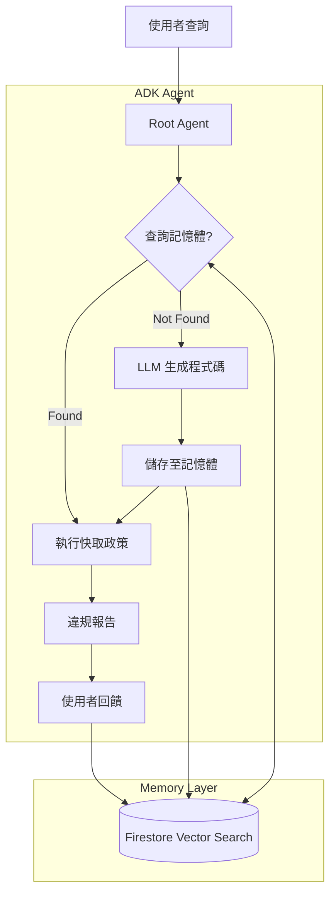

# Policy-as-Code Agent 設計說明書

本文件彙整了 Policy-as-Code Agent 的高階設計、底層實作細節以及記憶體架構的完整說明。

## 目錄

1.  [專案概述](#1-專案概述)
2.  [核心價值與應用場景](#2-核心價值與應用場景)
3.  [系統架構](#3-系統架構)
4.  [核心運作流程](#4-核心運作流程)
5.  [記憶體系統設計](#5-記憶體系統設計)
6.  [安全性與程式碼生成](#6-安全性與程式碼生成)
7.  [部署與整合](#7-部署與整合)

---

## 1. 專案概述

**Policy-as-Code Agent** 是一個旨在自動化並簡化資料治理的智慧代理人。它允許使用者透過自然語言定義與驗證資料政策，解決了傳統人工檢查的低效與規則式系統的僵化問題。

### 核心概念
*   **Agentic AI**：利用生成式 AI 即時產生 Python 政策檢查程式，而非僅執行靜態規則。
*   **混合執行模式**：結合 LLM 的語意理解與 Python 的確定性執行，確保結果精確無幻覺。
*   **持續學習**：透過向量搜尋記憶體，快取並學習成功的政策，隨著使用時間增加而更聰明、更快速。

---

## 2. 核心價值與應用場景

### 技術優勢 (Technical Value)
*   **消除幻覺**：邏輯由 Python 執行，而非由 LLM 直接判斷合規性。
*   **智慧記憶體**：利用 Google Cloud Firestore 與 Vector Search 實現語意快取，優化延遲與 API 成本。
*   **雙模式支援**：
    *   **離線模式**：針對 Google Cloud Storage (GCS) 的匯出檔案進行批次分析。
    *   **即時模式**：直接透過 Dataplex API 查詢當下資料狀態。

### 商業效益 (Business Value)
*   **治理民主化**：非技術人員（如法務、稽核）也能透過對話介面進行資料查核。
*   **主動風險控管**：將合規性檢查程式碼化，隨時可執行以降低違規風險。
*   **效率提升**：將數天的人工盤點工作縮短至數秒鐘完成。
*   **自我修復**：不僅發現問題，更能提供具體的修正建議 (Remediation)。

---

## 3. 系統架構

本系統採用「記憶優先」(Memory-First) 的架構設計，以確保運作效率與回應的一致性。

### 架構圖示概念

### 關鍵技術堆疊
*   **核心語言**: Python
*   **LLM 模型**:
    *   **Gemini 2.5 Flash**: 處理對話邏輯與工具路由。
    *   **Gemini 2.5 Pro**: 處理複雜的程式碼生成任務。
*   **基礎框架**: Google ADK (Agent Development Kit)。
*   **資料儲存**: Google Cloud Firestore (儲存政策與執行紀錄)。
*   **嵌入模型**: Vertex AI `text-embedding-004` (用於向量搜尋)。

---

## 4. 核心運作流程

Agent 的運作遵循以下六大步驟，確保從理解意圖到產出結果的完整閉環：

1.  **搜尋記憶體 (Search)**：
    *   將使用者查詢轉換為向量。
    *   在 Firestore 中搜尋語意相似的現有政策。
    *   若找到且相似度高，直接調用快取的 Python 程式碼。

2.  **理解與生成 (Generate)**：
    *   若無現有政策，Agent 會分析資料來源的 Schema 與樣本數據。
    *   利用 Gemini Pro 將自然語言轉換為 Python 驗證函式（`check_policy`）。

3.  **安全性檢查 (Safety Check)**：
    *   對生成的程式碼進行 AST (Abstract Syntax Tree) 靜態分析。
    *   阻擋危險匯入 (如 `os`, `sys`) 與函數調用。

4.  **執行與驗證 (Execute)**：
    *   在受限環境中執行 Python 程式碼。
    *   針對 GCS 或 Dataplex 的中繼資料進行逐項檢查。

5.  **回報與建議 (Report & Remediate)**：
    *   產出結構化的違規報告。
    *   可應要求生成具體的修正指令或程式碼。

6.  **回饋與優化 (Feedback)**：
    *   使用者可對結果評分，回饋將用於調整未來政策的排名與推薦。

---

## 5. 記憶體系統設計

本系統採用 **混合記憶體架構 (Hybrid Memory Architecture)**，結合了對話上下文與領域知識庫。

### 第一層：對話上下文 (Conversational Context)
*   **技術**: Agent Engine 原生記憶體 (`VertexAiMemoryBankService`)。
*   **目的**: 處理短期對話脈絡（例如：「再執行一次*那個*檢查」）。
*   **範圍**: 以單次會話 (Session) 為主。

### 第二層：程序與領域知識 (Procedural & Domain Knowledge)
*   **技術**: Google Cloud Firestore + Vector Search。
*   **目的**: 儲存可執行的政策邏輯、版本控制與執行歷史。
*   **範圍**: 全域共享 (Global)，所有使用者皆可受益於他人建立的政策。

### Firestore 資料結構
*   **`policies` 集合**:
    *   儲存政策程式碼、自然語言查詢、向量嵌入 (Embedding)。
    *   包含版本號、作者、評分與使用次數統計。
*   **`policy_executions` 集合**:
    *   作為稽核日誌 (Audit Log)。
    *   記錄每次執行的時間、狀態、違規資源列表。
*   **`configurations/core_policies`**:
    *   定義組織層級的「核心政策」清單，用於合規評分卡 (Scorecard)。

---

## 6. 安全性與程式碼生成

為了在保持靈活性的同時確保安全，系統實作了嚴格的程式碼管控機制：

### 程式碼生成策略
*   使用精心設計的 Prompt Template (`prompts/code_generation.md`)。
*   動態注入 JSON Schema 與資料樣本，確保 LLM 理解資料結構。

### 執行沙箱 (Sandbox Execution)
*   **靜態分析**: 執行前檢查 AST，禁止危險操作。
*   **受限環境**: 使用 Python `exec()` 執行，僅開放白名單內的函式庫（如 `json`, `re`, `datetime`）。
*   **無副作用**: 政策程式碼僅能讀取中繼資料並回傳違規列表，無法修改系統狀態或存取外部網路。

---

## 7. 部署與整合

### 環境需求
*   **Google Cloud Firestore**: 需開啟原生模式 (Native Mode) 以支援向量搜尋。
*   **環境變數**:
    *   `ENABLE_MEMORY_BANK=True`: 啟用記憶體功能。
    *   `FIRESTORE_DATABASE`: 指定資料庫名稱。
    *   `EMBEDDING_MODEL_NAME`: 指定嵌入模型 (預設 `text-embedding-004`)。

### 擴充性 (Extensibility)
*   **MCP (Model Context Protocol)**: 支援與 Dataplex MCP Server 整合，可擴展更多互動工具與資料來源。
*   **優雅降級 (Graceful Degradation)**: 若無法連線至 Firestore，系統會自動切換至無記憶體模式，仍可進行基本的政策生成與執行。
