# 部署 (Deployment)

此目錄包含 Terraform 設定檔，用於佈建您的 Agent 所需的 Google Cloud 基礎架構。

建議的基礎架構部署與 CI/CD 流程設置方式，是從專案根目錄使用 `agent-starter-pack setup-cicd` 指令。

然而，如果您偏好手動操作，也可以手動套用 Terraform 設定來進行自訂設置。

有關部署流程、基礎架構和 CI/CD 流程的詳細資訊，請參閱官方文件：

**🔗 [Agent Starter Pack 部署指南](https://googlecloudplatform.github.io/agent-starter-pack/guide/deployment.html)**

## 📋 目錄

- [Terraform 架構設計](#terraform-架構設計)
  - [架構概覽](#架構概覽)
  - [基礎架構流程圖](#基礎架構流程圖)
  - [CI/CD 流程圖](#cicd-流程圖)
- [模組結構](#模組結構)
- [環境配置](#環境配置)
- [資源配置詳解](#資源配置詳解)
  - [核心基礎設施](#核心基礎設施)
  - [計算與應用層](#計算與應用層)
  - [資料與儲存層](#資料與儲存層)
  - [CI/CD 與自動化](#cicd-與自動化)
  - [監控與觀測](#監控與觀測)
- [變數配置](#變數配置)
- [部署指南](#部署指南)
- [最佳實踐](#最佳實踐)

## Terraform 架構設計

### 架構概覽

本專案採用 **多環境部署架構**，支援三個獨立的 Google Cloud 專案環境：

| 環境 | 用途 | Terraform 目錄 | 特性 |
|------|------|----------------|------|
| **Production** | 正式營運環境 | `terraform/` | 完整 CI/CD 流程、高可用性配置 |
| **Staging** | 預備測試環境 | `terraform/` | 與 Production 相同架構、測試驗證 |
| **Development** | 開發環境 | `terraform/dev/` | 簡化配置、快速迭代 |

### 基礎架構流程圖

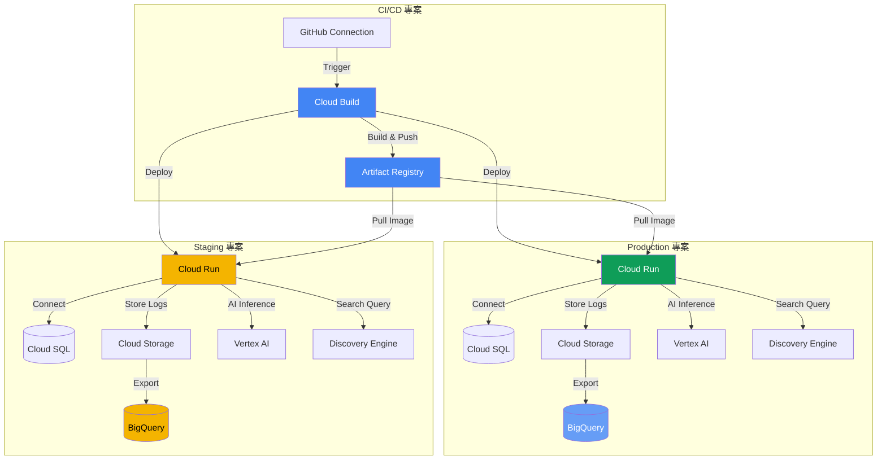

### CI/CD 流程圖

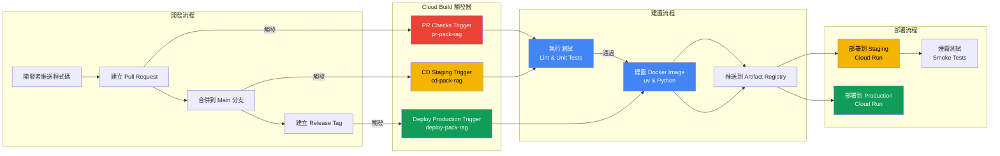

## 模組結構

```
deployment/terraform/
├── 🔧 核心配置檔案
│   ├── providers.tf          # Provider 配置 (Google, GitHub, Random)
│   ├── variables.tf          # 輸入變數定義
│   ├── locals.tf            # 區域變數與常數
│   └── vars/
│       └── env.tfvars       # 環境變數值
│
├── 🏗️ 基礎設施資源
│   ├── apis.tf              # Google Cloud APIs 啟用
│   ├── service_accounts.tf  # 服務帳戶建立
│   └── iam.tf               # IAM 角色與權限綁定
│
├── 💾 資料與儲存
│   ├── storage.tf           # Cloud Storage 與 Artifact Registry
│   └── service.tf           # Cloud SQL 資料庫配置
│
├── 🚀 應用服務
│   └── service.tf           # Cloud Run 服務部署
│
├── 🔄 CI/CD 自動化
│   ├── github.tf            # GitHub 整合與連線
│   └── build_triggers.tf    # Cloud Build 觸發器
│
├── 📊 監控與觀測
│   └── telemetry.tf         # BigQuery 與 Cloud Logging 配置
│
└── 🛠️ 開發環境 (簡化版)
    └── dev/
        ├── providers.tf     # Dev 環境 Provider
        ├── variables.tf     # Dev 環境變數
        ├── apis.tf          # Dev APIs 啟用
        ├── iam.tf           # Dev IAM 配置
        ├── service.tf       # Dev Cloud Run & SQL
        ├── storage.tf       # Dev Cloud Storage
        ├── telemetry.tf     # Dev 遙測配置
        └── vars/
            └── env.tfvars   # Dev 環境變數值
```

## 環境配置

### 多專案架構設計

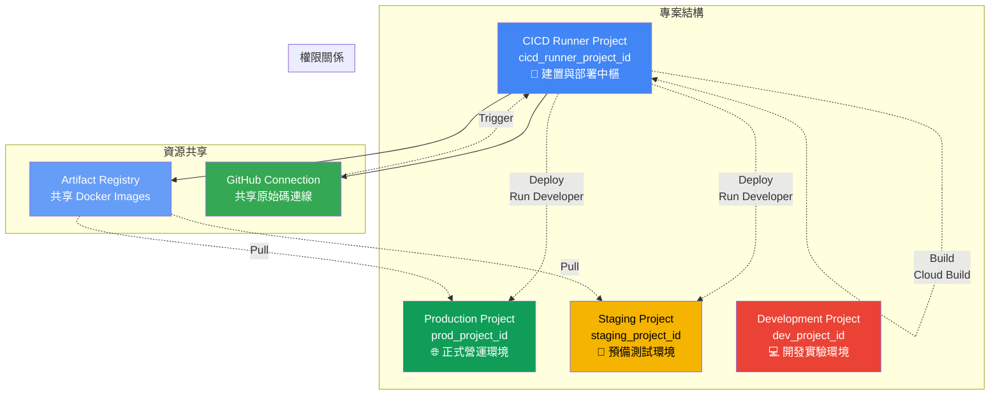

### 環境對照表

| 項目 | Production | Staging | Development |
|------|-----------|---------|-------------|
| **專案 ID 變數** | `prod_project_id` | `staging_project_id` | `dev_project_id` |
| **資源命名前綴** | `pack-rag-prod` | `pack-rag-staging` | `pack-rag-dev` |
| **Cloud Run 配置** | 4 CPU / 8GB Memory | 4 CPU / 8GB Memory | 1 CPU / 2GB Memory |
| **Cloud SQL 規格** | db-custom-1-3840 | db-custom-1-3840 | db-f1-micro |
| **日誌保留期限** | 3650 天 (10年) | 3650 天 (10年) | 30 天 |
| **刪除保護** | `false` (Starter Pack) | `false` (Starter Pack) | `false` |
| **CI/CD 整合** | ✅ 完整流程 | ✅ 完整流程 | ❌ 手動部署 |
| **自動部署觸發** | Git Tag | Git Push (main) | - |

## 資源配置詳解

### 核心基礎設施

#### 1. Provider 配置 ([providers.tf](terraform/providers.tf))

| Provider | 版本 | 用途 |
|----------|------|------|
| `hashicorp/google` | ~> 7.13.0 | Google Cloud 資源管理 |
| `integrations/github` | ~> 6.5.0 | GitHub 儲存庫與連線管理 |
| `hashicorp/random` | ~> 3.7.0 | 隨機值生成 (如密碼) |

**特殊配置**：
- **Billing Override**: 為 Staging 和 Production 專案設定獨立的 billing_project
- **User Project Override**: 確保 API 呼叫計費正確性

#### 2. Google Cloud APIs ([apis.tf](terraform/apis.tf))

**CICD 專案啟用的 APIs**：

| API | 用途 |
|-----|------|
| `cloudbuild.googleapis.com` | Cloud Build CI/CD 流程 |
| `discoveryengine.googleapis.com` | Discovery Engine RAG 搜尋 |
| `aiplatform.googleapis.com` | Vertex AI 模型推論 |
| `serviceusage.googleapis.com` | 服務使用量追蹤 |
| `bigquery.googleapis.com` | BigQuery 資料分析 |
| `cloudresourcemanager.googleapis.com` | 資源管理與 IAM |
| `cloudtrace.googleapis.com` | 分散式追蹤 |
| `telemetry.googleapis.com` | 遙測資料收集 |
| `sqladmin.googleapis.com` | Cloud SQL 管理 |

**部署專案 (Prod/Staging) 啟用的 APIs**：

| API | 用途 |
|-----|------|
| `run.googleapis.com` | Cloud Run 容器執行 |
| `iam.googleapis.com` | IAM 權限管理 |
| `logging.googleapis.com` | Cloud Logging 日誌 |
| `secretmanager.googleapis.com` | Secret Manager 密碼管理 |
| *(其他同 CICD 專案)* | |

#### 3. 服務帳戶 ([service_accounts.tf](terraform/service_accounts.tf))

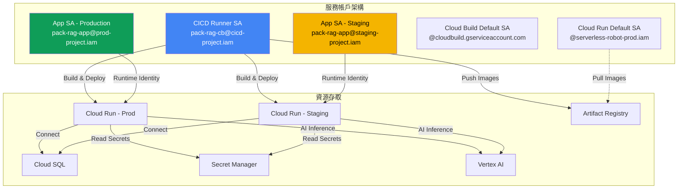

#### 4. IAM 權限配置 ([iam.tf](terraform/iam.tf))

**CICD Runner SA 權限 (在 CICD 專案)**：

| 角色 | 用途 |
|------|------|
| `roles/run.invoker` | 調用 Cloud Run 服務 |
| `roles/storage.admin` | 管理 Cloud Storage |
| `roles/aiplatform.user` | 使用 Vertex AI |
| `roles/discoveryengine.editor` | 編輯 Discovery Engine |
| `roles/logging.logWriter` | 寫入日誌 |
| `roles/cloudtrace.agent` | 追蹤代理 |
| `roles/artifactregistry.writer` | 推送 Docker Images |
| `roles/cloudbuild.builds.builder` | 建置執行 |

**CICD Runner SA 權限 (在 Prod/Staging 專案)**：

| 角色 | 用途 |
|------|------|
| `roles/run.developer` | 部署 Cloud Run 服務 |
| `roles/iam.serviceAccountUser` | 模擬服務帳戶 |
| `roles/aiplatform.user` | AI 平台使用 |
| `roles/storage.admin` | 儲存管理 |

**App SA 權限 (在各自專案)**：

| 角色 | 用途 |
|------|------|
| `roles/aiplatform.user` | Vertex AI 推論 |
| `roles/discoveryengine.editor` | RAG 搜尋與索引 |
| `roles/logging.logWriter` | 應用日誌寫入 |
| `roles/cloudtrace.agent` | 分散式追蹤 |
| `roles/storage.admin` | 存取 Cloud Storage |
| `roles/serviceusage.serviceUsageConsumer` | 服務使用追蹤 |
| `roles/cloudsql.client` | Cloud SQL 連線 |
| `roles/secretmanager.secretAccessor` | 讀取 Secret Manager |

**特殊授權**：

```terraform
# 允許 CICD SA 自我模擬 (用於建立觸發器)
serviceAccount -> serviceAccount (self-impersonation)
Role: roles/iam.serviceAccountTokenCreator

# 允許 Cloud Run 預設 SA 拉取 Artifact Registry Images
Cloud Run Default SA -> Artifact Registry
Role: roles/artifactregistry.reader
```

### 計算與應用層

#### 5. Cloud Run 服務 ([service.tf](terraform/service.tf))

**服務配置**：

| 設定項目 | Production/Staging | Development |
|---------|-------------------|-------------|
| **服務名稱** | `pack-rag` | `pack-rag` |
| **區域** | `us-central1` (可配置) | `us-central1` |
| **CPU** | 4 核心 | 1 核心 |
| **記憶體** | 8 GB | 2 GB |
| **CPU Idle** | `false` (始終分配) | `true` (閒置釋放) |
| **Ingress** | `INGRESS_TRAFFIC_ALL` | `INGRESS_TRAFFIC_ALL` |
| **Container Image** | 從 Artifact Registry 拉取 | 本機建置 |

**環境變數注入**：

```yaml
環境變數:
  INSTANCE_CONNECTION_NAME:
    value: <Cloud SQL Connection Name>
    source: Terraform Output

  DB_PASS:
    value_source:
      secret_key_ref:
        secret: pack-rag-db-password
        version: latest
    source: Secret Manager

  DB_USER: pack-rag
  DB_NAME: pack-rag
```

**Volume 掛載**：

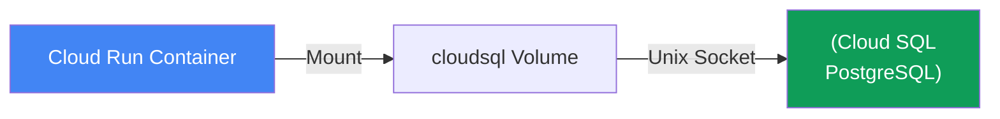

### 資料與儲存層

#### 6. Cloud SQL ([service.tf](terraform/service.tf))

**實例配置**：

| 項目 | 值 | 說明 |
|------|-----|------|
| **資料庫引擎** | `POSTGRES_15` | PostgreSQL 15 版本 |
| **實例規格** | `db-custom-1-3840` | 1 vCPU / 3.75 GB RAM |
| **區域** | `us-central1` | 與 Cloud Run 同區域 |
| **備份時間** | `03:00 UTC` | 每日自動備份 |
| **IAM 認證** | `enabled` | 啟用 Cloud IAM 資料庫認證 |
| **刪除保護** | `false` | Starter Pack 便於清理 |

**資料庫結構**：

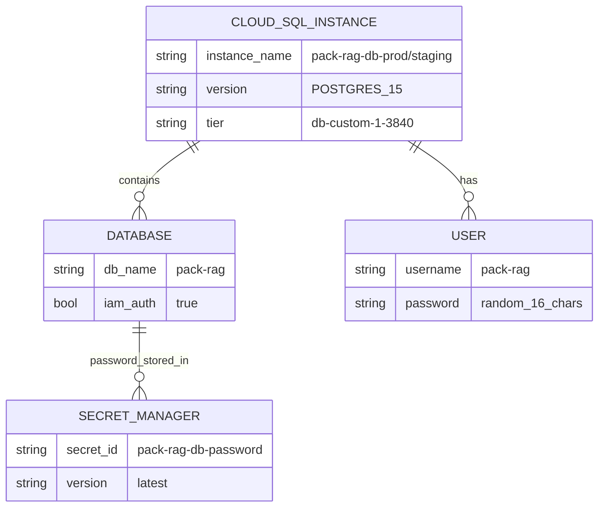

**密碼管理流程**：

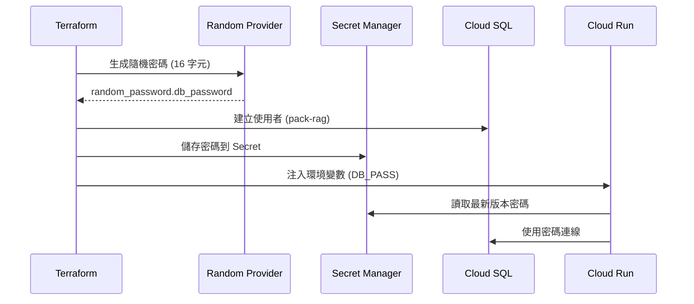

#### 7. Cloud Storage ([storage.tf](terraform/storage.tf))

**Bucket 配置**：

| Bucket 類型 | 命名格式 | 用途 | 生命週期 |
|------------|---------|------|---------|
| **日誌 Bucket** | `{project_id}-pack-rag-logs` | 儲存應用日誌與遙測資料 | `force_destroy: true` |
| **Artifact Registry** | `pack-rag-repo` | 儲存 Docker Container Images | 由 CICD 專案管理 |

**存取控制**：

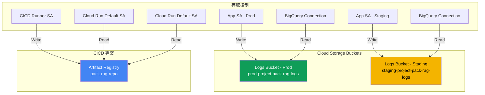

### CI/CD 與自動化

#### 8. GitHub 整合 ([github.tf](terraform/github.tf))

**連線建立流程**：

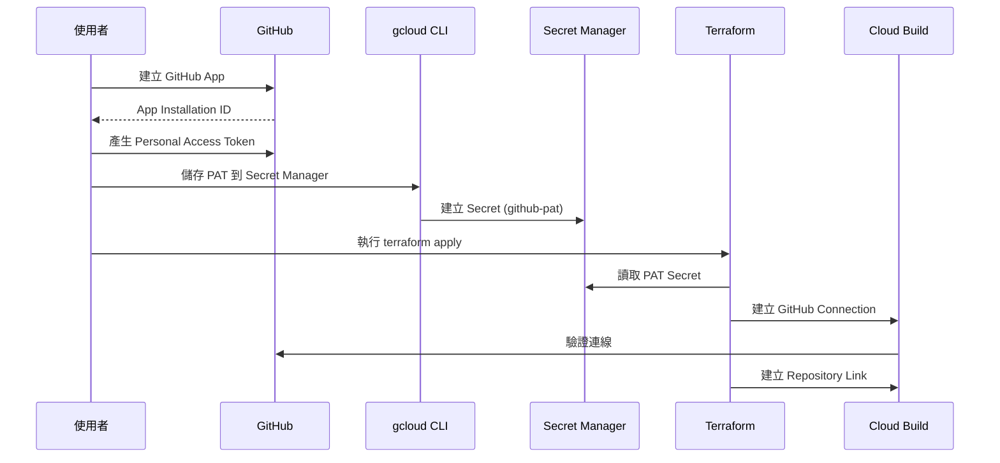

**變數配置**：

| 變數 | 說明 | 範例 |
|------|------|------|
| `repository_owner` | GitHub 使用者名稱或組織 | `google-cloud-platform` |
| `repository_name` | 儲存庫名稱 | `pack-rag` |
| `github_app_installation_id` | GitHub App 安裝 ID | `12345678` |
| `github_pat_secret_id` | Secret Manager 中的 PAT Secret ID | `github-pat` |
| `host_connection_name` | Cloud Build 連線名稱 | `pack-rag-github-connection` |
| `create_repository` | 是否建立新儲存庫 | `false` (通常使用現有) |
| `create_cb_connection` | 是否建立新連線 | `false` (CLI 已建立) |

#### 9. Cloud Build 觸發器 ([build_triggers.tf](terraform/build_triggers.tf))

**觸發器類型**：

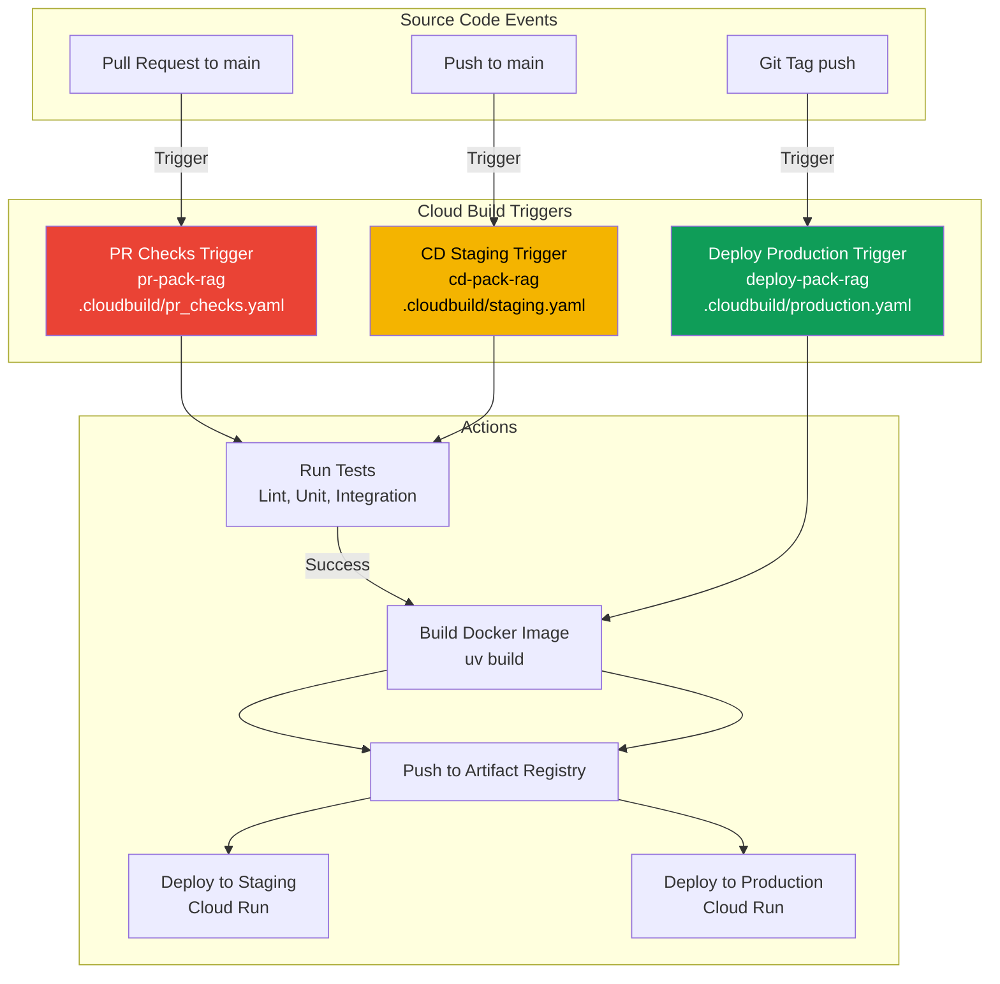

**觸發器詳細配置**：

| 觸發器 | 觸發條件 | Cloud Build 檔案 | 監控檔案路徑 | 用途 |
|-------|---------|-----------------|-------------|------|
| **pr-pack-rag** | Pull Request → main | `.cloudbuild/pr_checks.yaml` | `rag/**, data_ingestion/**, tests/**, deployment/**, uv.lock` | 程式碼品質檢查 |
| **cd-pack-rag** | Push → main | `.cloudbuild/staging.yaml` | 同上 | 自動部署到 Staging |
| **deploy-pack-rag** | Git Tag | `.cloudbuild/production.yaml` | 同上 | 正式環境部署 |

**替代變數 (Substitutions)**：

```yaml
替代變數 (用於 CI/CD):
  _STAGING_PROJECT_ID: "${var.staging_project_id}"
  _LOGS_BUCKET_NAME_STAGING: "${google_storage_bucket.logs_data_bucket[staging].name}"
  _APP_SERVICE_ACCOUNT_STAGING: "${google_service_account.app_sa[staging].email}"
  _REGION: "${var.region}"
  _CONTAINER_NAME: "pack-rag"
  _ARTIFACT_REGISTRY_REPO_NAME: "${google_artifact_registry_repository.repo.repository_id}"
```

### 監控與觀測

#### 10. 遙測與日誌系統 ([telemetry.tf](terraform/telemetry.tf))

**架構設計**：

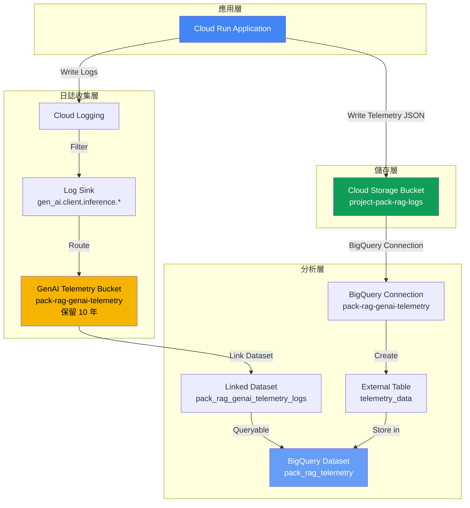

**日誌保留政策**：

| 日誌類型 | 保留期限 | 儲存位置 | 用途 |
|---------|---------|---------|------|
| **GenAI 遙測日誌** | 3650 天 (10 年) | Cloud Logging Bucket | AI 推論詳細記錄 |
| **應用程式日誌** | 30 天 (預設) | Cloud Logging | 一般應用日誌 |
| **遙測 JSON 檔案** | 無限期 | Cloud Storage | 原始遙測資料 |

**BigQuery 外部表配置**：

```sql
-- 外部表結構 (自動從 JSON Schema 推斷)
CREATE EXTERNAL TABLE `pack_rag_telemetry.telemetry_data`
OPTIONS (
  format = 'NEWLINE_DELIMITED_JSON',
  uris = ['gs://project-pack-rag-logs/telemetry/*.json'],
  connection_id = 'pack-rag-genai-telemetry'
);
```

**日誌過濾器**：

```javascript
// GenAI 遙測日誌過濾器
log_name="projects/${project_id}/logs/gen_ai.client.inference.operation.details"
AND (
  labels."gen_ai.input.messages_ref" =~ ".*pack-rag.*"
  OR labels."gen_ai.output.messages_ref" =~ ".*pack-rag.*"
)
```

**權限配置**：

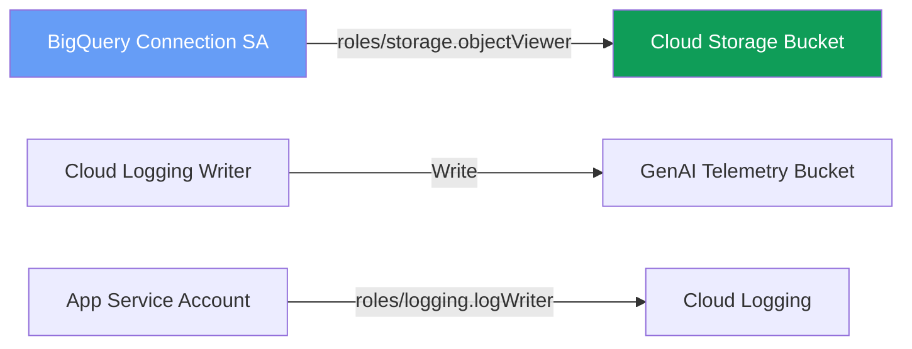

## 變數配置

### 必填變數

| 變數名稱 | 類型 | 說明 | 範例 |
|---------|------|------|------|
| `prod_project_id` | `string` | 正式環境專案 ID | `my-prod-project` |
| `staging_project_id` | `string` | 預備環境專案 ID | `my-staging-project` |
| `cicd_runner_project_id` | `string` | CI/CD 專案 ID | `my-cicd-project` |
| `repository_owner` | `string` | GitHub 擁有者 (使用者/組織) | `google-cloud-platform` |
| `repository_name` | `string` | GitHub 儲存庫名稱 | `pack-rag` |
| `github_pat_secret_id` | `string` | GitHub PAT Secret ID | `github-pat` |
| `github_app_installation_id` | `string` | GitHub App 安裝 ID | `12345678` |

### 可選變數

| 變數名稱 | 預設值 | 說明 |
|---------|-------|------|
| `project_name` | `pack-rag` | 資源命名前綴 |
| `region` | `us-central1` | Google Cloud 區域 |
| `host_connection_name` | `pack-rag-github-connection` | Cloud Build 連線名稱 |
| `create_repository` | `false` | 是否建立 GitHub 儲存庫 |
| `create_cb_connection` | `false` | 是否建立 Cloud Build 連線 |

### 角色列表變數

**app_sa_roles** (應用程式服務帳戶角色):
```hcl
[
  "roles/aiplatform.user",
  "roles/discoveryengine.editor",
  "roles/logging.logWriter",
  "roles/cloudtrace.agent",
  "roles/storage.admin",
  "roles/serviceusage.serviceUsageConsumer",
  "roles/cloudsql.client",
  "roles/secretmanager.secretAccessor",
]
```

**cicd_roles** (CICD Runner 角色):
```hcl
[
  "roles/run.invoker",
  "roles/storage.admin",
  "roles/aiplatform.user",
  "roles/discoveryengine.editor",
  "roles/logging.logWriter",
  "roles/cloudtrace.agent",
  "roles/artifactregistry.writer",
  "roles/cloudbuild.builds.builder"
]
```

**cicd_sa_deployment_required_roles** (部署權限):
```hcl
[
  "roles/run.developer",
  "roles/iam.serviceAccountUser",
  "roles/aiplatform.user",
  "roles/storage.admin"
]
```

## 部署指南

### 前置準備

1. **建立 Google Cloud 專案**
   ```bash
   # 建立三個專案
   gcloud projects create my-cicd-project
   gcloud projects create my-staging-project
   gcloud projects create my-prod-project

   # 啟用計費
   gcloud beta billing projects link my-cicd-project \
     --billing-account=BILLING_ACCOUNT_ID
   ```

2. **安裝 GitHub App**
   ```bash
   # 前往 Cloud Build > Settings > Repositories
   # 安裝 GitHub App 並記錄 Installation ID
   ```

3. **建立 GitHub Personal Access Token**
   ```bash
   # 前往 GitHub > Settings > Developer settings > Personal access tokens
   # 建立 token 並儲存到 Secret Manager
   gcloud secrets create github-pat \
     --project=my-cicd-project \
     --data-file=- <<< "YOUR_GITHUB_PAT"
   ```

### 自動化部署 (推薦)

```bash
# 使用 Agent Starter Pack CLI
agent-starter-pack setup-cicd \
  --cicd-project=my-cicd-project \
  --staging-project=my-staging-project \
  --prod-project=my-prod-project \
  --repository=my-org/pack-rag
```

### 手動部署

```bash
# 1. 初始化 Terraform
cd deployment/terraform
terraform init

# 2. 編輯變數檔案
cp vars/env.tfvars.example vars/env.tfvars
vim vars/env.tfvars

# 3. 驗證配置
terraform plan -var-file=vars/env.tfvars

# 4. 套用配置
terraform apply -var-file=vars/env.tfvars

# 5. 部署開發環境 (可選)
cd dev
terraform init
terraform apply -var-file=vars/env.tfvars
```

### 驗證部署

```bash
# 檢查 Cloud Run 服務
gcloud run services list --project=my-staging-project

# 檢查 Cloud SQL 實例
gcloud sql instances list --project=my-staging-project

# 檢查 Cloud Build 觸發器
gcloud builds triggers list --project=my-cicd-project --region=us-central1

# 測試應用程式
curl https://pack-rag-xxx.run.app/health
```

## 最佳實踐

### 安全性

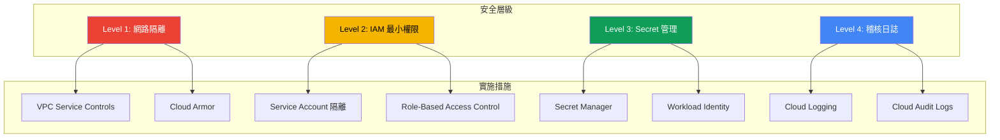

**建議措施**：

1. ✅ **啟用刪除保護** (正式環境)
   ```hcl
   deletion_protection = true  # 在 service.tf 中修改
   ```

2. ✅ **使用 Workload Identity**
   - 避免使用服務帳戶金鑰
   - 讓 Cloud Run 自動使用服務帳戶

3. ✅ **設定 VPC Connector** (生產環境)
   ```hcl
   # 在 service.tf 中新增
   vpc_access {
     connector = google_vpc_access_connector.connector.id
     egress    = "PRIVATE_RANGES_ONLY"
   }
   ```

4. ✅ **啟用 Cloud Armor**
   - 防護 DDoS 攻擊
   - 設定 IP 白名單

### 成本最佳化

| 項目 | 建議 | 節省成本 |
|------|------|---------|
| **Cloud Run** | 設定 `min_instance_count = 0` | 閒置時無費用 |
| **Cloud SQL** | 使用 `db-f1-micro` (開發) | 降低 80% 成本 |
| **Cloud Storage** | 設定生命週期政策 | 自動刪除舊日誌 |
| **BigQuery** | 使用 `partition` 和 `clustering` | 減少掃描資料量 |

### 可靠性

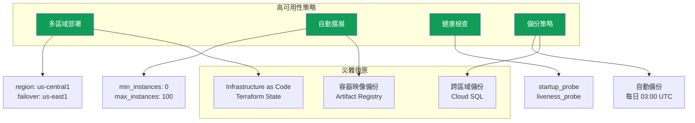

### 監控與告警

**建議設定的告警規則**：

```yaml
告警規則:
  - name: "Cloud Run 錯誤率過高"
    condition: error_rate > 5%
    duration: 5 minutes
    notification: PagerDuty

  - name: "Cloud SQL 連線數過高"
    condition: connections > 80% of max_connections
    duration: 3 minutes
    notification: Email

  - name: "Artifact Registry 儲存空間不足"
    condition: storage_usage > 90%
    duration: 1 hour
    notification: Slack

  - name: "Cloud Build 建置失敗"
    condition: build_status = FAILURE
    duration: immediate
    notification: GitHub Issue
```

## 資源關係圖

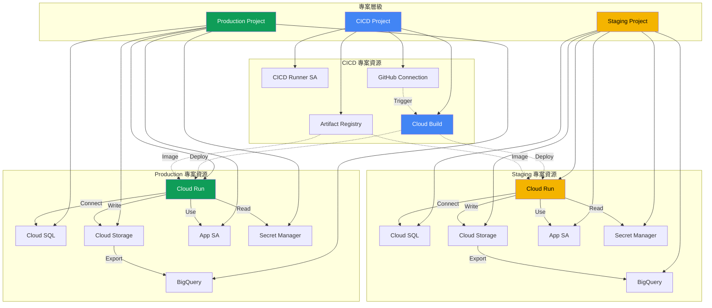

## 常見問題

<details>
<summary><strong>Q1: 如何切換部署區域？</strong></summary>

修改 `vars/env.tfvars` 中的 `region` 變數：

```hcl
region = "asia-east1"  # 改為亞洲區域
```

然後重新執行 `terraform apply`。
</details>

<details>
<summary><strong>Q2: 如何增加 Cloud Run 的記憶體限制？</strong></summary>

修改 [service.tf](terraform/service.tf) 中的 `resources` 設定：

```hcl
resources {
  limits = {
    cpu    = "8"      # 增加到 8 核心
    memory = "16Gi"   # 增加到 16 GB
  }
}
```
</details>

<details>
<summary><strong>Q3: 如何停用某個環境？</strong></summary>

使用 Terraform 的 `target` 參數：

```bash
# 僅部署 Production
terraform apply -target=google_cloud_run_v2_service.app["prod"]

# 刪除 Staging 資源
terraform destroy -target=google_cloud_run_v2_service.app["staging"]
```
</details>

<details>
<summary><strong>Q4: 如何備份 Terraform State？</strong></summary>

建議使用 Google Cloud Storage 作為 Backend：

```hcl
terraform {
  backend "gcs" {
    bucket = "my-terraform-state-bucket"
    prefix = "pack-rag/terraform/state"
  }
}
```
</details>

## 參考資源

- 📚 [Terraform Google Provider 文件](https://registry.terraform.io/providers/hashicorp/google/latest/docs)
- 🚀 [Cloud Run 最佳實踐](https://cloud.google.com/run/docs/)
- 🔐 [IAM 權限建議](https://cloud.google.com/iam/docs/)
- 🛠️ [Cloud Build 配置指南](https://cloud.google.com/build/docs/)
- 📊 [BigQuery 成本最佳化](https://cloud.google.com/bigquery/docs/best-practices-costs)
