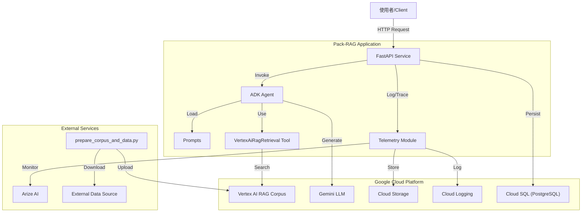
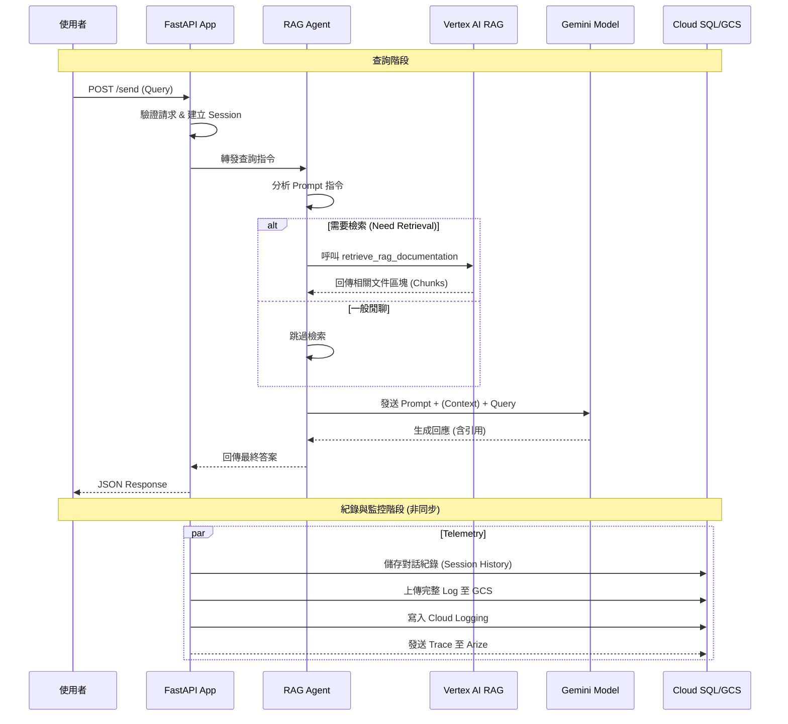
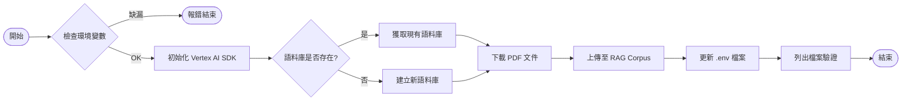

# RAG 系統設計文件 (RAG System Design Document)

本文件詳細說明 `rag` 套件的系統架構、模組設計與運作流程。該系統旨在建立一個基於 Google Cloud Vertex AI 的檢索增強生成 (RAG) 代理人。

## 1. 系統摘要 (System Summary)

本系統是一個整合了 **Google Vertex AI RAG** 服務的 AI 代理人應用程式。它能夠根據預先建立的語料庫（Corpus）回答使用者的問題，並提供精確的引用來源。系統封裝為 **FastAPI** 服務，支援持久化對話紀錄、遙測監控 (Telemetry) 與使用者回饋收集。

### 主要功能
- **檢索增強生成 (RAG)**：利用 Vertex AI RAG API 從專屬語料庫檢索資訊。
- **AI 代理人 (Agent)**：基於 Gemini 模型，具備工具使用能力的代理人。
- **RESTful API**：提供標準化的對話與回饋介面。
- **可觀測性 (Observability)**：整合 Arize 與 OpenTelemetry 進行效能追蹤與除錯。
- **自動化資料管道**：提供腳本自動下載文件並建立/更新 RAG 語料庫。

---

## 2. 技術架構 (Technical Architecture)

本系統採用微服務架構風格，主要運行於 Google Cloud Platform (GCP) 環境。

### 技術堆疊 (Tech Stack)

| 類別 | 技術/工具 | 說明 |
| :--- | :--- | :--- |
| **語言** | Python 3.10+ | 核心開發語言 |
| **Web 框架** | FastAPI | 高效能非同步 Web API 框架 |
| **LLM 模型** | Gemini-2.0-flash-001 | Google 最新一代生成式 AI 模型 |
| **RAG 引擎** | Vertex AI RAG | 管理向量資料庫與檢索服務 |
| **代理人框架** | Google ADK (Agent Development Kit) | 用於構建與管理 AI 代理人 |
| **監控/追蹤** | Arize AI, OpenTelemetry | 系統效能監控與 LLM 評估 |
| **資料庫** | Cloud SQL (PostgreSQL) | (選用) 儲存對話歷史與 Session 資料 |
| **日誌儲存** | Cloud Logging, GCS | 結構化日誌與完整對話紀錄儲存 |

---

## 3. 模組設計 (Module Design)

系統由以下核心模組組成，各模組職責分明：

| 檔案路徑 | 模組名稱 | 功能描述 |
| :--- | :--- | :--- |
| `rag/__init__.py` | 初始化 | 設定 Google Cloud 專案環境變數與認證。 |
| `rag/agent.py` | 代理人核心 | 定義 `Agent` 實例，配置 `VertexAiRagRetrieval` 工具，載入 Prompt。 |
| `rag/fast_api_app.py` | API 服務 | 建立 FastAPI 應用，處理 HTTP 請求，整合資料庫與遙測。 |
| `rag/prompts.py` | 指令管理 | 集中管理 System Prompts 與引用格式規範。 |
| `rag/tracing.py` | 追蹤整合 | 設定 Arize AI 連線，註冊 OpenTelemetry 提供者。 |
| `rag/app_utils/telemetry.py` | 遙測工具 | 設定日誌上傳至 GCS 的規則與 OTEL 屬性。 |
| `rag/app_utils/typing.py` | 資料模型 | 定義 API 請求 (Request) 與回饋 (Feedback) 的 Pydantic 模型。 |
| `rag/shared_libraries/` | 共用工具 | 包含 `prepare_corpus_and_data.py` 用於自動化建立語料庫與上傳文件。 |

---

## 4. 系統流程圖 (System Flowcharts)

### 4.1 系統組件架構圖 (Component Diagram)

### 4.2 使用者查詢序列圖 (Sequence Diagram)

說明從使用者發送請求到接收回應的完整流程。

### 4.3 資料準備流程 (Data Preparation Flow)

說明 `shared_libraries/prepare_corpus_and_data.py` 的運作邏輯。

---

## 5. 詳細設計說明 (Detailed Design)

### 5.1 代理人設計 (Agent Design)
- **模型**: `gemini-2.0-flash-001`，平衡速度與成本。
- **指令 (Instructions)**: 定義於 `prompts.py`。嚴格規定代理人僅在必要時使用檢索工具，且必須在回答末尾附上引用來源。
- **工具 (Tools)**:
    - `VertexAiRagRetrieval`: 設定 `similarity_top_k=10` 與 `vector_distance_threshold=0.6`，確保檢索結果的廣度與相關性。

### 5.2 資料持久化與遙測 (Persistence & Telemetry)
- **Cloud SQL**: 透過 `asyncpg` 連接 PostgreSQL，用於儲存會話狀態 (Session State)。
- **Arize AI**: 透過 OpenTelemetry 收集 Traces，用於監控 LLM 的輸入輸出品質與延遲。
- **隱私控制**: `telemetry.py` 支援 `NO_CONTENT` 模式，可配置僅上傳中繼資料而不記錄敏感的對話內容。

### 5.3 錯誤處理與回饋 (Error Handling & Feedback)
- API 端點 `/feedback` 接收使用者對回答的評分與建議，並透過結構化日誌記錄至 Cloud Logging，便於後續分析與模型優化。
- 檢索工具設有異常處理機制，若憑證失效或配額不足會拋出適當的錯誤訊息。
