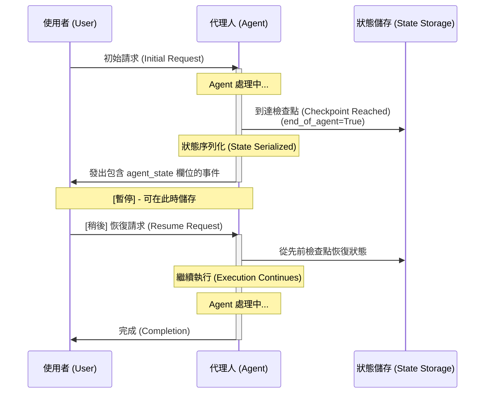

# TIL: 使用 Google ADK 1.16.0 實現暫停與恢復調用 (Pause and Resume Invocations)

本專案展示了 ADK 1.16.0 新推出的 **暫停與恢復調用 (Pause and Resume Invocation)** 功能，用於構建具備韌性且可長期執行的 Agent 工作流，支援自動狀態檢查點 (checkpoint) 建立與恢復。

## 快速開始

```bash
# 1. 安裝依賴
make setup

# 2. 新增您的 API 金鑰
# 編輯 pause_resume_agent/.env 並加入 GOOGLE_API_KEY

# 3. 嘗試執行 Agent
make dev
# 開啟 http://localhost:8000 - 選擇 'pause_resume_agent'

# 4. 執行測試
make test
```

## 包含內容

- **`pause_resume_agent/`** - 主要 Agent 實作
  - `agent.py` - 包含資料處理、檢查點驗證與恢復提示工具的 Agent
  - `.env.example` - 環境配置範本
- **`app.py`** - 啟用了 `ResumabilityConfig` 的 ADK App 配置
- **`tests/`** - 完整的測試套件（單元測試）
- **`Makefile`** - 標準開發指令
- **`requirements.txt`** - 依賴項目

## 檔案結構

```text
til_pause_resume_20251020/
├── pause_resume_agent/
│   ├── __init__.py        # 套件初始化
│   ├── agent.py           # Agent 定義與 root_agent 導出
│   └── .env.example       # 環境範本
├── tests/
│   ├── __init__.py
│   └── test_agent.py      # 完整測試
├── app.py                 # 包含 ResumabilityConfig 的 App 配置
├── pyproject.toml         # 專案詮釋資料 (Metadata)
├── Makefile              # 開發指令
├── requirements.txt      # 依賴項目
└── README.md             # 本檔案
```

## 暫停/恢復調用如何運作

暫停/恢復調用功能可實現：

1. **Agent 狀態檢查點 (Agent State Checkpointing)** - Agent 在關鍵點自動儲存狀態
2. **調用暫停 (Invocation Pausing)** - 長期執行的操作可以優雅地暫停
3. **狀態恢復 (State Restoration)** - 恢復時還原先前的狀態
4. **容錯能力 (Fault Tolerance)** - 若執行中斷，狀態會被保留
5. **人機互動 (Human-in-the-Loop)** - Agent 可暫停以請求人類輸入，隨後恢復

### 狀態檢查點架構



### 範例配置

```python
from google.adk.apps import App, ResumabilityConfig

# 啟用暫停/恢復支援
config = ResumabilityConfig(is_resumable=True)

app = App(
    root_agent=agent,
    resumability_config=config
)
```

## 本專案的 Agent

此實作包含一個具備三個工具的 Agent，用於展示長期執行的工作流：

### 1. `process_data_chunk(data: str)`

模擬處理資料塊（代表長時間操作）：

```python
result = process_data_chunk("Sample data...")
# 回傳： {
#     "status": "success",
#     "lines_processed": 5,
#     "word_count": 42,
#     "data_summary": "..."
# }
```

### 2. `validate_checkpoint(checkpoint_data: str)`

在恢復前驗證檢查點的完整性：

```python
result = validate_checkpoint(checkpoint_state)
# 回傳： {
#     "status": "success",
#     "is_valid": True,
#     "checkpoint_size": 256
# }
```

### 3. `get_resumption_hint(context: str)`

分析上下文並建議最佳恢復點：

```python
result = get_resumption_hint("processing data")
# 回傳： {
#     "status": "success",
#     "hint": "Consider resuming from the data processing stage",
#     "context_length": 18
# }
```

## 測試

執行所有測試：

```bash
make test
```

或執行特定測試類別：

```bash
pytest tests/test_agent.py::TestAgentConfiguration -v
```

**測試涵蓋範圍：**

- ✅ Agent 配置（名稱、模型、描述、指令）
- ✅ 工具可用性與功能
- ✅ 匯入驗證
- ✅ App 配置
- ✅ ResumabilityConfig 設定

## 在開發中使用

### 觀察 Events 分頁

執行 `make dev` 時，檢查 Events 分頁以查看暫停/恢復的運作：

1. 發送觸發資料處理的訊息
2. 觀察 `end_of_agent=True` 的檢查點事件
3. 檢查事件中的 `agent_state` 欄位
4. 查看狀態保留標記

### 嘗試這些提示詞 (Prompts)

```
1. "Process this data: Hello world, this is a test"
   (觸發資料處理檢查點)

2. "Can you validate this checkpoint?"
   (觸發驗證工具)

3. "What checkpoint should I use for processing?"
   (獲取恢復提示)

4. 繼續進行後續對話以觀察狀態處理
```

## 關鍵特性

### Agent 狀態檢查點 (Agent State Checkpointing)

```python
# Agent 發出檢查點事件
Event(
    invocation_id='inv_1',
    author='pause_resume_agent',
    actions=EventActions(
        end_of_agent=True,
        agent_state={'processing': True}  # 狀態已儲存
    ),
    content="Processing complete"
)
```

### 恢復調用 (Resuming Invocations)

```python
# 從已儲存狀態恢復
await runner.run_async(
    session=session,
    new_message=next_user_input,
    invocation_id=previous_invocation_id,  # 恢復狀態
)
```

## 使用案例

### 1. 長期執行的工作流 (Long-Running Workflows)

在較長時間內處理大型資料集或複雜任務：

```
初始請求 → 階段 1 處理 → [檢查點]
[暫停 - 儲存狀態]
[稍後] 恢復 → 階段 2 處理 → [檢查點]
[暫停 - 儲存狀態]
[稍後] 恢復 → 完成 → 結束
```

### 2. 人機互動 (Human-in-the-Loop)

Agent 暫停以請求回饋，隨後恢復：

```
Agent 處理中 → [檢查點]
↓
等待人類輸入
↓
人類提供回饋
↓
帶著回饋恢復 → 完成
```

### 3. 容錯能力 (Fault Tolerance)

系統故障不會遺失進度：

```
Agent 處理中
↓
[檢查點] - 狀態已儲存
↓
[系統故障]
↓
[恢復] - 狀態已還原
↓
從檢查點恢復 → 完成
```

### 4. 多階段操作 (Multi-Stage Operations)

具備自然暫停點的序列化 Agent 工作流：

```
✅ 資料驗證 [檢查點 1]
↓
✅ 處理中 [檢查點 2]
↓
✅ 分析中 [檢查點 3]
↓
✅ 結果生成 [檢查點 4]
↓
完成
```

## 調整配置

預設配置適用於大多數案例：

```python
# 目前預設
resumability_config = ResumabilityConfig(is_resumable=True)
```

### 啟用暫停/恢復

```python
resumability_config = ResumabilityConfig(is_resumable=True)
```

### 禁用暫停/恢復 (為了向下相容)

```python
resumability_config = ResumabilityConfig(is_resumable=False)
# 或完全省略該配置
```

## 疑難排解

### Agent 未載入網頁 UI

```bash
# 以可編輯模式重新安裝套件
pip install -e .
adk web
```

### 測試因匯入錯誤而失敗

```bash
# 重新安裝依賴
make setup
```

### 環境檔案遺失

```bash
# 複製範例檔案
cp pause_resume_agent/.env.example pause_resume_agent/.env
# 新增您的 GOOGLE_API_KEY
```

### 看不到檢查點事件

1. 確保 `app.py` 中設定了 `ResumabilityConfig(is_resumable=True)`
2. 以較長的操作執行 Agent 以觸發檢查點
3. 在 Agent 執行期間檢查 Events 分頁
4. 在事件詳情中尋找 `end_of_agent=True` 的事件

## 相關學習

- **[TIL 文章](../../../notes/google-adk-training-hub/blog/2025-10-20-til-pause-resume.md)** - 完整解釋與最佳實踐
- **[教學 17](../../../notes/google-adk-training-hub/adk_training/17-agent_to_agent.md)** - 多 Agent 工作流
- **[ADK 文件](https://github.com/google/adk-python)** - 官方文件

## 延伸本範例

嘗試這些修改：

1. **多步驟工作流** - 串接多個工具，並在工具間設置檢查點
2. **自定義狀態** - 在檢查點資料中追蹤額外狀態
3. **錯誤恢復** - 實作保留狀態的錯誤處理機制
4. **進度追蹤** - 在檢查點狀態中儲存進度指標
5. **狀態分析** - 記錄並分析狀態轉換

## 實作細節

### Agent 狀態結構 (Agent State Structure)

```python
from google.adk.agents.base_agent import BaseAgentState

# 狀態會在檢查點自動擷取
agent_state = {
    'processing_stage': 'data_validation',
    'items_processed': 42,
    'checkpoint_timestamp': '2025-01-20T10:30:00Z'
}
```

### 帶狀態的事件發送 (Event Emission with State)

```python
# Agent 框架會自動處理此部分
event = Event(
    invocation_id='inv_1',
    author='pause_resume_agent',
    actions=EventActions(
        end_of_agent=True,
        agent_state=agent_state  # 已持久化
    ),
    content=response
)
```

### Session 儲存 (Session Storage)

暫停/恢復功能需要 Session 來持久化事件：

```python
# 狀態會自動儲存在 Session 中
session.events.append(checkpoint_event)
# 狀態會在恢復時自動還原
invocation_context = await runner._setup_context_for_resumed_invocation(...)
```

## 關鍵參數

| 參數 | 類型 | 預設值 | 用途 |
|-----------|------|---------|---------|
| `is_resumable` | bool | - | 啟用暫停/恢復支援 |

## 最佳實踐

1. **務必配置 ResumabilityConfig** - 為需要恢復功能的 App 明確設定為 true
2. **了解您的檢查點** - 知道 Agent 在何處會自然暫停
3. **測試恢復功能** - 測試正常路徑與恢復後的執行路徑
4. **處理狀態錯誤** - 針對損毀的狀態實作錯誤處理
5. **清理 Session** - 定期封存舊的 Session

## 效能考量

- **狀態序列化 (State Serialization)**：僅限可 JSON 序列化的狀態
- **儲存 (Storage)**：Session 事件儲存在配置的 Session 服務中
- **恢復延遲 (Resumption Latency)**：狀態恢復速度極快（通常 < 100ms）
- **檢查點頻率 (Checkpoint Frequency)**：自動執行，基於 Agent 完成點

## 限制

1. App 必須透過 `ResumabilityConfig(is_resumable=True)` 明確啟用可恢復性
2. 狀態必須可 JSON 序列化
3. 恢復需要 Session 具備原始調用的事件
4. 子代理 (Sub-agent) 恢復具備已知的限制（詳見 ADK 文件）

## 後續步驟

1. ✅ 執行 `make setup` 準備環境
2. ✅ 在 `.env` 中新增 API 金鑰
3. ✅ 執行 `make test` 驗證設定
4. ✅ 執行 `make dev` 嘗試 Agent
5. ✅ 在網頁 UI 中觀察檢查點事件
6. ✅ 修改 Agent 並實驗檢查點
7. ✅ 將暫停/恢復整合到您自己的專案中

## 備註

- 暫停/恢復調用需要 ADK 1.16.0+
- 檢查點建立是自動的，對 Agent 邏輯透明
- 狀態可跨重啟與故障保留
- 非常適合具備長期執行操作的生產環境 Agent
- 與人機互動 (Human-in-the-Loop) 工作流完美整合

---

**有疑問嗎？** 請參閱完整的 **[暫停/恢復調用 TIL 文章](../../../notes/google-adk-training-hub/blog/2025-10-20-til-pause-resume.md)**！

### 重點摘要
- **核心概念**：展示 Google ADK 1.16.0 的暫停與恢復調用 (Pause/Resume) 功能，重點在於 Agent 狀態檢查點。
- **關鍵技術**：使用 `ResumabilityConfig` 啟用功能，透過 `agent_state` 欄位進行狀態序列化與還原。
- **重要結論**：該功能透過自動建立檢查點提供韌性與容錯，適用於長時任務、人機互動及故障恢復。
- **行動項目**：
  1. 依照「快速開始」步驟安裝並設定環境。
  2. 使用 `make dev` 在 ADK UI 觀察事件流。
  3. 參考「最佳實踐」進行生產環境整合。
