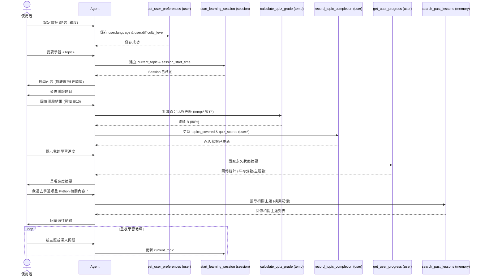

# Tutorial 08：State 與記憶體管理（狀態與記憶管理）

一個「個人學習導師（Personal Learning Tutor）」教學範例，展示如何在 ADK（Agent Development Kit，智能代理開發套件）中利用多層次狀態（State）與記憶（Memory）能力來構建具備學習成效追蹤的代理。

## 🚀 快速開始（Quick Start）

```bash
# 安裝相依套件（dependencies）
make setup

# 啟動代理（agent）
make dev

# 開啟 http://localhost:8000 並選擇 'personal_tutor'
```

## 💬 功能概述（What It Does）

此代理示範 ADK 的狀態管理系統，區分三種狀態型別：

- **永久狀態（Persistent State）**（`user:` 前綴）：儲存使用者偏好與學習歷史
- **工作階段狀態（Session State）**（無前綴）：追蹤目前的學習階段與主題
- **暫時狀態（Temporary State）**（`temp:` 前綴）：測驗分數計算與中間結果（使用後即丟棄）

### 核心特色（Key Features）

- 🎯 **使用者偏好（User Preferences）**：語言與難度等設定
- 📚 **進度追蹤（Progress Tracking）**：已完成主題與測驗分數紀錄
- 🧠 **記憶搜尋（Memory Search）**：查詢過往學習工作階段
- 📊 **學習分析（Learning Analytics）**：進度摘要與統計
- 🔄 **工作階段管理（Session Management）**：追蹤目前學習主題

## 📁 專案結構（Project Structure）

```
tutorial08/
├── personal_tutor/        # 代理主程式實作（Agent implementation）
│   ├── __init__.py        # 套件標記（Package marker）
│   ├── agent.py           # 具 6 個狀態管理工具的代理
│   └── .env.example       # API 金鑰範例檔
├── tests/                 # 完整測試套件（21 個測試）
├── requirements.txt       # 相依套件
└── Makefile               # 建置與操作指令
```

## 🔧 安裝設定（Setup）

1. **取得 API Key**：前往 [Google AI Studio](https://aistudio.google.com/app/apikey)
2. **安裝**：執行 `make setup`
3. **設定環境變數**：複製 `.env.example` 為 `.env` 並填入你的 API 金鑰
4. **啟動**：執行 `make dev`

## 🧪 測試（Testing）

```bash
make test    # 執行完整測試套件
make demo    # 示範對話流程（conversation flows）
```

## 狀態時序圖

以下以「時序圖（sequence diagram）」呈現使用者、代理與各狀態管理工具的互動流程，並標示不同狀態層級：



狀態前綴說明：`user:` = 永久偏好/歷史；`temp:` = 單次呼叫暫存；無前綴 = 工作階段上下文。

## 🎯 推薦對話流程（Try These Conversation Flows）

### 1. 設定偏好（Set Preferences）

```text
使用者：將我的語言設定為西班牙文，難度設為中級
代理：偏好已儲存：es，中級程度
```

### 2. 開始學習（Start Learning）

```text
使用者：開始學習 Python 類別
代理：已開始學習工作階段：Python 類別，中級程度
```

### 3. 完成測驗（Complete Quiz）

```text
使用者：我的測驗得了 10 題中的 8 題
代理：測驗成績：B（80.0%）
```

### 4. 檢視進度（Check Progress）

```text
使用者：顯示我的學習進度
代理：已完成主題：1 個，平均分數：80.0
```

### 5. 搜尋記憶（Search Memory）

```text
使用者：我學過哪些關於 Python 的內容？
代理：找到 1 個與「python」相關的過往工作階段：Python 類別
```

## 🛠️ 狀態管理工具（State Management Tools）

| 工具（Tool）              | 目的（Purpose）      | 狀態型別（State Type）        |
| ------------------------- | -------------------- | ----------------------------- |
| `set_user_preferences`    | 儲存語言/難度設定    | 永久（Persistent，`user:`）   |
| `record_topic_completion` | 記錄已完成主題       | 永久（Persistent，`user:`）   |
| `get_user_progress`       | 顯示學習統計         | 讀取永久狀態（Persistent）    |
| `start_learning_session`  | 開始新主題           | 工作階段（Session）           |
| `calculate_quiz_grade`    | 計算測驗成績         | 暫時（Temporary，`temp:`）    |
| `search_past_lessons`     | 搜尋過往學習工作階段 | 記憶模擬（Memory simulation） |

## 📊 狀態前綴說明（State Prefixes Explained）

- **`user:`** — 永久跨工作階段保存（使用者偏好、歷史）
- **無前綴** — 限於目前工作階段（當前主題與上下文）
- **`temp:`** — 單次呼叫使用後即丟棄（計算/中間值）

## 🧪 測試涵蓋（Test Coverage）

- ✅ **21 個完整測試** 涵蓋所有功能
- ✅ **各工具單元測試（Unit tests）**
- ✅ **整合測試（Integration workflows）** 驗證端到端流程
- ✅ **狀態管理（State management）** 驗證
- ✅ **記憶操作（Memory operations）** 測試
- ✅ **代理設定（Agent configuration）** 檢查

## 📚 學習目標（Learning Objectives）

完成本教學後，你將理解：

- 如何使用 ADK 的狀態管理系統
- 不同狀態持久層級與適用情境
- 記憶服務整合模式（Memory integration patterns）
- 建構具學習能力的智能代理方法
- 全面性測試策略（Testing strategies）