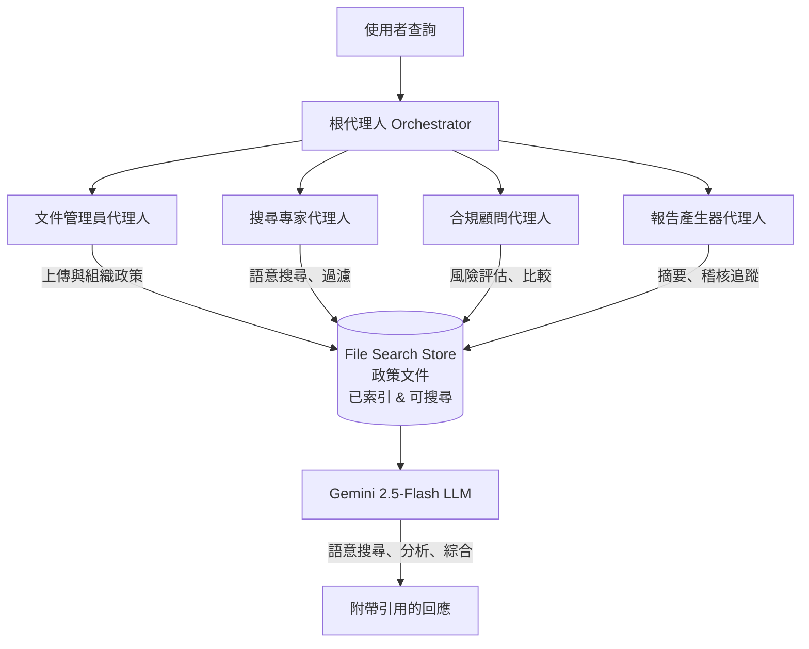

# 教學 37：企業合規與政策導航器 (Enterprise Compliance & Policy Navigator)

**使用 Google ADK 與 Gemini File Search API 實作原生 RAG**

## 🎯 概覽

本教學實作了一個**可直接用於生產環境的多代理人 (multi-agent) 系統**，利用 **Google 的 Gemini File Search API** 進行原生的檢索增強生成 (Retrieval Augmented Generation, RAG)，以管理、搜尋及分析公司政策。

### 商業價值

- **年度節省 $9K-$12K**：針對中型企業的實際估算
- **建置成本 $2.5K-3.5K**：3-5 個月的回收期
- **165-270% ROI**：第一年投資報酬率
- **90%+ 更快**的政策存取速度：從 5 分鐘縮短至 30 秒 (自動化查詢)
- **隨時可稽核 (Audit-ready)**：內建引用追蹤與合規軌跡

_注意：這是生產級的基礎架構。若要完全部署到生產環境，請加入重試邏輯、監控和速率限制。_

### 關鍵功能

- ✅ **原生 File Search 整合** - 具備語意搜尋的持久性文件儲存
- ✅ **多代理人架構** - 文件管理員 (Document Manager)、搜尋專家 (Search Specialist)、合規顧問 (Compliance Advisor)、報告產生器 (Report Generator)
- ✅ **Metadata 管理** - 依部門、類型、管轄區、敏感度組織政策
- ✅ **引用追蹤** - 自動來源歸屬以符合規性
- ✅ **稽核追蹤 (Audit Trails)** - 追蹤所有政策存取與決策
- ✅ **生產就緒 (Production Ready)** - 錯誤處理、日誌記錄與可觀測性

## 📁 專案結構

```
policy-navigator/
├── policy_navigator/           # 主套件
│   ├── __init__.py            # 套件匯出
│   ├── agent.py               # 多代理人系統
│   ├── tools.py               # 核心 File Search 工具 (8 個函式)
│   ├── stores.py              # Store 管理實用工具
│   ├── config.py              # 設定與環境
│   ├── metadata.py            # Metadata 結構描述與過濾器
│   └── utils.py               # 輔助實用工具
├── sample_policies/           # 範例政策文件
│   ├── hr_handbook.md
│   ├── it_security_policy.md
│   ├── remote_work_policy.md
│   └── code_of_conduct.md
├── tests/                     # 綜合測試套件
│   └── test_core.py          # 單元與整合測試
├── demos/                     # 展示腳本
│   ├── demo_upload.py        # 上傳政策
│   ├── demo_search.py        # 搜尋範例
│   └── demo_full_workflow.py  # 完整工作流程
├── docs/                      # 文件
│   ├── architecture.md
│   ├── roi_calculator.md
│   └── deployment_guide.md
├── Makefile                   # 標準建置指令
├── pyproject.toml             # Python 專案設定
├── requirements.txt           # 相依套件
├── .env.example               # 環境變數範本
└── README.md                  # 本檔案
```

## 🚀 快速入門

### 先決條件

- Python 3.9+
- 具備 Gemini 存取權限的 Google API 金鑰
- 約 10 MB 的可用儲存空間 (用於範例政策)

### 設定並執行完整工作流程

```bash
# 1. 進入教學目錄
cd policy-navigator

# 2. 安裝相依套件
make setup

# 3. 設定環境
cp .env.example .env
# 編輯 .env 並加入您的 GOOGLE_API_KEY

# 4. 建立 File Search Stores 並上傳政策
python demos/demo_upload.py

# 5. 搜尋政策 (在 stores 建立後)
python demos/demo_search.py

# 6. 執行完整工作流程
python demos/demo_full_workflow.py
```

### 重要提示：File Search 設定

File Search 要求在搜尋**之前**必須先建立 Stores 並填入文件。工作流程如下：

1. **建立 stores**: `client.file_search_stores.create()`
2. **上傳文件**: `client.file_search_stores.upload_to_file_search_store()`
3. **搜尋**: 使用帶有 file_search 設定的模型

`demo_upload.py` 腳本處理步驟 1-2。請在執行 `demo_search.py` 之前先執行它。

### 互動式使用

啟動 ADK 網頁介面進行互動式測試：

```bash
make dev
# 開啟 http://localhost:8000
```

## 📚 核心概念

### File Search vs 傳統 RAG

| 功能 | File Search (原生) | 外部向量資料庫 (External Vector DB) |
|---------|-------------|-------------------|
| **設定** | 簡單 (1 個函式) | 複雜 (嵌入 → 索引 → 搜尋) |
| **成本** | $0.15/百萬 tokens (僅索引) | $0.15/百萬 tokens + $25+/月 資料庫費用 |
| **儲存** | 持久性 (無限期) | 外部 (需自行管理) |
| **引用** | 內建 | 需手動擷取 |
| **搜尋品質** | 優異 (Gemini Embeddings) | 變異大 (自訂 Embeddings) |

### 架構



## 🛠️ 核心工具

系統提供 **8 個專用工具**：

### 1. upload_policy_documents()
上傳並索引多份政策到 File Search stores。

```python
from policy_navigator.tools import upload_policy_documents

result = upload_policy_documents(
    file_paths=["hr_handbook.md", "it_security_policy.md"],
    store_name="policy-navigator-hr",
    metadata_list=[metadata1, metadata2]
)
```

### 2. search_policies()
跨政策文件進行語意搜尋並附帶引用。

```python
result = search_policies(
    query="What are the vacation day policies?",
    store_name="policy-navigator-hr"
)
# 回傳：答案 + 來自來源文件的引用
```

### 3. filter_policies_by_metadata()
依部門、類型、管轄區、敏感度過濾政策。

```python
result = filter_policies_by_metadata(
    store_name="policy-navigator-hr",
    department="HR",
    policy_type="handbook"
)
```

### 4. compare_policies()
跨多個 stores 或文件比較政策。

```python
result = compare_policies(
    query="比較不同部門的休假政策",
    store_names=["policy-navigator-hr", "policy-navigator-it"]
)
```

### 5. check_compliance_risk()
評估合規風險並提供建議。

```python
result = check_compliance_risk(
    query="員工可以在其他國家工作嗎？",
    store_name="policy-navigator-hr"
)
```

### 6. extract_policy_requirements()
以結構化格式擷取特定需求。

```python
result = extract_policy_requirements(
    query="密碼要求",
    store_name="policy-navigator-it"
)
```

### 7. generate_policy_summary()
產生簡潔的政策資訊摘要。

```python
result = generate_policy_summary(
    query="遠端工作福利",
    store_name="policy-navigator-hr"
)
```

### 8. create_audit_trail()
為合規與治理建立稽核追蹤項目。

```python
result = create_audit_trail(
    action="search",
    user="john.doe@company.com",
    query="遠端工作政策",
    result_summary="已擷取遠端工作政策"
)
```

## 📖 使用範例

### 範例 1：員工詢問遠端工作事宜

```python
from policy_navigator.agent import root_agent

question = "我可以在家工作嗎？我需要做什麼？"

response = root_agent(question)
# 代理人：
# 1. 搜尋 HR 政策
# 2. 找到遠端工作政策
# 3. 回傳需求並附帶引用
```

### 範例 2：合規團隊比較政策

```python
from policy_navigator.tools import compare_policies

result = compare_policies(
    query="不同部門的休假政策有何不同？",
    store_names=["policy-navigator-hr", "policy-navigator-it"]
)

# 回傳結構化的比較結果，包含差異與建議
```

### 範例 3：經理需要快速簡報

```python
from policy_navigator.tools import generate_policy_summary

result = generate_policy_summary(
    query="我們的福利方案有哪些重點？",
    store_name="policy-navigator-hr"
)

# 回傳：包含重點與行動項目的執行摘要
```

## 🧪 測試

執行綜合測試套件：

```bash
# 所有測試
make test

# 僅單元測試
make test-unit

# 整合測試 (需要 API 金鑰)
make test-int

# 檢查覆蓋率
pytest tests/ --cov=policy_navigator --cov-report=html
```

## 📊 設定

### 環境變數 (.env)

```env
# 必填
GOOGLE_API_KEY=your-api-key

# 選填
GOOGLE_CLOUD_PROJECT=your-project-id
GOOGLE_CLOUD_LOCATION=us-central1

# File Search Stores
HR_STORE_NAME=policy-navigator-hr
IT_STORE_NAME=policy-navigator-it
LEGAL_STORE_NAME=policy-navigator-legal
SAFETY_STORE_NAME=policy-navigator-safety

# 模型
DEFAULT_MODEL=gemini-2.5-flash

# 除錯
DEBUG=false
```

### Metadata Schema

文件可以用 Metadata 標記以進行進階過濾：

```python
from policy_navigator.metadata import MetadataSchema

metadata = MetadataSchema.create_metadata(
    department="HR",
    policy_type="handbook",
    effective_date="2025-01-01",
    jurisdiction="US",
    sensitivity="internal",
    version=1,
    owner="hr@company.com",
    review_cycle_months=12
)
```

## 🔍 進階功能

### 多個 Stores

依類型或部門組織政策：

```python
from policy_navigator.stores import create_policy_store

hr_store = create_policy_store("company-hr-policies")
it_store = create_policy_store("company-it-procedures")
legal_store = create_policy_store("legal-compliance")
```

### Metadata 過濾

使用 AIP-160 過濾語法尋找特定政策：

```python
from policy_navigator.metadata import MetadataSchema

# 建立過濾器
filter_str = MetadataSchema.build_metadata_filter(
    department="IT",
    sensitivity="confidential",
    jurisdiction="US"
)

# 在搜尋中使用
result = search_policies(
    query="security policies",
    store_name="policy-navigator-it",
    metadata_filter=filter_str
)
```

### 稽核追蹤 (Audit Trail)

追蹤所有政策存取以符合規性：

```python
from policy_navigator.tools import create_audit_trail

create_audit_trail(
    action="search",
    user="manager@company.com",
    query="remote work approval criteria",
    result_summary="Found remote work policy with approval process"
)
```

## 📈 效能與成本

### 索引成本

- **一次性**：1 GB 文件約 $37.50 (索引費用 $0.15/1M tokens)
- **查詢成本**：每月 1,000 次查詢約 $3-5/月

### 回應時間

- **首次查詢**：2-3 秒 (初始化)
- **後續查詢**：500ms - 1s

### 儲存

- **持久性**：文件無限期儲存 (免費)
- **最大 store 大小**：建議 < 20 GB 以獲得最佳效能
- **第一年總成本**：約 $4,000 設定費 + 約 $37 查詢費 = $4,037

**定價驗證**：所有成本均已根據 Google Gemini API 官方文件驗證。詳情請參閱 `log/pricing_verification_official_sources.md`。

## 🔐 安全性與合規性

### 資料保護

- ✅ 所有 API 呼叫皆使用 HTTPS 加密
- ✅ 透過環境變數管理 API 金鑰
- ✅ 原始碼或 git 歷史記錄中無金鑰
- ✅ 所有政策存取的稽核追蹤

### 合規性

- ✅ 用於問責的引用追蹤
- ✅ 包含時間戳記與使用者的稽核追蹤
- ✅ 用於資料分類的 Metadata 標籤
- ✅ 基於角色的 Store 組織

## 📝 文件

- **[架構指南 (Architecture Guide)](docs/architecture.md)** - 詳細系統設計
- **[ROI 計算機 (ROI Calculator)](docs/roi_calculator.md)** - 商業案例分析
- **[部署指南 (Deployment Guide)](docs/deployment_guide.md)** - 生產環境部署

## 🎓 學習資源

- [Google ADK 文件](https://github.com/google/adk-python)
- [Gemini File Search API](https://ai.google.dev/gemini-api/docs/file-search)
- [教學系列](https://github.com/raphaelmansuy/adk_training)

## 🚀 下一步

1. ✅ 完成上述快速入門
2. 執行展示以查看所有功能
3. 將範例政策調整為您的組織政策
4. 部署到生產環境 (參見部署指南)
5. 整合到 Slack/Teams (參見教學 33)
6. 監控使用情況並持續迭代

## 📞 支援

- **Issues**: GitHub Issues
- **Discussions**: GitHub Discussions
- **Training**: ADK Training Project 文件

---
### 重點摘要

- **核心概念**：企業合規與政策導航器，利用 Gemini File Search API 實現原生 RAG，提供比傳統外部向量資料庫更簡單且低成本的解決方案。
- **關鍵技術**：Google ADK、Gemini File Search (語意搜尋、引用)、多代理人系統 (Multi-Agent System)、Metadata 過濾。
- **重要結論**：本系統具備高 ROI、快速部署、安全性與合規性 (稽核追蹤)，適合企業內部文件檢索使用。
- **行動項目**：依照快速入門步驟設定環境，上傳政策文件，並執行展示腳本以驗證功能。
