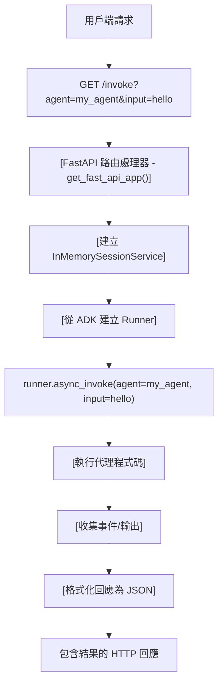

# 部署選項說明：ADK vs 自訂 FastAPI

**最後更新**：2025 年 10 月 17 日
**基於**：官方 ADK 文件 + 原始碼分析

---

## TL;DR: 您需要自訂 FastAPI 伺服器嗎？

| 問題                           | 答案                   | 使用路徑                   |
| ------------------------------ | ---------------------- | -------------------------- |
| **想要盡快部署？**             | ✅ 不需要自訂伺服器     | `adk deploy cloud_run/gke` |
| **需要自訂驗證？**             | ❌ 是的，需要自訂伺服器 | 教學 23（此 repo）         |
| **需要進階日誌/監控？**        | ❌ 是的，需要自訂伺服器 | 教學 23（此 repo）         |
| **需要特定業務邏輯端點？**     | ❌ 是的，需要自訂伺服器 | 教學 23（此 repo）         |
| **只是做原型 (Prototyping)？** | ✅ ADK 內建的就可以了   | `adk deploy cloud_run/gke` |
| **具有合規性需求的生產環境？** | ❌ 是的，建議自訂伺服器 | 教學 23（此 repo）         |

---

## ADK 內建伺服器如何運作（底層發生了什麼）

當您執行 `adk deploy cloud_run`、`adk deploy gke` 或 `adk deploy agent_engine` 時，ADK 會自動執行以下操作：

### 1. **程式碼產生階段**

ADK 在暫存資料夾中自動產生數個檔案：

```
temp_folder/
├── Dockerfile              # 容器定義
├── main.py                 # FastAPI 應用程式
└── agents/
    └── your_agent_code/
```

### 2. **Dockerfile（自動產生）**

```dockerfile
FROM python:3.11-slim
WORKDIR /app

# 建立非 root 使用者
RUN adduser --disabled-password --gecos "" myuser

# 複製檔案
COPY requirements.txt .
RUN pip install --no-cache-dir -r requirements.txt
COPY . .

# 使用 uvicorn 執行 FastAPI 伺服器
USER myuser
CMD ["sh", "-c", "uvicorn main:app --host 0.0.0.0 --port $PORT"]
```

**重點**：ADK 使用 `uvicorn` 來服務 FastAPI 應用程式

### 3. **main.py（自動產生）**

```python
# 由 ADK 自動產生
from google.adk.cli.fast_api import get_fast_api_app

# ADK 的內建函式建立 FastAPI 應用程式
app = get_fast_api_app(
    agents_dir="/app/agents",
    session_service_uri=SESSION_SERVICE_URI,
    allow_origins=ALLOWED_ORIGINS,
    web=SERVE_WEB_INTERFACE,
)

# Uvicorn 執行它
if __name__ == "__main__":
    import uvicorn
    uvicorn.run(app, host="0.0.0.0", port=8080)
```

### 4. **`get_fast_api_app()` 裡面有什麼？**

來自 `google.adk.cli.fast_api` 的 `get_fast_api_app()` 函式建立了一個 FastAPI 應用程式，包含：

**✅ 包含的端點：**
- `GET /` - API 資訊
- `GET /health` - 基本健康狀態
- `GET /agents` - 列出可用的代理
- `POST /invoke` - 執行代理
- `GET /docs` - 自動產生的 API 文件
- `GET /sessions` - 工作階段管理

**❌ 不包含：**
- ❌ 自訂驗證（無 Bearer token、API 金鑰等）
- ❌ 進階監控（無請求 ID、自訂指標）
- ❌ 自訂業務邏輯端點
- ❌ 結構化日誌模式
- ❌ 進階錯誤處理
- ❌ 速率限制
- ❌ 斷路器 (Circuit breakers)
- ❌ 自訂健康檢查邏輯

### 5. **部署流程**

```
YOUR AGENT CODE
      ↓
adk deploy cloud_run/gke
      ↓
[ADK Auto-Generates]
├── Dockerfile (shown above)
├── main.py (with get_fast_api_app())
└── requirements.txt
      ↓
[Container Built]
      ↓
[Deployed to Platform]
      ↓
Live FastAPI Server
(using ADK's built-in get_fast_api_app)
```

---

## 路徑 1：簡易部署（ADK 內建伺服器）

### 何時使用此路徑

✅ **非常適合：**
- 快速原型
- 內部工具
- 非生產部署
- 學習 ADK
- 測試代理
- MVP 開發

❌ **不適合：**
- 具有合規性需求的生產環境
- 自訂安全性需求
- 特定監控需求
- 自訂業務邏輯

### 如何使用

```bash
# Cloud Run（推薦大多數情況）
adk deploy cloud_run \
  --project your-project-id \
  --region us-central1

# GKE（如果您有 Kubernetes）
adk deploy gke \
  --project your-project-id \
  --cluster_name your-cluster \
  --region us-central1

# Agent Engine（託管基礎設施）
adk deploy agent_engine \
  --project your-project-id \
  --region us-central1
```

### 您將獲得什麼

```
🎯 您的代理程式碼
├── ✅ 自動容器建置
├── ✅ FastAPI 伺服器 (get_fast_api_app)
├── ✅ 基本健康端點
├── ✅ 工作階段管理
├── ✅ 自動擴展
└── ✅ 公開 HTTPS URL
```

### 可用的端點

```bash
# 列出所有代理
curl https://your-service-url/agents

# 調用代理
curl -X POST https://your-service-url/invoke \
  -H "Content-Type: application/json" \
  -d '{"agent_name": "my_agent", "input": "Hello!"}'

# 健康檢查
curl https://your-service-url/health

# API 文件
curl https://your-service-url/docs
```

---

## 路徑 2：自訂部署（您自己的 FastAPI 伺服器）

### 何時使用此路徑

✅ **必須用於：**
- 生產部署
- 自訂驗證需求
- 進階監控/可觀察性
- 自訂業務邏輯
- 合規性/安全性標準
- 特定效能需求
- 自訂日誌模式
- 速率限制或斷路器

❌ **工作量較大，但在以下情況下是必要的：**
- 您需要完全控制 API
- 您有 ADK 預設值中沒有的特定需求
- 您正在建置生產系統

### 如何使用

建立您自己的 `main.py`：

```python
from fastapi import FastAPI
from google.adk.cli.fast_api import get_fast_api_app
# 或實作自訂伺服器（如教學 23）

# 選項 A：擴充 ADK 內建
app = get_fast_api_app(
    agents_dir="./agents",
    # 新增自訂中介軟體、路由等
)

# 選項 B：自訂實作（教學 23 方法）
from your_custom_server import app
```

### 教學 23：自訂生產伺服器

此儲存庫中的伺服器 (`tutorial23/production_agent/server.py`) 展示了：

**✅ 設定管理**
```python
from pydantic_settings import BaseSettings

class Settings(BaseSettings):
    model_config = SettingsConfigDict(env_file=".env")

    GOOGLE_CLOUD_PROJECT: str
    API_KEY: str
    REQUEST_TIMEOUT: int = 30
```

**✅ 驗證**
```python
def verify_api_key(token: str) -> bool:
    """驗證 Bearer token"""
    return token == settings.API_KEY
```

**✅ 帶有指標的健康檢查**
```python
@app.get("/health")
async def health():
    return {
        "status": "healthy",
        "request_count": metrics["request_count"],
        "error_rate": metrics["error_rate"],
    }
```

**✅ 結構化日誌**
```python
logger = logging.getLogger("my_agent")
logger.info("invoke_agent.started", extra={
    "request_id": request_id,
    "agent": agent_name,
})
```

**✅ 逾時保護**
```python
async def invoke_agent(request: QueryRequest):
    try:
        async with asyncio.timeout(settings.REQUEST_TIMEOUT):
            result = await runner.async_invoke(...)
    except asyncio.TimeoutError:
        return {"error": "Agent execution timeout"}
```

---

## 部署策略比較

| 方面       | ADK 內建 | 自訂伺服器 |
| ---------- | -------- | ---------- |
| 設定時間   | < 1 分鐘 | 30+ 分鐘   |
| 驗證       | 無       | 完全控制   |
| 日誌       | 基本     | 進階       |
| 監控       | 基本     | 完全控制   |
| 錯誤處理   | 基本     | 進階       |
| 速率限制   | 無       | 有         |
| 自訂端點   | 有限     | 無限       |
| 維護       | ADK 維護 | 您維護     |
| 最適合     | 原型     | 生產       |
| 程式碼大小 | ~50 行   | ~500 行    |
| 學習曲線   | 容易     | 中等       |

---

## 決策樹：我應該選擇哪條路徑？

```
開始：我想部署一個 ADK 代理
            |
            ├─ 這是為了學習/原型嗎？
            │  ├─ 是 → 使用路徑 1 (adk deploy)
            │  └─ 否 → 繼續
            │
            ├─ 我需要自訂驗證嗎？
            │  ├─ 是 → 使用路徑 2（自訂伺服器）
            │  └─ 否 → 繼續
            │
            ├─ 我需要進階監控嗎？
            │  ├─ 是 → 使用路徑 2（自訂伺服器）
            │  └─ 否 → 繼續
            │
            ├─ 這是生產工作負載嗎？
            │  ├─ 是 → 使用路徑 2（自訂伺服器）
            │  └─ 否 → 使用路徑 1 (adk deploy)
            │
            ├─ 我有特定的合規性需求嗎？
            │  ├─ 是 → 使用路徑 2（自訂伺服器）
            │  └─ 否 → 使用路徑 1 (adk deploy)
            │
            └─ 預設 → 使用路徑 1 (adk deploy)
```

---

## GKE 特定：兩個選項

### 選項 1：自動化 (`adk deploy gke`)

**ADK 做什麼：**
1. 建置 Docker 映像檔
2. 推送至 Artifact Registry
3. 產生 Kubernetes manifests
4. 部署至 GKE 叢集
5. 建立 LoadBalancer 服務

```bash
adk deploy gke \
  --project my-project \
  --cluster_name my-cluster \
  --region us-central1 \
  ./my_agent
```

**結果：** 您的代理在 GKE 上執行，使用自動產生的 `main.py` 和 `get_fast_api_app()`

### 選項 2：使用 kubectl 手動操作

**您做什麼：**
1. 建立您自己的 `main.py`
2. 建立 `Dockerfile`
3. 建置映像檔：`gcloud builds submit`
4. 建立 `deployment.yaml`
5. 部署：`kubectl apply -f deployment.yaml`

**優點：** 完全控制 `main.py` - 可以使用自訂伺服器

```yaml
# deployment.yaml
apiVersion: apps/v1
kind: Deployment
metadata:
  name: my-agent
spec:
  replicas: 3
  template:
    spec:
      containers:
      - name: my-agent
        image: gcr.io/my-project/my-agent:latest
        ports:
        - containerPort: 8080
        env:
        - name: PORT
          value: "8080"
```

---

## 底層：ADK 如何服務代理

### 請求流程（使用 ADK 內建伺服器）



### 涉及的關鍵 ADK 類別

```python
# from google.adk.cli.fast_api
get_fast_api_app()  # 建立包含所有端點的 FastAPI

# from google.adk.runners
Runner  # 執行代理

# from google.adk.sessions
InMemorySessionService  # 管理對話狀態

# from google.adk.agents
Agent  # 您的代理定義
```

---

## 生產檢查清單

### 如果使用路徑 1（ADK 內建）

- [ ] 測試 `/health` 端點
- [ ] 正確設定環境變數
- [ ] 啟用 Cloud Logging
- [ ] 設定自動擴展
- [ ] 設定 Cloud Monitoring 警報
- [ ] 記錄 API 端點文件
- [ ] 使用生產負載進行測試
- [ ] 規劃災難復原

### 如果使用路徑 2（自訂伺服器 - 教學 23）

- [ ] 以上路徑 1 的所有項目，加上：
- [ ] 設定驗證
- [ ] 設定自訂日誌
- [ ] 實作速率限制
- [ ] 正確設定 CORS
- [ ] 記錄驗證方案文件
- [ ] 測試錯誤情境
- [ ] 負載測試逾時
- [ ] 監控自訂指標
- [ ] 審查安全性模型
- [ ] 規劃 API 版本控制

---

## 真實世界範例

### 範例 1：新創 MVP
**需求：** "這週讓我們的 AI 代理上線"
**解決方案：** 路徑 1（ADK 內建）
```bash
adk deploy cloud_run --project startup-proj --region us-central1 ./agent
# 5 分鐘內完成！
```

### 範例 2：企業生產
**需求：**
- 自訂驗證 (OAuth2)
- 自訂日誌至 Cloud Logging
- 請求追蹤
- 每個客戶的速率限制
- 進階監控

**解決方案：** 路徑 2（自訂伺服器）
```python
# 具有所有這些功能的自訂伺服器（如教學 23）
# 以相同方式部署，但使用您自己的 main.py
```

### 範例 3：Kubernetes 多代理系統
**需求：**
- 在 GKE 上執行 3 個相關代理
- 共用工作階段狀態
- 自訂服務網格 (Service Mesh)
- 進階網路

**解決方案：** 路徑 2（自訂伺服器）+ 手動 GKE 部署
```bash
# 使用您的 main.py 建置自訂 Docker 映像檔
gcloud builds submit --tag gcr.io/.../my-agent
# 使用 kubectl 和自訂 manifests 部署
```

---

## 常見問題

### Q: 我可以使用 `get_fast_api_app()` 然後新增我自己的自訂路由嗎？

**A:** 是的！您可以取得 ADK 的應用程式，然後新增您的路由：
```python
app = get_fast_api_app(agents_dir="./agents")

# 新增您的自訂端點
@app.get("/custom")
async def custom_endpoint():
    return {"custom": "data"}
```

### Q: 如果我使用 `adk deploy`，我可以修改產生的 main.py 嗎？

**A:** 不行，ADK 會重新產生它。如需修改，請使用手動部署並搭配您自己的 `main.py`。

### Q: `get_fast_api_app()` 提供什麼驗證？

**A:** 預設沒有。您必須自己實作（見教學 23）。

### Q: 我應該總是為生產環境使用自訂伺服器嗎？

**A:** 不一定。對於簡單的內部工具，ADK 內建的就夠了。對於具有特定需求的客戶端 API，請使用自訂伺服器。

### Q: 我可以使用 `adk deploy` 部署教學 23 中的自訂伺服器嗎？

**A:** 不能直接部署。您需要手動部署（gcloud 或 kubectl）。

### Q: 效能有什麼差異？

**A:** 微乎其微。兩者都使用 uvicorn + FastAPI。自訂伺服器增加了驗證/日誌的小量開銷。

### Q: 我可以混合使用路徑 1 和路徑 2 嗎？

**A:** 是的，您可以使用 `adk deploy` 學習，然後切換到自訂伺服器進行生產。

---

## 摘要

|              | **路徑 1：ADK 內建**   | **路徑 2：自訂伺服器** |
| ------------ | ---------------------- | ---------------------- |
| **實作**     | `adk deploy cloud_run` | 自訂 `main.py` + 部署  |
| **設定時間** | 5 分鐘                 | 2-4 小時               |
| **驗證**     | 無                     | 完全控制               |
| **日誌**     | 基本                   | 進階                   |
| **最適合**   | 原型                   | 生產                   |
| **何時使用** | 學習、MVP              | 真實應用程式、合規性   |
| **教學**     | 官方 ADK 文件          | **教學 23**            |

---

## 下一步

1. **想快速部署？** → 使用 `adk deploy cloud_run`
2. **想了解生產模式？** → 研究 `tutorial23/production_agent/server.py`
3. **想要兩個選項？** → 先用 `adk deploy` 部署，然後重構為自訂伺服器
4. **有問題？** → 查看此目錄中的 `FASTAPI_BEST_PRACTICES.md`

---

**來源：**
- [官方 ADK 文件](https://google.github.io/adk-docs/)
- [ADK Python GitHub](https://github.com/google/adk-python)
- [Google Cloud Run 文件](https://cloud.google.com/run/docs)
- [GKE 部署文件](https://google.github.io/adk-docs/deploy/gke/)
