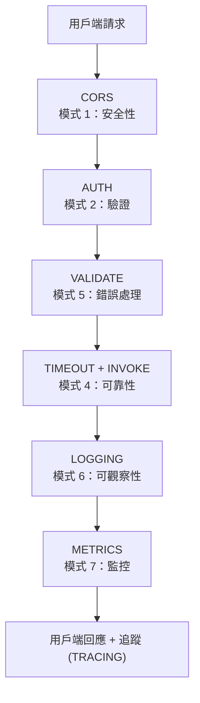
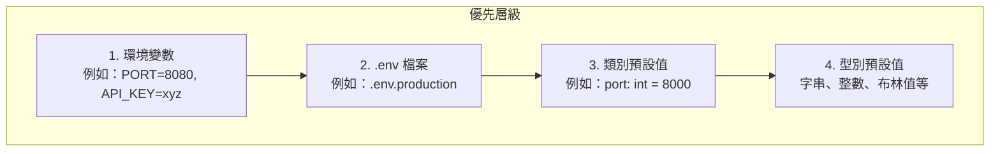
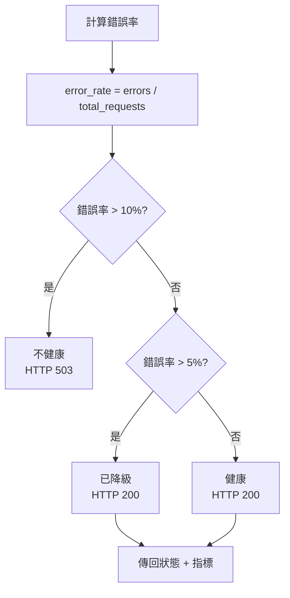
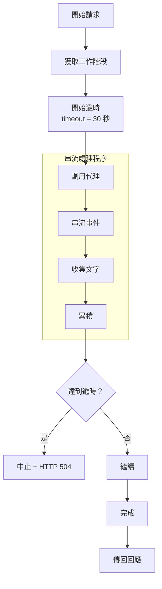
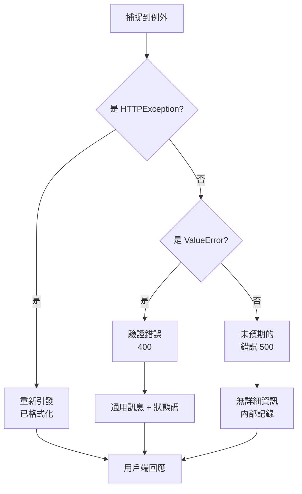
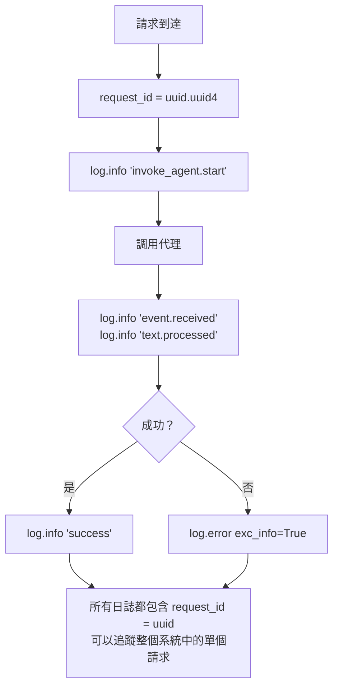
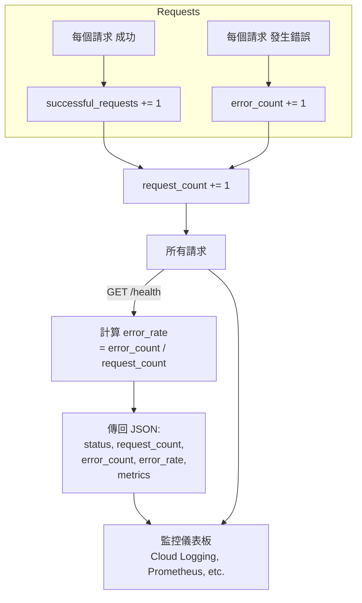
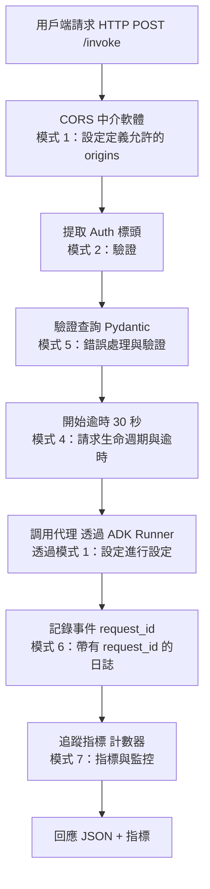

# ADK 代理的 FastAPI 最佳實務

透過 FastAPI 公開 Google ADK 代理的簡明指南，採用生產級模式。

## 為什麼選擇 FastAPI？

- **非同步原生 (Async Native)**：專為 Python async/await 打造，支援 ADK 的串流回應
- **自動文件**：自動產生 OpenAPI/Swagger 文件
- **型別安全**：完整的 Pydantic 驗證型別提示
- **效能**：最快的 Python Web 框架之一
- **開發者體驗**：最少的樣板程式碼，最大的清晰度

## 7 個核心模式

下圖顯示這 7 個模式如何在生產級 FastAPI 伺服器中協同運作：



所有模式皆透過 **模式 1：設定** (pydantic BaseSettings) 進行設定

### 1. 設定管理

使用 `pydantic.BaseSettings` 來管理基於環境的設定：

設定層級（優先順序由高至低）：



會依序檢查這三個層級，以第一個符合者為準。

使用 `pydantic.BaseSettings` 來管理基於環境的設定：

```python
from pydantic_settings import BaseSettings

class Settings(BaseSettings):
    app_name: str = "My Agent API"
    environment: str = os.getenv("ENVIRONMENT", "development")
    api_key: Optional[str] = os.getenv("API_KEY", None)
    enable_auth: bool = os.getenv("ENABLE_AUTH", "false").lower() == "true"
    request_timeout: int = int(os.getenv("REQUEST_TIMEOUT", "30"))

    class Config:
        env_file = ".env"

settings = Settings()
```

**好處：**

- 外部化設定 (12-factor app)
- 型別檢查設定
- 支援環境變數和預設值
- 易於測試（可覆寫）

### 2. 驗證與安全性

實作 Bearer token 驗證以供生產使用：

```python
from fastapi import HTTPException
from typing import Optional

async def verify_api_key(authorization: Optional[str] = None) -> None:
    """Verify API key if authentication is enabled."""
    if not settings.enable_auth:
        return

    if not authorization or not authorization.startswith("Bearer "):
        raise HTTPException(status_code=401, detail="Missing authorization")

    token = authorization.replace("Bearer ", "")
    if token != settings.api_key:
        raise HTTPException(status_code=403, detail="Invalid API key")
```

**在端點中的使用方式：**

```python
@app.post("/invoke")
async def invoke_agent(
    request: QueryRequest,
    authorization: Optional[str] = None
):
    await verify_api_key(authorization)
    # ... 其餘邏輯
```

### 3. 具有狀態追蹤的健康檢查

實作追蹤系統狀態的全面健康檢查：

基於錯誤率的健康狀態邏輯：



實作追蹤系統狀態的全面健康檢查：

```python
from enum import Enum
from datetime import datetime

class HealthStatus(Enum):
    HEALTHY = "healthy"
    DEGRADED = "degraded"
    UNHEALTHY = "unhealthy"

service_start_time = datetime.now()
request_count = 0
error_count = 0

@app.get("/health")
async def health_check():
    """Health check with real status logic."""
    uptime = (datetime.now() - service_start_time).total_seconds()
    error_rate = error_count / max(request_count, 1)

    # Determine status based on error rate
    if error_rate > 0.1:
        status = HealthStatus.UNHEALTHY
        http_status = 503
    elif error_rate > 0.05:
        status = HealthStatus.DEGRADED
        http_status = 200
    else:
        status = HealthStatus.HEALTHY
        http_status = 200

    response = {
        "status": status.value,
        "uptime_seconds": uptime,
        "error_rate": error_rate,
        "request_count": request_count
    }

    return JSONResponse(response, status_code=http_status)
```

### 4. 請求生命週期與逾時

使用逾時包裹代理調用以防止掛起：

具有逾時保護的請求流程：



使用逾時包裹代理調用以防止掛起：

```python
import asyncio
from google.adk.runners import Runner

@app.post("/invoke")
async def invoke_agent(request: QueryRequest):
    try:
        async with asyncio.timeout(settings.request_timeout):
            response_text = ""
            async for event in runner.run_async(
                user_id="api_user",
                session_id=session.id,
                new_message=new_message
            ):
                if event.content and event.content.parts:
                    text = event.content.parts[0].text
                    if text:
                        response_text += text
    except asyncio.TimeoutError:
        raise HTTPException(
            status_code=504,
            detail=f"Request exceeded {settings.request_timeout}s timeout"
        )
```

**關鍵點：**

- `asyncio.timeout()` 防止請求無限期掛起
- 在串接之前檢查文字是否不為 None
- 針對逾時傳回適當的 HTTP 504 狀態
- 追蹤 timeout_count 指標

### 5. 錯誤處理與驗證

使用型別例外和 Pydantic 模型進行驗證：

錯誤處理決策樹：



使用型別例外和 Pydantic 模型進行驗證：

```python
from pydantic import BaseModel, Field

class QueryRequest(BaseModel):
    """Request model with built-in validation."""
    query: str = Field(
        ...,
        min_length=1,
        max_length=10000,
        description="Query prompt"
    )
    temperature: float = Field(
        0.5,
        ge=0.0,
        le=2.0,
        description="Randomness: 0=deterministic, 2=creative"
    )

@app.post("/invoke", response_model=QueryResponse)
async def invoke_agent(request: QueryRequest):
    try:
        # Logic here
        pass
    except HTTPException as e:
        # Already formatted, re-raise
        raise
    except ValueError as e:
        # Validation errors
        raise HTTPException(status_code=400, detail="Invalid parameters")
    except Exception as e:
        # Unexpected errors - don't expose details
        logger.error(f"Unexpected error", exc_info=True)
        raise HTTPException(status_code=500, detail="An error occurred")
```

### 6. 日誌與可觀察性

實作帶有請求追蹤的結構化日誌：

每個步驟都有日誌的請求流程：



實作帶有請求追蹤的結構化日誌：

```python
import logging

def setup_logging() -> logging.Logger:
    """Configure structured logging."""
    logger = logging.getLogger(__name__)
    logger.setLevel(logging.INFO)

    handler = logging.StreamHandler()
    formatter = logging.Formatter(
        '%(asctime)s - %(name)s - %(levelname)s - %(message)s'
    )
    handler.setFormatter(formatter)
    logger.addHandler(handler)
    return logger

logger = setup_logging()

# In endpoints, use request IDs for tracing
request_id = str(uuid.uuid4())
logger.info(f"invoke_agent.start - request_id={request_id} query_len={len(request.query)}")

try:
    # ... agent invocation
    logger.info(f"invoke_agent.success - request_id={request_id} tokens={token_count}")
except Exception as e:
    logger.error(f"invoke_agent.error - request_id={request_id} error={str(e)}", exc_info=True)
```

### 7. 指標與監控

追蹤關鍵指標以進行可觀察性：

指標收集和暴露流程：



追蹤關鍵指標以進行可觀察性：

```python
# Global metrics
request_count = 0
successful_requests = 0
error_count = 0
timeout_count = 0

@app.post("/invoke")
async def invoke_agent(request: QueryRequest):
    global request_count, successful_requests, error_count, timeout_count

    request_count += 1

    try:
        # ... invoke agent
        successful_requests += 1
        return QueryResponse(...)
    except asyncio.TimeoutError:
        timeout_count += 1
        raise
    except Exception as e:
        error_count += 1
        raise
```

**在健康檢查中暴露指標：**

```python
response = {
    "status": status.value,
    "metrics": {
        "request_count": request_count,
        "successful_requests": successful_requests,
        "error_count": error_count,
        "timeout_count": timeout_count,
        "error_rate": error_count / max(request_count, 1)
    }
}
```

## 模式參考表

所有模式的請求流程圖：



| 模式 | 優點 | 範例 |
| -------------- | ----------------------------- | --------------------------------- |
| **設定** | 設定外部化 | `.env` 檔案，無硬編碼值 |
| **Auth** | 生產安全性 | Bearer token 驗證 |
| **健康** | 監控就緒 | 基於指標的真實狀態 |
| **逾時** | 可靠性 | 防止掛起的請求 |
| **驗證** | 資料完整性 | 帶有限制的 Pydantic 模型 |
| **日誌** | 除錯與追蹤 | 請求 ID，結構化日誌 |
| **指標** | 可觀察性 | 追蹤錯誤率，延遲 |

## 生產檢查清單

在部署到 Cloud Run 或生產環境之前：

- [ ] **設定**：所有敏感資料都在環境變數中，不在程式碼中
- [ ] **驗證**：在生產環境中啟用 API 金鑰或 OAuth2
- [ ] **健康檢查**：在協調器中設定 `/health` 端點
- [ ] **逾時**：為您的使用案例適當設定請求逾時
- [ ] **日誌**：日誌由協調器捕捉（Cloud Logging 等）
- [ ] **錯誤處理**：錯誤回應中不暴露堆疊追蹤 (stack traces)
- [ ] **CORS**：設定為特定 origins，而非萬用字元
- [ ] **測試**：所有測試通過且覆蓋率良好
- [ ] **指標**：為關鍵指標設定監控儀表板
- [ ] **優雅關機**：Lifespan 事件處理清理

## 常見陷阱

### ❌ 不要

```python
# 不要使用同步用戶端
response = runner.run(...)  # 這會阻塞！

# 不要暴露內部錯誤
raise HTTPException(status_code=500, detail=str(e))

# 不要硬編碼 API 金鑰
API_KEY = "sk-1234567890"

# 不要跳過逾時處理
async for event in runner.run_async(...):  # 可能會永遠掛起

# 不要忽略文字提取錯誤
text = event.content.parts[0].text  # 可能為 None！
```

### ✅ 要

```python
# 要使用非同步用戶端
async for event in runner.run_async(...):

# 要使用通用錯誤訊息
raise HTTPException(status_code=500, detail="An error occurred")

# 要使用環境變數
api_key = os.getenv("API_KEY")

# 要使用逾時包裹
async with asyncio.timeout(30):
    async for event in runner.run_async(...):

# 要檢查是否為 None
if text and text is not None:
    response_text += text
```

## 效能提示

1. **連線池**：跨請求重複使用 Runner 執行個體
2. **串流**：使用 `async for event in runner.run_async()` 進行串流回應
3. **快取**：在請求之間快取代理設定
4. **Workers**：使用多個 uvicorn workers：`uvicorn app:app --workers 4`
5. **全程非同步**：讓每個 I/O 操作都是非同步的

## 部署範例

### 本地開發

```bash
uvicorn production_agent.server:app --reload
```

### 生產 (Cloud Run)

```bash
# 建立帶有生產值的 .env
export PORT=8080
uvicorn production_agent.server:app --host 0.0.0.0 --port 8080
```

### 使用 Docker

```dockerfile
FROM python:3.12-slim
WORKDIR /app
COPY requirements.txt .
RUN pip install -r requirements.txt
COPY production_agent/ production_agent/
CMD ["uvicorn", "production_agent.server:app", "--host", "0.0.0.0", "--port", "8080"]
```

## 連結與資源

- [FastAPI 文件](https://fastapi.tiangolo.com/)
- [Google ADK](https://github.com/google/adk-python)
- [Pydantic 驗證](https://docs.pydantic.dev/latest/)
- [Cloud Run 最佳實務](https://cloud.google.com/run/docs/quickstarts/build-and-deploy)
- [Python asyncio](https://docs.python.org/3/library/asyncio.html)

## 完整範例

請參閱此儲存庫中的 `production_agent/server.py`，以取得所有這些模式協同運作的完整實作。
