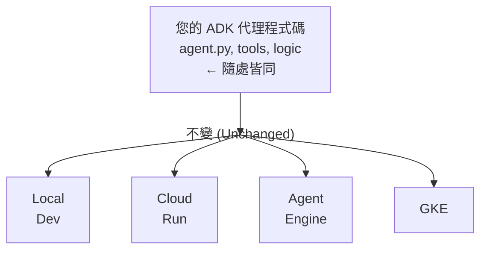

# 遷移指南：在部署平台之間移動您的代理

**以零停機時間將您的 ADK 代理從一個平台移動到另一個平台。**

---

## 概述

每個平台都有優點。您可能想要遷移：

- **Local → Cloud Run**：從本地開始，移動到生產環境
- **Cloud Run → Agent Engine**：需要 FedRAMP 合規或託管基礎設施
- **Cloud Run → GKE**：需要進階協調或地端 (on-premises) 選項
- **GKE → Cloud Run**：從 Kubernetes 簡化回無伺服器

本指南涵蓋每個遷移路徑。

---

## 架構：什麼保持不變

您的 ADK 代理核心保持 **100% 不變**：



只有 **部署層** 會改變。

---

## 遷移路徑 1：Local → Cloud Run

**時間**：15 分鐘
**複雜度**：簡單
**停機時間**：無（平行啟動）

### 步驟 1：準備 Cloud Run

#### 1.1 建立 Dockerfile（若不存在）

```dockerfile
FROM python:3.11-slim

WORKDIR /app
COPY requirements.txt .
RUN pip install -r requirements.txt

COPY agent/ ./agent/
COPY server.py .

ENV PORT=8080
EXPOSE 8080

CMD ["python", "server.py"]
```

#### 1.2 更新 requirements.txt

```bash
pip freeze > requirements.txt
```

驗證：
- google-genai >= 1.15.0
- fastapi
- uvicorn[standard]

### 步驟 2：部署到 Cloud Run

```bash
# 1. 建置映像檔
gcloud builds submit --tag gcr.io/YOUR_PROJECT/agent \
  --region=us-central1

# 2. 部署
gcloud run deploy agent \
  --image gcr.io/YOUR_PROJECT/agent \
  --region us-central1 \
  --memory 2Gi \
  --timeout 3600 \
  --max-instances 100 \
  --allow-unauthenticated

# 3. 取得 URL
SERVICE_URL=$(gcloud run services describe agent \
  --region us-central1 --format 'value(status.url)')
echo $SERVICE_URL
```

### 步驟 3：測試 Cloud Run

```bash
# 測試健康狀態
curl $SERVICE_URL/health

# 測試調用
curl -X POST $SERVICE_URL/invoke \
  -H "Content-Type: application/json" \
  -d '{"query": "hello"}'
```

### 步驟 4：更新 DNS（如果適用）

```bash
# 更新您的網域以指向 Cloud Run URL
# 選項 A：CNAME 到 *.run.app
# 選項 B：使用 Cloud DNS

gcloud dns record-sets create agent.yourdomain.com \
  --ttl 300 \
  --type CNAME \
  --rrdatas your-service.run.app
```

### 步驟 5：停用本地環境

```bash
# 一旦 Cloud Run 驗證完成：
# - 停止本地部署
# - 刪除本地伺服器行程
# - 封存本地 Dockerfile
```

---

## 遷移路徑 2：Cloud Run → Agent Engine

**時間**：30 分鐘
**複雜度**：中等
**停機時間**：無（可能平行啟動）

### 步驟 1：封裝為 Agent

#### 1.1 建立 Agent 描述檔

Agent Engine 需要特定的結構。建立 `agent_config.yaml`：

```yaml
spec:
  display_name: "Your Agent Name"
  agent:
    model: "projects/YOUR_PROJECT/locations/us-central1/models/gemini-2.5-flash"
    tools:
      - name: "tool_name"
        description: "Tool description"
        input_schema:
          type: "object"
          properties:
            param:
              type: "string"
      - name: "another_tool"
        # ... 更多工具
```

#### 1.2 匯出 Agent 定義

從您現有的 Cloud Run 代理：

```bash
# 取得目前的代理設定
gcloud ai agents describe YOUR_AGENT \
  --format yaml > agent_config.yaml
```

### 步驟 2：部署到 Agent Engine

```bash
# 建立代理
gcloud ai agents create YOUR_AGENT \
  --config agent_config.yaml \
  --region us-central1 \
  --display-name "Your Agent"

# 注意：Agent Engine 部署與 Cloud Run 不同
# 工具直接在 Agent Engine 註冊
```

### 步驟 3：遷移工具

Agent Engine 以不同方式註冊工具：

```bash
# 註冊每個工具
gcloud ai agents register-tool YOUR_AGENT \
  --tool-definition tool_config.json \
  --region us-central1
```

工具設定格式：
```json
{
  "name": "tool_name",
  "description": "What tool does",
  "input_schema": {
    "type": "object",
    "properties": {
      "param": {"type": "string"}
    }
  },
  "function_declaration": {
    "name": "tool_name"
  }
}
```

### 步驟 4：測試 Agent Engine

```bash
# 建立測試對話
gcloud ai agents conversations create \
  --agent YOUR_AGENT \
  --region us-central1

# 傳送訊息
gcloud ai agents conversations send-message \
  --conversation YOUR_CONVERSATION \
  --message "hello" \
  --region us-central1
```

### 步驟 5：設定 OAuth（僅限 Agent Engine）

```bash
# Agent Engine 需要 OAuth 2.0
gcloud oauth2l fetch --credentials=YOUR_CREDENTIALS \
  cloud-platform
```

### 步驟 6：停用 Cloud Run（選用）

一旦 Agent Engine 運作正常：

```bash
# 選項 A：保留 Cloud Run 以向後相容
# 選項 B：刪除 Cloud Run 服務
gcloud run services delete agent --region us-central1
```

---

## 遷移路徑 3：Cloud Run → GKE

**時間**：60 分鐘
**複雜度**：複雜
**停機時間**：可以使用藍綠部署實現零停機

### 步驟 1：準備 GKE 叢集

#### 1.1 建立叢集

```bash
gcloud container clusters create agent-cluster \
  --zone us-central1-a \
  --num-nodes 2 \
  --machine-type n1-standard-2 \
  --enable-ip-alias \
  --enable-stackdriver-kubernetes \
  --addons HorizontalPodAutoscaling,HttpLoadBalancing
```

#### 1.2 建立 Workload Identity

```bash
# 建立服務帳戶
gcloud iam service-accounts create agent-workload \
  --display-name="Agent Workload"

# 綁定到 Kubernetes 服務帳戶
gcloud iam service-accounts add-iam-policy-binding \
  agent-workload@YOUR_PROJECT.iam.gserviceaccount.com \
  --role roles/iam.workloadIdentityUser \
  --member "serviceAccount:YOUR_PROJECT.svc.id.goog[default/agent-sa]"

# 建立 K8s 服務帳戶
kubectl create serviceaccount agent-sa
kubectl annotate serviceaccount agent-sa \
  iam.gke.io/gcp-service-account=agent-workload@YOUR_PROJECT.iam.gserviceaccount.com
```

### 步驟 2：建立 Kubernetes Manifests

#### 2.1 Deployment

```yaml
apiVersion: apps/v1
kind: Deployment
metadata:
  name: agent
spec:
  replicas: 3
  selector:
    matchLabels:
      app: agent
  template:
    metadata:
      labels:
        app: agent
    spec:
      serviceAccountName: agent-sa
      containers:
      - name: agent
        image: gcr.io/YOUR_PROJECT/agent:latest
        ports:
        - containerPort: 8080
        env:
        - name: PORT
          value: "8080"
        resources:
          requests:
            cpu: 500m
            memory: 1Gi
          limits:
            cpu: 1000m
            memory: 2Gi
        livenessProbe:
          httpGet:
            path: /health
            port: 8080
          initialDelaySeconds: 30
          periodSeconds: 10
```

#### 2.2 Service

```yaml
apiVersion: v1
kind: Service
metadata:
  name: agent-service
spec:
  selector:
    app: agent
  ports:
  - port: 80
    targetPort: 8080
  type: LoadBalancer
```

#### 2.3 Network Policy

```yaml
apiVersion: networking.k8s.io/v1
kind: NetworkPolicy
metadata:
  name: agent-policy
spec:
  podSelector:
    matchLabels:
      app: agent
  policyTypes:
  - Ingress
  - Egress
  ingress:
  - from:
    - namespaceSelector:
        matchLabels:
          name: ingress-nginx
    ports:
    - protocol: TCP
      port: 8080
  egress:
  - to:
    - namespaceSelector: {}
    ports:
    - protocol: TCP
      port: 443
```

### 步驟 3：部署到 GKE

```bash
# 取得憑證
gcloud container clusters get-credentials agent-cluster \
  --zone us-central1-a

# 套用 manifests
kubectl apply -f deployment.yaml
kubectl apply -f service.yaml
kubectl apply -f network-policy.yaml

# 取得服務 URL
kubectl get service agent-service
```

### 步驟 4：測試 GKE

```bash
# Port forward 以進行測試
kubectl port-forward service/agent-service 8080:80

# 本地測試
curl localhost:8080/health
curl -X POST localhost:8080/invoke \
  -H "Content-Type: application/json" \
  -d '{"query": "hello"}'
```

### 步驟 5：設定 Ingress（選用）

```yaml
apiVersion: networking.k8s.io/v1
kind: Ingress
metadata:
  name: agent-ingress
  annotations:
    cert-manager.io/cluster-issuer: "letsencrypt-prod"
spec:
  ingressClassName: nginx
  tls:
  - hosts:
    - agent.yourdomain.com
    secretName: agent-tls
  rules:
  - host: agent.yourdomain.com
    http:
      paths:
      - path: /
        pathType: Prefix
        backend:
          service:
            name: agent-service
            port:
              number: 80
```

### 步驟 6：藍綠遷移（零停機）

```bash
# 1. 保持 Cloud Run 運行 (藍)
# 2. 部署到 GKE (綠)
# 3. 將 5% 流量導向 GKE
kubectl set env deployment/agent TRAFFIC_SPLIT=5

# 4. 監控錯誤
kubectl logs -f deployment/agent

# 5. 逐步增加流量
kubectl set env deployment/agent TRAFFIC_SPLIT=50
# ... 等待 5 分鐘 ...
kubectl set env deployment/agent TRAFFIC_SPLIT=100

# 6. 刪除 Cloud Run
gcloud run services delete agent --region us-central1
```

---

## 遷移路徑 4：GKE → Cloud Run

**時間**：15 分鐘
**複雜度**：簡單
**停機時間**：無（可以平行部署）

### 步驟 1：匯出您的代理

```bash
# 取得運行中的容器映像檔
kubectl get deployment agent -o yaml | grep image:

# 範例：gcr.io/YOUR_PROJECT/agent:abc123
```

### 步驟 2：部署到 Cloud Run

```bash
gcloud run deploy agent \
  --image gcr.io/YOUR_PROJECT/agent:abc123 \
  --region us-central1 \
  --memory 2Gi
```

### 步驟 3：測試 Cloud Run

```bash
SERVICE_URL=$(gcloud run services describe agent \
  --region us-central1 --format 'value(status.url)')

curl $SERVICE_URL/health
```

### 步驟 4：刪除 GKE（選用）

```bash
# 一旦 Cloud Run 運作正常
gcloud container clusters delete agent-cluster
```

---

## 復原程序

### 如果 Cloud Run 遷移失敗

```bash
# 將 DNS 恢復到先前的服務
gcloud dns record-sets update agent.yourdomain.com \
  --rrdatas old-service.run.app

# 保留 Cloud Run 服務（尚未刪除）
# 恢復舊的基礎設施
```

### 如果 Agent Engine 遷移失敗

```bash
# 恢復到 Cloud Run
# Agent Engine 和 Cloud Run 可以並存

# 刪除失敗的代理
gcloud ai agents delete YOUR_AGENT

# 保持 Cloud Run 運行
```

### 如果 GKE 遷移失敗

```bash
# 在 GKE 部署期間保持 Cloud Run 服務在線
# 只有在 GKE 驗證運行 24+ 小時後才刪除 Cloud Run

# 復原：將 DNS 指回 Cloud Run
gcloud dns record-sets update agent.yourdomain.com \
  --rrdatas original-cloud-run.run.app
```

---

## 遷移檢查清單

每次遷移之前：

- [ ] 備份目前的設定
- [ ] 記錄目前的指標/效能
- [ ] 建立遷移操作手冊（本指南！）
- [ ] 先在 Staging 環境測試
- [ ] 通知使用者可能的短暫維護視窗
- [ ] 監控新部署 30 分鐘
- [ ] 準備好復原計畫
- [ ] 封存舊的部署設定（不要刪除）

每次遷移之後：

- [ ] 驗證所有端點運作正常
- [ ] 檢查錯誤日誌是否有問題
- [ ] 確認已套用安全性設定
- [ ] 更新 DNS/負載平衡器
- [ ] 監控 24 小時
- [ ] 記錄順利的部分
- [ ] 記錄遇到的問題

---

## 並排比較

| 方面 | Cloud Run | Agent Engine | GKE |
|--------|-----------|--------------|-----|
| **遷移時間** | 15 分鐘 | 30 分鐘 | 60 分鐘 |
| **停機時間** | 無 | 無 | 無（藍綠部署） |
| **複雜度** | 簡單 | 中等 | 困難 |
| **復原時間** | 5 分鐘 | 10 分鐘 | 20 分鐘 |
| **成本影響** | 相同 | 相似 | 相似 |
| **擴展** | 自動 | 自動 | 手動/HPA |
| **學習曲線** | 低 | 中等 | 高 |

---

## 常見遷移問題

### 問題：代理之前連接到 API

**問題**：遷移後，代理無法連線到外部 API

**解決方案**：
```bash
# 檢查防火牆規則
# 驗證 Secret Manager 存取權
# 確認 API 配額

# Cloud Run：新增 Egress VPC 連接器
# GKE：驗證 NetworkPolicy 允許 egress
```

### 問題：效能不同

**問題**：新平台比舊平台慢/快

**解決方案**：
```bash
# Cloud Run：調整記憶體配置
# GKE：調整資源請求 (requests)
# 檢查模型回應時間 vs 推論時間
```

### 問題：無法存取 Secrets

**問題**：環境變數/secrets 未載入

**解決方案**：
```bash
# Cloud Run：重新綁定 Secret Manager
gcloud run services update agent \
  --set-env-vars KEY=projects/YOUR_PROJECT/secrets/KEY/versions/latest

# GKE：從 Secret Manager 建立 secret
gcloud secrets versions access latest --secret=KEY | \
  kubectl create secret generic agent-secrets \
    --from-file=key=/dev/stdin
```

### 問題：監控無法運作

**問題**：遷移後看不到指標/日誌

**解決方案**：
```bash
# 驗證 Cloud Logging 已連接
gcloud logging sinks list

# 驗證適當的服務帳戶權限
gcloud projects get-iam-policy YOUR_PROJECT \
  --flatten="bindings[].members" \
  --filter="bindings.members:serviceAccount:*"
```

---

**✅ 完成此遷移指南以在平台之間安全移動。**
