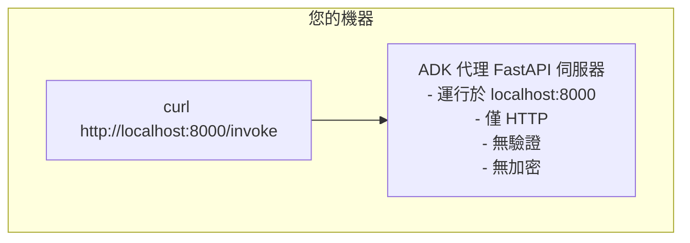
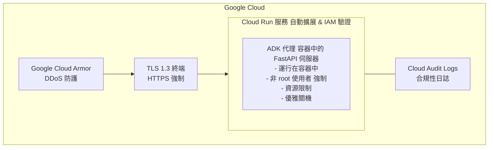
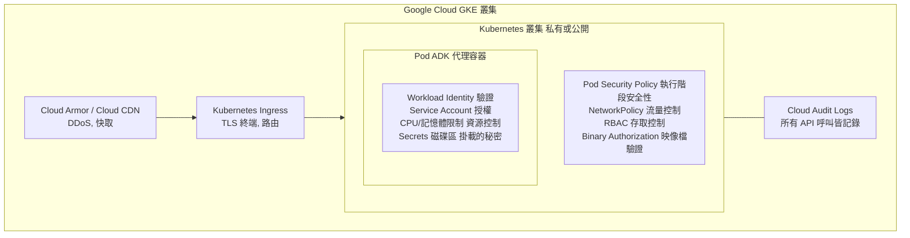
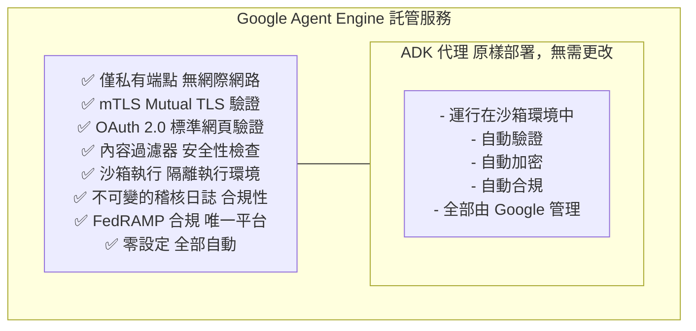
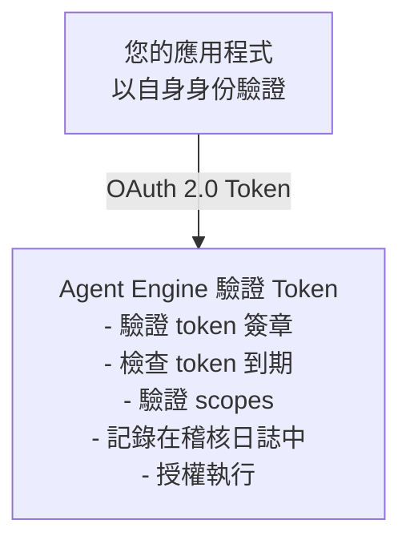
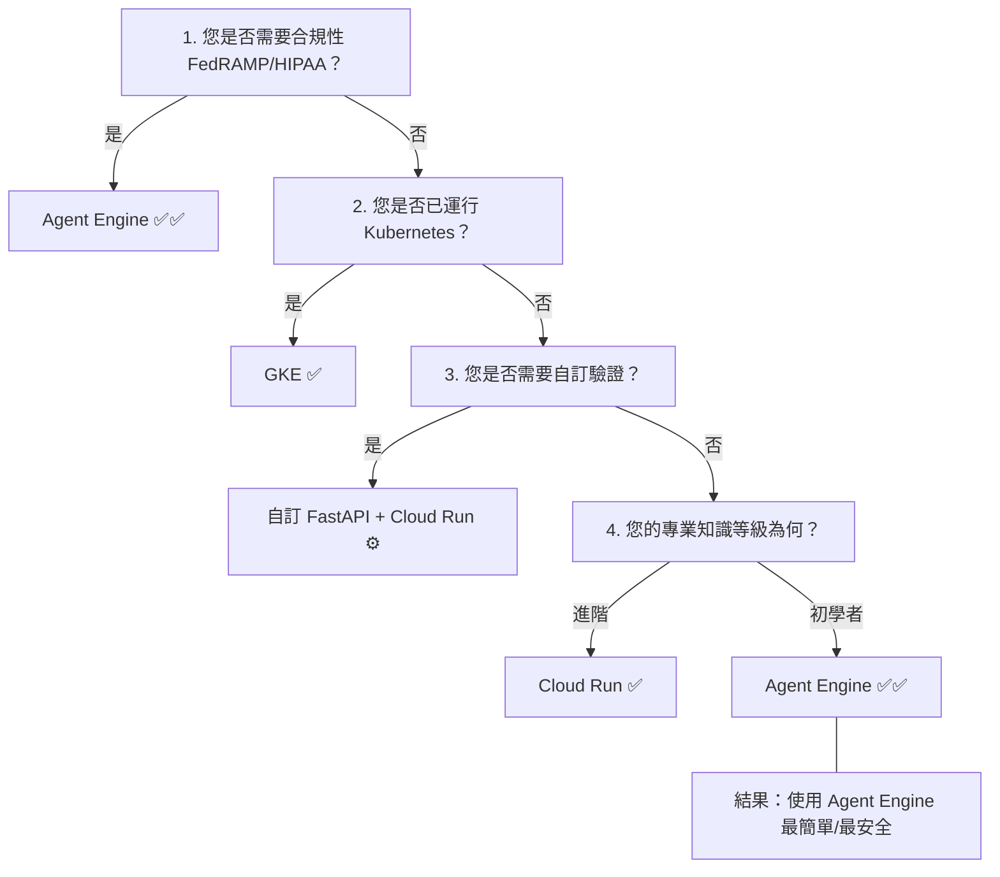

# 安全性分析：所有部署選項

**狀態**：✅ 完成
**範圍**：ADK 部署的詳細安全性分析
**最後更新**：2025 年 10 月 17 日

---

## 目錄

1. [ADK 內建伺服器架構](#adk-內建伺服器架構)
2. [本地開發 (Local Development)](#本地開發-local-development)
3. [Cloud Run](#cloud-run)
4. [Google Kubernetes Engine (GKE)](#google-kubernetes-engine-gke)
5. [Agent Engine](#agent-engine)
6. [安全性比較矩陣](#安全性比較矩陣)
7. [威脅模型分析](#威脅模型分析)
8. [實作模式](#實作模式)
9. [安全性決策架構](#安全性決策架構)

**配套文件**：
- 📋 [SECURITY_RESEARCH_SUMMARY.md](./SECURITY_RESEARCH_SUMMARY.md) - 給決策者的執行摘要
- 📖 [教學 23：生產部署](../../docs/tutorial/23_production_deployment.md) - 主要教學文件

---

## ADK 內建伺服器架構

### 什麼是 `get_fast_api_app()`？

ADK 透過 `get_fast_api_app()` 提供一個內建的 FastAPI 伺服器，提供：

```python
from google.adk import get_fast_api_app

app = get_fast_api_app(agent)

# 這提供：
# POST /invoke - 使用輸入執行代理
# GET /health - 健康檢查端點
# WebSocket /ws - 即時串流（如果啟用）
```

### 架構設計理念

**設計目標**：最小化、專注、平台無關

**理由**：
- 雲端平台現在是基礎設施安全性的專家
- 在 ADK 中增加安全性會與平台所做的重複
- 更好的關注點分離：ADK = 應用程式，平台 = 基礎設施
- 允許部署到任何雲端 (AWS, Azure, GCP, 地端)

### 核心端點

#### 1. POST /invoke

**目的**：使用使用者輸入執行代理

**請求**：
```json
{
  "prompt": "我應該使用什麼部署？",
  "session_id": "optional-session-id"
}
```

**回應**：
```json
{
  "response": "代理回應",
  "session_id": "session-id",
  "status": "success"
}
```

**安全性備註**：
- ✅ 輸入驗證（ADK 執行）
- ✅ 工作階段追蹤（ADK 執行）
- ❌ 驗證（平台執行）
- ❌ 速率限制（平台執行）
- ❌ 加密（平台執行）

#### 2. GET /health

**目的**：用於監控的健康檢查

**回應**：
```json
{
  "status": "healthy"
}
```

**安全性備註**：
- ✅ 無需驗證（為了監控而設計）
- ⚠️ 揭露代理正在運行（如有需要可停用）

#### 3. WebSocket /ws（選用）

**目的**：即時串流回應

**安全性備註**：
- ✅ 使用與 /invoke 相同的驗證
- ✅ 基於工作階段的驗證
- ❌ 驗證/加密由平台執行

### ADK 不提供的功能

| 功能 | 為什麼不提供 | 誰提供 |
|---------|---------|-----------------|
| TLS/HTTPS | 平台專長 | Cloud Run、Agent Engine、GKE |
| 驗證 | 平台專長 | Cloud Run IAM、Agent Engine OAuth |
| 授權 | 平台專長 | Cloud Run IAM、GKE RBAC |
| DDoS 防護 | 平台專長 | Google Cloud Armor |
| 速率限制 | 平台專長 | Cloud Run 配額、GKE ingress |
| 請求簽署 | 特定部署需求 | 自訂 FastAPI（如果需要） |
| 進階日誌 | 超出範圍 | 使用平台日誌 |

**模式**：「做好一件事」 - ADK 專注於代理執行，平台處理基礎設施。

---

## 本地開發 (Local Development)

### 架構



### 安全性特徵

**✅ 優點**：
- 開發即時回饋
- 程式碼熱重載
- 完整的除錯功能
- 無啟動延遲

**❌ 缺點**：
- 無加密（僅 HTTP）
- 無驗證
- 無速率限制
- 無 DDoS 防護
- 單執行緒（通常）
- 無稽核日誌
- 暴露給區域網路上的任何人

### 威脅模型

| 威脅 | 風險 | 緩解措施 |
|--------|------|-----------|
| **網路嗅探** | 🔴 高 | 僅在受信任的網路上使用 |
| **未經授權的存取** | 🔴 高 | 防火牆封鎖連接埠 8000 |
| **意外暴露** | 🔴 高 | 絕不將連接埠轉發到網際網路 |
| **開發資料外洩** | 🟡 中 | 使用非敏感測試資料 |
| **API 金鑰暴露** | 🔴 高 | 使用模擬金鑰，絕不使用真實金鑰 |

### 安全性檢查清單

- [ ] 僅運行於 localhost (不是 0.0.0.0)
- [ ] 防火牆從外部存取封鎖連接埠 8000
- [ ] 使用開發/模擬 API 金鑰（非生產）
- [ ] 本地環境中無生產資料
- [ ] 未將連接埠轉發到網際網路
- [ ] 如果在內部暴露，前方有 HTTPS 代理
- [ ] 團隊成員無法直接存取 API

### 適當的使用案例

✅ **適用於**：
- 學習 ADK 概念
- 生產前的本地測試
- 除錯代理行為
- 開發迭代
- 整合測試

❌ **不適用於**：
- 生產部署
- 處理真實客戶資料
- 暴露給外部使用者
- 任何形式的生產使用

### 過渡到生產環境

**絕不直接暴露本地開發伺服器**。相反地：
1. 使用 ADK 在本地編寫程式碼
2. 在本地測試
3. 部署到 Cloud Run/Agent Engine
4. 在生產環境中測試
5. 使用 Cloud Logging 進行監控

---

## Cloud Run

### 架構



### 安全性功能（自動）

| 功能 | 作用 | 您的設定 |
|---------|-------------|-------------------|
| **HTTPS/TLS 1.3** | 加密所有流量 | 無 - 自動 |
| **Google Cloud Armor** | DDoS 防護 | 選用（進階） |
| **Container Registry** | 掃描漏洞 | 自動 |
| **IAM 驗證** | 控制誰可以調用 | 在 Cloud Run 中設定 |
| **靜態資料加密** | 加密資料儲存 | 無 - 自動 |
| **傳輸中加密** | 加密網路流量 | 無 - 自動 |
| **非 Root 容器** | 防止權限提升 | 平台強制 |
| **網路隔離** | VPC 安全性 | 選用（進階） |
| **Cloud Audit Logs** | 記錄所有 API 呼叫 | 無 - 自動 |

### 您必須做的事

| 任務 | 重要性 | 範例 |
|------|-----------|---------|
| **秘密管理** | 🔴 關鍵 | 使用 Secret Manager 管理 API 金鑰 |
| **輸入驗證** | 🔴 關鍵 | 在程式碼中驗證代理輸入 |
| **資源限制** | 🟡 高 | 設定記憶體/CPU 限制 |
| **錯誤處理** | 🟡 高 | 記錄例外狀況，不暴露內部細節 |
| **監控** | 🟡 高 | 設定 Cloud Monitoring 警報 |
| **存取控制** | 🟡 高 | 使用 Cloud Run IAM 角色 |

### 部署安全性

**步驟 1**：建立具有安全性的容器

```bash
# Dockerfile 最佳實務
FROM python:3.11-slim

# 以非 root 身份運行
RUN useradd -m -u 1000 appuser
USER appuser

# 複製代理程式碼
COPY . /app
WORKDIR /app

# 安裝相依套件
RUN pip install --no-cache-dir -r requirements.txt

# 設定資源限制（在 Cloud Run UI 中）
CMD ["gunicorn", "-w", "4", "-b", "0.0.0.0:8080", "app:app"]
```

**步驟 2**：部署並啟用驗證

```bash
gcloud run deploy my-agent \
  --image gcr.io/my-project/my-agent:latest \
  --memory 512Mi \
  --cpu 1 \
  --region us-central1 \
  --no-allow-unauthenticated  # 要求 IAM 驗證
```

**步驟 3**：授權給受信任的主體 (Principals)

```bash
# 允許特定服務帳戶調用
gcloud run services add-iam-policy-binding my-agent \
  --member=serviceAccount:my-client@my-project.iam.gserviceaccount.com \
  --role=roles/run.invoker
```

### 驗證模式

#### 模式 1：服務對服務（推薦）

**設定**：
```python
# 用戶端程式碼
from google.auth.transport.requests import Request
from google.oauth2 import service_account

credentials = service_account.Credentials.from_service_account_file(
    'service-account.json',
    scopes=['https://www.googleapis.com/auth/cloud-platform']
)

request = Request()
credentials.refresh(request)

# 使用憑證呼叫 Cloud Run
headers = {
    'Authorization': f'Bearer {credentials.token}',
    'Content-Type': 'application/json'
}

response = requests.post(
    'https://my-agent-abc123.a.run.app/invoke',
    json={'prompt': '我應該做什麼？'},
    headers=headers
)
```

**安全性**：✅ 最佳 - 使用服務帳戶，不處理秘密

#### 模式 2：使用者驗證（透過前端）

**設定**：
```javascript
# 前端 (瀏覽器)
const idToken = await firebase.auth().currentUser.getIdToken();

const response = await fetch(
  'https://my-agent-abc123.a.run.app/invoke',
  {
    method: 'POST',
    headers: {
      'Authorization': `Bearer ${idToken}`,
      'Content-Type': 'application/json'
    },
    body: JSON.stringify({prompt: '我應該做什麼？'})
  }
);
```

**安全性**：✅ 良好 - 使用 Firebase auth token，瀏覽器安全處理

#### 模式 3：直接 API 金鑰（不推薦）

**設定**：
```bash
# 產生 API 金鑰（不建議用於生產）
gcloud run services update-traffic my-agent \
  --update-routes my-agent=100 \
  --allow-unauthenticated

# 用戶端必須使用 API 金鑰
curl -X POST https://my-agent-abc123.a.run.app/invoke \
  -H "Authorization: Bearer $API_KEY" \
  -H "Content-Type: application/json" \
  -d '{"prompt": "我應該做什麼？"}'
```

**安全性**：❌ 薄弱 - 共用秘密有風險

### 威脅模型

| 威脅 | 可能性 | 影響 | 緩解措施 |
|--------|-----------|--------|-----------|
| **網路嗅探** | 🟢 低 | 🔴 高 | TLS 1.3 (自動) |
| **DDoS 攻擊** | 🟡 中 | 🔴 高 | Cloud Armor (自動) |
| **未經授權的存取** | 🟡 中 | 🔴 高 | IAM 驗證 |
| **API 金鑰竊盜** | 🟡 中 | 🔴 高 | 使用 Secret Manager |
| **程式碼注入** | 🟡 中 | 🔴 高 | 輸入驗證 |
| **容器逃逸** | 🟢 低 | 🔴 高 | 非 root + 隔離 |
| **日誌暴露** | 🟡 中 | 🟡 中 | Cloud Audit Logs |

### 安全性檢查清單

**部署前**：
- [ ] 容器以非 root 使用者身份運行
- [ ] API 金鑰在 Secret Manager 中（非環境變數）
- [ ] 代理程式碼中有輸入驗證
- [ ] 錯誤處理不暴露內部細節
- [ ] 資源限制已設定 (--memory, --cpu)
- [ ] 部署檢查清單已審查

**部署後**：
- [ ] HTTPS 已驗證 (curl -I https://...)
- [ ] IAM 角色設定為最小權限
- [ ] Cloud Logging 已驗證
- [ ] 健康端點運作正常
- [ ] 驗證已測試（嘗試使用錯誤 token）
- [ ] 監控警報已設定
- [ ] DDoS 防護已啟用（選用）

### 成本估算

| 負載 | 預估成本 | 計算方式 |
|------|-----------|------------|
| **低** (100 請求/天) | ~$5/月 | 1-2 小時閒置 + 請求 |
| **中** (10K 請求/天) | ~$40/月 | 基於 Google 定價 |
| **高** (1M 請求/天) | ~$300/月 | 持續運算 |

**注意**：需另外加上模型 API 成本（Gemini 定價）。

---

## Google Kubernetes Engine (GKE)

### 架構



### 安全性功能（需要設定）

| 功能 | 作用 | 您的設定 |
|---------|-------------|-------------------|
| **Pod Security Policy** | 執行階段限制 | 設定 PSP（受限模式） |
| **Workload Identity** | 服務驗證 | 綁定 SA 到 K8s SA |
| **RBAC** | 存取控制 | 設定 roles/rolebindings |
| **NetworkPolicy** | 流量控制 | 定義 ingress/egress 規則 |
| **資源限制** | 防止 DoS | 設定 requests/limits |
| **秘密管理** | 秘密儲存 | 掛載 secrets 磁碟區 |
| **Binary Authorization** | 映像檔驗證 | 設定映像檔政策 |
| **稽核日誌** | 事件記錄 | 啟用 Cloud Audit Logs |

### 部署模式

**步驟 1**：建立 Kubernetes Secret

```bash
kubectl create secret generic api-key \
  --from-literal=GOOGLE_API_KEY=$GOOGLE_API_KEY \
  -n default
```

**步驟 2**：設定 Workload Identity

```bash
# 建立 K8s 服務帳戶
kubectl create serviceaccount adk-agent-sa -n default

# 建立 GCP 服務帳戶
gcloud iam service-accounts create adk-agent

# 綁定它們
gcloud iam service-accounts add-iam-policy-binding \
  adk-agent@project-id.iam.gserviceaccount.com \
  --role=roles/iam.workloadIdentityUser \
  --member="serviceAccount:project-id.svc.id.goog[default/adk-agent-sa]"

# 註釋 K8s SA
kubectl annotate serviceaccount adk-agent-sa \
  iam.gke.io/gcp-service-account=adk-agent@project-id.iam.gserviceaccount.com
```

**步驟 3**：部署並啟用安全性

```yaml
apiVersion: apps/v1
kind: Deployment
metadata:
  name: adk-agent
spec:
  replicas: 3
  selector:
    matchLabels:
      app: adk-agent
  template:
    metadata:
      labels:
        app: adk-agent
    spec:
      serviceAccountName: adk-agent-sa
      securityContext:
        runAsNonRoot: true
        runAsUser: 1000
        fsReadOnlyRootFilesystem: true
      containers:
      - name: agent
        image: gcr.io/my-project/adk-agent:latest
        imagePullPolicy: Always
        ports:
        - containerPort: 8080
        resources:
          requests:
            memory: "256Mi"
            cpu: "250m"
          limits:
            memory: "512Mi"
            cpu: "500m"
        env:
        - name: PORT
          value: "8080"
        volumeMounts:
        - name: secrets
          mountPath: /var/secrets
          readOnly: true
        - name: tmp
          mountPath: /tmp
        securityContext:
          allowPrivilegeEscalation: false
          readOnlyRootFilesystem: true
          capabilities:
            drop:
            - ALL
      volumes:
      - name: secrets
        secret:
          secretName: api-key
      - name: tmp
        emptyDir: {}
---
apiVersion: policy/v1
kind: PodDisruptionBudget
metadata:
  name: adk-agent
spec:
  minAvailable: 2
  selector:
    matchLabels:
      app: adk-agent
---
apiVersion: networking.k8s.io/v1
kind: NetworkPolicy
metadata:
  name: adk-agent
spec:
  podSelector:
    matchLabels:
      app: adk-agent
  policyTypes:
  - Ingress
  - Egress
  ingress:
  - from:
    - namespaceSelector:
        matchLabels:
          name: istio-system
    ports:
    - protocol: TCP
      port: 8080
  egress:
  - to:
    - namespaceSelector: {}
    ports:
    - protocol: TCP
      port: 443
  - to:
    - namespaceSelector: {}
    ports:
    - protocol: UDP
      port: 53
```

### 威脅模型

| 威脅 | 可能性 | 影響 | 緩解措施 |
|--------|-----------|--------|-----------|
| **Pod 逃逸** | 🟢 低 | 🔴 高 | PSP + securityContext |
| **橫向移動** | 🟡 中 | 🔴 高 | NetworkPolicy |
| **權限提升** | 🟢 低 | 🔴 高 | RBAC + Pod Security |
| **未經授權的存取** | 🟡 中 | 🔴 高 | Workload Identity |
| **資源耗盡** | 🟡 中 | 🟡 中 | 資源限制 |
| **秘密暴露** | 🟡 中 | 🔴 高 | 加密的 secrets |
| **容器映像檔篡改** | 🟢 低 | 🔴 高 | Binary Authorization |

### 安全性檢查清單

**部署前**：
- [ ] Pod Security Policy 已設定（受限）
- [ ] Workload Identity 綁定已驗證
- [ ] RBAC 角色範圍最小化
- [ ] 資源限制已設定 (requests/limits)
- [ ] Secrets 靜態加密
- [ ] NetworkPolicy 已定義
- [ ] Binary Authorization 已啟用
- [ ] 容器映像檔已掃描漏洞

**部署後**：
- [ ] Pod 成功啟動（無安全性錯誤）
- [ ] Workload Identity 運作中（可存取 GCP）
- [ ] RBAC 已測試（嘗試未經授權的存取）
- [ ] NetworkPolicy 運作中（驗證 ingress/egress）
- [ ] 稽核日誌已記錄
- [ ] 監控警報已設定

### 成本估算

| 叢集大小 | 預估成本 | 計算方式 |
|-------------|-----------|------------|
| **小型** (3 節點, n1-standard-1) | ~$200/月 | 基礎叢集 + 3 個節點 |
| **中型** (5 節點, n1-standard-2) | ~$500/月 | 較大節點，更多副本 |
| **大型** (10+ 節點) | $1000+/月 | 生產叢集 |

**加上**：模型 API 成本（Gemini 定價）、儲存、Ingress 成本。

---

## Agent Engine

### 架構



### 安全性功能（全部自動）

| 功能 | 作用 | 您的工作 |
|---------|-------------|-----------|
| **私有端點** | 無公開網際網路存取 | 無 - 自動 |
| **mTLS** | 用於驗證的 Mutual TLS | 無 - 自動 |
| **OAuth 2.0** | 標準網頁 token 驗證 | 無 - 自動 |
| **內容過濾器** | 輸出的安全性檢查 | 無 - 自動 |
| **沙箱化** | 隔離的執行環境 | 無 - 自動 |
| **稽核日誌** | 不可變的合規性日誌 | 無 - 自動 |
| **FedRAMP** | 政府合規標準 | 無 - 自動 |
| **傳輸中加密** | 所有通訊的 TLS | 無 - 自動 |
| **靜態資料加密** | 資料儲存加密 | 無 - 自動 |
| **自動修補** | 套用安全性更新 | 無 - 自動 |

### 部署（最簡單）

**步驟 1**：部署代理到 Agent Engine

```bash
adk deploy agent_engine \
  --project your-project-id \
  --region us-central1 \
  --agent-name my-agent
```

**就是這樣。** 所有安全性都是自動的。

**步驟 2**：調用代理（從授權的用戶端）

```python
from google.cloud import agent_service_v1beta1

client = agent_service_v1beta1.AgentsClient()

request = agent_service_v1beta1.ExecuteAgentRequest(
    agent=f"projects/your-project/locations/us-central1/agents/my-agent",
    input_data=agent_service_v1beta1.InputData(text="我應該做什麼？")
)

response = client.execute_agent(request=request)
print(response.output_data.text)
```

**所有安全性由 Agent Engine 處理**。

### 驗證模型



### 威脅模型

Agent Engine 的設計消除了大多數威脅：

| 威脅 | Agent Engine 緩解措施 | 您的行動 |
|--------|------------------------|------------|
| **網路嗅探** | 強制 mTLS | 無 |
| **DDoS 攻擊** | 隔離的基礎設施 | 無 |
| **未經授權的存取** | OAuth 2.0 驗證 | 正確驗證 |
| **程式碼注入** | 沙箱化執行 | 驗證輸入 |
| **合規性違規** | 不可變的稽核日誌 | 審查日誌 |
| **權限提升** | 沙箱化隔離 | 無 |
| **容器逃逸** | 由 Google 管理 | 無 |

### 安全性檢查清單

**部署前**：
- [ ] 代理程式碼有輸入驗證
- [ ] API 金鑰使用 Secret Manager
- [ ] 確定驗證方式 (OAuth 2.0)
- [ ] 了解稽核日誌需求

**部署後**：
- [ ] 代理成功執行
- [ ] 私有端點已驗證（無公開 URL）
- [ ] 驗證運作正常（嘗試無效 token）
- [ ] 稽核日誌可存取
- [ ] 符合合規性需求

**為什麼檢查清單這麼短？** Agent Engine 自動處理大多數安全性。

### 成本估算

| 使用量層級 | 預估成本 | 計算方式 |
|------------|-----------|------------|
| **開發** | ~$0-10/月 | 低量，免費層 |
| **低量** (1K 呼叫/天) | ~$20/月 | 最低執行時間 |
| **中量** (100K 呼叫/天) | ~$50/月 | 標準定價 |
| **高量** (1M 呼叫/天) | ~$200/月 | 持續執行 |

**加上**：模型 API 成本（Gemini 定價）。

**注意**：Agent Engine 比 Cloud Run 稍貴，但包含內建合規性。

---

## 安全性比較矩陣

### 功能完整性

| 安全性功能 | Local | Cloud Run | GKE | Agent Engine |
|-----------------|-------|-----------|-----|--------------|
| **TLS/HTTPS** | ❌ | ✅ | ⚠️ | ✅ |
| **驗證** | ❌ | ✅ | ⚠️ | ✅ |
| **授權** | ❌ | ⚠️ | ✅ | ✅ |
| **DDoS 防護** | ❌ | ✅ | ⚠️ | ✅ |
| **加密（傳輸中）** | ❌ | ✅ | ⚠️ | ✅ |
| **加密（靜態）** | ❌ | ✅ | ⚠️ | ✅ |
| **速率限制** | ❌ | ⚠️ | ⚠️ | ✅ |
| **稽核日誌** | ❌ | ✅ | ✅ | ✅ |
| **合規性就緒** | ❌ | ⚠️ | ⚠️ | ✅ |
| **零設定** | ❌ | ✅ | ❌ | ✅ |

圖例：✅ = 自動，⚠️ = 需要設定，❌ = 不可用

### 設定負擔

| 平台 | 設定複雜度 | 需要的安全性專業知識 | 持續維護 |
|----------|------------------|--------------------------|-------------------|
| **Local** | 極低 | 無 | 極低 |
| **Cloud Run** | 低 | 基礎 | 低 |
| **GKE** | 高 | 進階 (Kubernetes) | 高 |
| **Agent Engine** | 非常低 | 基礎 | 極低 |

### 合規性認證

| 合規性 | Local | Cloud Run | GKE | Agent Engine |
|-----------|-------|-----------|-----|--------------|
| **FedRAMP** | ❌ | ❌ | ❌ | ✅ |
| **HIPAA** | ❌ | ⚠️ 設定 | ⚠️ 設定 | ✅ |
| **PCI-DSS** | ❌ | ⚠️ 設定 | ⚠️ 設定 | ✅ |
| **SOC 2** | ❌ | ✅ 部分 | ✅ 部分 | ✅ |
| **GDPR** | ❌ | ✅ | ✅ | ✅ |

圖例：✅ = 內建，⚠️ = 需設定，❌ = 不可用

---

## 威脅模型分析

### 常見威脅與緩解措施

#### 威脅 1：網路竊聽

**情境**：攻擊者攔截 API 呼叫以讀取代理回應

| 平台 | 風險 | 緩解措施 |
|----------|------|-----------|
| **Local** | 🔴 高 | 防火牆，僅受信任網路 |
| **Cloud Run** | 🟢 低 | TLS 1.3 (自動) |
| **GKE** | 🟢 低 | TLS (設定) |
| **Agent Engine** | 🟢 低 | mTLS (自動) |

#### 威脅 2：未經授權的存取

**情境**：攻擊者在未經授權的情況下呼叫代理 API

| 平台 | 風險 | 緩解措施 |
|----------|------|-----------|
| **Local** | 🔴 高 | 無 auth 層 |
| **Cloud Run** | 🟡 中 | Cloud Run IAM (必須設定) |
| **GKE** | 🟡 中 | Workload Identity (必須設定) |
| **Agent Engine** | 🟢 低 | OAuth 2.0 (自動) |

#### 威脅 3：API 金鑰竊盜

**情境**：生產環境 API 金鑰在程式碼/日誌中洩漏

| 平台 | 風險 | 緩解措施 |
|----------|------|-----------|
| **Local** | 🔴 高 | 手動管理 |
| **Cloud Run** | 🟢 低 | Secret Manager + 稽核日誌 |
| **GKE** | 🟢 低 | 加密的 secrets + RBAC |
| **Agent Engine** | 🟢 低 | 無需金鑰 (僅 OAuth) |

#### 威脅 4：DDoS 攻擊

**情境**：攻擊者以大量請求淹沒代理端點

| 平台 | 風險 | 緩解措施 |
|----------|------|-----------|
| **Local** | 🔴 高 | 無保護 |
| **Cloud Run** | 🟢 低 | Cloud Armor (自動) |
| **GKE** | 🟡 中 | 選用 Cloud Armor |
| **Agent Engine** | 🟢 低 | 內建保護 |

#### 威脅 5：容器逃逸

**情境**：攻擊者突破容器以存取主機

| 平台 | 風險 | 緩解措施 |
|----------|------|-----------|
| **Local** | 🔴 高 | 無容器隔離 |
| **Cloud Run** | 🟢 低 | 非 root + gVisor 沙箱 |
| **GKE** | 🟡 中 | Pod Security Policy (必須設定) |
| **Agent Engine** | 🟢 低 | 沙箱化 (自動) |

#### 威脅 6：權限提升

**情境**：攻擊者在容器內獲得提升的權限

| 平台 | 風險 | 緩解措施 |
|----------|------|-----------|
| **Local** | 🔴 高 | 無控制 |
| **Cloud Run** | 🟢 低 | 強制非 root |
| **GKE** | 🟡 中 | securityContext (必須設定) |
| **Agent Engine** | 🟢 低 | 沙箱化使用者隔離 |

#### 威脅 7：合規性違規

**情境**：稽核日誌顯示未經授權的存取以進行合規性稽核

| 平台 | 風險 | 緩解措施 |
|----------|------|-----------|
| **Local** | 🔴 高 | 無稽核軌跡 |
| **Cloud Run** | 🟢 低 | Cloud Audit Logs (自動) |
| **GKE** | 🟢 低 | Cloud Audit Logs (必須啟用) |
| **Agent Engine** | 🟢 低 | 不可變的稽核日誌 (自動) |

---

## 實作模式

### 模式 1：公開 API（最低安全性）

**情境**：任何人皆可存取的公開聊天機器人

```python
# Cloud Run 部署
gcloud run deploy agent \
  --allow-unauthenticated  # 任何人皆可呼叫

# 結果：✅ 易於使用，❌ 無存取控制
```

**使用案例**：公開演示、教育工具、非敏感資料

**安全性等級**：🟡 中（僅平台安全性，無 auth）

---

### 模式 2：已驗證的 API（推薦）

**情境**：授權使用者的私有代理

```python
# Cloud Run 部署
gcloud run deploy agent \
  --no-allow-unauthenticated  # 要求驗證

# 用戶端 (具有 IAM 角色)
from google.auth.transport.requests import Request
from google.oauth2 import service_account

credentials = service_account.Credentials.from_service_account_file(
    'service-account.json'
)
credentials.refresh(Request())

response = requests.post(
    'https://my-agent.run.app/invoke',
    json={'prompt': '什麼？'},
    headers={'Authorization': f'Bearer {credentials.token}'}
)
```

**使用案例**：企業部署、生產系統

**安全性等級**：✅ 高（auth + 平台安全性）

---

### 模式 3：自訂 FastAPI + Cloud Run（進階）

**情境**：需要 IAM 以外的自訂驗證

```python
# server.py
from fastapi import FastAPI, HTTPException, Header
from google.adk import Agent

app = FastAPI()
agent = Agent(...)

# 自訂 LDAP 驗證
def verify_ldap(credentials: str):
    # 自訂 LDAP 驗證邏輯
    if not valid_ldap_user(credentials):
        raise HTTPException(status_code=401)

@app.post("/invoke")
async def invoke(
    prompt: str,
    authorization: str = Header(None)
):
    verify_ldap(authorization)  # 自訂 auth
    result = agent.invoke(prompt)
    return {"response": result}
```

**使用案例**：具有 LDAP/Kerberos 的企業部署

**安全性等級**：✅✅ 非常高（自訂 auth + 平台安全性）

---

### 模式 4：GKE 部署（企業級）

**請參閱上方的 GKE 部分以取得完整部署模式。**

**使用案例**：現有的 Kubernetes 基礎設施、複雜部署

**安全性等級**：✅✅ 非常高（需要專業知識）

---

### 模式 5：Agent Engine（最大安全性）

**情境**：需要合規性的部署

```bash
# 簡單部署
adk deploy agent_engine \
  --project your-project \
  --region us-central1

# 全部自動：
# ✅ OAuth 2.0
# ✅ mTLS
# ✅ FedRAMP 合規
# ✅ 沙箱化
# ✅ 稽核日誌
```

**使用案例**：政府、醫療保健、受監管產業

**安全性等級**：✅✅ 最大（完全託管）

---

## 安全性決策架構

### 決策樹



### 平台選擇表

| 您的情況 | 推薦平台 | 原因 | 成本 |
|---|---|---|---|
| **新創/MVP** | Cloud Run | 快速、安全、負擔得起 | ~$40/月 |
| **受監管產業** | Agent Engine | 內建 FedRAMP | ~$50/月 |
| **現有 K8s** | GKE | 利用投資 | ~$300/月 |
| **學習** | Local + Cloud Run | 開發然後生產 | $0-40/月 |
| **自訂 auth** | FastAPI + Cloud Run | 自訂邏輯 + 平台 | ~$60/月 |
| **最大合規性** | Agent Engine | 全部自動 | ~$50/月 |

---

## 結論

✅ **ADK 在所有四種部署選項中皆為生產安全。**

選擇符合您的平台：
1. **安全性需求** (local < Cloud Run < Agent Engine < GKE)
2. **合規性需求** (none < general < FedRAMP)
3. **營運專業知識** (simple < advanced)
4. **預算限制** ($0 < $50 < $500)

**推薦預設值**：
- **大多數團隊**：Cloud Run（極佳平衡）
- **受監管產業**：Agent Engine（包含合規性）
- **Kubernetes 優先**：GKE（強大、複雜）
- **學習**：Local，然後 Cloud Run

安心部署。

---

**文件狀態**：✅ 完成
**最後更新**：2025 年 10 月 17 日
**審查週期**：每季
