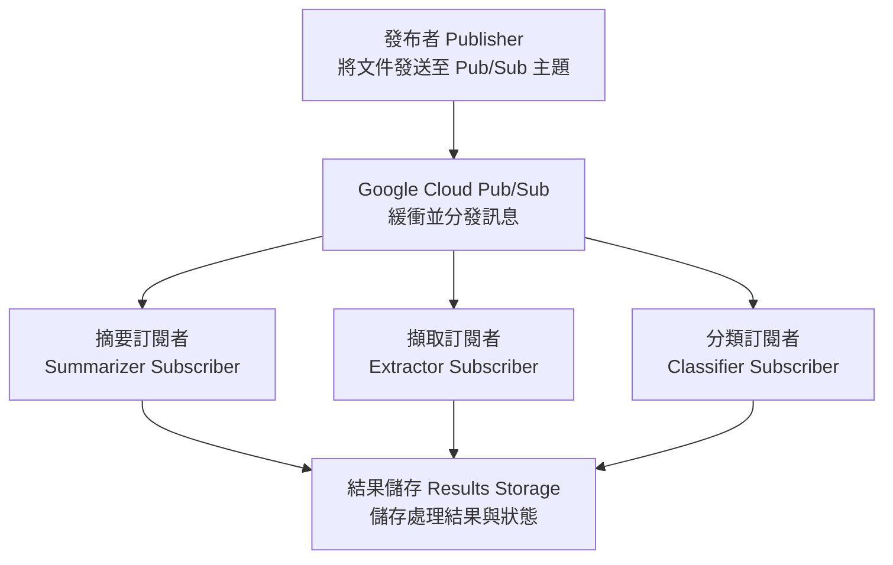
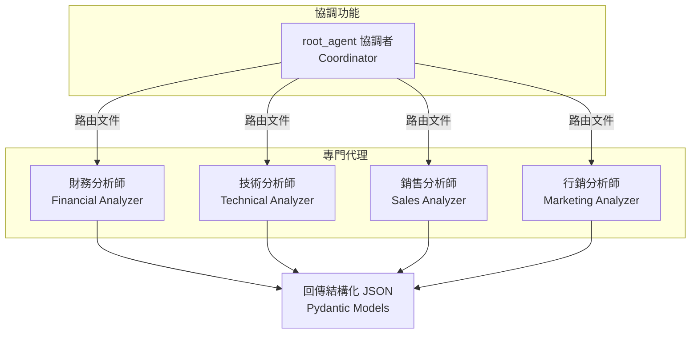
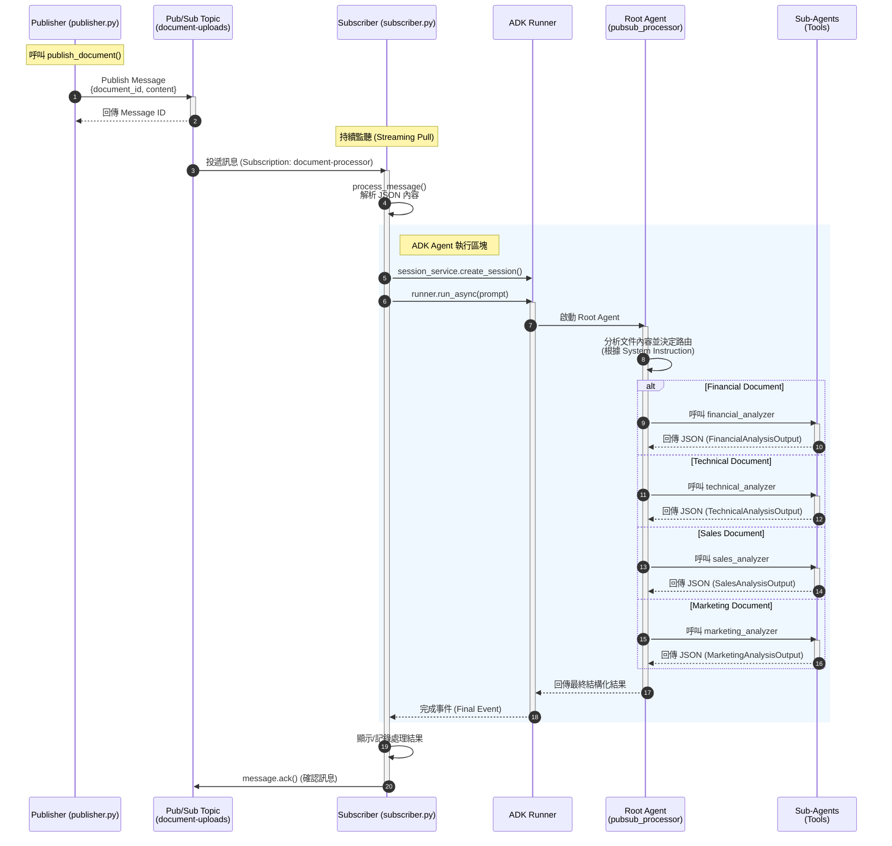

# 教學範例 34: Google Cloud Pub/Sub + 事件驅動代理

利用 Google Cloud Pub/Sub 和 ADK 代理建構可擴展的事件驅動文件處理管線，實現即時非同步處理。

## 快速開始

### 設定 (5 分鐘)

```bash
# 安裝相依套件
make setup

# 執行測試以驗證設定
make test
```

### 了解架構

本教學實作了一個 **事件驅動文件處理管線**：



## 元件

### 多重代理 (Multi-Agent) 架構

本教學實作了 **協調者 + 專門代理 (Coordinator + Specialized Agents)** 模式：



### 處理流程時序圖 (Processing Sequence)

下圖展示了從發布文件到代理處理的完整時序：



### `pubsub_agent/agent.py`

定義了一個協調者代理，負責將文件路由到專門的分析器：

#### 協調者代理：`root_agent`

主要的 ADK 代理，負責智慧路由文件：

```python
from pubsub_agent.agent import root_agent

# 代理屬性
root_agent.name           # "pubsub_processor"
root_agent.model          # "gemini-2.5-flash"
root_agent.description    # "Event-driven document processing coordinator" (事件驅動文件處理協調者)
root_agent.tools          # [financial_tool, technical_tool, sales_tool, marketing_tool]
```

#### 專門子代理 (Specialized Sub-Agents)

每個子代理都配置了 Pydantic 輸出結構描述 (Schema)，用於產生結構化的 JSON 回應：

1.  **財務分析師 (Financial Analyzer)** - 分析財務報告、收益、預算
    -   擷取：營收、利潤、利潤率、成長率、財政期間
    -   回傳：`FinancialAnalysisOutput` (Pydantic 模型)

2.  **技術分析師 (Technical Analyzer)** - 分析技術文件、架構、規格書
    -   擷取：技術、元件、部署資訊
    -   回傳：`TechnicalAnalysisOutput` (Pydantic 模型)

3.  **銷售分析師 (Sales Analyzer)** - 分析銷售管道、交易、預測
    -   擷取：客戶交易、管道價值、階段
    -   回傳：`SalesAnalysisOutput` (Pydantic 模型)

4.  **行銷分析師 (Marketing Analyzer)** - 分析行銷活動、參與度指標
    -   擷取：活動、參與率、轉換率
    -   回傳：`MarketingAnalysisOutput` (Pydantic 模型)

#### 使用協調者

代理會根據內容分析自動路由文件：

```python
from google.adk.agents import Runner
from pubsub_agent.agent import root_agent
import asyncio

async def process_document(content: str):
    runner = Runner(root_agent)
    result = await runner.run_async(
        user_id="processor",
        session_id="session_001",
        new_message=f"Analyze this document:\n{content}"
    )
    return result

# 範例：財務文件
financial_doc = "Q4 2024 Financial Report: Revenue $1.2M, Profit 33%"
result = asyncio.run(process_document(financial_doc))
# 代理自動路由至 financial_analyzer
# 回傳包含營收、利潤、建議的結構化 JSON
```

#### 輸出結構描述 (Output Schemas)

所有子代理都使用 Pydantic 模型強制執行結構化 JSON 輸出：

```python
from pubsub_agent.agent import (
    FinancialAnalysisOutput,
    TechnicalAnalysisOutput,
    SalesAnalysisOutput,
    MarketingAnalysisOutput,
    EntityExtraction,
    DocumentSummary
)

# 範例：FinancialAnalysisOutput 結構
{
    "summary": {
        "main_points": [...],
        "key_insight": "...",
        "summary": "..."
    },
    "entities": {
        "dates": ["2024-10-08"],
        "currency_amounts": ["$1.2M"],
        "percentages": ["35%"],
        "numbers": [...]
    },
    "financial_metrics": {
        "revenue": "$1.2M",
        "profit": "$400K",
        "margin": "33%",
        "growth_rate": "15%"
    },
    "fiscal_periods": ["Q4 2024"],
    "recommendations": [...]
}
```

## 使用範例

### 本地測試 (無需 GCP)

```bash
# 執行所有測試
make test

# 執行特定測試檔案
pytest tests/test_agent.py -v

# 執行並產出覆蓋率
make test-cov
```

### 在本地測試協調者代理

```python
import asyncio
from google.adk import Runner
from google.adk.sessions import InMemorySessionService
from google.genai import types
from pubsub_agent.agent import root_agent

async def test_agent():
    session_service = InMemorySessionService()
    runner = Runner(
        app_name="document_analyzer",
        agent=root_agent,
        session_service=session_service
    )

    # 為此測試建立一個工作階段
    session = await session_service.create_session(
        app_name="document_analyzer",
        user_id="test_user"
    )

    # 發送測試提示並串流事件
    prompt_content = types.Content(
        role="user",
        parts=[types.Part(text="Analyze this document: [test content]")]
    )

    final_result = None
    async for event in runner.run_async(
        user_id="test_user",
        session_id=session.id,
        new_message=prompt_content
    ):
        # 隨著代理處理串流事件
        final_result = event

    # 印出最終結果
    print("Agent response:", final_result)
    return final_result

# 執行測試
asyncio.run(test_agent())
```

### 使用 ADK 網頁介面

使用網頁 UI 進行互動式測試：

```bash
# 啟動 ADK 網頁伺服器
adk web

# 在瀏覽器中訪問 http://localhost:8000
# 從下拉選單中選擇 "pubsub_processor" 協調者代理
# 輸入您的文件分析請求
```

## Google Cloud 設定 (選用)

若要在 Google Cloud 上將此部署為真實的事件驅動管線：

### 0. 前置作業：設定 gcloud CLI

在建立資源之前，您需要驗證 Google Cloud：

#### A. 安裝 gcloud CLI

如果尚未安裝：

```bash
# macOS (使用 Homebrew)
brew install --cask google-cloud-sdk

# 或直接下載
# https://cloud.google.com/sdk/docs/install

# 驗證安裝
gcloud --version
```

#### B. 驗證 Google Cloud

```bash
# 登入您的 Google Cloud 帳戶
gcloud auth login

# 這將開啟瀏覽器視窗。使用您的 Google 帳戶登入。
# 系統將要求您授權給 gcloud CLI。
```

#### C. 設定預設專案

驗證後，設定您的預設 GCP 專案：

```bash
# 列出可用專案
gcloud projects list

# 設定預設專案 (替換為您的專案 ID)
gcloud config set project your-project-id

# 驗證設定
gcloud config get-value project

# 您應該會看到：your-project-id
```

#### D. 設定應用程式預設憑證 (選用但建議)

```bash
# 設定本地開發用的憑證
gcloud auth application-default login

# 這會建立本地憑證，讓 Python 函式庫可以直接使用
# 無需額外設定
```

#### E. 驗證您的設定

```bash
# 顯示目前設定
gcloud config list

# 範例輸出：
# [core]
# account = you@example.com
# project = your-project-id

# 測試驗證
gcloud auth list

# 範例輸出：
# ACTIVE  ACCOUNT
# *       you@example.com
```

### 1. 建立 GCP 專案

```bash
# 建立專案
gcloud projects create my-agent-pipeline --name="Agent Pipeline"

# 設定為活動專案
gcloud config set project my-agent-pipeline

# 啟用 API
gcloud services enable \
  pubsub.googleapis.com \
  run.googleapis.com \
  aiplatform.googleapis.com
```

### 2. 設定 Pub/Sub

```bash
# 建立上傳主題
gcloud pubsub topics create document-uploads

# 建立訂閱
gcloud pubsub subscriptions create document-processor \
  --topic=document-uploads \
  --ack-deadline=600
```

### 3. 設定驗證

```bash
# 建立服務帳戶
gcloud iam service-accounts create agent-pipeline \
  --display-name="Agent Pipeline"

# 授予 Pub/Sub 權限
gcloud projects add-iam-policy-binding my-agent-pipeline \
  --member="serviceAccount:agent-pipeline@my-agent-pipeline.iam.gserviceaccount.com" \
  --role="roles/pubsub.publisher"

gcloud projects add-iam-policy-binding my-agent-pipeline \
  --member="serviceAccount:agent-pipeline@my-agent-pipeline.iam.gserviceaccount.com" \
  --role="roles/pubsub.subscriber"

# 建立憑證金鑰
gcloud iam service-accounts keys create key.json \
  --iam-account=agent-pipeline@my-agent-pipeline.iam.gserviceaccount.com

# 設定環境變數
export GOOGLE_APPLICATION_CREDENTIALS="$(pwd)/key.json"
export GCP_PROJECT="my-agent-pipeline"
```

### 4. 發布文件

建立 `publisher.py`：

```python
import os
import json
from google.cloud import pubsub_v1
from datetime import datetime

project_id = os.environ.get("GCP_PROJECT")
topic_id = "document-uploads"

publisher = pubsub_v1.PublisherClient()
topic_path = publisher.topic_path(project_id, topic_id)

def publish_document(document_id: str, content: str):
    """Publish a document for processing."""
    message_data = {
        "document_id": document_id,
        "content": content,
        "uploaded_at": datetime.now().isoformat(),
    }

    data = json.dumps(message_data).encode("utf-8")
    future = publisher.publish(topic_path, data)
    message_id = future.result()

    print(f"✅ Published {document_id} (message ID: {message_id})")
    return message_id

# Example: Publish various document types
if __name__ == "__main__":
    # Financial document
    publish_document(
        "DOC-FINANCIAL-001",
        "Q4 2024 Financial Report: Revenue $1.2M, Profit 33%, Growth 15%"
    )

    # Technical document
    publish_document(
        "DOC-TECH-001",
        "API Architecture: Using REST with PostgreSQL database, deployed on Kubernetes"
    )

    # Sales document
    publish_document(
        "DOC-SALES-001",
        "Sales Pipeline: Acme Corp $500K deal (negotiating), TechStart $250K (open)"
    )

    # Marketing document
    publish_document(
        "DOC-MARKETING-001",
        "Campaign Results: 45% engagement, 3.2% conversion, 100K reach, $5K cost"
    )
```

```bash
# 發布文件
python publisher.py
```

### 5. 使用協調者代理處理文件

`subscriber.py` 使用協調者代理自動路由並分析文件：

```python
import os
import sys
import json
import asyncio
import logging
from google.cloud import pubsub_v1
from google.adk import Runner
from google.adk.sessions import InMemorySessionService
from google.genai import types
from pubsub_agent.agent import root_agent

# 抑制函式庫中嘈雜的偵錯訊息
logging.getLogger('google.auth').setLevel(logging.WARNING)
logging.getLogger('google.cloud').setLevel(logging.WARNING)
logging.getLogger('google.genai').setLevel(logging.WARNING)
logging.getLogger('absl').setLevel(logging.ERROR)

project_id = os.environ.get("GCP_PROJECT")
subscription_id = "document-processor"

subscriber = pubsub_v1.SubscriberClient()
subscription_path = subscriber.subscription_path(project_id, subscription_id)

async def process_document_with_agent(document_id: str, content: str):
    """使用 ADK root_agent 協調者處理文件。"""
    # 使用 app_name、agent 和 session_service 初始化 runner
    session_service = InMemorySessionService()
    runner = Runner(
        app_name="pubsub_processor",
        agent=root_agent,
        session_service=session_service
    )

    # 為此文件處理建立一個工作階段
    session = await session_service.create_session(
        app_name="pubsub_processor",
        user_id="pubsub_subscriber"
    )

    prompt = f"""分析此文件並將其路由到適當的分析器：

文件 ID: {document_id}

內容:
{content}

分析文件類型並擷取相關資訊。"""

    # 為代理建立一個正確的 Content 物件
    message_content = types.Content(
        role="user",
        parts=[types.Part(text=prompt)]
    )

    # 代理根據文件類型自動路由
    # 注意：run_async 回傳 AsyncGenerator，需迭代事件
    final_result = None
    async for event in runner.run_async(
        user_id="pubsub_subscriber",
        session_id=session.id,
        new_message=message_content
    ):
        final_result = event

    return final_result

def process_message(message):
    """使用非同步代理處理來處理 Pub/Sub 訊息。"""
    try:
        data = json.loads(message.data.decode("utf-8"))
        document_id = data.get("document_id")
        content = data.get("content")

        print(f"\n 處理中: {document_id}")

        # 執行非同步代理處理
        result = asyncio.run(process_document_with_agent(document_id, content))

        if result:
            # 從事件的內容中擷取文字
            response_text = ""
            if hasattr(result, 'content') and result.content and result.content.parts:
                for part in result.content.parts:
                    if part.text:
                        response_text += part.text

            if response_text:
                # 清理回應文字以便顯示
                display_text = response_text.strip()[:200]
                print(f"✅ 成功: {document_id}")
                print(f"   └─ {display_text}...")
            else:
                print(f"✅ 完成 {document_id} (無文字回應)")
        else:
            print(f"✅ 完成 {document_id}")

        # 確認訊息 (從佇列中移除)
        message.ack()

    except Exception as e:
        print(f"❌ 錯誤: {document_id} - {str(e)[:100]}")
        message.nack()

# 訂閱並處理
print("\n" + "="*70)
print("🚀 文件處理協調者")
print("="*70)
print(f"訂閱: {subscription_id}")
print(f"專案:      {project_id or '(未設定 - 本地模式)'}")
print(f"代理:        root_agent (多重分析器協調者)")
print("="*70)
print("等待訊息中...\n")

streaming_pull_future = subscriber.subscribe(
    subscription_path,
    callback=process_message
)

try:
    streaming_pull_future.result()
except KeyboardInterrupt:
    streaming_pull_future.cancel()
    print("\n" + "="*70)
    print("✋ 處理器已停止")
    print("="*70)
```

```bash
# 終端機 1 - 訂閱並處理
python subscriber.py

# 終端機 2 - 發布 (在另一個終端機中)
python publisher.py
```

## 專案結構

```
pubsub-agent/
├── pubsub_agent/              # 主要代理套件
│   ├── __init__.py            # 套件標記
│   ├── agent.py               # 包含工具的代理定義
│   └── .env.example           # 環境變數範本
├── tests/                     # 測試套件
│   ├── __init__.py
│   ├── test_agent.py          # 代理與工具測試
│   ├── test_imports.py        # 匯入驗證
│   └── test_structure.py      # 專案結構
├── Makefile                   # 開發指令
├── pyproject.toml             # 套件設定
├── requirements.txt           # 相依套件
├── README.md                  # 本檔案
├── publisher.py               # 發布者範例 (選用)
└── subscriber.py              # 訂閱者範例 (選用)
```


## 關鍵概念

### Pub/Sub 保證

| 功能 | 優點 |
| :--- | :--- |
| **至少一次傳遞 (At-least-once delivery)** | 訊息至少傳遞 1 次 (需處理重複) |
| **非同步 (Asynchronous)** | 非阻塞，快速的使用者體驗 |
| **可擴展 (Scalable)** | 自動擴展，從 0 到數百萬條訊息 |
| **可靠 (Reliable)** | 內建重試與錯誤處理 |
| **扇出 (Fan-out)** | 一個主題 → 多個訂閱 |

### 代理職責

`root_agent` 透過以下方式處理文件：

1.  **分析 (Analyzing)** 文件結構與內容
2.  **摘要 (Summarizing)** 重點與發現
3.  **擷取 (Extracting)** 實體 (日期、數字、貨幣等)
4.  **分類 (Classifying)** 文件類型與主題
5.  **識別 (Identifying)** 關鍵資訊

### 工具函式

每個工具回傳結構化回應：

```python
{
    'status': 'success' | 'error',
    'report': '人類可讀的訊息',
    'data': {...}  # 工具特定資料
}
```

## 進階模式

### 多重訂閱者 (Fan-out)

一個主題可以有多個訂閱：

```bash
# 建立多個訂閱
gcloud pubsub subscriptions create summarizer \
  --topic=document-uploads
gcloud pubsub subscriptions create extractor \
  --topic=document-uploads
gcloud pubsub subscriptions create classifier \
  --topic=document-uploads

# 每個訂閱都會獨立收到相同的訊息
```

### 死信佇列 (錯誤處理)

處理失敗的訊息：

```bash
# 建立 DLQ 主題
gcloud pubsub topics create document-dlq

# 建立帶有 DLQ 的訂閱
gcloud pubsub subscriptions create document-processor \
  --topic=document-uploads \
  --dead-letter-topic=document-dlq \
  --max-delivery-attempts=5
```

### 訊息排序

確保按順序處理：

```bash
# 建立有序主題
gcloud pubsub topics create ordered-documents --message-ordering

# 使用排序鍵發布
publisher.publish(
    topic_path,
    data,
    ordering_key=f"user_{user_id}"  # 每個鍵的訊息會按順序處理
)
```

## 疑難排解

### 問題："gcloud command not found"

**解決方案**：安裝 Google Cloud CLI

```bash
# macOS
brew install --cask google-cloud-sdk

# 或從此處下載：
# https://cloud.google.com/sdk/docs/install

# 安裝後初始化：
gcloud init
```

### 問題："ERROR: (gcloud.pubsub.topics.create) User does not have permission"

**原因**：未驗證或未設定專案

**解決方案**：

```bash
# 1. 檢查是否已登入
gcloud auth list

# 2. 如果沒有活動帳戶，請登入
gcloud auth login

# 3. 檢查專案是否已設定
gcloud config get-value project

# 4. 如果未設定，請立即設定
gcloud config set project your-project-id

# 5. 驗證權限
gcloud projects get-iam-policy your-project-id
```

### 問題："ERROR: (gcloud.config.set) Unable to find project"

**原因**：專案不存在或 ID 不正確

**解決方案**：

```bash
# 列出您的所有專案
gcloud projects list

# 尋找您的專案 ID (非顯示名稱)
# 設定正確的 ID
gcloud config set project correct-project-id

# 驗證設定
gcloud config get-value project
```

### 問題：應用程式憑證錯誤

**錯誤**：`DefaultCredentialsError: Could not automatically determine credentials`

**原因**：未設定本地開發用的應用程式憑證

**解決方案**：

```bash
# 設定應用程式預設憑證
gcloud auth application-default login

# 這將在以下位置建立憑證檔案：
# ~/.config/gcloud/application_default_credentials.json

# Python 將自動使用此檔案
```

### 問題："PERMISSION_DENIED: User does not have permission to access topic"

**原因**：服務帳戶缺少 Pub/Sub 權限

**解決方案**：

```bash
# 授予 Pub/Sub 角色給您的使用者帳戶
gcloud projects add-iam-policy-binding your-project-id \
  --member="user:your-email@example.com" \
  --role="roles/pubsub.editor"

# 或僅授予特定權限：
gcloud projects add-iam-policy-binding your-project-id \
  --member="user:your-email@example.com" \
  --role="roles/pubsub.admin"
```

### 問題："Messages Not Delivered" (訊息未傳遞)

**解決方案**：檢查訂閱是否存在且有監聽者

```bash
# 列出訂閱
gcloud pubsub subscriptions list

# 手動拉取一條訊息
gcloud pubsub subscriptions pull document-processor --limit=1
```

### 問題："High Latency" (高延遲)

**解決方案**：增加並行處理 (Parallelism)

```python
flow_control = pubsub_v1.types.FlowControl(
    max_messages=10,  # 一次處理 10 條
    max_bytes=10 * 1024 * 1024
)

subscriber.subscribe(
    subscription_path,
    callback=process_message,
    flow_control=flow_control
)
```

### 問題："Messages Re-delivered" (訊息重複傳遞)

**解決方案**：實作冪等性 (Idempotency)

```python
processed_ids = set()

def process_message(message):
    if message.message_id in processed_ids:
        message.ack()  # 已處理過
        return

    # 處理...
    processed_ids.add(message.message_id)
    message.ack()
```

## 測試

### 執行所有測試

```bash
make test
```

### 執行特定測試

```bash
# 代理功能測試
pytest tests/test_agent.py -v

# 匯入與模組測試
pytest tests/test_imports.py -v

# 專案結構測試
pytest tests/test_structure.py -v
```

### 測試覆蓋率

```bash
make test-cov
```

## 下一步

1.  **部署至 Cloud Run**：跨區域擴展代理處理能力
2.  **新增 UI**：建立具有 WebSocket 更新的即時儀表板
3.  **監控**：設定 Cloud Monitoring 和警報
4.  **最佳化**：使用訊息排序和批次處理
5.  **整合**：連接至外部服務 (Firestore, Storage 等)

## 資源

-   [Google Cloud Pub/Sub 文件](https://cloud.google.com/pubsub/docs)
-   [Google ADK 文件](https://google.github.io/adk-docs/)
-   [Python Pub/Sub 用戶端](https://cloud.google.com/python/docs/reference/pubsub)
-   [Pub/Sub 最佳實踐](https://cloud.google.com/pubsub/docs/best-practices)

## 指令摘要

```bash
# 設定
make setup              # 安裝相依套件

# 開發
make demo               # 顯示演示說明
make test               # 執行所有測試
make test-cov           # 執行測試並顯示覆蓋率

# 清理
make clean              # 移除快取和產物
```

## 作者筆記

本教學演示了如何使用 Google ADK 建構事件驅動架構。關鍵洞察在於 **解耦發布者與處理者** 能夠實現：

-   **可擴展性**：處理數百萬條訊息
-   **可靠性**：內建重試與錯誤處理
-   **靈活性**：新增訂閱者無需修改發布者
-   **效率**：非同步處理不會阻塞使用者

這裡的模式適用於文件處理、影像分析、資料分類以及許多其他真實世界的場景。

---

### 重點摘要 (程式碼除外)
- **核心概念**：事件驅動架構 (Event-Driven Architecture)、Pub/Sub 模型、多重代理協作 (Multi-Agent Collaboration)。
- **關鍵技術**：Google Cloud Pub/Sub, Google ADK (Agent Development Kit), Python, Pydantic, gcloud CLI。
- **重要結論**：通過解耦訊息的發送者與接收者，可以建立高可擴展、高可靠性的系統。使用 ADK 協調者代理 (Coordinator Agent) 可以智慧地路由任務到專門的子代理。
- **行動項目**：
    - 設定 Google Cloud 專案與 Pub/Sub 資源。
    - 執行 `make setup` 與 `make test` 驗證環境。
    - 參考 `publisher.py` 與 `subscriber.py` 實作自己的事件驅動應用。
