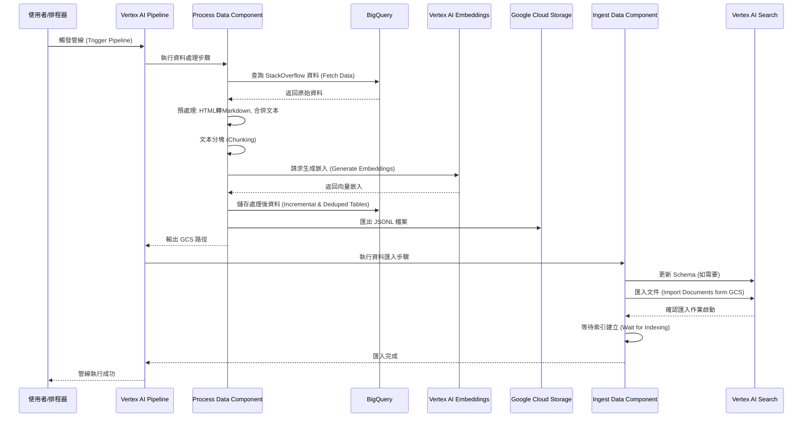

# Data Ingestion Pipeline

此管線自動化將資料匯入 Vertex AI Search 的過程，簡化了構建檢索增強生成 (RAG) 應用程式的流程。

它協調了完整的工作流程：載入資料、將其分割成可管理的區段 (chunks)、使用 Vertex AI Embeddings 生成嵌入 (embeddings)，並將處理後的資料匯入您的 Vertex AI Search 資料儲存區 (datastore)。

您可以觸發管線進行初始資料載入，或排程定期執行，確保您的搜尋索引保持最新。Vertex AI Pipelines 為此過程提供了協調和監控功能。

## 完整資料流程時序圖



## Google Cloud 服務整合說明

本管線整合了多項 Google Cloud 服務，各服務的角色與注意事項如下：

| 服務名稱 (Service) | 角色 (Role) | 詳細說明 (Description) | 注意事項 (Notes) |
| :--- | :--- | :--- | :--- |
| **Vertex AI Pipelines** | **管線協調與執行** (Orchestrator) | 負責管理整個資料處理流程的執行順序、資源分配、依賴關係與重試機制。 | 首次執行可能需要較長時間進行環境配置。可透過 Google Cloud Console 的 Pipelines 儀表板監控執行狀態與日誌。 |
| **BigQuery** | **資料來源與儲存** (Data Source & Storage) | 作為原始資料的來源 (StackOverflow 資料集)，以及處理過程中增量資料與去重後資料的儲存庫。 | 管線會自動建立所需的資料集與表格。建議定期檢查儲存成本，並根據需要設定資料分區或過期策略。 |
| **Vertex AI Embeddings** | **向量生成** (Embedding Generation) | 提供 `text-embedding-005` 模型，將切分後的文本轉換為高維度的向量嵌入，賦予資料語意搜尋的能力。 | 嵌入生成的 API 呼叫可能會產生費用。BigFrames ML 封裝了這些呼叫，簡化了與 BigQuery 資料的整合。 |
| **Google Cloud Storage (GCS)** | **中繼檔案儲存** (Intermediate Storage) | 暫存從 BigQuery 匯出的 JSONL 格式檔案，作為 `process_data` 與 `ingest_data` 元件之間的橋樑。 | 管線會將處理後的資料匯出至 `pipeline-root` 指定的路徑。需確保執行管線的服務帳號擁有 GCS 的讀寫權限。 |
| **Vertex AI Search** | **資料檢索與搜尋** (Search & Retrieval) | 最終的資料目的地。負責建立索引並提供 RAG 應用程式所需的語意搜尋與檢索功能。 | 匯入資料後，索引建立需要一些時間 (通常數分鐘)。若遇到 Schema 錯誤，可能是因為 Schema 更新尚未生效，建議稍後重試。 |

## 步驟詳細說明

此管線主要由兩個元件組成：`process_data` 和 `ingest_data`。

### 1. 資料處理與嵌入生成 (Process Data)

此步驟由 `process_data` 元件執行，負責將原始資料轉換為可用於向量搜索的格式。

1.  **資料獲取 (Data Fetching)**:
    *   連線至 BigQuery。
    *   根據排程時間與回溯天數 (`look_back_days`) 計算查詢的時間範圍。如果是增量模式 (`is_incremental=True`)，僅查詢該範圍內的資料。
    *   從 BigQuery 的 StackOverflow 公開資料集 (或您的資料來源) 獲取問題與答案。

2.  **資料預處理 (Preprocessing)**:
    *   將 HTML 格式的問題內文與答案轉換為 Markdown 格式，以利於 LLM 閱讀與解析。
    *   將問題標題、問題內文與所有答案合併為單一的 Markdown 文本欄位 `full_text_md`。

3.  **文本分塊 (Chunking)**:
    *   使用 LangChain 的 `RecursiveCharacterTextSplitter` 將長文本分割成較小的區塊 (Chunks)。
    *   預設區塊大小 (`chunk_size`) 為 1500 字元，重疊 (`chunk_overlap`) 為 20 字元。這有助於保留上下文並適應嵌入模型的輸入限制。

4.  **生成嵌入 (Embedding Generation)**:
    *   利用 BigFrames 的機器學習功能，呼叫 Vertex AI 的 `text-embedding-005` 模型。
    *   為每個文本區塊生成向量嵌入 (Embeddings)。

5.  **儲存與匯出 (Storage & Export)**:
    *   將包含嵌入向量的結果寫入 BigQuery 的增量表 (`incremental_questions_embeddings`)。
    *   執行去重操作，將每個問題的最新版本寫入去重表 (`questions_embeddings`)。
    *   將去重後的資料轉換為 JSONL 格式，並匯出至 Google Cloud Storage (GCS)，供下一步驟使用。

### 2. 資料匯入 (Ingest Data)

此步驟由 `ingest_data` 元件執行，負責將處理好的資料載入 Vertex AI Search。

1.  **Schema 更新 (Schema Update)**:
    *   檢查目標 Vertex AI Search Data Store 的 Schema。
    *   如果需要，更新 Schema 以包含向量嵌入欄位 (預設為 `embedding`) 及其維度 (預設 768)。

2.  **文件匯入 (Import Documents)**:
    *   使用 `ImportDocumentsRequest` 將 GCS 中的 JSONL 檔案匯入至 Data Store。
    *   使用 `FULL` 協調模式 (Reconciliation Mode)，確保 Data Store 的內容與匯入的資料完全一致 (會覆蓋舊資料)。

3.  **索引建立 (Indexing)**:
    *   等待匯入作業完成。
    *   額外等待一段時間 (如 3 分鐘)，確保 Vertex AI Search 完成索引建立，使資料可被搜尋。

## 資料注入範例說明

以下展示了資料在管線中轉換的簡化範例。

### 原始資料 (BigQuery)

| question_id | question_title | question_body (HTML) | answers (List of Structs) |
| :--- | :--- | :--- | :--- |
| 12345 | How to replace string in Python? | `<p>I have a string...</p>` | `[{'body': '<p>Use replace()...</p>'}]` |

### 處理後資料 (Exported JSONL)

處理後的 JSONL 檔案中的每一行代表一個文本區塊，格式如下：

```json
{
  "id": "12345__0",
  "embedding": [0.0123, -0.0456, ..., 0.7890],
  "content": "# How to replace string in Python?\n\nI have a string...\n\n## Answer 1:\nUse replace()...",
  "question_id": 12345,
  "creation_timestamp": "2023-10-27 10:00:00",
  "last_edit_date": "2023-10-28 12:00:00",
  "question_text": "I have a string...",
  "full_text_md": "# How to replace string in Python?\n\nI have a string...\n\n## Answer 1:\nUse replace()..."
}
```

*   **id**: 唯一的區塊 ID (問題 ID + 區塊索引)。
*   **embedding**: 768 維的浮點數陣列 (向量)。
*   **content**: 實際被向量化的文本區塊內容 (Markdown)。
*   **full_text_md**: 該問題的完整 Markdown 文本 (用於參考)。

## 先決條件 (Prerequisites)

在執行任何命令之前，請確保您已將 Google Cloud 專案 ID 設定為環境變數。

```bash
export PROJECT_ID="YOUR_PROJECT_ID"
```
將 `"YOUR_PROJECT_ID"` 替換為您的實際 Google Cloud 專案 ID。

現在，您可以設定開發環境：

1.  **設定開發環境：** 從儲存庫根目錄使用以下命令，使用 Terraform 在您的開發環境中配置必要的資源。這包括部署資料儲存區和配置所需的權限。

    ```bash
    make setup-dev-env
    ```
    此命令需要安裝並配置 `terraform`。

## 執行資料注入管線 (Running the Data Ingestion Pipeline)

在設定好基礎設施後，您可以執行資料注入管線。

> **注意：** 初始管線執行可能需要較長時間，因為您的專案正在配置 Vertex AI Pipelines。

**步驟：**

**a. 執行管線：**
從儲存庫根目錄執行以下命令。確保 `PROJECT_ID` 環境變數在您目前的 shell 工作階段中已設定。

```bash
make data-ingestion
```

此命令會處理依賴項安裝 (如果需要)，並使用從您的專案設定衍生的配置提交管線作業。

**b. 管線排程：**

`make data-ingestion` 命令會觸發立即執行的管線。對於生產環境，底層的 `submit_pipeline.py` 腳本也支援排程選項，例如 `--schedule-only` 和 `--cron-schedule` 用於定期執行。

**c. 監控管線進度：**

管線的配置和執行狀態連結將在提交後印在控制台上。如需詳細監控，請使用 Google Cloud Console 中的 Vertex AI Pipelines 儀表板。

## 測試您的 RAG 應用程式

一旦資料注入管線成功完成，您就可以使用 Vertex AI Search 測試您的 RAG 應用程式。
> **疑難排解：** 如果您在初始資料注入後遇到錯誤 `"google.api_core.exceptions.InvalidArgument: 400 The embedding field path: embedding not found in schema"`，請稍等幾分鐘後再試。此延遲允許 Vertex AI Search 完全索引注入的資料。
