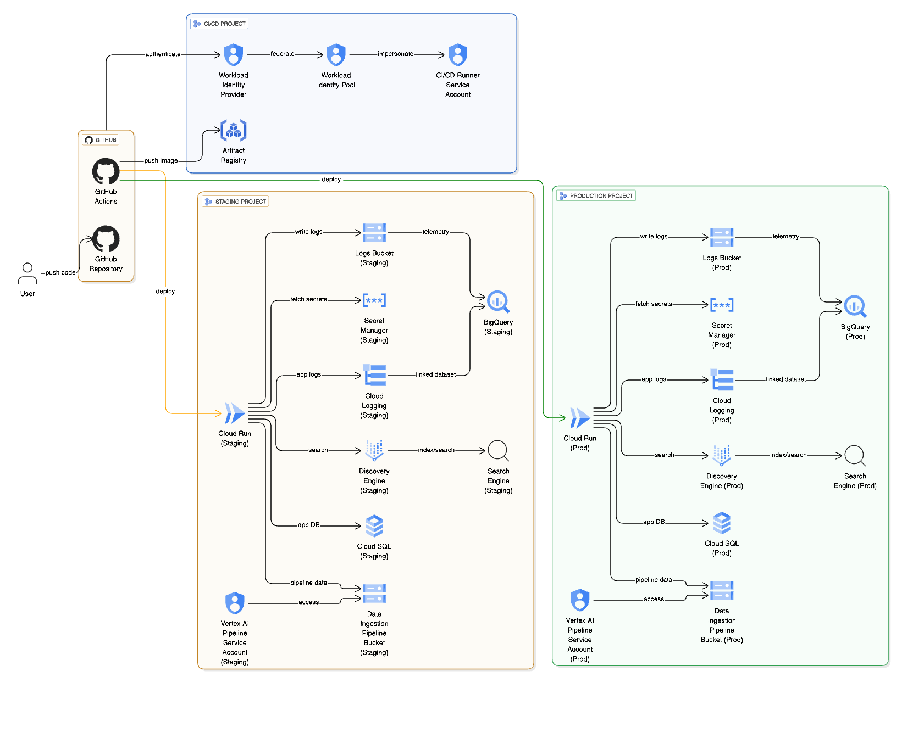
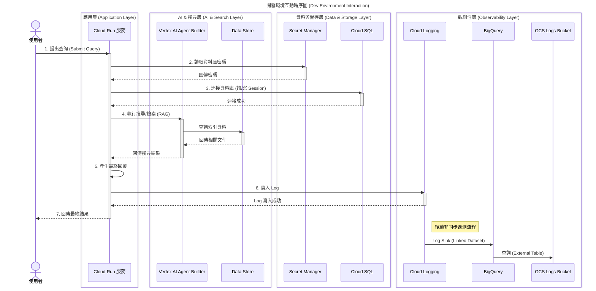
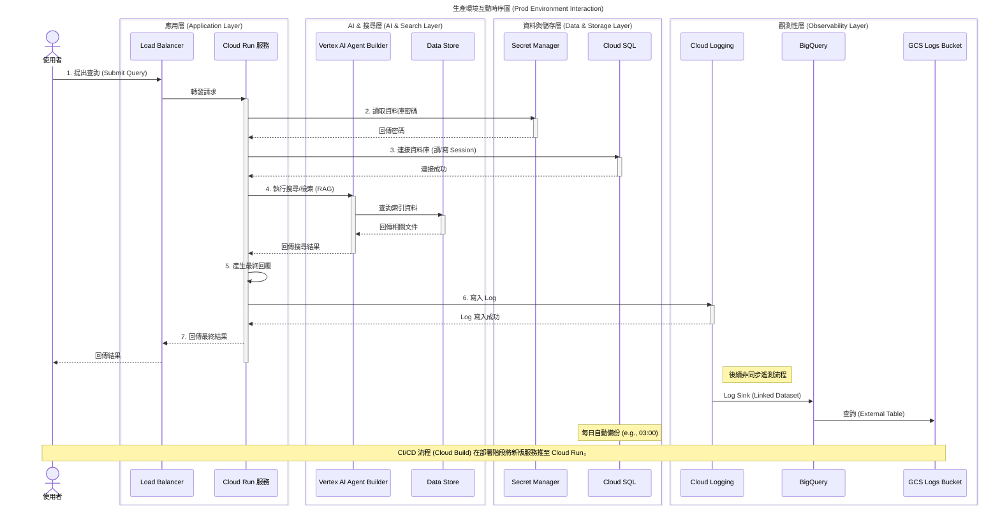

# 部署 (Deployment)

此目錄包含 Terraform 配置，用於為您的代理程式佈建必要的 Google Cloud 基礎架構。
部署基礎架構和設定 CI/CD 管線的建議方法是從專案根目錄執行 `agent-starter-pack setup-cicd` 命令。
然而，若您偏好手動操作，也可以自行手動應用 Terraform 配置。
有關部署流程、基礎架構和 CI/CD 管線的詳細資訊，請參閱官方文件：

**[Agent Starter Pack 部署指南](https://googlecloudplatform.github.io/agent-starter-pack/guide/deployment.html)**

## 檔案結構 (File Structure)

```
deployment/terraform
├── apis.tf                 # 啟用 Google Cloud APIs
├── dev/                    # 開發環境專屬配置
│   ├── apis.tf
│   ├── iam.tf              # 開發環境 IAM 設定
│   ├── providers.tf
│   ├── service.tf          # 開發環境 Cloud Run & SQL
│   ├── storage.tf          # 開發環境 GCS & Artifacts
│   ├── telemetry.tf        # 開發環境 BigQuery & Logging
│   ├── variables.tf
│   └── vars/
├── github.tf               # GitHub 整合與 WIF 設定 (通常用於 Prod/CI)
├── iam.tf                  # 共用或 Prod IAM 設定
├── locals.tf               # 區域變數定義
├── providers.tf            # Terraform Provider 設定
├── service.tf              # Prod/Staging Cloud Run & SQL
├── service_accounts.tf     # 服務帳號定義
├── sql/                    # SQL 初始化腳本
│   └── completions.sql     # BigQuery View 定義 SQL
├── storage.tf              # Prod/Staging GCS & Artifacts
├── telemetry.tf            # Prod/Staging BigQuery & Logging
├── variables.tf            # 變數定義
└── wif.tf                  # Workload Identity Federation 設定
```

## 架構圖 (Architecture Diagrams)

以下架構圖展示了開發環境 (Dev) 和生產環境 (Prod) 的主要元件及其互動方式。
### Development Environment (Dev)

開發環境採用簡化的架構，重點在於快速迭代與測試。資料庫備份預設關閉，且通常部署於單一專案中。


## 架構圖


---

### 開發流程時序圖
此圖展示了在開發環境中，從使用者發出請求到系統回覆的典型互動流程。



### Production Environment (Prod)

生產環境包含完整的備份機制、高可用性配置，並整合 CI/CD 流程。通常涉及多個專案（CI/CD Runner Project 與 Target Environment Project）。

### 正式環境時序圖
此圖展示了在生產環境中，從使用者發出請求到系統回覆的典型互動流程，其中包含了負載平衡器。


---
### 詳細架構元件 (Detailed Architecture Components)

下表詳細列出了 Terraform 配置中的關鍵元件及其功能說明：

| 分類 (Category)            | 元件 (Component)  | 服務 (Service)              | 說明 (Description)                                                       | 差異 (Dev vs Prod)                                                       |
| :------------------------- | :---------------- | :-------------------------- | :----------------------------------------------------------------------- | :----------------------------------------------------------------------- |
| **運算 (Compute)**         | App Service       | **Cloud Run**               | 託管應用程式容器，具備自動擴展 (1-10 instances) 與負載平衡功能。         | 配置相同，但 Prod 通常連接至不同的 Data Store 與資料庫實例。             |
| **資料庫 (Database)**      | Session DB        | **Cloud SQL (PostgreSQL)**  | 儲存對話 Session 與應用程式結構化資料。啟用 IAM 驗證。                   | **Dev**: 備份關閉。<br>**Prod**: 每日 03:00 自動備份。                   |
| **安全 (Security)**        | DB Password       | **Secret Manager**          | 安全儲存與輪替資料庫密碼，應用程式透過 Secret Accessor 角色讀取。        | 獨立的 Secret 實例。                                                     |
| **儲存 (Storage)**         | Logs Bucket       | **Cloud Storage (GCS)**     | 儲存應用程式日誌 JSON 檔案，供 BigQuery 外部表查詢。                     | 獨立 Bucket。                                                            |
|                            | RAG Root          | **Cloud Storage (GCS)**     | RAG Pipeline 的工作目錄，儲存原始文件與處理過程中的工件。                | 獨立 Bucket。                                                            |
|                            | Image Repo        | **Artifact Registry**       | 儲存應用程式的 Docker 映像檔。                                           | **Dev**: 通常共用或使用 Placeholder。<br>**Prod**: 存放在 CI/CD 專案中。 |
| **AI & 搜尋**              | Search Engine     | **Vertex AI Agent Builder** | 提供企業級搜尋能力 (Discovery Engine)，索引非結構化資料。                | 獨立的 Data Store ID 與 Engine。                                         |
| **觀測性 (Observability)** | Telemetry Dataset | **BigQuery**                | 用於分析 GenAI 遙測數據的資料集。                                        | 獨立 Dataset。                                                           |
|                            | Log Bucket        | **Cloud Logging**           | 專用的 Log Bucket，設定 **10 年** 資料保留期。                           | 獨立 Bucket 配置。                                                       |
|                            | Completions View  | **BigQuery View**           | 整合 Cloud Logging (Linked Dataset) 與 GCS (External Table) 的統一視圖。 | 相同邏輯。                                                               |
| **身分驗證 (IAM)**         | Service Account   | **IAM**                     | `App SA`: 應用程式執行身分。<br>`CICD SA`: 部署流程身分。                | 權限依照最小權限原則配置。                                               |

---
