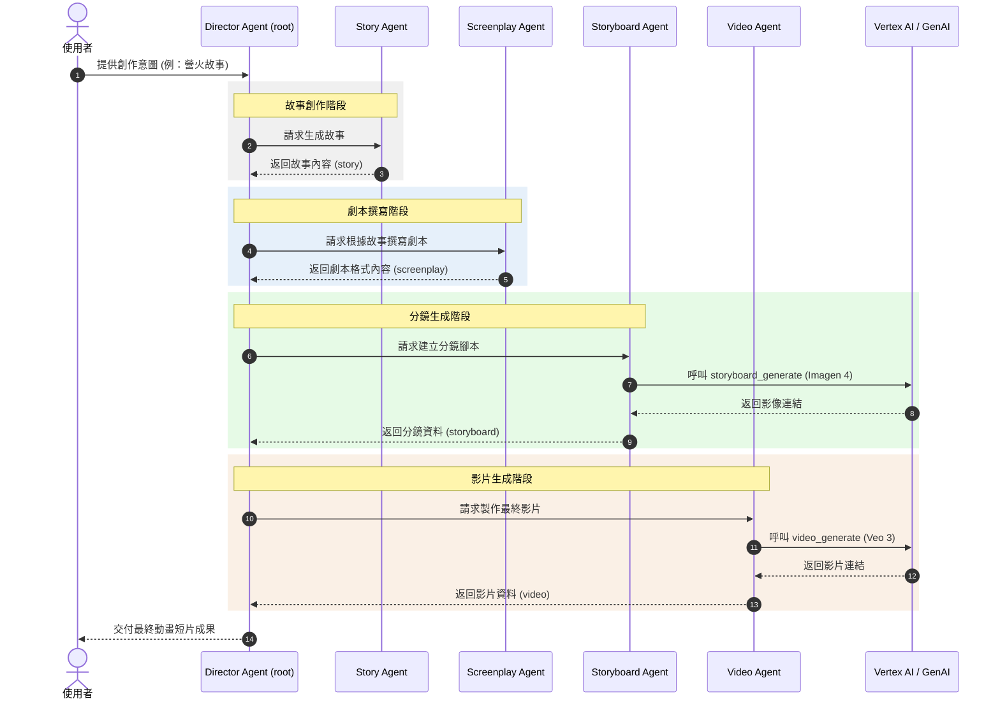

# 短片生成代理 (Short Movie Agents)

短片生成代理示範是一個 ADK 範例，展示了如何使用多代理架構 (Multi-agent architecture)，根據使用者的意圖建構端到端的影片。它包含多個扮演不同角色的代理：

- [導演代理 (Director Agent)](app/agent.py) - 主要協調者
- [故事代理 (Story Agent)](app/story_agent.py) - 創作故事內容
- [劇本代理 (Screenplay Agent)](app/screenplay_agent.py) - 根據故事生成劇本
- [分鏡腳本代理 (Storyboard Agent)](app/storyboard_agent.py) - 使用先前代理提供的上下文和 Imagen 4 模型生成分鏡圖
- [影片代理 (Video Agent)](app/video_agent.py) - 使用 Veo 3 製作最終影片

## ADK WEB 架構圖：


### Agents 互動流程圖



## 專案結構

本專案組織如下：

```
short-movie-agents/ (專案根目錄)
├── Dockerfile (建置 Docker Image 使用)
├── GEMINI.md (提供 Gemini CLI 與專案上下文)
├── Makefile (定義常用指令與自動化腳本)
├── README.md (專案說明與使用指南)
├── app/ (應用程式程式碼)
│   ├── __init__.py (Python 套件初始化)
│   ├── agent.py (導演代理主要協調邏輯)
│   ├── prompts/ (提示詞範本)
│   │   ├── README.md (prompts 資訊與使用說明)
│   │   ├── director_agent.txt (導演代理提示詞)
│   │   ├── screenplay_agent.txt (劇本代理提示詞)
│   │   ├── story_agent.txt (故事代理提示詞)
│   │   ├── story_agent_desc.txt (故事代理描述範本)
│   │   ├── storyboard_agent.txt (分鏡代理提示詞)
│   │   └── video_agent.txt (影片代理提示詞)
│   ├── screenplay_agent.py (劇本代理實作)
│   ├── server.py (本地伺服器 / Streamlit 介面)
│   ├── story_agent.py (故事代理實作)
│   ├── storyboard_agent.py (分鏡代理實作)
│   ├── utils/ (工具程式)
│   │   ├── __init__.py (工具模組初始化)
│   │   ├── gcs.py (Google Cloud Storage 操作工具)
│   │   ├── tracing.py (OpenTelemetry 追蹤設定)
│   │   ├── typing.py (專案共用型別定義)
│   │   └── utils.py (通用輔助函式)
│   └── video_agent.py (影片代理實作)
├── assets/ (靜態資源)
│   └── agent_diagram.png (代理架構圖)
├── pyproject.toml (Python 專案設定與依賴)
├── tests/ (測試)
│   ├── INDEX.md (測試索引)
│   ├── QUICK_REFERENCE.md (測試快速參考)
│   ├── README.md (測試說明)
│   ├── TEST_SUMMARY.md (測試摘要)
│   ├── __init__.py (tests 套件初始化)
│   ├── conftest.py (pytest 共用配置)
│   ├── integration/ (整合測試)
│   │   ├── __init__.py (整合測試套件初始化)
│   │   ├── test_agent.py (整合測試：代理流程)
│   │   └── test_server_e2e.py (整合測試：伺服器端到端)
│   └── unit/ (單元測試)
│       ├── __init__.py (單元測試套件初始化)
│       ├── test_agent.py (單元測試：代理)
│       ├── test_imports.py (匯入檢查測試)
│       ├── test_models.py (模型相關測試)
│       ├── test_structure.py (專案結構驗證)
│       ├── test_tools.py (工具函式測試)
│       └── test_utils.py (utils 測試)
```

## 需求環境

在開始之前，請確保您已安裝：
- **uv**：Python 套件管理器（用於本專案的所有依賴管理） - [安裝](https://docs.astral.sh/uv/getting-started/installation/)（使用 `uv add <package>` [添加套件](https://docs.astral.sh/uv/concepts/dependencies/)）
- **Google Cloud SDK**：用於 GCP 服務 - [安裝](https://cloud.google.com/sdk/docs/install)
- **make**：建置自動化工具 - [安裝](https://www.gnu.org/software/make/)（大多數類 Unix 系統已預裝）


## 快速上手（本地測試）

安裝必要的套件並啟動本地開發環境：

```bash
cp .env-template .env
# 編輯 .env 檔案，取消註釋並更新環境變數
make install && make playground
```

## 指令列表

| 指令                 | 說明                                                                                 |
| -------------------- | ------------------------------------------------------------------------------------------- |
| `make install`       | 使用 uv 安裝所有必要的依賴項                                                  |
| `make playground`    | 啟動包含後端和前端的本地開發環境 - 利用 `adk web` 指令。|
| `make backend`       | 將代理部署到 Cloud Run |
| `make local-backend` | 啟動本地開發伺服器 |
| `make test`          | 執行單元測試和整合測試                                                              |
| `make lint`          | 執行程式碼品質檢查 (codespell, ruff, mypy)                                             |
| `make clean`         | 刪除所有在執行時產生的檔案 (例如 `__pycache__`, `.pytest_cache`, `.mypy_cache`, `build/`, `dist/`) |
關於完整的指令選項與用法，請參考 [Makefile](Makefile)。


## 使用說明 (Usage)

此模板遵循「自備代理」(Bring your own agent) 的原則 - 您只需專注於業務邏輯，模板會處理其他所有事務（UI、基礎設施、部署、監控）。

1. **整合 (Integrate)**：透過編輯 `app` 資料夾中的檔案來更新代理。
2. **測試 (Test)**：使用 Streamlit 測試場 `make playground` 探索代理功能。該測試場提供聊天記錄、使用者回饋和各種輸入類型等功能，並在程式碼變更時自動重新載入代理。
3. **部署 (Deploy)**：請參閱 [部署章節](#部署) 以獲得詳細說明。
4. **監控 (Monitor)**：使用 Cloud Logging、Tracing 和 Looker Studio 儀表板追蹤效能並收集見解，以便在應用程式中進行反覆運算。

專案包含一個 `GEMINI.md` 檔案，在詢問有關專案的問題時為 Gemini CLI 等 AI 工具提供上下文。

## 部署 (Deployment)

### 開發環境 (Dev Environment)

您可以使用以下指令測試向開發環境的部署：

```bash
cp .env.example .env
# 編輯 .env 檔案，取消註釋並更新環境變數
gcloud config set project <your-dev-project-id>
make backend
```

## 監控與可觀測性 (Monitoring and Observability)
> 您可以使用[這個 Looker Studio 儀表板](https://lookerstudio.google.com/reporting/46b35167-b38b-4e44-bd37-701ef4307418/page/tEnnC)模板來視覺化記錄在 BigQuery 中的事件。請參閱「設定說明」標籤頁以開始使用。

該應用程式使用 OpenTelemetry 進行全面的可觀測性，所有事件都會發送到 Google Cloud Trace 和 Logging 進行監控，並發送到 BigQuery 進行長期儲存。

### 免責聲明 (Disclaimer)

本文件僅為個人學習與教育目的而創建。其內容主要是參考線上資源，並基於個人在學習 Google ADK 過程中的理解與整理，並非 Google 的官方觀點或文件。所有資訊請以 Google 官方發布為準。

## 參考資源

- [[ADK-Samples] Short Movie Agents](https://github.com/google/adk-samples/tree/main/python/agents/short-movie-agents)