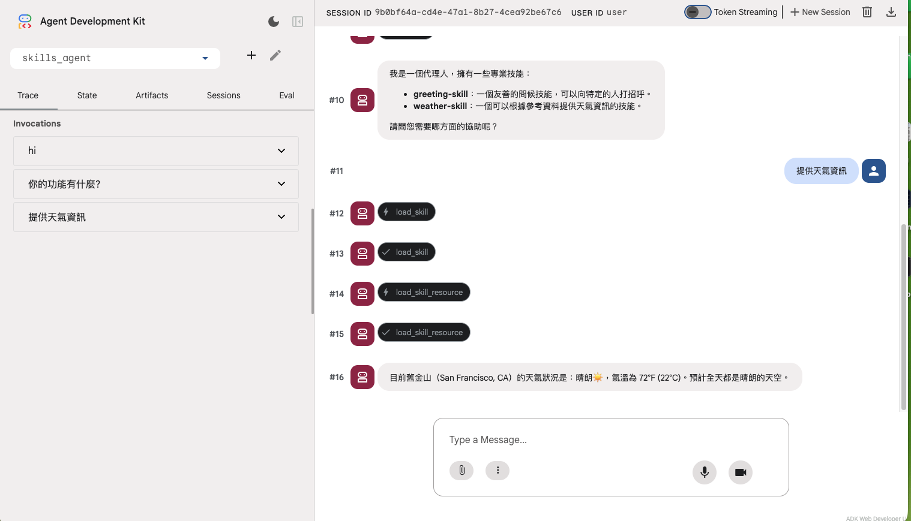
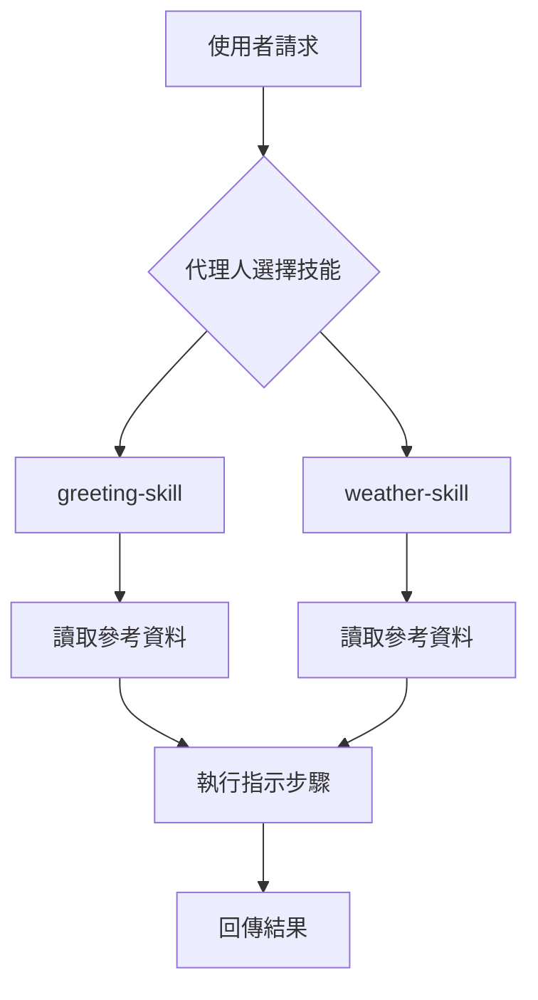

# 技能代理人 (Skills Agent)

**學習如何在 Google ADK 中建立和使用專業技能 (Specialized Skills) 來增強代理人能力。**

> [!WARNING] 目前技能系統仍在開發中，API 可能會有重大變動。請密切關注官方文件以獲取最新資訊。
> 🔗 參考連結：[Skills for ADK agents](https://google.github.io/adk-docs/skills/)。

## 專案概述

本實作示範如何：
- 使用 `SkillToolset` 為代理人裝備專業技能
- **定義內嵌技能**（在程式碼中直接定義）
- **從目錄載入技能**（模組化技能管理）
- 為技能提供參考資料 (References)
- 建構可重複使用的技能系統
- 實作結構化的技能執行流程

## 🎯 核心概念

### 什麼是技能 (Skill)？

由 Anthropic 推出的開放標準，旨在為 AI 代理提供「可隨插即用」的專業技能包。它將特定任務的 SOP（標準作業程序）、自動化腳本與背景知識封裝成模組，讓 AI 能像安裝軟體一樣獲得特定領域的專家能力。

### 核心優勢

- 效能優化 (Efficiency)： 採用「漸進式揭露」機制，僅在需要時載入詳細指令，有效減少 Token 消耗並維持長對話的準確性。
- 穩定輸出 (Reliability)： 透過結構化的 SKILL.md 定義任務邊界，確保 AI 遵循特定格式與邏輯，減少隨機幻覺。
- 跨工具複用 (Portability)： 作為開放協議，一套技能可同時支援 Claude Code、Cursor 及其他相容的開發環境。

### 為什麼使用 Skill？

- ✅ **模組化**：將複雜能力分解為獨立單元
- ✅ **可重複使用**：在多個代理人之間共享能力
- ✅ **易於維護**：集中管理專業知識
- ✅ **清晰結構**：明確的執行步驟和資源
- ✅ **團隊協作**：不同團隊可開發不同技能

## 快速開始

### 先決條件

- Python 3.11+
- Google API 金鑰
- uv（推薦）或 pip

### 安裝

```bash
# 1. 安裝 uv（如果尚未安裝）
uv init

# 2. 初始化專案並安裝相依套件 (經測試目前需明確指定安裝 ADK Python SDK)
uv add git+https://github.com/google/adk-python.git@main

# 3. 啟動虛擬環境
source .venv/bin/activate  # macOS/Linux
# 或
.venv\Scripts\activate  # Windows

# 4. 設定環境變數
export GOOGLE_API_KEY=your_api_key_here

# 5. 執行代理人 CLI
adk run skills_agent
```

### 快速示範

```bash
# 啟動 ADK Web 介面
> adk web
```
---

#### 畫面說明
下圖 ADK Web 介面中，您將看到一個名為 `skills_agent`(畫面左上角) 的代理人，已經裝備了兩個技能：`greeting-skill` 和 `weather-skill`。



#### 在 ADK Web 頁面中輸入以下命令：

```bash 中嘗試：
> 向我打招呼 (Hi)
> 告訴我今天的天氣如何 (提供天氣資訊)
```

## 專案結構

```
skills-agent/
├── skills_agent/           # 主要套件
│   ├── __init__.py         # 套件匯出
│   ├── agent.py            # 根代理人與技能定義
│   └── skills/             # 技能目錄
│       └── weather-skill/  # 天氣技能範例
│           ├── SKILL.md    # 技能定義（frontmatter + instructions）
│           └── references/ # 技能參考資料
│               └── weather_info.md
├── main.py                 # 程式進入點
├── pyproject.toml          # 專案設定
└── README.md               # 本檔案
```

## 功能

### 1. 內嵌技能定義 (Inline Skill)

**直接在程式碼中定義技能：**

```python
from google.adk.skills import models

greeting_skill = models.Skill(
    frontmatter=models.Frontmatter(
        name="greeting-skill",
        description="一個友善的問候技能，可以向特定的人打招呼。",
    ),
    instructions=(
        "步驟 1：讀取 'references/hello_world.txt' 檔案以瞭解如何"
        " 向使用者打招呼。步驟 2：根據參考內容回傳問候語。"
    ),
    resources=models.Resources(
        references={
            "hello_world.txt": "哈囉！ 👋👋👋 很高興見到你！ ✨✨✨",
            "example.md": "這是一個範例參考資料。",
        },
    ),
)
```

**特點：**
- ✅ 適合簡單、小型技能
- ✅ 快速原型開發
- ✅ 參考資料直接內嵌
- ❌ 較難管理大型技能
- ❌ 不易跨專案共享

### 2. 目錄載入技能 (Directory-based Skill)

**從結構化目錄載入技能：**

```python
import pathlib
from google.adk.skills import load_skill_from_dir

weather_skill = load_skill_from_dir(
    pathlib.Path(__file__).parent / "skills" / "weather_skill"
)
```

**目錄結構：**

```
weather-skill/
├── SKILL.md            # 技能定義
└── references/         # 參考資料目錄
    └── weather_info.md # 參考資料檔案
```

**SKILL.md 格式：**

```markdown
---
name: weather-skill
description: 根據參考資料提供天氣資訊的技能。
---

步驟 1：檢查 'references/weather_info.md' 以取得目前天氣。
步驟 2：將天氣更新提供給使用者。
```

**特點：**
- ✅ 適合複雜、大型技能
- ✅ 易於版本控制
- ✅ 可跨專案共享
- ✅ 團隊協作友善
- ✅ 清晰的檔案組織

### 3. 技能工具集 (SkillToolset)

**將技能打包為工具集：**

```python
from google.adk.tools.skill_toolset import SkillToolset

my_skill_toolset = SkillToolset(
    skills=[greeting_skill, weather_skill]
)
```

**使用技能工具集：**

```python
from google.adk import Agent

root_agent = Agent(
    model="gemini-2.5-flash",
    name="skill_user_agent",
    description="一個可以使用專業技能的代理人。",
    tools=[my_skill_toolset],
)
```

**工作流程：**



### 4. 參考資料系統 (References)

**技能可以攜帶參考資料：**

1. **內嵌參考資料：**
   ```python
   resources=models.Resources(
       references={
           "file.txt": "內容...",
       }
   )
   ```

2. **檔案參考資料：**
   ```
   skills/weather-skill/references/weather_info.md
   ```

**參考資料用途：**
- 📚 提供領域知識
- 📋 範例和模板
- 🔍 查找表和資料
- 📖 操作指南

### 基本操作

1. **測試問候技能：**

   ```text
   向我打招呼
   ```

2. **測試天氣技能：**

   ```text
   今天舊金山的天氣如何？
   ```

3. **個人化問候：**

   ```text
   用非常友善和熱情的方式向 Bob 問好
   ```

4. **組合使用：**

   ```text
   先向我打招呼，然後告訴我天氣如何，最後祝我有美好的一天
   ```

### 進階操作

1. **觀察技能執行流程：**

   ```text
   告訴我天氣，並說明你是如何獲得這些資訊的
   ```

2. **測試技能邊界：**

   ```text
   告訴我紐約的天氣（應該無法提供，因為參考資料只有舊金山）
   ```

3. **多步驟任務：**

   ```text
   根據今天的天氣，給我一個友善的問候並建議適合的活動
   ```

## 技能開發指南

### 建立新技能的步驟

#### 方法 1：內嵌技能

```python
my_skill = models.Skill(
    frontmatter=models.Frontmatter(
        name="my-skill",
        description="技能描述",
    ),
    instructions="執行步驟...",
    resources=models.Resources(
        references={"ref.md": "內容..."}
    ),
)
```

#### 方法 2：目錄技能

1. **建立技能目錄：**
   ```bash
   mkdir -p skills_agent/skills/my-skill/references
   ```

2. **建立 SKILL.md：**
   ```markdown
   ---
   name: my-skill
   description: 技能描述
   ---

   步驟 1：...
   步驟 2：...
   ```

3. **加入參考資料：**
   ```bash
   echo "參考內容" > skills_agent/skills/my-skill/references/data.md
   ```

4. **載入技能：**
   ```python
   from google.adk.skills import load_skill_from_dir
   import pathlib

   my_skill = load_skill_from_dir(
       pathlib.Path(__file__).parent / "skills" / "my_skill"
   )
   ```

### 技能設計最佳實務

#### ✅ 推薦做法

- **單一職責**：每個技能專注於一個明確的任務
- **清晰指示**：提供詳細的步驟說明
- **完整參考**：包含所有必要的參考資料
- **描述性命名**：使用清楚的技能名稱和描述
- **錯誤處理**：在指示中包含異常情況處理

#### ❌ 避免做法

- 技能過於複雜或承擔多重職責
- 指示模糊或缺少步驟
- 參考資料不完整或過時
- 技能名稱不清楚
- 缺少錯誤處理邏輯

### 技能命名慣例

- 使用 **kebab-case**：`greeting-skill`, `weather-skill`
- 使用 **動詞-名詞** 模式：`check-weather`, `send-email`
- 保持 **簡短且描述性**：避免過長的名稱
- 使用 **領域前綴**（可選）：`email-send`, `db-query`

## 測試

本專案採用 **pytest** 進行單元與結構測試，並支援覆蓋率報告。

### 🚀 完整測試內容

參考 [`tests/README.md`](tests/README.md) 以獲取詳細的測試執行指南和最佳實務。

## 環境設定

```bash
# 必要：Google API 金鑰
export GOOGLE_API_KEY=your_api_key_here

# 選用：Vertex AI（生產環境）
export GOOGLE_GENAI_USE_VERTEXAI=TRUE
export GOOGLE_CLOUD_PROJECT=your-project-id
export GOOGLE_CLOUD_LOCATION=us-central1
```

## 常見問題

### 🔎 技能沒有被執行

**問題：** 代理人沒有使用技能

**解決方案：**
1. 確認技能描述清楚且相關
2. 檢查技能是否正確加入 SkillToolset
3. 驗證代理人 prompt 是否與技能描述匹配
4. 啟用 debug 模式查看代理人決策過程

### 🔎 找不到參考資料

**問題：** 技能無法讀取參考資料

**解決方案：**
1. 檢查參考資料路徑是否正確
2. 驗證 references/ 目錄結構
3. 確認 SKILL.md 中的參考路徑與實際檔案匹配
4. 使用相對路徑而非絕對路徑

### 🔎 技能載入失敗

**問題：** load_skill_from_dir 失敗

**解決方案：**
1. 確認 SKILL.md 格式正確（frontmatter + instructions）
2. 檢查目錄路徑存在
3. 驗證 pathlib.Path 構造正確
4. 查看詳細錯誤訊息

## 關鍵學習

### 技能系統優點

- ✅ **可組合性**：技能可自由組合使用
- ✅ **可測試性**：獨立技能易於測試
- ✅ **可維護性**：集中管理專業知識
- ✅ **可擴展性**：輕鬆加入新技能
- ✅ **可重複使用性**：跨代理人共享能力

### 最佳實務總結

1. **技能設計**
   - ✅ 保持技能簡單且專注
   - ✅ 提供清晰的執行指示
   - ✅ 包含充足的參考資料
   - ✅ 使用描述性名稱

2. **檔案組織**
   - ✅ 複雜技能使用目錄結構
   - ✅ 簡單技能可內嵌定義
   - ✅ 參考資料集中管理
   - ✅ 遵循命名慣例

3. **開發流程**
   - ✅ 從簡單技能開始
   - ✅ 逐步增加複雜度
   - ✅ 充分測試每個技能
   - ✅ 文件化技能用法

### 技能 vs 工具的選擇

| 特性 | 技能 (Skill) | 工具 (Tool) |
|------|-------------|-------------|
| **定義方式** | Markdown + 指示 | Python 函式 |
| **執行方式** | LLM 解釋指示 | 直接執行程式碼 |
| **適用場景** | 需要推理的任務 | 確定性操作 |
| **參考資料** | 內建支援 | 需自行實作 |
| **靈活性** | 高（LLM 解釋） | 低（固定邏輯） |
| **效能** | 較慢 | 較快 |
| **範例** | 分析報告、撰寫內容 | API 呼叫、資料庫查詢 |

**選擇建議：**
- 🎯 需要**推理和理解**？→ 使用技能
- ⚡ 需要**快速確定性操作**？→ 使用工具
- 🔄 需要**結合兩者**？→ 混合使用

## 擴展想法

### 建立技能庫

```python
# skills/catalog.py
from google.adk.skills import load_skill_from_dir
import pathlib

SKILLS_DIR = pathlib.Path(__file__).parent

def load_all_skills():
    """載入所有可用技能"""
    skills = []
    for skill_dir in SKILLS_DIR.iterdir():
        if skill_dir.is_dir() and (skill_dir / "SKILL.md").exists():
            skills.append(load_skill_from_dir(skill_dir))
    return skills
```

### 動態技能選擇

```python
# 根據任務類型動態選擇技能
def get_skills_for_task(task_type: str):
    all_skills = load_all_skills()
    return [s for s in all_skills if task_type in s.frontmatter.description]
```

### 技能組合模式

```python
# 建立專業化代理人
customer_service_agent = Agent(
    model="gemini-2.5-flash",
    tools=[
        SkillToolset(skills=[
            greeting_skill,
            faq_skill,
            ticket_creation_skill,
        ])
    ]
)

data_analysis_agent = Agent(
    model="gemini-2.5-flash",
    tools=[
        SkillToolset(skills=[
            data_loading_skill,
            statistical_analysis_skill,
            visualization_skill,
        ])
    ]
)
```

## 資源

- **ADK 文件：** https://google.github.io/adk-docs/
- **技能系統指南：** https://google.github.io/adk-docs/skills/
- **ADK Python SDK：** https://github.com/google/adk-python
- **[ADK Python] 參考程式碼：** https://github.com/google/adk-python/tree/main/contributing/samples/skills_agent
- **Agent Skills 官方參考：**https://agentskills.io/specification**

## 下一步

掌握技能系統後，可以探索：

1. **進階技能**：建立複雜的多步驟技能
2. **技能組合**：組合多個技能建立強大代理人
3. **自訂工具**：結合技能與自訂工具
4. **MCP 整合**：透過 MCP 存取外部系統
5. **代理人協作**：多代理人技能共享

## 📝 免責聲明

本文件僅為個人學習與教育目的而創建。其內容主要是參考線上資源，並基於個人在學習 Google ADK 過程中的理解與整理，並非 Google 的官方觀點或文件。所有資訊請以 Google 官方發布為準。
