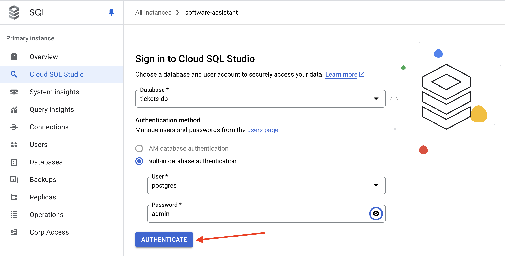
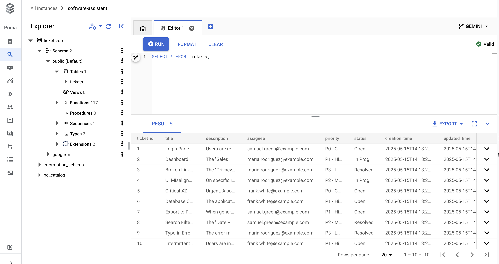
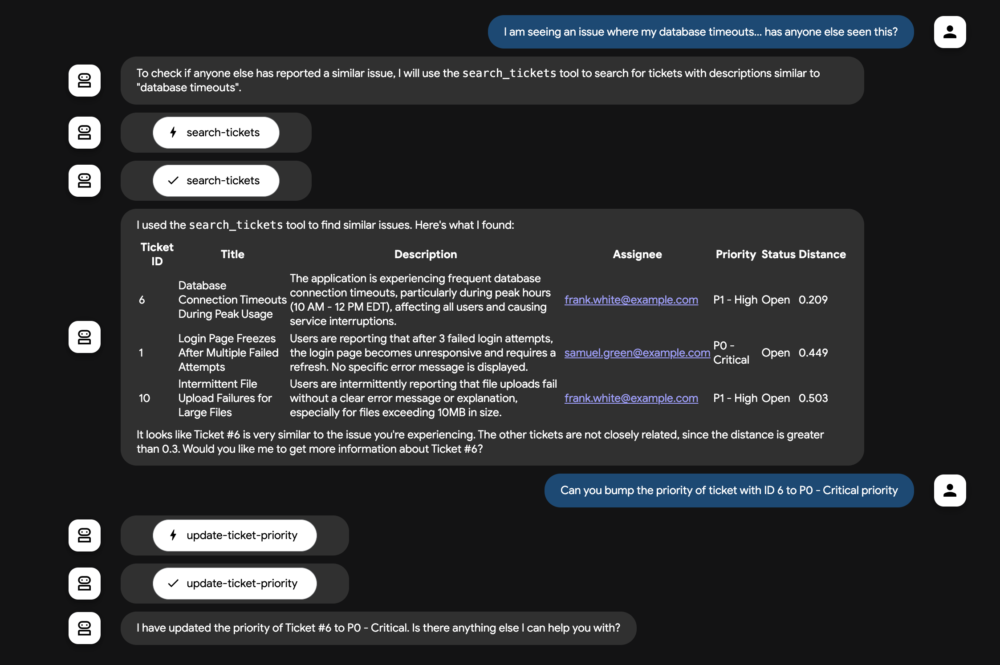

# 軟體錯誤助理 - ADK Python 範例代理

[](https://youtu.be/5ZmaWY7UX6k?si=ZbtTScrOls6vp7CH)
[](https://cloud.google.com/blog/topics/developers-practitioners/tools-make-an-agent-from-zero-to-assistant-with-adk?e=48754805?utm_source%3Dtwitter?utm_source%3Dlinkedin)

## 概述

軟體錯誤助理是一個範例代理，設計用來協助 IT 支援和軟體開發人員進行軟體問題的分類、管理和解決。此範例代理使用 ADK Python、PostgreSQL 錯誤票據資料庫（內部票據）、GitHub MCP 伺服器（外部票據）、RAG、Google 搜尋以及 StackOverflow 來協助除錯。


此 README 包含本地和 Google Cloud 部署的說明。

## 代理詳細資訊

軟體錯誤助理代理的主要功能包括：

| 功能 | 描述 |
| --- | --- |
| **互動類型** | 對話式 |
| **複雜度**       | 中級 |
| **代理類型**       | 單一代理 |
| **組件**       | 工具、資料庫、RAG、Google 搜尋、GitHub MCP |
| **垂直領域**         | 水平 / IT 支援 |

## 代理架構


## 主要功能

*   **檢索增強生成 (RAG)：** 利用 Cloud SQL 內建的 [Vertex AI ML 整合](https://cloud.google.com/sql/docs/postgres/integrate-cloud-sql-with-vertex-ai) 來取得相關/重複的軟體錯誤。
*   **資料庫 MCP 工具箱：** [資料庫 MCP 工具箱](https://github.com/googleapis/genai-toolbox) 為我們的代理提供資料庫特定工具。
*   **GitHub MCP 伺服器：** 連接到 [GitHub 的遠端 MCP 伺服器](https://github.com/github/github-mcp-server?tab=readme-ov-file#remote-github-mcp-server) 來取得外部軟體錯誤（開放議題、pull requests 等）。
*   **Google 搜尋：** 利用 Google 搜尋作為內建工具來取得相關搜尋結果，以便用外部最新知識來支撐代理的回應。
*   **StackOverflow：** 查詢 [StackOverflow](https://stackoverflow.com/) 強大的 Q&A 資料，使用 [LangChain 的豐富工具函式庫](https://python.langchain.com/docs/integrations/tools/)—特別是 [StackExchange API Wrapper 工具](https://python.langchain.com/docs/integrations/tools/stackexchange/)。ADK 支援 [第三方工具如 LangChain 工具](https://google.github.io/adk-docs/tools/third-party-tools/#1-using-langchain-tools)

## 設定與安裝

### 前置條件

- Python 3.9+
- [uv](https://docs.astral.sh/uv/getting-started/installation)（用於管理相依性）
- Git（用於複製儲存庫，請參閱 [安裝說明](https://git-scm.com/book/en/v2/Getting-Started-Installing-Git)）
- Google Cloud CLI（[安裝說明](https://cloud.google.com/sdk/docs/install)）

### 安裝

1. 複製儲存庫：

```bash
git clone https://github.com/google/adk-samples.git
cd adk-samples/python/agents/software-bug-assistant
```

2. 設定環境變數（透過 `.env` 檔案）：

#### GitHub 個人存取權杖 (PAT)

若要使用 GitHub MCP 伺服器進行驗證，您需要一個 GitHub 個人存取權杖。

1. 前往您的 GitHub [開發者設定](https://github.com/settings/tokens)。
2. 點擊 "Personal access tokens" -> "Tokens (classic)"。
3. 點擊 "Generate new token" -> "Generate new token (classic)"。
4. 為您的權杖命名。
5. 為您的權杖設定到期日。
6. 重要：基於安全考量，請授予權杖最少必要的範圍。對於儲存庫的唯讀存取，`repo:status`、`public_repo` 和 `read:user` 範圍通常已足夠。除非絕對必要，否則避免授予完整儲存庫或管理員權限。
7. 點擊 "Generate token"。
8. 複製生成的權杖。

#### Gemini API 認證

有兩種不同的方式來驗證 Gemini 模型：

- 使用透過 Google AI Studio 建立的 API 金鑰直接呼叫 Gemini API。
- 透過 Google Cloud 上的 Vertex AI API 呼叫 Gemini 模型。

> [!TIP]
> 如果您只想在本地執行範例，從 Google AI Studio 取得 API 金鑰是最快的開始方法。
>
> 如果您計劃部署到 Cloud Run，您可能想使用 Vertex AI。

<details open>
<summary>Gemini API 金鑰</summary>

從 Google AI Studio 取得 API 金鑰：https://aistudio.google.com/apikey

執行以下命令建立 `.env` 檔案（將 `<your_api_key_here>` 替換為您的 API 金鑰，將 `<your_github_pat_here>` 替換為您的 GitHub 個人存取權杖）：

```sh
echo "GOOGLE_API_KEY=<your_api_key_here>" >> .env \
&& echo "GOOGLE_GENAI_USE_VERTEXAI=FALSE" >> .env \
&& echo "GITHUB_PERSONAL_ACCESS_TOKEN=<your_github_pat_here>" >> .env
```

</details>

<details>
<summary>Vertex AI</summary>

若要使用 Vertex AI，您需要 [建立一個 Google Cloud 專案](https://developers.google.com/workspace/guides/create-project) 並 [啟用 Vertex AI](https://cloud.google.com/vertex-ai/docs/start/cloud-environment)。

驗證並啟用 Vertex AI API：

```bash
gcloud auth login
# 將 <your_project_id> 替換為您的專案 ID
gcloud config set project <your_project_id>
gcloud services enable aiplatform.googleapis.com
```

執行以下命令建立 `.env` 檔案（將 `<your_project_id>` 替換為您的專案 ID，將 `<your_github_pat_here>` 替換為您的 GitHub 個人存取權杖）：

```sh
echo "GOOGLE_GENAI_USE_VERTEXAI=TRUE" >> .env \
&& echo "GOOGLE_CLOUD_PROJECT=<your_project_id>" >> .env \
&& echo "GOOGLE_CLOUD_LOCATION=us-central1" >> .env \
&& echo "GITHUB_PERSONAL_ACCESS_TOKEN=<your_github_pat_here>" >> .env
```

</details>

在 [.env.example](.env.example) 位置有一個範例 `.env` 檔案，如果您想要驗證您的 `.env` 是否設定正確。

將 `.env` 檔案來源載入您的環境：

```bash
set -o allexport && source .env && set +o allexport
```

3. 下載 [資料庫 MCP 工具箱](https://github.com/googleapis/genai-toolbox)

```bash
export OS="linux/amd64" # 選擇 linux/amd64, darwin/arm64, darwin/amd64, 或 windows/amd64 其中之一
curl -O --output-dir deployment/mcp-toolbox https://storage.googleapis.com/genai-toolbox/v0.6.0/$OS/toolbox
chmod +x deployment/mcp-toolbox/toolbox
```

**跳轉到**：
- [💻 本地執行](#本地執行)
- [☁️ 部署到 Google Cloud](#部署到-google-cloud)

## 💻 本地執行

### 開始之前

安裝 PostgreSQL：

- [PostgreSQL - 本地實例和 psql 命令列工具](https://www.postgresql.org/download/)

### 1 - 啟動本地 PostgreSQL 實例

例如，在 MacOS 上：

```bash
brew services start postgresql
```

### 2 - 初始化資料庫

```bash
psql -U postgres
```

然後，初始化資料庫和 `tickets` 表：

```SQL
CREATE DATABASE ticketsdb;
\c ticketsdb;
CREATE TABLE tickets (
  ticket_id SERIAL PRIMARY KEY,             -- PostgreSQL 的自動遞增整數類型（SERIAL 等同於 INT AUTO_INCREMENT）
  title VARCHAR(255) NOT NULL,              -- 錯誤/問題的簡潔摘要或標題。
  description TEXT,                         -- 錯誤的詳細描述。
  assignee VARCHAR(100),                    -- 指派給票據的人員/團隊名稱或電子郵件。
  priority VARCHAR(50),                     -- 優先級（例如：'P0 - Critical', 'P1 - High'）。
  status VARCHAR(50) DEFAULT 'Open',        -- 票據的當前狀態（例如：'Open', 'In Progress', 'Resolved'）。預設為 'Open'。
  creation_time TIMESTAMP WITH TIME ZONE DEFAULT CURRENT_TIMESTAMP, -- 票據首次建立時的時間戳。建議使用 'WITH TIME ZONE' 以確保清晰度和相容性。
  updated_time TIMESTAMP WITH TIME ZONE DEFAULT CURRENT_TIMESTAMP  -- 票據最後更新時的時間戳。由觸發器管理。
);
```

插入一些範例資料：

```SQL
INSERT INTO tickets (title, description, assignee, priority, status) VALUES
('登入頁面在多次失敗嘗試後凍結', '使用者回報在 3 次登入失敗嘗試後，登入頁面變得無回應且需要重新整理。沒有顯示特定的錯誤訊息。', 'samuel.green@example.com', 'P0 - Critical', 'Open');

INSERT INTO tickets (title, description, assignee, priority, status) VALUES
('儀表板銷售小工具間歇性資料載入失敗', '主儀表板上的「銷售概覽」小工具間歇性地顯示載入圖示但沒有資料。主要影響 Chrome 瀏覽器使用者。', 'maria.rodriguez@example.com', 'P1 - High', 'In Progress');

INSERT INTO tickets (title, description, assignee, priority, status) VALUES
('頁尾中的隱私權政策連結損壞', '位於網站頁尾的「隱私權政策」超連結導致 404「找不到頁面」錯誤。', 'maria.rodriguez@example.com', 'P3 - Low', 'Resolved');

INSERT INTO tickets (title, description, assignee, priority, status) VALUES
('iOS 行動裝置橫向檢視時 UI 對齊問題', '在特定 iOS 裝置（例如：iPhone 14 機型）上，當裝置以橫向方向檢視時，頂部導航列會向下移位，遮蔽內容。', 'maria.rodriguez@example.com', 'P2 - Medium', 'In Progress');

INSERT INTO tickets (title, description, assignee, priority, status) VALUES
('核心相依性中檢測到關鍵的 XZ Utils 後門（CVE-2024-3094）', '緊急：在 XZ Utils 版本 5.6.0 和 5.6.1 中發現了一個複雜的供應鏈入侵（CVE-2024-3094）。此惡意程式碼可能透過修改 liblzma 允許未授權的遠端 SSH 存取。受影響的 Linux/Unix 系統和依賴 XZ Utils 的服務需要立即調查和採取行動。', 'frank.white@example.com', 'P0 - Critical', 'Open');

INSERT INTO tickets (title, description, assignee, priority, status) VALUES
('尖峰使用期間資料庫連線逾時', '應用程式在尖峰時段（東部時間上午 10 點 - 中午 12 點）經常遇到資料庫連線逾時，影響所有使用者並造成服務中斷。', 'frank.white@example.com', 'P1 - High', 'Open');

INSERT INTO tickets (title, description, assignee, priority, status) VALUES
('匯出 PDF 時報告中的長文字欄位被截斷', '生成包含大量文字欄位的報告的 PDF 匯出時，文字在頁面末尾被突然截斷，而不是換行或繼續到下一頁。', 'samuel.green@example.com', 'P1 - High', 'Open');

INSERT INTO tickets (title, description, assignee, priority, status) VALUES
('搜尋篩選器「日期範圍」未正確套用', '搜尋結果頁面上的「日期範圍」篩選器未能準確篩選記錄；仍顯示指定日期範圍外的結果。', 'samuel.green@example.com', 'P2 - Medium', 'Resolved');

INSERT INTO tickets (title, description, assignee, priority, status) VALUES
('錯誤訊息中的拼字錯誤：「Unathorized Access」', '當使用者嘗試未授權操作時顯示的錯誤訊息顯示為「Unathorized Access」而不是「Unauthorized Access」。', 'maria.rodriguez@example.com', 'P3 - Low', 'Resolved');

INSERT INTO tickets (title, description, assignee, priority, status) VALUES
('大檔案間歇性檔案上傳失敗', '使用者間歇性地回報檔案上傳失敗，沒有清楚的錯誤訊息或說明，特別是對於超過 10MB 的檔案。', 'frank.white@example.com', 'P1 - High', 'Open');
```

### 3 - 執行資料庫 MCP 工具箱伺服器

[資料庫 MCP 工具箱](https://googleapis.github.io/genai-toolbox) 是一個開源的 [模型上下文協定 (MCP)](https://modelcontextprotocol.io/introduction) 伺服器，支援包括 PostgreSQL 在內的資料庫。它允許您針對資料庫定義「工具」，配合相對應的 SQL 查詢，有效地啟用代理對資料庫的「函數呼叫」。

首先，如果尚未安裝，請 [下載 MCP 工具箱](https://googleapis.github.io/genai-toolbox/getting-started/local_quickstart/) 二進位檔。

然後，開啟 `deployment/mcp-toolbox/tools.yaml` 檔案。這是一個預建的 MCP 工具箱設定，針對我們剛建立的 `tickets` 表定義了幾個 SQL 工具，包括透過 ID 取得票據、建立新票據或搜尋票據。

> [!Note]
> 透過 `search-tickets` 的向量搜尋尚未為本地開發啟用 - 請參閱下方的 Google Cloud 設定。

**重要：** 更新 `tools.yaml` 的前幾行，以指向您的本地 Postgres 實例，例如：

```yaml
  postgresql:
  kind: postgres
  host: 127.0.0.1
  port: 5432
  database: tickets-db
  user: ${DB_USER}
  password: ${DB_PASS}
```

現在您可以在本地執行工具箱伺服器：

```bash
cd deployment/mcp-toolbox/
./toolbox --tools-file="tools.yaml"
```

您應該會看到類似以下的輸出：

```bash
2025-05-30T02:06:57.479344419Z INFO "Initialized 1 sources."
2025-05-30T02:06:57.479696869Z INFO "Initialized 0 authServices."
2025-05-30T02:06:57.479973769Z INFO "Initialized 9 tools."
2025-05-30T02:06:57.480054519Z INFO "Initialized 2 toolsets."
2025-05-30T02:06:57.480739499Z INFO "Server ready to serve!"
```

您可以透過在瀏覽器中開啟 http://localhost:5000/api/toolset 來驗證伺服器是否正在執行。
您應該會看到包含 `tools.yaml` 中指定工具列表的 JSON 回應。

```json
{
  "serverVersion": "0.6.0+binary.linux.amd64.0.5.0.9a5d76e2dc66eaf0d2d0acf9f202a17539879ffe",
  "tools": {
  "create-new-ticket": {
    "description": "建立一個新的軟體票據。",
    "parameters": [
    {
      "name": "title",
      "type": "string",
      "description": "新票據的標題。",
      "authSources": []
    },
    // ...
    ],
  }
  }
}
```

### 4 - 在本地執行代理

現在我們準備好執行 ADK Python 代理了！

預設情況下，代理被設定為與在 `http://127.0.0.1:5000` 的本地 MCP 工具箱伺服器通訊，所以 **請保持工具箱伺服器執行**。

您可以在 **新的** 終端中使用 `adk` 命令執行代理。

1. 透過 CLI（`adk run`）：

  ```bash
  uv run adk run software_bug_assistant
  ```

2. 透過網頁介面（`adk web`）：

  ```bash
  uv run adk web
  ```

`adk web` 命令會在您的機器上啟動網頁伺服器並列印 URL。您可以開啟 URL，在左上角下拉選單中選擇「software_bug_assistant」，右側會出現聊天機器人介面。對話初始為空白。

以下是一些您可以向代理詢問的範例請求：

- "您能列出所有開放的內部票據問題嗎？"
- "您能將票據 ID 7 的優先級提升至 P0 嗎？"
- "StackOverflow 上有關於 CVE-2024-3094 的討論嗎？"
- "您能列出 psf/requests GitHub 儲存庫的最新 5 個開放議題嗎？"


---------

## ☁️ 部署到 Google Cloud

這些說明將逐步介紹將軟體錯誤助理代理部署到 Google Cloud 的過程，包括 Cloud Run 和 Cloud SQL (PostgreSQL)。此設定還為票據資料庫添加了 RAG 功能，使用 Cloud SQL 的 [google_ml_integration](https://cloud.google.com/blog/products/ai-machine-learning/google-ml-intergration-extension-for-cloud-sql) 向量外掛和來自 Vertex AI 的 `text-embeddings-005` 模型。


### 開始之前

部署到 Google Cloud 需要：

- 一個啟用計費的 [Google Cloud 專案](https://cloud.google.com/resource-manager/docs/creating-managing-projects)。
- `gcloud` CLI（[安裝說明](https://cloud.google.com/sdk/docs/install)）

### 1 - 驗證 Google Cloud CLI，並啟用 Google Cloud API

```
gcloud auth login
gcloud auth application-default login

export PROJECT_ID="<YOUR_PROJECT_ID>"
gcloud config set project $PROJECT_ID

gcloud services enable sqladmin.googleapis.com \
   compute.googleapis.com \
   cloudresourcemanager.googleapis.com \
   servicenetworking.googleapis.com \
   aiplatform.googleapis.com
```

### 2 - 建立 Cloud SQL (Postgres) 實例

```bash
gcloud sql instances create software-assistant \
   --database-version=POSTGRES_16 \
   --tier=db-custom-1-3840 \
   --region=us-central1 \
   --edition=ENTERPRISE \
   --enable-google-ml-integration \
   --database-flags cloudsql.enable_google_ml_integration=on \
   --root-password=admin
```

建立完成後，您可以在 Cloud Console [這裡](https://console.cloud.google.com/sql/instances/software-assistant/overview) 檢視您的實例。

### 3 - 建立 SQL 資料庫，並授予 Cloud SQL 服務帳戶存取 Vertex AI 的權限

此步驟對於建立向量嵌入（代理 RAG 搜尋）是必要的。

```bash
gcloud sql databases create tickets-db --instance=software-assistant

SERVICE_ACCOUNT_EMAIL=$(gcloud sql instances describe software-assistant --format="value(serviceAccountEmailAddress)")
echo $SERVICE_ACCOUNT_EMAIL

gcloud projects add-iam-policy-binding $PROJECT_ID --member="serviceAccount:$SERVICE_ACCOUNT_EMAIL" --role="roles/aiplatform.user"
```

### 4 - 設定 `tickets` 表

從 Cloud Console (Cloud SQL)，開啟 **Cloud SQL Studio**。

使用 `postgres` 使用者登入 `tickets-db` 資料庫（密碼：`admin`，但請注意您可以在 Cloud SQL > 主要實例 > 使用者 下更改為更安全的密碼）。



開啟新的 **編輯器** 分頁。然後，貼上以下 SQL 程式碼來設定表格和建立向量嵌入。

```SQL
CREATE EXTENSION IF NOT EXISTS google_ml_integration CASCADE;
CREATE EXTENSION IF NOT EXISTS vector CASCADE;
GRANT EXECUTE ON FUNCTION embedding TO postgres;

CREATE TABLE tickets (
  ticket_id SERIAL PRIMARY KEY,             -- PostgreSQL 的自動遞增整數類型（SERIAL 等同於 INT AUTO_INCREMENT）
  title VARCHAR(255) NOT NULL,              -- 錯誤/問題的簡潔摘要或標題。
  description TEXT,                         -- 錯誤的詳細描述。
  assignee VARCHAR(100),                    -- 指派給票據的人員/團隊名稱或電子郵件。
  priority VARCHAR(50),                     -- 優先級（例如：'P0 - Critical', 'P1 - High'）。
  status VARCHAR(50) DEFAULT 'Open',        -- 票據的當前狀態（例如：'Open', 'In Progress', 'Resolved'）。預設為 'Open'。
  creation_time TIMESTAMP WITH TIME ZONE DEFAULT CURRENT_TIMESTAMP, -- 票據首次建立時的時間戳。建議使用 'WITH TIME ZONE' 以確保清晰度和相容性。
  updated_time TIMESTAMP WITH TIME ZONE DEFAULT CURRENT_TIMESTAMP  -- 票據最後更新時的時間戳。由觸發器管理。
);
```

### 5 - 載入範例資料

從 Cloud SQL Studio，貼上以下 SQL 程式碼來載入範例資料。

```SQL
INSERT INTO tickets (title, description, assignee, priority, status) VALUES
('登入頁面在多次失敗嘗試後凍結', '使用者回報在 3 次登入失敗嘗試後，登入頁面變得無回應且需要重新整理。沒有顯示特定的錯誤訊息。', 'samuel.green@example.com', 'P0 - Critical', 'Open');

INSERT INTO tickets (title, description, assignee, priority, status) VALUES
('儀表板銷售小工具間歇性資料載入失敗', '主儀表板上的「銷售概覽」小工具間歇性地顯示載入圖示但沒有資料。主要影響 Chrome 瀏覽器使用者。', 'maria.rodriguez@example.com', 'P1 - High', 'In Progress');

INSERT INTO tickets (title, description, assignee, priority, status) VALUES
('頁尾中的隱私權政策連結損壞', '位於網站頁尾的「隱私權政策」超連結導致 404「找不到頁面」錯誤。', 'maria.rodriguez@example.com', 'P3 - Low', 'Resolved');

INSERT INTO tickets (title, description, assignee, priority, status) VALUES
('iOS 行動裝置橫向檢視時 UI 對齊問題', '在特定 iOS 裝置（例如：iPhone 14 機型）上，當裝置以橫向方向檢視時，頂部導航列會向下移位，遮蔽內容。', 'maria.rodriguez@example.com', 'P2 - Medium', 'In Progress');

INSERT INTO tickets (title, description, assignee, priority, status) VALUES
('核心相依性中檢測到關鍵的 XZ Utils 後門（CVE-2024-3094）', '緊急：在 XZ Utils 版本 5.6.0 和 5.6.1 中發現了一個複雜的供應鏈入侵（CVE-2024-3094）。此惡意程式碼可能透過修改 liblzma 允許未授權的遠端 SSH 存取。受影響的 Linux/Unix 系統和依賴 XZ Utils 的服務需要立即調查和採取行動。', 'frank.white@example.com', 'P0 - Critical', 'Open');

INSERT INTO tickets (title, description, assignee, priority, status) VALUES
('尖峰使用期間資料庫連線逾時', '應用程式在尖峰時段（東部時間上午 10 點 - 中午 12 點）經常遇到資料庫連線逾時，影響所有使用者並造成服務中斷。', 'frank.white@example.com', 'P1 - High', 'Open');

INSERT INTO tickets (title, description, assignee, priority, status) VALUES
('匯出 PDF 時報告中的長文字欄位被截斷', '生成包含大量文字欄位的報告的 PDF 匯出時，文字在頁面末尾被突然截斷，而不是換行或繼續到下一頁。', 'samuel.green@example.com', 'P1 - High', 'Open');

INSERT INTO tickets (title, description, assignee, priority, status) VALUES
('搜尋篩選器「日期範圍」未正確套用', '搜尋結果頁面上的「日期範圍」篩選器未能準確篩選記錄；仍顯示指定日期範圍外的結果。', 'samuel.green@example.com', 'P2 - Medium', 'Resolved');

INSERT INTO tickets (title, description, assignee, priority, status) VALUES
('錯誤訊息中的拼字錯誤：「Unathorized Access」', '當使用者嘗試未授權操作時顯示的錯誤訊息顯示為「Unathorized Access」而不是「Unauthorized Access」。', 'maria.rodriguez@example.com', 'P3 - Low', 'Resolved');

INSERT INTO tickets (title, description, assignee, priority, status) VALUES
('大檔案間歇性檔案上傳失敗', '使用者間歇性地回報檔案上傳失敗，沒有清楚的錯誤訊息或說明，特別是對於超過 10MB 的檔案。', 'frank.white@example.com', 'P1 - High', 'Open');
```

### 6 - 建立觸發器以在記錄更新時更新 `updated_time` 欄位

```SQL
CREATE OR REPLACE FUNCTION update_updated_time_tickets()
RETURNS TRIGGER AS $$
BEGIN
  NEW.updated_time = NOW();  -- 將 updated_time 設定為當前時間戳
  RETURN NEW;                -- 返回新的列
END;
$$ language 'plpgsql';

CREATE TRIGGER update_tickets_updated_time
BEFORE UPDATE ON tickets
FOR EACH ROW                  -- 這意味著觸發器會對 UPDATE 語句影響的每一列執行
EXECUTE PROCEDURE update_updated_time_tickets();
```

### 7 - 從 `description` 欄位建立向量嵌入

```SQL
ALTER TABLE tickets ADD COLUMN embedding vector(768) GENERATED ALWAYS AS (embedding('text-embedding-005',description)) STORED;
```

### 8 - 驗證資料庫已準備就緒

從 Cloud SQL studio，執行：

```SQL
SELECT * FROM tickets;
```

您應該會看到：



### 9 - 將資料庫 MCP 工具箱伺服器部署到 Cloud Run

現在我們有了 Cloud SQL 資料庫，我們可以將資料庫 MCP 工具箱伺服器部署到 Cloud Run，並將其指向我們的 Cloud SQL 實例。

首先，為您的 Cloud SQL 實例更新 `deployment/mcp-toolbox/tools.yaml`：

```yaml
  postgresql:
  kind: cloud-sql-postgres
  project: ${PROJECT_ID}
  region: us-central1
  instance: software-assistant
  database: tickets-db
  user: ${DB_USER}
  password: ${DB_PASS}
```

然後，設定 Toolbox 的 Cloud Run 服務帳戶以存取 Secret Manager 和 Cloud SQL。Secret Manager 是我們儲存 `tools.yaml` 檔案的地方，因為它包含敏感的 Cloud SQL 憑證。

注意 - 從頂層的 `software-bug-assistant/` 目錄執行此命令。

```bash
gcloud services enable run.googleapis.com \
   cloudbuild.googleapis.com \
   artifactregistry.googleapis.com \
   iam.googleapis.com \
   secretmanager.googleapis.com

gcloud iam service-accounts create toolbox-identity

gcloud projects add-iam-policy-binding $PROJECT_ID \
  --member serviceAccount:toolbox-identity@$PROJECT_ID.iam.gserviceaccount.com \
  --role roles/secretmanager.secretAccessor

gcloud projects add-iam-policy-binding $PROJECT_ID \
  --member serviceAccount:toolbox-identity@$PROJECT_ID.iam.gserviceaccount.com \
  --role roles/cloudsql.client

gcloud secrets create tools --data-file=deployment/mcp-toolbox/tools.yaml
```

現在我們可以將 Toolbox 部署到 Cloud Run。我們將使用 MCP 工具箱的最新 [發行版本](https://github.com/googleapis/genai-toolbox/releases) 映像（我們不需要從原始程式碼建置或部署 `toolbox`）。

```bash
gcloud run deploy toolbox \
  --image us-central1-docker.pkg.dev/database-toolbox/toolbox/toolbox:latest \
  --service-account toolbox-identity \
  --region us-central1 \
  --set-secrets "/app/tools.yaml=tools:latest" \
  --set-env-vars="PROJECT_ID=$PROJECT_ID,DB_USER=postgres,DB_PASS=admin" \
  --args="--tools-file=/app/tools.yaml","--address=0.0.0.0","--port=8080" \
  --allow-unauthenticated
```

透過取得 Cloud Run 日誌來驗證 Toolbox 是否正在執行：

```bash
gcloud run services logs read toolbox --region us-central1
```

您應該會看到：

```bash
2025-05-15 18:03:55 2025-05-15T18:03:55.465847801Z INFO "Initialized 1 sources."
2025-05-15 18:03:55 2025-05-15T18:03:55.466152914Z INFO "Initialized 0 authServices."
2025-05-15 18:03:55 2025-05-15T18:03:55.466374245Z INFO "Initialized 9 tools."
2025-05-15 18:03:55 2025-05-15T18:03:55.466477938Z INFO "Initialized 2 toolsets."
2025-05-15 18:03:55 2025-05-15T18:03:55.467492303Z INFO "Server ready to serve!"
```

將 Toolbox 服務的 Cloud Run URL 儲存為環境變數。

```bash
export MCP_TOOLBOX_URL=$(gcloud run services describe toolbox --region us-central1 --format "value(status.url)")
```

現在我們準備將 ADK Python 代理部署到 Cloud Run！ :rocket:

### 10 - 建立 Artifact Registry 儲存庫

這是我們儲存代理容器映像的地方。

```bash
gcloud artifacts repositories create adk-samples \
  --repository-format=docker \
  --location=us-central1 \
  --description="ADK Python 範例代理的儲存庫" \
  --project=$PROJECT_ID
```

### 11 - 容器化 ADK Python 代理

使用 Cloud Build 建置容器映像並推送到 Artifact Registry。

```bash
gcloud builds submit --region=us-central1 --tag us-central1-docker.pkg.dev/$PROJECT_ID/adk-samples/software-bug-assistant:latest
```

### 12 - 將代理部署到 Cloud Run

> [!NOTE]
>
> 如果您使用 Vertex AI 而非 AI Studio 進行 Gemini 呼叫，您需要在下方 `gcloud run deploy` 命令的最後一行將 `GOOGLE_API_KEY` 替換為 `GOOGLE_CLOUD_PROJECT`、`GOOGLE_CLOUD_LOCATION` 和 `GOOGLE_GENAI_USE_VERTEXAI=TRUE`。
>
> ```bash
> --set-env-vars=GOOGLE_CLOUD_PROJECT=$PROJECT_ID,GOOGLE_CLOUD_LOCATION=us-central1,GOOGLE_GENAI_USE_VERTEXAI=TRUE,MCP_TOOLBOX_URL=$MCP_TOOLBOX_URL,GITHUB_PERSONAL_ACCESS_TOKEN=$GITHUB_PERSONAL_ACCESS_TOKEN
> ```

```bash
gcloud run deploy software-bug-assistant \
  --image=us-central1-docker.pkg.dev/$PROJECT_ID/adk-samples/software-bug-assistant:latest \
  --region=us-central1 \
  --allow-unauthenticated \
  --set-env-vars=GOOGLE_API_KEY=$GOOGLE_API_KEY,MCP_TOOLBOX_URL=$MCP_TOOLBOX_URL,GITHUB_PERSONAL_ACCESS_TOKEN=$GITHUB_PERSONAL_ACCESS_TOKEN
```

當成功執行時，您應該會看到：

```bash
Service [software-bug-assistant] revision [software-bug-assistant-00001-d4s] has been deployed and is serving 100 percent of traffic.
```

### 13 - 測試 Cloud Run 代理

開啟前一步驟輸出的 Cloud Run 服務 URL。

您應該會看到軟體錯誤助理的 ADK Web UI。

透過詢問以下問題來測試代理：
- `有關於資料庫逾時的任何問題嗎？`
- `有多少個錯誤指派給 samuel.green@example.com？顯示表格。`
- `無回應登入頁面問題的可能根本原因是什麼？`（呼叫 Google 搜尋工具）
- `取得無回應登入頁面問題的錯誤 ID` --> `將該錯誤的優先級提升至 P0。`
- `建立一個新的錯誤。`（讓代理引導您完成錯誤建立）

*範例工作流程*：



## 替代方案：使用代理起始套件

您也可以使用 [代理起始套件](https://goo.gle/agent-starter-pack) 來建立此代理的生產就緒版本，提供額外的部署選項：

```bash
# 建立並啟動虛擬環境
python -m venv .venv && source .venv/bin/activate # 在 Windows 上：.venv\Scripts\activate

# 安裝起始套件並建立您的專案
pip install --upgrade agent-starter-pack
agent-starter-pack create my-software-bug-assistant -a adk@software-bug-assistant
```

<details>
<summary>⚡️ 替代方案：使用 uv</summary>

如果您已安裝 [`uv`](https://github.com/astral-sh/uv)，您可以使用單一命令建立和設定您的專案：
```bash
uvx agent-starter-pack create my-software-bug-assistant -a adk@software-bug-assistant
```
此命令會處理專案建立，而無需預先將套件安裝到虛擬環境中。

</details>

起始套件會提示您選擇部署選項，並提供額外的生產就緒功能，包括自動化 CI/CD 部署腳本。

### 清理

您可以透過以下方式清理此代理範例：
- 刪除 [Artifact Registry](https://console.cloud.google.com/artifacts)。
- 刪除兩個 [Cloud Run 服務](https://console.cloud.google.com/run)。
- 刪除 [Cloud SQL 實例](https://console.cloud.google.com/sql/instances)。
- 刪除 [Secret Manager 祕密](https://console.cloud.google.com/security/secret-manager)。
